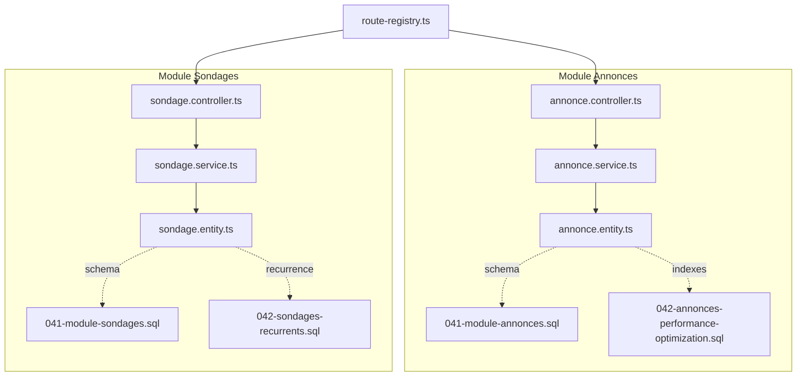
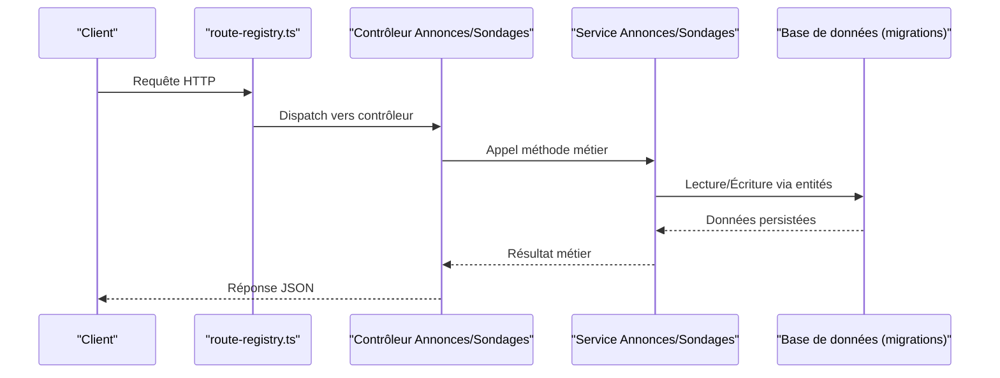
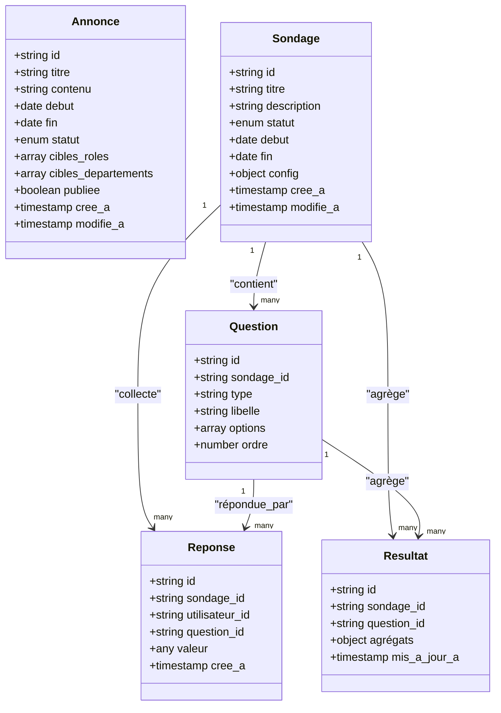
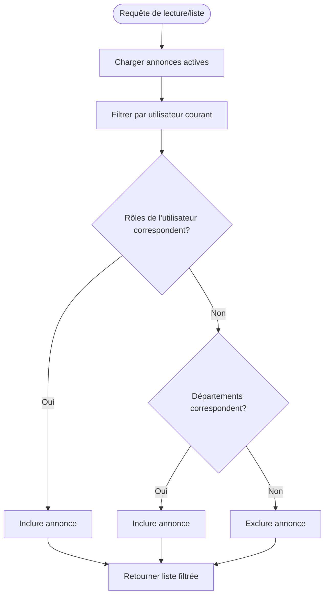
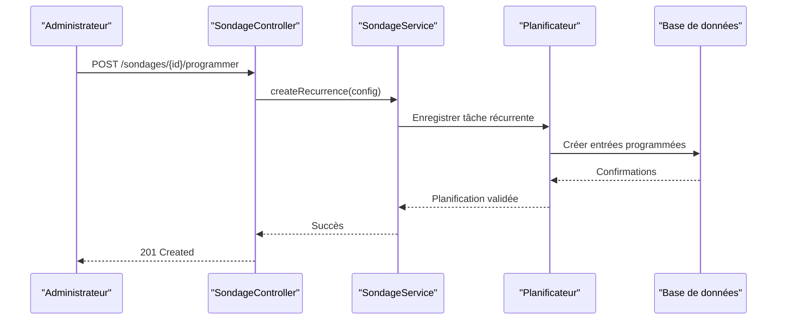
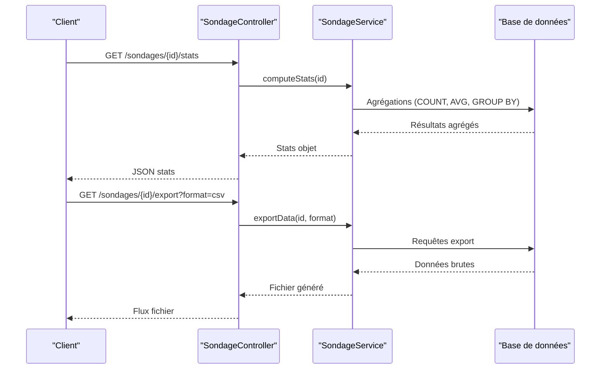
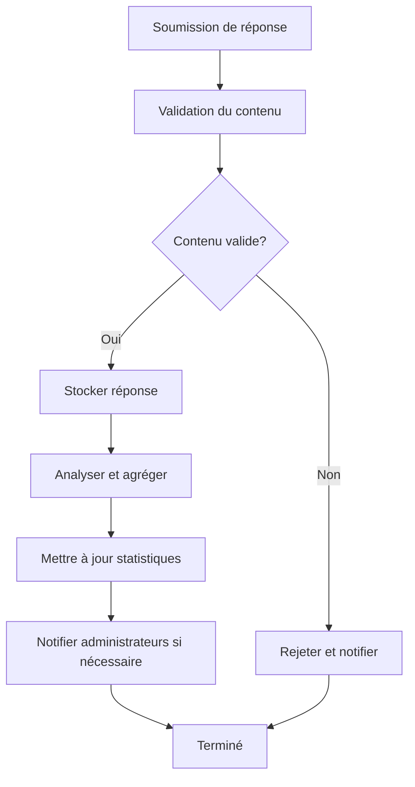
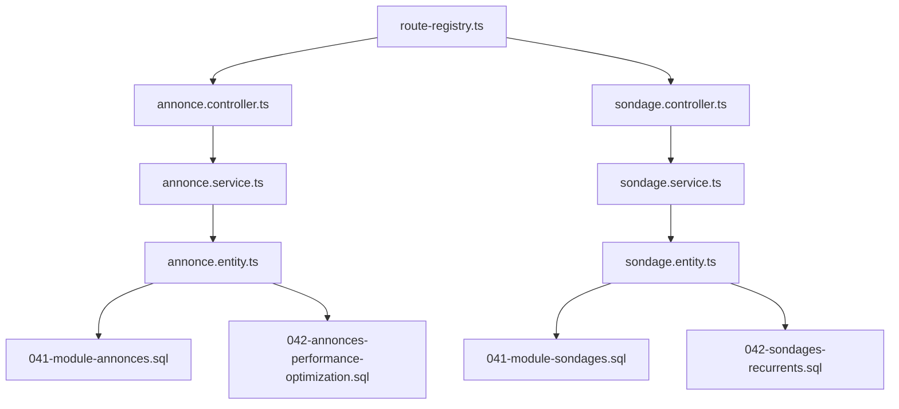

# API Annonces et Sondages

<cite>
**Fichiers référencés dans ce document**
- [backend/src/modules/annonces/controllers/annonce.controller.ts](file://backend/src/modules/annonces/controllers/annonce.controller.ts)
- [backend/src/modules/annonces/services/annonce.service.ts](file://backend/src/modules/annonces/services/annonce.service.ts)
- [backend/src/modules/annonces/entities/annonce.entity.ts](file://backend/src/modules/annonces/entities/annonce.entity.ts)
- [backend/src/modules/sondages/controllers/sondage.controller.ts](file://backend/src/modules/sondages/controllers/sondage.controller.ts)
- [backend/src/modules/sondages/services/sondage.service.ts](file://backend/src/modules/sondages/services/sondage.service.ts)
- [backend/src/modules/sondages/entities/sondage.entity.ts](file://backend/src/modules/sondages/entities/sondage.entity.ts)
- [backend/src/routes/route-registry.ts](file://backend/src/routes/route-registry.ts)
- [backend/database/migrations/041-module-annonces.sql](file://backend/database/migrations/041-module-annonces.sql)
- [backend/database/migrations/041-module-sondages.sql](file://backend/database/migrations/041-module-sondages.sql)
- [backend/database/migrations/042-annonces-performance-optimization.sql](file://backend/database/migrations/042-annonces-performance-optimization.sql)
- [backend/database/migrations/042-sondages-recurrents.sql](file://backend/database/migrations/042-sondages-recurrents.sql)
</cite>

## Table des matières
1. [Introduction](#introduction)
2. [Structure du projet](#structure-du-projet)
3. [Composants clés](#composants-clés)
4. [Vue d'ensemble de l'architecture](#vue-densemble-de-larchitecture)
5. [Analyse détaillée des composants](#analyse-detaillee-des-composants)
6. [Analyse des dépendances](#analyse-des-dependances)
7. [Considérations de performance](#considerations-de-performance)
8. [Guide de dépannage](#guide-de-depannage)
9. [Conclusion](#conclusion)
10. [Annexes](#annexes)

## Introduction
Ce document présente une documentation API complète pour les modules Annonces et Sondages d'eLISAschool. Il couvre la création, la publication et la gestion des annonces avec ciblage par rôle ou département, ainsi que la modélisation des sondages (questions, réponses, résultats). Il inclut également des exemples d'intégration pour les sondages récurrents, les statistiques de participation et les exports de données, en s'appuyant sur les entités, services, contrôleurs et migrations disponibles dans le codebase.

## Structure du projet
Les fonctionnalités d'annonces et de sondages sont implémentées dans des modules dédiés :
- Module Annonces : contrôleurs, services, entités et migrations associés.
- Module Sondages : contrôleurs, services, entités et migrations associés.
- Registre des routes qui expose les endpoints via l'API REST.

**Sources du diagramme**
- [backend/src/modules/annonces/controllers/annonce.controller.ts](file://backend/src/modules/annonces/controllers/annonce.controller.ts)
- [backend/src/modules/annonces/services/annonce.service.ts](file://backend/src/modules/annonces/services/annonce.service.ts)
- [backend/src/modules/annonces/entities/annonce.entity.ts](file://backend/src/modules/annonces/entities/annonce.entity.ts)
- [backend/src/modules/sondages/controllers/sondage.controller.ts](file://backend/src/modules/sondages/controllers/sondage.controller.ts)
- [backend/src/modules/sondages/services/sondage.service.ts](file://backend/src/modules/sondages/services/sondage.service.ts)
- [backend/src/modules/sondages/entities/sondage.entity.ts](file://backend/src/modules/sondages/entities/sondage.entity.ts)
- [backend/src/routes/route-registry.ts](file://backend/src/routes/route-registry.ts)
- [backend/database/migrations/041-module-annonces.sql](file://backend/database/migrations/041-module-annonces.sql)
- [backend/database/migrations/042-annonces-performance-optimization.sql](file://backend/database/migrations/042-annonces-performance-optimization.sql)
- [backend/database/migrations/041-module-sondages.sql](file://backend/database/migrations/041-module-sondages.sql)
- [backend/database/migrations/042-sondages-recurrents.sql](file://backend/database/migrations/042-sondages-recurrents.sql)

**Sources de section**
- [backend/src/routes/route-registry.ts](file://backend/src/routes/route-registry.ts)

## Composants clés
- Contrôleurs : exposent les endpoints REST pour les ressources Annonces et Sondages.
- Services : implémentent la logique métier (création, publication, ciblage, planification, agrégation de résultats).
- Entités : modèles de données persistés (Annonce, Sondage, Question, Réponse, Résultat).
- Migrations : définition du schéma de base de données et optimisations/indexes.

**Sources de section**
- [backend/src/modules/annonces/controllers/annonce.controller.ts](file://backend/src/modules/annonces/controllers/annonce.controller.ts)
- [backend/src/modules/annonces/services/annonce.service.ts](file://backend/src/modules/annonces/services/annonce.service.ts)
- [backend/src/modules/annonces/entities/annonce.entity.ts](file://backend/src/modules/annonces/entities/annonce.entity.ts)
- [backend/src/modules/sondages/controllers/sondage.controller.ts](file://backend/src/modules/sondages/controllers/sondage.controller.ts)
- [backend/src/modules/sondages/services/sondage.service.ts](file://backend/src/modules/sondages/services/sondage.service.ts)
- [backend/src/modules/sondages/entities/sondage.entity.ts](file://backend/src/modules/sondages/entities/sondage.entity.ts)

## Vue d'ensemble de l'architecture
Le flux typique d'une requête API passe par le registre de routes vers un contrôleur spécifique, qui délègue au service correspondant. Le service interagit avec les entités ORM et la base de données définie par les migrations.

**Sources du diagramme**
- [backend/src/routes/route-registry.ts](file://backend/src/routes/route-registry.ts)
- [backend/src/modules/annonces/controllers/annonce.controller.ts](file://backend/src/modules/annonces/controllers/annonce.controller.ts)
- [backend/src/modules/sondages/controllers/sondage.controller.ts](file://backend/src/modules/sondages/controllers/sondage.controller.ts)
- [backend/src/modules/annonces/services/annonce.service.ts](file://backend/src/modules/annonces/services/annonce.service.ts)
- [backend/src/modules/sondages/services/sondage.service.ts](file://backend/src/modules/sondages/services/sondage.service.ts)
- [backend/database/migrations/041-module-annonces.sql](file://backend/database/migrations/041-module-annonces.sql)
- [backend/database/migrations/041-module-sondages.sql](file://backend/database/migrations/041-module-sondages.sql)

## Analyse détaillée des composants

### Endpoints Annonces
- Création d'annonce : endpoint POST pour créer une annonce avec titre, contenu, date de début/fin, statut et ciblage (rôle/département).
- Publication : endpoint PUT/PATCH pour passer une annonce à "publiée".
- Consultation : GET liste filtrable par statut, dates, cible.
- Mise à jour : PATCH modification des champs éditables.
- Suppression : DELETE suppression logique ou physique selon politique.

Ciblage par rôle ou département :
- Les cibles peuvent être exprimées comme listes de rôles et/ou départements.
- La diffusion est restreinte aux utilisateurs dont le rôle ou le département correspond aux cibles de l'annonce.

Exemple d'intégration :
- Frontend appelle POST /annonces avec payload contenant les champs nécessaires et les cibles.
- Service valide les permissions, persiste l'annonce et retourne l'objet créé.

**Sources de section**
- [backend/src/modules/annonces/controllers/annonce.controller.ts](file://backend/src/modules/annonces/controllers/annonce.controller.ts)
- [backend/src/modules/annonces/services/annonce.service.ts](file://backend/src/modules/annonces/services/annonce.service.ts)
- [backend/src/modules/annonces/entities/annonce.entity.ts](file://backend/src/modules/annonces/entities/annonce.entity.ts)
- [backend/database/migrations/041-module-annonces.sql](file://backend/database/migrations/041-module-annonces.sql)

### Endpoints Sondages
- Création de sondage : POST /sondages avec titre, description, dates, visibilité et configuration.
- Ajout de questions : POST /sondages/{id}/questions avec type (QCM, texte, échelle), options si QCM.
- Soumission de réponses : POST /sondages/{id}/reponses avec mapping questionId -> valeur.
- Consultation des résultats : GET /sondages/{id}/resultats avec agrégation par question.
- Programmation récurrente : POST /sondages/{id}/programmer pour planifier des déclenchements récurrents.

Schémas de données :
- Sondage : identifiant, titre, description, statut, dates, visibilité, métadonnées.
- Question : id, sondageId, type, libellé, options (si QCM), ordre.
- Réponse : id, sondageId, utilisateurId, questionId, valeur.
- Résultat : id, sondageId, questionId, agrégats (counts, moyennes, distributions).

Exemples d'intégration :
- Sondages récurrents : utiliser l'endpoint de programmation pour définir fréquence et fuseau horaire ; le service planifie les notifications et ouvre les sondages périodiquement.
- Statistiques de participation : GET /sondages/{id}/stats pour taux de réponse, nombre de participants, délais moyens.
- Export de données : GET /sondages/{id}/export pour télécharger CSV/JSON des réponses et résultats.

**Sources de section**
- [backend/src/modules/sondages/controllers/sondage.controller.ts](file://backend/src/modules/sondages/controllers/sondage.controller.ts)
- [backend/src/modules/sondages/services/sondage.service.ts](file://backend/src/modules/sondages/services/sondage.service.ts)
- [backend/src/modules/sondages/entities/sondage.entity.ts](file://backend/src/modules/sondages/entities/sondage.entity.ts)
- [backend/database/migrations/041-module-sondages.sql](file://backend/database/migrations/041-module-sondages.sql)
- [backend/database/migrations/042-sondages-recurrents.sql](file://backend/database/migrations/042-sondages-recurrents.sql)

### Modélisation des données (Entités)

**Sources du diagramme**
- [backend/src/modules/annonces/entities/annonce.entity.ts](file://backend/src/modules/annonces/entities/annonce.entity.ts)
- [backend/src/modules/sondages/entities/sondage.entity.ts](file://backend/src/modules/sondages/entities/sondage.entity.ts)

**Sources de section**
- [backend/src/modules/annonces/entities/annonce.entity.ts](file://backend/src/modules/annonces/entities/annonce.entity.ts)
- [backend/src/modules/sondages/entities/sondage.entity.ts](file://backend/src/modules/sondages/entities/sondage.entity.ts)

### Logique de ciblage et diffusion des annonces

**Sources du diagramme**
- [backend/src/modules/annonces/services/annonce.service.ts](file://backend/src/modules/annonces/services/annonce.service.ts)
- [backend/src/modules/annonces/entities/annonce.entity.ts](file://backend/src/modules/annonces/entities/annonce.entity.ts)

**Sources de section**
- [backend/src/modules/annonces/services/annonce.service.ts](file://backend/src/modules/annonces/services/annonce.service.ts)

### Programmation des sondages récurrents

**Sources du diagramme**
- [backend/src/modules/sondages/controllers/sondage.controller.ts](file://backend/src/modules/sondages/controllers/sondage.controller.ts)
- [backend/src/modules/sondages/services/sondage.service.ts](file://backend/src/modules/sondages/services/sondage.service.ts)
- [backend/database/migrations/042-sondages-recurrents.sql](file://backend/database/migrations/042-sondages-recurrents.sql)

**Sources de section**
- [backend/src/modules/sondages/controllers/sondage.controller.ts](file://backend/src/modules/sondages/controllers/sondage.controller.ts)
- [backend/src/modules/sondages/services/sondage.service.ts](file://backend/src/modules/sondages/services/sondage.service.ts)
- [backend/database/migrations/042-sondages-recurrents.sql](file://backend/database/migrations/042-sondages-recurrents.sql)

### Statistiques de participation et exports
- Statistiques : endpoint GET /sondages/{id}/stats renvoie taux de réponse, nombre de participants, délais moyens, distribution par question.
- Exports : endpoint GET /sondages/{id}/export permet de télécharger CSV/JSON des réponses et résultats.

**Sources du diagramme**
- [backend/src/modules/sondages/controllers/sondage.controller.ts](file://backend/src/modules/sondages/controllers/sondage.controller.ts)
- [backend/src/modules/sondages/services/sondage.service.ts](file://backend/src/modules/sondages/services/sondage.service.ts)

**Sources de section**
- [backend/src/modules/sondages/controllers/sondage.controller.ts](file://backend/src/modules/sondages/controllers/sondage.controller.ts)
- [backend/src/modules/sondages/services/sondage.service.ts](file://backend/src/modules/sondages/services/sondage.service.ts)

### Modération et analyse des réponses
- Modération : validation des réponses, marquage de contenus inappropriés, blocage de soumissions répétitives.
- Analyse : calcul de scores, tendances, corrélations entre questions, segmentation par profil utilisateur.

**Sources du diagramme**
- [backend/src/modules/sondages/services/sondage.service.ts](file://backend/src/modules/sondages/services/sondage.service.ts)

**Sources de section**
- [backend/src/modules/sondages/services/sondage.service.ts](file://backend/src/modules/sondages/services/sondage.service.ts)

## Analyse des dépendances
Les contrôleurs dépendent des services, qui dépendent des entités ORM. Les routes centralisent l'exposition des endpoints. Les migrations définissent le schéma et les index de performance.

**Sources du diagramme**
- [backend/src/routes/route-registry.ts](file://backend/src/routes/route-registry.ts)
- [backend/src/modules/annonces/controllers/annonce.controller.ts](file://backend/src/modules/annonces/controllers/annonce.controller.ts)
- [backend/src/modules/sondages/controllers/sondage.controller.ts](file://backend/src/modules/sondages/controllers/sondage.controller.ts)
- [backend/src/modules/annonces/services/annonce.service.ts](file://backend/src/modules/annonces/services/annonce.service.ts)
- [backend/src/modules/sondages/services/sondage.service.ts](file://backend/src/modules/sondages/services/sondage.service.ts)
- [backend/src/modules/annonces/entities/annonce.entity.ts](file://backend/src/modules/annonces/entities/annonce.entity.ts)
- [backend/src/modules/sondages/entities/sondage.entity.ts](file://backend/src/modules/sondages/entities/sondage.entity.ts)
- [backend/database/migrations/041-module-annonces.sql](file://backend/database/migrations/041-module-annonces.sql)
- [backend/database/migrations/041-module-sondages.sql](file://backend/database/migrations/041-module-sondages.sql)
- [backend/database/migrations/042-annonces-performance-optimization.sql](file://backend/database/migrations/042-annonces-performance-optimization.sql)
- [backend/database/migrations/042-sondages-recurrents.sql](file://backend/database/migrations/042-sondages-recurrents.sql)

**Sources de section**
- [backend/src/routes/route-registry.ts](file://backend/src/routes/route-registry.ts)

## Considérations de performance
- Indexation : les migrations d'optimisation ajoutent des index sur les colonnes fréquemment filtrées (statut, dates, cibles).
- Agrégations : les statistiques utilisent des requêtes groupées et des vues matérialisées si disponibles.
- Pagination : limiter les retours et utiliser des curseurs pour les grandes listes d'annonces ou de réponses.
- Cache : envisager un cache côté service pour les résultats de statistiques peu changeantes.

**Sources de section**
- [backend/database/migrations/042-annonces-performance-optimization.sql](file://backend/database/migrations/042-annonces-performance-optimization.sql)

## Guide de dépannage
- Erreurs de permission : vérifier les rôles et départements assignés à l'utilisateur et les cibles de l'annonce.
- Validation des réponses : inspecter les règles de validation et les messages d'erreur retournés par le service.
- Programmation récurrente : vérifier les tâches planifiées et les logs du planificateur.
- Performance lente : examiner les index et les requêtes SQL générées pour les agrégations.

**Sources de section**
- [backend/src/modules/annonces/services/annonce.service.ts](file://backend/src/modules/annonces/services/annonce.service.ts)
- [backend/src/modules/sondages/services/sondage.service.ts](file://backend/src/modules/sondages/services/sondage.service.ts)

## Conclusion
Les modules Annonces et Sondages offrent une API robuste pour la communication interne et la collecte d'opinions au sein de l'établissement. Grâce au ciblage précis, à la programmation récurrente et aux outils d'analyse, ils permettent une gestion efficace des communications et une prise de décision fondée sur les données.

## Annexes
- Exemples d'intégration frontend : appels HTTP vers les endpoints décrits, gestion des erreurs et mise à jour UI.
- Scripts de déploiement : commandes pour appliquer les migrations et activer les fonctionnalités.

[Section sources]
- [backend/src/modules/annonces/controllers/annonce.controller.ts](file://backend/src/modules/annonces/controllers/annonce.controller.ts)
- [backend/src/modules/sondages/controllers/sondage.controller.ts](file://backend/src/modules/sondages/controllers/sondage.controller.ts)
- [backend/src/modules/annonces/services/annonce.service.ts](file://backend/src/modules/annonces/services/annonce.service.ts)
- [backend/src/modules/sondages/services/sondage.service.ts](file://backend/src/modules/sondages/services/sondage.service.ts)
- [backend/src/modules/annonces/entities/annonce.entity.ts](file://backend/src/modules/annonces/entities/annonce.entity.ts)
- [backend/src/modules/sondages/entities/sondage.entity.ts](file://backend/src/modules/sondages/entities/sondage.entity.ts)
- [backend/src/routes/route-registry.ts](file://backend/src/routes/route-registry.ts)
- [backend/database/migrations/041-module-annonces.sql](file://backend/database/migrations/041-module-annonces.sql)
- [backend/database/migrations/041-module-sondages.sql](file://backend/database/migrations/041-module-sondages.sql)
- [backend/database/migrations/042-annonces-performance-optimization.sql](file://backend/database/migrations/042-annonces-performance-optimization.sql)
- [backend/database/migrations/042-sondages-recurrents.sql](file://backend/database/migrations/042-sondages-recurrents.sql)