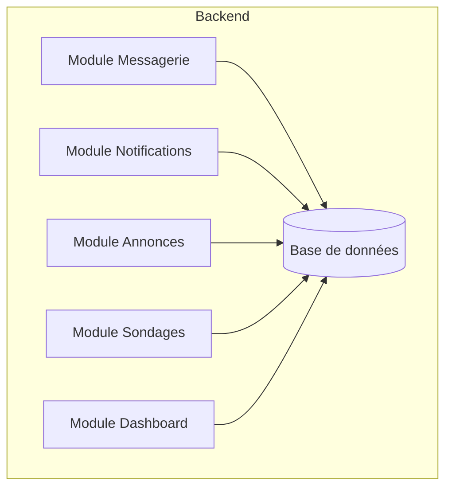
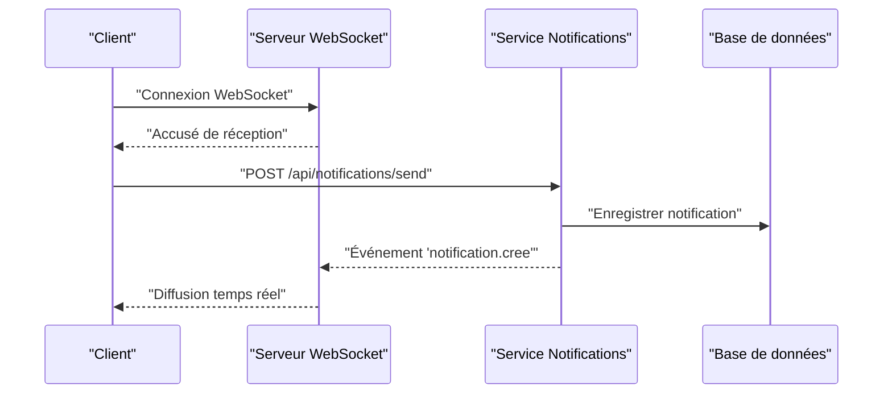
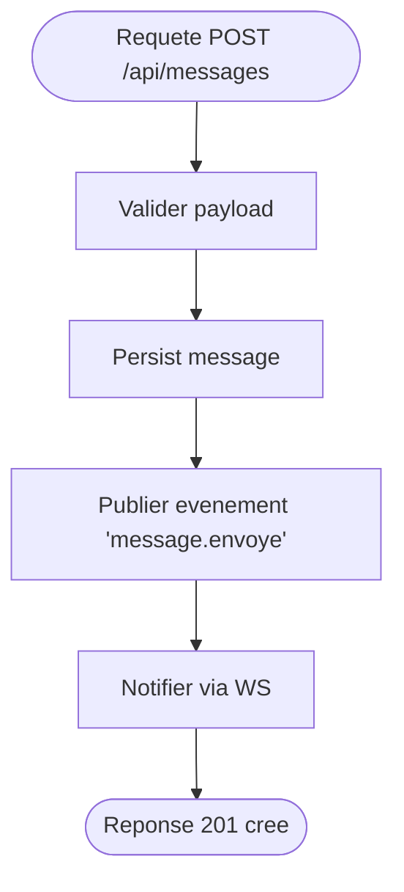
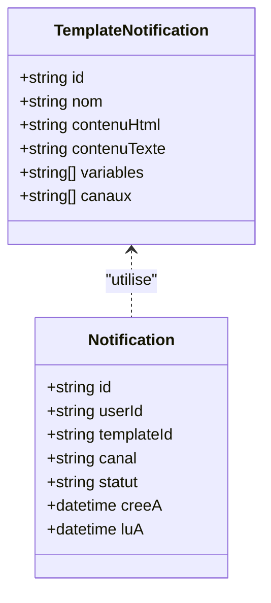
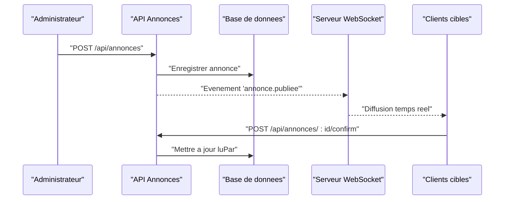
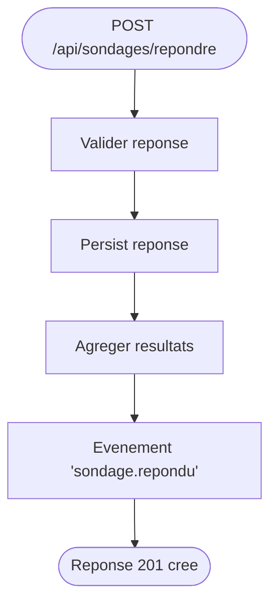
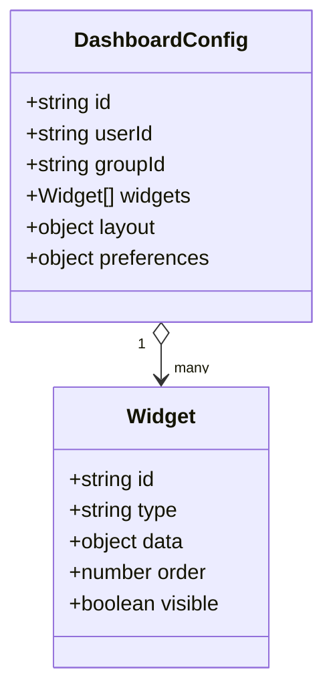
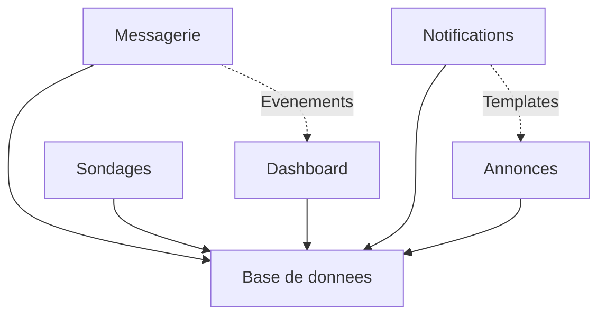

# API Communication et Collaboration

<cite>
**Fichiers référencés dans ce document**
- [backend/src/modules/messagerie/index.ts](file://backend/src/modules/messagerie/index.ts)
- [backend/src/modules/notifications/index.ts](file://backend/src/modules/notifications/index.ts)
- [backend/src/modules/annonces/index.ts](file://backend/src/modules/annonces/index.ts)
- [backend/src/modules/sondages/index.ts](file://backend/src/modules/sondages/index.ts)
- [backend/src/modules/dashboard/index.ts](file://backend/src/modules/dashboard/index.ts)
- [backend/database/migrations/043-module-messagerie-complete.sql](file://backend/database/migrations/043-module-messagerie-complete.sql)
- [backend/database/migrations/045-messagerie-fonctionnalites-avancees-v2.2.sql](file://backend/database/migrations/045-messagerie-fonctionnalites-avancees-v2.2.sql)
- [backend/database/migrations/041-module-annonces.sql](file://backend/database/migrations/041-module-annonces.sql)
- [backend/database/migrations/041-module-sondages.sql](file://backend/database/migrations/041-module-sondages.sql)
- [backend/database/migrations/046-dashboard-config.sql](file://backend/database/migrations/046-dashboard-config.sql)
- [backend/database/migrations/047-notifications-ameliorations.sql](file://backend/database/migrations/047-notifications-ameliorations.sql)
- [backend/database/migrations/048-notifications-performance-optimizations.sql](file://backend/database/migrations/048-notifications-performance-optimizations.sql)
- [backend/docs/DASHBOARD-SYSTEM.md](file://backend/docs/DASHBOARD-SYSTEM.md)
- [backend/docs/DASHBOARD-FRONTEND-INTEGRATION.md](file://backend/docs/DASHBOARD-FRONTEND-INTEGRATION.md)
- [backend/docs/DASHBOARD-IMPLEMENTATION-SUMMARY.md](file://backend/docs/DASHBOARD-IMPLEMENTATION-SUMMARY.md)
</cite>

## Table des matières
1. [Introduction](#introduction)
2. [Structure du projet](#structure-du-projet)
3. [Composants clés](#composants-clés)
4. [Vue d'ensemble de l'architecture](#vue-densemble-de-larchitecture)
5. [Analyse détaillée des composants](#analyse-detaillee-des-composants)
6. [Analyse des dépendances](#analyse-des-dependances)
7. [Considérations de performance](#considerations-de-performance)
8. [Guide de dépannage](#guide-de-depannage)
9. [Conclusion](#conclusion)
10. [Annexes](#annexes)

## Introduction
Ce document présente l’API de communication et collaboration d’eLISAschool, centrée sur la messagerie interne, les notifications multi-canaux, les annonces et sondages, ainsi que les tableaux de bord personnalisables. Il couvre les endpoints REST, les schémas de données, les événements temps réel (WebSocket), les templates de notifications et les configurations de dashboard, avec des exemples d’intégration pour une mise en œuvre fluide côté client.

## Structure du projet
Le module de communication et collaboration est organisé par fonctionnalités dans le backend :
- Messagerie : contrôleurs, services, DTOs et migrations dédiées.
- Notifications : orchestration multi-canaux, templates et persistance.
- Annonces : gestion des publications, ciblage et diffusion.
- Sondages : création, réponses, résultats et statistiques.
- Dashboard : configuration, widgets et personnalisation par utilisateur ou groupe.

[Ce diagramme illustre la répartition modulaire et la dépendance vers la base de données.]

**Section sources**
- [backend/src/modules/messagerie/index.ts](file://backend/src/modules/messagerie/index.ts)
- [backend/src/modules/notifications/index.ts](file://backend/src/modules/notifications/index.ts)
- [backend/src/modules/annonces/index.ts](file://backend/src/modules/annonces/index.ts)
- [backend/src/modules/sondages/index.ts](file://backend/src/modules/sondages/index.ts)
- [backend/src/modules/dashboard/index.ts](file://backend/src/modules/dashboard/index.ts)

## Composants clés
- Messagerie interne : envoi, réception, archivage, filtres et recherche ; support de threads et pièces jointes.
- Notifications multi-canaux : email, SMS, push, in-app ; templates dynamiques et ciblage par rôle/groupe.
- Annonces : publication, versioning, visibilité par cible, historique et lecture confirmée.
- Sondages : questions, options, réponses anonymes ou identifiées, clôture automatique, résultats agrégés.
- Dashboard : définition de widgets, agencement, accès par rôle, sauvegarde de mises en page.

**Section sources**
- [backend/database/migrations/043-module-messagerie-complete.sql](file://backend/database/migrations/043-module-messagerie-complete.sql)
- [backend/database/migrations/045-messagerie-fonctionnalites-avancees-v2.2.sql](file://backend/database/migrations/045-messagerie-fonctionnalites-avancees-v2.2.sql)
- [backend/database/migrations/041-module-annonces.sql](file://backend/database/migrations/041-module-annonces.sql)
- [backend/database/migrations/041-module-sondages.sql](file://backend/database/migrations/041-module-sondages.sql)
- [backend/database/migrations/046-dashboard-config.sql](file://backend/database/migrations/046-dashboard-config.sql)
- [backend/database/migrations/047-notifications-ameliorations.sql](file://backend/database/migrations/047-notifications-ameliorations.sql)
- [backend/database/migrations/048-notifications-performance-optimizations.sql](file://backend/database/migrations/048-notifications-performance-optimizations.sql)

## Vue d'ensemble de l'architecture
L’API expose des endpoints REST pour la gestion CRUD et des événements WebSocket pour la diffusion temps réel. Les modules communiquent via des événements internes et utilisent la base de données pour la persistance. Le système de notifications centralise les canaux et les templates.

**Diagram sources**
- [backend/src/modules/notifications/index.ts](file://backend/src/modules/notifications/index.ts)
- [backend/database/migrations/047-notifications-ameliorations.sql](file://backend/database/migrations/047-notifications-ameliorations.sql)

**Section sources**
- [backend/src/modules/notifications/index.ts](file://backend/src/modules/notifications/index.ts)
- [backend/database/migrations/047-notifications-ameliorations.sql](file://backend/database/migrations/047-notifications-ameliorations.sql)
- [backend/database/migrations/048-notifications-performance-optimizations.sql](file://backend/database/migrations/048-notifications-performance-optimizations.sql)

## Analyse détaillée des composants

### Messagerie interne
- Endpoints REST :
  - POST /api/messages : envoyer un message (destinataires, sujet, corps, pièces jointes).
  - GET /api/messages : liste filtrée (par destinataire, statut, date).
  - GET /api/messages/:id : détails d’un message.
  - PUT /api/messages/:id : modifier un message brouillon.
  - DELETE /api/messages/:id : supprimer un message.
  - POST /api/messages/:id/read : marquer comme lu.
- Schéma de message :
  - id, expéditeurId, destinataires[], sujet, corps, statut, createdAt, updatedAt, attachments[].
- Événements temps réel :
  - message.envoye, message.lu, message.supprime.
- Intégration WebSocket :
  - Connexion à ws://.../ws/messages, abonnement aux salons ou utilisateurs.
  - Réception d’événements pour mise à jour instantanée.

**Diagram sources**
- [backend/src/modules/messagerie/index.ts](file://backend/src/modules/messagerie/index.ts)
- [backend/database/migrations/043-module-messagerie-complete.sql](file://backend/database/migrations/043-module-messagerie-complete.sql)
- [backend/database/migrations/045-messagerie-fonctionnalites-avancees-v2.2.sql](file://backend/database/migrations/045-messagerie-fonctionnalites-avancees-v2.2.sql)

**Section sources**
- [backend/src/modules/messagerie/index.ts](file://backend/src/modules/messagerie/index.ts)
- [backend/database/migrations/043-module-messagerie-complete.sql](file://backend/database/migrations/043-module-messagerie-complete.sql)
- [backend/database/migrations/045-messagerie-fonctionnalites-avancees-v2.2.sql](file://backend/database/migrations/045-messagerie-fonctionnalites-avancees-v2.2.sql)

### Système de notifications multi-canaux
- Endpoints REST :
  - POST /api/notifications/send : déclencher une notification (cible, template, variables).
  - GET /api/notifications/history : historique des notifications envoyées.
  - GET /api/notifications/templates : liste des templates disponibles.
  - PUT /api/notifications/templates/:id : mettre à jour un template.
- Templates de notifications :
  - id, nom, contenuHtml, contenuTexte, variables[], canaux[].
- Canaux :
  - Email, SMS, Push, In-app ; routage selon préférences utilisateur.
- Événements temps réel :
  - notification.cree, notification.lue, notification.reussie, notification.echeee.

**Diagram sources**
- [backend/src/modules/notifications/index.ts](file://backend/src/modules/notifications/index.ts)
- [backend/database/migrations/047-notifications-ameliorations.sql](file://backend/database/migrations/047-notifications-ameliorations.sql)

**Section sources**
- [backend/src/modules/notifications/index.ts](file://backend/src/modules/notifications/index.ts)
- [backend/database/migrations/047-notifications-ameliorations.sql](file://backend/database/migrations/047-notifications-ameliorations.sql)
- [backend/database/migrations/048-notifications-performance-optimizations.sql](file://backend/database/migrations/048-notifications-performance-optimizations.sql)

### Annonces
- Endpoints REST :
  - POST /api/annonces : créer une annonce (titre, contenu, cible, date debut/fin).
  - GET /api/annonces : liste filtrée (par cible, statut).
  - GET /api/annonces/:id : détails.
  - PUT /api/annonces/:id : modifier.
  - DELETE /api/annonces/:id : supprimer.
  - POST /api/annonces/:id/confirm : confirmer lecture.
- Schéma d’annonce :
  - id, titre, contenu, cible[], statut, dateDebut, dateFin, creePar, luPar[].
- Diffusion :
  - Ciblage par rôle, département, classe, établissement.
  - Historique de lectures et rappels automatiques.

**Diagram sources**
- [backend/src/modules/annonces/index.ts](file://backend/src/modules/annonces/index.ts)
- [backend/database/migrations/041-module-annonces.sql](file://backend/database/migrations/041-module-annonces.sql)

**Section sources**
- [backend/src/modules/annonces/index.ts](file://backend/src/modules/annonces/index.ts)
- [backend/database/migrations/041-module-annonces.sql](file://backend/database/migrations/041-module-annonces.sql)

### Sondages
- Endpoints REST :
  - POST /api/sondages : créer un sondage (questions, options, durée).
  - GET /api/sondages : liste active/expirée.
  - GET /api/sondages/:id : détails.
  - POST /api/sondages/:id/repondre : soumettre réponse.
  - GET /api/sondages/:id/resultats : résultats agrégés.
- Schéma de sondage :
  - id, titre, description, questions[], statut, dateDebut, dateFin, reponses[].
- Fonctionnalités :
  - Clôture automatique, anonymat optionnel, export de résultats.

**Diagram sources**
- [backend/src/modules/sondages/index.ts](file://backend/src/modules/sondages/index.ts)
- [backend/database/migrations/041-module-sondages.sql](file://backend/database/migrations/041-module-sondages.sql)

**Section sources**
- [backend/src/modules/sondages/index.ts](file://backend/src/modules/sondages/index.ts)
- [backend/database/migrations/041-module-sondages.sql](file://backend/database/migrations/041-module-sondages.sql)

### Tableaux de bord personnalisables
- Endpoints REST :
  - GET /api/dashboard/config : récupérer la configuration actuelle.
  - PUT /api/dashboard/config : sauvegarder la configuration (widgets, ordre, taille).
  - GET /api/dashboard/widgets : liste des widgets disponibles.
  - POST /api/dashboard/widgets : ajouter un widget personnalisé.
  - DELETE /api/dashboard/widgets/:id : supprimer un widget.
- Schéma de configuration :
  - id, userId ou groupId, widgets[], layout, preferences.
- Widgets :
  - Données agrégées, graphiques, indicateurs KPI ; accès par rôle.

**Diagram sources**
- [backend/src/modules/dashboard/index.ts](file://backend/src/modules/dashboard/index.ts)
- [backend/database/migrations/046-dashboard-config.sql](file://backend/database/migrations/046-dashboard-config.sql)

**Section sources**
- [backend/src/modules/dashboard/index.ts](file://backend/src/modules/dashboard/index.ts)
- [backend/database/migrations/046-dashboard-config.sql](file://backend/database/migrations/046-dashboard-config.sql)
- [backend/docs/DASHBOARD-SYSTEM.md](file://backend/docs/DASHBOARD-SYSTEM.md)
- [backend/docs/DASHBOARD-FRONTEND-INTEGRATION.md](file://backend/docs/DASHBOARD-FRONTEND-INTEGRATION.md)
- [backend/docs/DASHBOARD-IMPLEMENTATION-SUMMARY.md](file://backend/docs/DASHBOARD-IMPLEMENTATION-SUMMARY.md)

## Analyse des dépendances
Les modules sont faiblement couplés et communiquent via événements internes et la base de données. Les notifications dépendent des templates et des préférences utilisateur. La messagerie utilise des événements pour la synchronisation temps réel. Les sondages et annonces exposent des endpoints REST simples et publient des événements pour la diffusion.

**Diagram sources**
- [backend/src/modules/messagerie/index.ts](file://backend/src/modules/messagerie/index.ts)
- [backend/src/modules/notifications/index.ts](file://backend/src/modules/notifications/index.ts)
- [backend/src/modules/annonces/index.ts](file://backend/src/modules/annonces/index.ts)
- [backend/src/modules/sondages/index.ts](file://backend/src/modules/sondages/index.ts)
- [backend/src/modules/dashboard/index.ts](file://backend/src/modules/dashboard/index.ts)

**Section sources**
- [backend/src/modules/messagerie/index.ts](file://backend/src/modules/messagerie/index.ts)
- [backend/src/modules/notifications/index.ts](file://backend/src/modules/notifications/index.ts)
- [backend/src/modules/annonces/index.ts](file://backend/src/modules/annonces/index.ts)
- [backend/src/modules/sondages/index.ts](file://backend/src/modules/sondages/index.ts)
- [backend/src/modules/dashboard/index.ts](file://backend/src/modules/dashboard/index.ts)

## Considérations de performance
- Indexation et requêtes optimisées pour les listes de messages, notifications et annonces.
- Mise en cache des templates de notifications et des configurations de dashboard.
- Diffusion WebSocket groupée pour réduire la charge réseau.
- Pagination et filtrage efficaces pour les grandes bases de données.

[Conseils généraux sans analyse spécifique de fichiers]

## Guide de dépannage
- Vérifier les logs d’échec d’envoi de notifications et les erreurs de template.
- Valider les permissions d’accès aux endpoints REST.
- Tester la connexion WebSocket et les abonnements aux événements.
- Examiner les contraintes de base de données lors de la création/modification de ressources.

**Section sources**
- [backend/database/migrations/047-notifications-ameliorations.sql](file://backend/database/migrations/047-notifications-ameliorations.sql)
- [backend/database/migrations/048-notifications-performance-optimizations.sql](file://backend/database/migrations/048-notifications-performance-optimizations.sql)

## Conclusion
L’API de communication et collaboration d’eLISAschool offre des fonctionnalités complètes pour la messagerie, les notifications, les annonces, les sondages et les dashboards. Elle combine REST pour la gestion des données et WebSocket pour la diffusion temps réel, tout en garantissant flexibilité et performance.

[Synthèse sans analyse spécifique de fichiers]

## Annexes
- Exemples d’intégration WebSocket :
  - Connexion ws://.../ws/messages, abonnement aux salons ou utilisateurs.
  - Réception d’événements pour mise à jour instantanée.
- Exemples d’intégration REST :
  - Requêtes HTTP standard avec authentification JWT.
  - Gestion des erreurs et pagination.

[Contenu conceptuel sans analyse spécifique de fichiers]