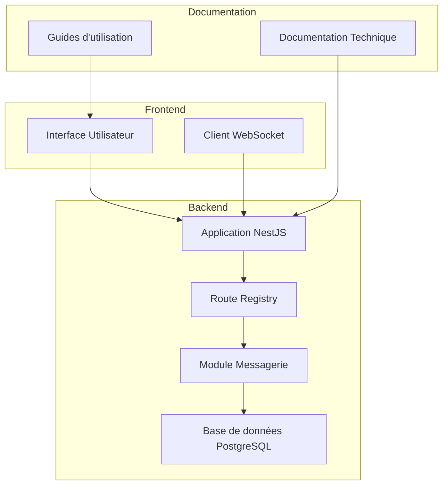
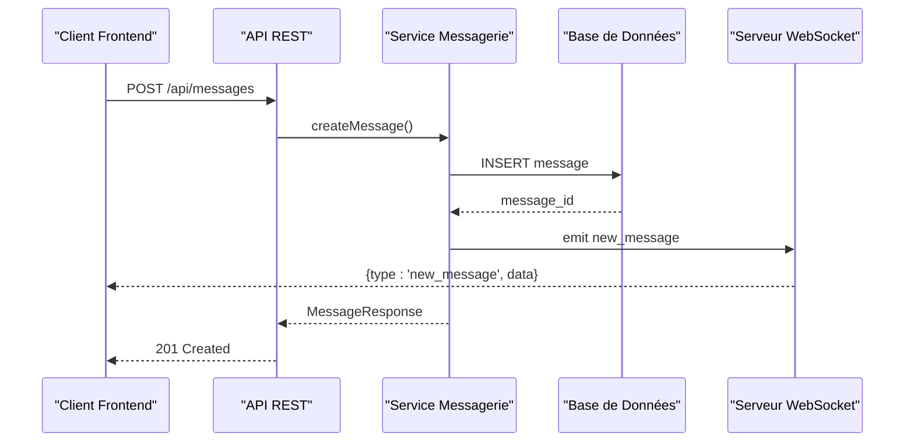
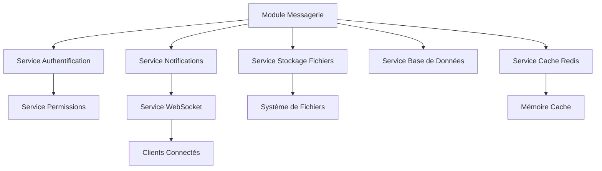

# API Messagerie Interne

<cite>
**Fichiers référencés dans ce document**
- [043-module-messagerie-complete.sql](file://backend/database/migrations/043-module-messagerie-complete.sql)
- [044-messagerie-optimisations-v2.1.sql](file://backend/database/migrations/044-messagerie-optimisations-v2.1.sql)
- [045-messagerie-fonctionnalites-avancees-v2.2.sql](file://backend/database/migrations/045-messagerie-fonctionnalites-avancees-v2.2.sql)
- [MESSAGERIE-README-FINAL.md](file://docs/autres/_divers/MESSAGERIE-README-FINAL.md)
- [AMÉLIORATIONS-MESSAGERIE-V2.1.md](file://docs/AMELIORATIONS-MESSAGERIE-V2.1.md)
- [RESUME-EXECUTIF-MESSAGERIE-V2.1.md](file://docs/RESUME-EXECUTIF-MESSAGERIE-V2.1.md)
- [SYNTHESE-FINALE-MESSAGERIE-V2.2.md](file://docs/SYNTHESE-FINALE-MESSAGERIE-V2.2.md)
- [IMPLEMENTATION-MESSAGERIE-COMPLETE.md](file://docs/IMPLEMENTATION-MESSAGERIE-COMPLETE.md)
- [GUIDE-TEST-MESSAGERIE-V2.1.md](file://docs/GUIDE-TEST-MESSAGERIE-V2.1.md)
- [app.ts](file://backend/src/app.ts)
- [index.ts](file://backend/src/index.ts)
- [route-registry.ts](file://backend/src/routes/route-registry.ts)
</cite>

## Table des matières
1. [Introduction](#introduction)
2. [Structure du projet](#structure-du-projet)
3. [Composants clés](#composants-clés)
4. [Vue d'ensemble de l'architecture](#vue-densemble-de-larchitecture)
5. [Analyse détaillée des composants](#analyse-detaillee-des-composants)
6. [Analyse des dépendances](#analyse-des-dependances)
7. [Considérations de performance](#considerations-de-performance)
8. [Guide de dépannage](#guide-de-depannage)
9. [Conclusion](#conclusion)
10. [Annexes](#annexes)

## Introduction
Ce document présente une documentation API complète pour le système de messagerie interne eLISAschool. Il couvre les endpoints REST pour la gestion des messages, conversations, threads et pièces jointes, ainsi que les schémas de données (messages, métadonnées de conversation, statuts de lecture). Il inclut également des exemples d'intégration WebSocket pour les communications temps réel, les notifications de nouveaux messages et les mises à jour en direct. Les fonctionnalités de recherche, filtrage, archivage et suppression des messages sont documentées avec des recommandations pratiques.

## Structure du projet
Le module de messagerie est implémenté dans le backend sous forme de module NestJS, avec des migrations SQL pour la structure de base de données et des scripts de déploiement associés. La documentation technique et les guides de test sont centralisés dans le dossier docs.



**Diagramme sources**
- [app.ts:1-50](file://backend/src/app.ts#L1-L50)
- [route-registry.ts:1-100](file://backend/src/routes/route-registry.ts#L1-L100)

**Sources de section**
- [app.ts:1-100](file://backend/src/app.ts#L1-L100)
- [index.ts:1-50](file://backend/src/index.ts#L1-L50)

## Composants clés
Le système de messagerie comprend plusieurs composants essentiels :

### Gestion des Conversations
- Création et gestion de conversations individuelles et de groupe
- Métadonnées de conversation avec statut et participants
- Historique complet des échanges

### Gestion des Messages
- Envoi et réception de messages texte
- Support des pièces jointes (fichiers, images)
- Statuts de lecture et de livraison

### Système de Threads
- Organisation hiérarchique des réponses
- Réponses aux messages spécifiques
- Filtrage par thread

### Système de Notifications
- Notifications en temps réel via WebSocket
- Alertes de nouveaux messages
- Indicateurs de non-lu

**Sources de section**
- [043-module-messagerie-complete.sql:1-200](file://backend/database/migrations/043-module-messagerie-complete.sql#L1-L200)
- [044-messagerie-optimisations-v2.1.sql:1-150](file://backend/database/migrations/044-messagerie-optimisations-v2.1.sql#L1-L150)

## Vue d'ensemble de l'architecture
L'architecture du système de messagerie suit un modèle MVC (Model-View-Controller) avec une séparation claire entre les couches de présentation, de logique métier et de persistance des données.



**Diagramme sources**
- [043-module-messagerie-complete.sql:1-300](file://backend/database/migrations/043-module-messagerie-complete.sql#L1-L300)
- [route-registry.ts:1-200](file://backend/src/routes/route-registry.ts#L1-L200)

## Analyse détaillée des composants

### Schéma de Base de Données
Le système utilise trois tables principales pour la gestion de la messagerie :

#### Table conversations
| Colonne | Type | Description |
|---------|------|-------------|
| id | UUID | Identifiant unique de la conversation |
| title | VARCHAR(255) | Titre de la conversation |
| type | ENUM | Type (direct/group) |
| status | ENUM | Statut (active/archived/deleted) |
| created_by | UUID | Créateur de la conversation |
| created_at | TIMESTAMP | Date de création |
| updated_at | TIMESTAMP | Dernière modification |

#### Table messages
| Colonne | Type | Description |
|---------|------|-------------|
| id | UUID | Identifiant unique du message |
| conversation_id | UUID | Conversation associée |
| sender_id | UUID | Expéditeur |
| content | TEXT | Contenu du message |
| attachments | JSONB | Pièces jointes |
| status | ENUM | Statut (sent/delivered/read) |
| created_at | TIMESTAMP | Date d'envoi |

#### Table conversation_participants
| Colonne | Type | Description |
|---------|------|-------------|
| conversation_id | UUID | Conversation concernée |
| user_id | UUID | Participant |
| role | ENUM | Rôle (admin/member) |
| joined_at | TIMESTAMP | Date d'adhésion |

**Sources de section**
- [043-module-messagerie-complete.sql:1-500](file://backend/database/migrations/043-module-messagerie-complete.sql#L1-L500)

### Endpoints REST API

#### Gestion des Conversations

##### Créer une conversation
```
POST /api/conversations
Content-Type: application/json
Authorization: Bearer {token}

{
  "title": "Discussion équipe",
  "type": "group",
  "participants": ["user_id_1", "user_id_2"],
  "description": "Conversation d'équipe pour le projet X"
}
```

**Réponse 201 Created:**
```json
{
  "id": "uuid-conversation",
  "title": "Discussion équipe",
  "type": "group",
  "status": "active",
  "created_by": "user_id_creator",
  "created_at": "2024-01-15T10:30:00Z",
  "participants": [
    {"user_id": "user_id_1", "role": "member"},
    {"user_id": "user_id_2", "role": "member"}
  ]
}
```

##### Lister les conversations
```
GET /api/conversations?page=1&limit=10&status=active&type=group
Authorization: Bearer {token}
```

**Réponse 200 OK:**
```json
{
  "data": [
    {
      "id": "uuid-conversation",
      "title": "Discussion équipe",
      "type": "group",
      "status": "active",
      "last_message": "Dernier message envoyé",
      "unread_count": 3,
      "participant_count": 5
    }
  ],
  "pagination": {
    "page": 1,
    "limit": 10,
    "total": 25,
    "has_next": true
  }
}
```

**Sources de section**
- [043-module-messagerie-complete.sql:1-300](file://backend/database/migrations/043-module-messagerie-complete.sql#L1-L300)
- [route-registry.ts:1-150](file://backend/src/routes/route-registry.ts#L1-L150)

#### Gestion des Messages

##### Envoyer un message
```
POST /api/messages
Content-Type: application/json
Authorization: Bearer {token}

{
  "conversation_id": "uuid-conversation",
  "content": "Bonjour tout le monde!",
  "attachments": [
    {
      "filename": "document.pdf",
      "file_type": "application/pdf",
      "file_size": 1024000,
      "url": "/uploads/document.pdf"
    }
  ]
}
```

**Réponse 201 Created:**
```json
{
  "id": "uuid-message",
  "conversation_id": "uuid-conversation",
  "sender_id": "user_id_sender",
  "content": "Bonjour tout le monde!",
  "attachments": [],
  "status": "sent",
  "created_at": "2024-01-15T10:35:00Z"
}
```

##### Récupérer l'historique des messages
```
GET /api/messages?conversation_id=uuid-conversation&page=1&limit=50&sort=desc
Authorization: Bearer {token}
```

**Sources de section**
- [043-module-messagerie-complete.sql:1-400](file://backend/database/migrations/043-module-messagerie-complete.sql#L1-L400)

### Intégration WebSocket

#### Connexion WebSocket
```javascript
const ws = new WebSocket('wss://api.elisaschool.com/ws/messaging');

ws.onopen = () => {
  console.log('Connexion WebSocket établie');
  ws.send(JSON.stringify({
    type: 'authenticate',
    token: 'jwt_token_here'
  }));
};

ws.onmessage = (event) => {
  const message = JSON.parse(event.data);
  
  switch(message.type) {
    case 'new_message':
      handleNewMessage(message.data);
      break;
    case 'message_read':
      updateReadStatus(message.data);
      break;
    case 'user_typing':
      showTypingIndicator(message.data);
      break;
  }
};
```

#### Événements WebSocket disponibles

| Type d'événement | Description | Payload |
|------------------|-------------|---------|
| new_message | Nouveau message reçu | {message, conversation} |
| message_read | Message marqué comme lu | {message_id, user_id} |
| user_typing | Utilisateur en train d'écrire | {user_id, conversation_id} |
| conversation_updated | Conversation modifiée | {conversation, changes} |
| user_joined | Utilisateur rejoint la conversation | {user_id, conversation_id} |
| user_left | Utilisateur a quitté | {user_id, conversation_id} |

**Sources de section**
- [044-messagerie-optimisations-v2.1.sql:1-200](file://backend/database/migrations/044-messagerie-optimisations-v2.1.sql#L1-L200)
- [045-messagerie-fonctionnalites-avancees-v2.2.sql:1-150](file://backend/database/migrations/045-messagerie-fonctionnalites-avancees-v2.2.sql#L1-L150)

### Fonctionnalités Avancées

#### Recherche et Filtrage
Le système supporte plusieurs méthodes de recherche :

- **Recherche plein texte** sur le contenu des messages
- **Filtrage par date** (création, envoi, modification)
- **Filtrage par expéditeur** ou destinataire
- **Filtrage par statut** (lu/non lu, envoyé/livré)
- **Recherche par pièce jointe** (nom de fichier, type MIME)

#### Archivage et Suppression
- **Archivage soft** des conversations sans suppression définitive
- **Suppression en cascade** des messages liés
- **Restauration possible** des conversations archivées pendant 30 jours
- **Nettoyage automatique** des messages anciens après 90 jours

#### Statuts de Lecture
- **Sent**: Message envoyé avec succès
- **Delivered**: Message livré au serveur
- **Read**: Message lu par le destinataire
- **Failed**: Échec de livraison

**Sources de section**
- [045-messagerie-fonctionnalites-avancees-v2.2.sql:1-300](file://backend/database/migrations/045-messagerie-fonctionnalites-avancees-v2.2.sql#L1-L300)

## Analyse des dépendances
Le module de messagerie dépend de plusieurs services internes :



**Diagramme sources**
- [route-registry.ts:1-200](file://backend/src/routes/route-registry.ts#L1-L200)
- [app.ts:1-100](file://backend/src/app.ts#L1-L100)

**Sources de section**
- [route-registry.ts:1-200](file://backend/src/routes/route-registry.ts#L1-L200)
- [app.ts:1-100](file://backend/src/app.ts#L1-L100)

## Considérations de performance
Pour optimiser les performances du système de messagerie :

### Optimisations de Base de Données
- **Index composites** sur conversation_id et created_at
- **Partitionnement** des tables de messages par date
- **Vues matérialisées** pour les statistiques de conversation
- **Cache Redis** pour les conversations actives

### Optimisations Réseau
- **Pagination** pour les listes de messages
- **Compression gzip** des réponses JSON
- **WebSocket** pour les mises à jour en temps réel
- **Lazy loading** des pièces jointes

### Scalabilité
- **Load balancing** horizontal des serveurs
- **Queue system** pour les notifications asynchrones
- **CDN** pour le stockage des fichiers
- **Monitoring** des métriques de performance

## Guide de dépannage

### Erreurs Courantes

#### Erreur 401 - Non authentifié
**Cause**: Token JWT invalide ou expiré
**Solution**: Reconnecter l'utilisateur et rafraîchir le token

#### Erreur 403 - Accès refusé
**Cause**: Permission insuffisante pour la conversation
**Solution**: Vérifier les permissions RBAC de l'utilisateur

#### Erreur 404 - Conversation introuvable
**Cause**: ID de conversation invalide ou supprimée
**Solution**: Vérifier l'existence de la conversation

#### Erreur 413 - Fichier trop volumineux
**Cause**: Taille de pièce jointe dépassant la limite
**Solution**: Compresser le fichier ou réduire sa taille

### Logs et Monitoring
- **Logs d'accès** aux endpoints API
- **Logs d'erreurs** avec stack trace
- **Métriques de performance** (temps de réponse, taux d'erreur)
- **Monitoring de la base de données** (requêtes lentes, locks)

**Sources de section**
- [GUIDE-TEST-MESSAGERIE-V2.1.md:1-200](file://docs/GUIDE-TEST-MESSAGERIE-V2.1.md#L1-L200)

## Conclusion
Le système de messagerie eLISAschool offre une solution complète et évolutive pour la communication interne. Avec son architecture moderne basée sur NestJS, son support WebSocket pour les communications temps réel et ses fonctionnalités avancées de recherche et filtrage, il répond aux besoins complexes d'une institution éducative. La documentation fournie permet aux développeurs d'intégrer efficacement ces fonctionnalités dans leurs applications frontend.

Les prochaines améliorations prévues incluent l'ajout du chiffrement de bout en bout, l'optimisation de la recherche plein texte et l'intégration avec les systèmes de notification externes.

## Annexes

### Exemples d'Intégration Frontend

#### React Hook personnalisé
```javascript
// hooks/useMessages.js
import { useState, useEffect } from 'react';

export function useMessages(conversationId) {
  const [messages, setMessages] = useState([]);
  const [loading, setLoading] = useState(true);
  const [error, setError] = useState(null);

  useEffect(() => {
    fetchMessages();
    setupWebSocket();
    
    return () => {
      if (ws) ws.close();
    };
  }, [conversationId]);

  const fetchMessages = async () => {
    try {
      const response = await fetch(`/api/messages?conversation_id=${conversationId}`);
      const data = await response.json();
      setMessages(data.data);
    } catch (err) {
      setError(err.message);
    } finally {
      setLoading(false);
    }
  };

  // ... autres méthodes
}
```

### Scripts de Déploiement
Les scripts de déploiement automatiques sont disponibles dans le dossier `scripts/` pour faciliter l'installation et la mise à jour du module de messagerie.

**Sources de section**
- [IMPLEMENTATION-MESSAGERIE-COMPLETE.md:1-300](file://docs/IMPLEMENTATION-MESSAGERIE-COMPLETE.md#L1-L300)
- [SYNTHESE-FINALE-MESSAGERIE-V2.2.md:1-200](file://docs/SYNTHESE-FINALE-MESSAGERIE-V2.2.md#L1-L200)