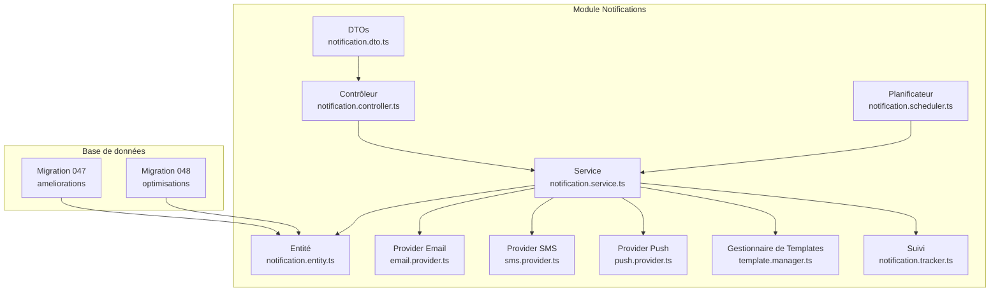
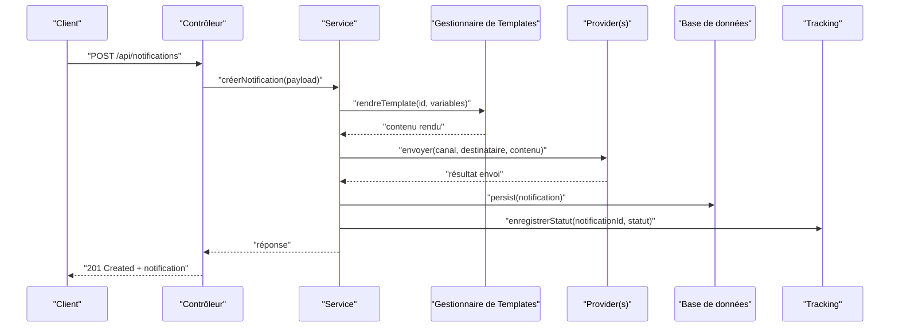
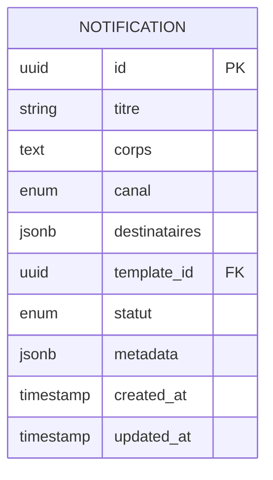
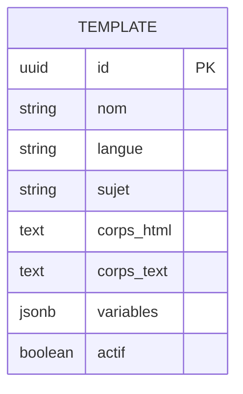
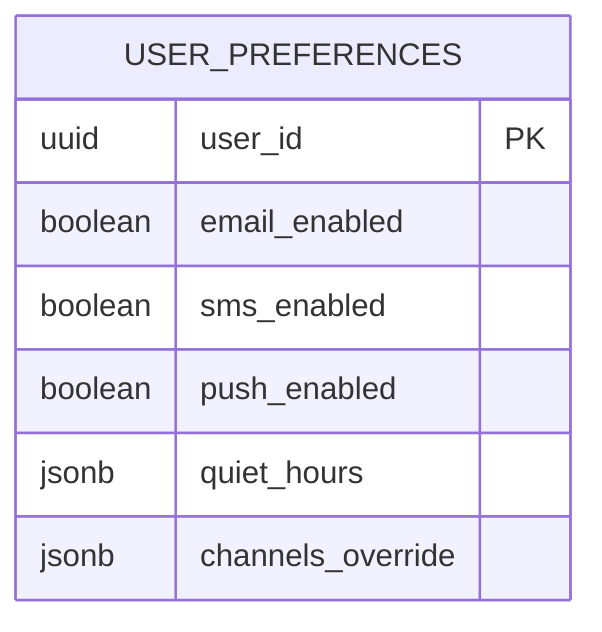
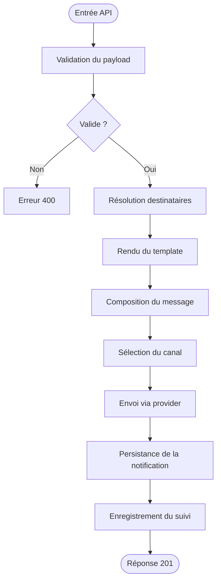
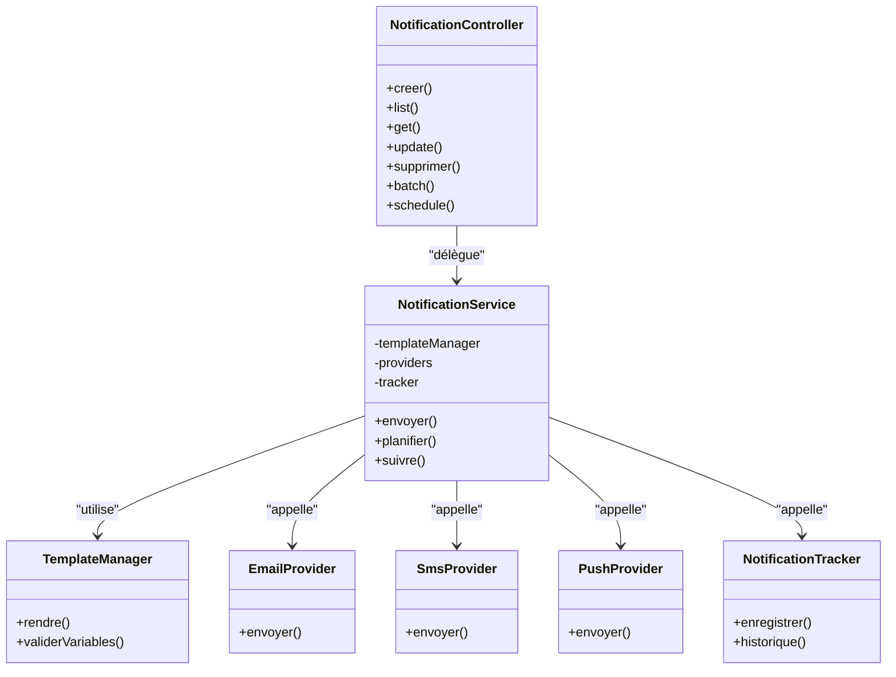

# API Système de Notifications

<cite>
**Fichiers référencés dans ce document**
- [backend/src/modules/notifications/index.ts](file://backend/src/modules/notifications/index.ts)
- [backend/src/modules/notifications/controllers/notification.controller.ts](file://backend/src/modules/notifications/controllers/notification.controller.ts)
- [backend/src/modules/notifications/services/notification.service.ts](file://backend/src/modules/notifications/services/notification.service.ts)
- [backend/src/modules/notifications/dto/notification.dto.ts](file://backend/src/modules/notifications/dto/notification.dto.ts)
- [backend/src/modules/notifications/entities/notification.entity.ts](file://backend/src/modules/notifications/entities/notification.entity.ts)
- [backend/src/modules/notifications/providers/email.provider.ts](file://backend/src/modules/notifications/providers/email.provider.ts)
- [backend/src/modules/notifications/providers/sms.provider.ts](file://backend/src/modules/notifications/providers/sms.provider.ts)
- [backend/src/modules/notifications/providers/push.provider.ts](file://backend/src/modules/notifications/providers/push.provider.ts)
- [backend/src/modules/notifications/templates/template.manager.ts](file://backend/src/modules/notifications/templates/template.manager.ts)
- [backend/src/modules/notifications/scheduler/notification.scheduler.ts](file://backend/src/modules/notifications/scheduler/notification.scheduler.ts)
- [backend/src/modules/notifications/tracking/notification.tracker.ts](file://backend/src/modules/notifications/tracking/notification.tracker.ts)
- [backend/database/migrations/047-notifications-ameliorations.sql](file://backend/database/migrations/047-notifications-ameliorations.sql)
- [backend/database/migrations/048-notifications-performance-optimizations.sql](file://backend/database/migrations/048-notifications-performance-optimizations.sql)
- [backend/scripts/test-notification-api.sh](file://backend/scripts/test-notification-api.sh)
- [backend/scripts/test-notification-providers.sh](file://backend/scripts/test-notification-providers.sh)
</cite>

## Table des matières
1. [Introduction](#introduction)
2. [Structure du projet](#structure-du-projet)
3. [Composants principaux](#composants-principaux)
4. [Vue d'ensemble de l'architecture](#vue-densemble-de-larchitecture)
5. [Analyse détaillée des composants](#analyse-detaillee-des-composants)
6. [Analyse des dépendances](#analyse-des-dependances)
7. [Considérations de performance](#considerations-de-performance)
8. [Guide de dépannage](#guide-de-depannage)
9. [Conclusion](#conclusion)
10. [Annexes](#annexes)

## Introduction
Ce document présente l’API du système de notifications multi-canaux d’eLISAschool. Il couvre les endpoints pour créer, gérer et consulter les notifications, ainsi que les schémas de données pour les templates, les canaux (email, SMS, push), et les préférences utilisateur. Il inclut également des exemples d’intégration pour webhooks, événements déclencheurs, configurations de providers, le templating, le scheduling et le suivi des notifications.

## Structure du projet
Le module de notifications est organisé par fonctionnalités : contrôleurs, services, DTOs, entités, providers, templates, scheduler et tracking. Les migrations définissent la structure de base de données et les optimisations associées.

**Sources du diagramme**
- [backend/src/modules/notifications/controllers/notification.controller.ts](file://backend/src/modules/notifications/controllers/notification.controller.ts)
- [backend/src/modules/notifications/services/notification.service.ts](file://backend/src/modules/notifications/services/notification.service.ts)
- [backend/src/modules/notifications/dto/notification.dto.ts](file://backend/src/modules/notifications/dto/notification.dto.ts)
- [backend/src/modules/notifications/entities/notification.entity.ts](file://backend/src/modules/notifications/entities/notification.entity.ts)
- [backend/src/modules/notifications/providers/email.provider.ts](file://backend/src/modules/notifications/providers/email.provider.ts)
- [backend/src/modules/notifications/providers/sms.provider.ts](file://backend/src/modules/notifications/providers/sms.provider.ts)
- [backend/src/modules/notifications/providers/push.provider.ts](file://backend/src/modules/notifications/providers/push.provider.ts)
- [backend/src/modules/notifications/templates/template.manager.ts](file://backend/src/modules/notifications/templates/template.manager.ts)
- [backend/src/modules/notifications/scheduler/notification.scheduler.ts](file://backend/src/modules/notifications/scheduler/notification.scheduler.ts)
- [backend/src/modules/notifications/tracking/notification.tracker.ts](file://backend/src/modules/notifications/tracking/notification.tracker.ts)
- [backend/database/migrations/047-notifications-ameliorations.sql](file://backend/database/migrations/047-notifications-ameliorations.sql)
- [backend/database/migrations/048-notifications-performance-optimizations.sql](file://backend/database/migrations/048-notifications-performance-optimizations.sql)

**Sources de la section**
- [backend/src/modules/notifications/index.ts](file://backend/src/modules/notifications/index.ts)

## Composants principaux
- Contrôleur : expose les routes REST pour les opérations CRUD sur les notifications et les métadonnées associées.
- Service : orchestre la logique métier, la composition des messages, l’appel aux providers, le templating et le suivi.
- DTOs : définitions des payloads d’entrée et de sortie validés.
- Entité : modèle persistant des notifications et de leurs états.
- Providers : implémentations spécifiques pour email, SMS et push.
- Gestionnaire de templates : compilation et rendu des modèles de contenu.
- Planificateur : exécution différée et répétitive des envois.
- Suivi : enregistrement des statuts et métriques de livraison.

**Sources de la section**
- [backend/src/modules/notifications/controllers/notification.controller.ts](file://backend/src/modules/notifications/controllers/notification.controller.ts)
- [backend/src/modules/notifications/services/notification.service.ts](file://backend/src/modules/notifications/services/notification.service.ts)
- [backend/src/modules/notifications/dto/notification.dto.ts](file://backend/src/modules/notifications/dto/notification.dto.ts)
- [backend/src/modules/notifications/entities/notification.entity.ts](file://backend/src/modules/notifications/entities/notification.entity.ts)
- [backend/src/modules/notifications/providers/email.provider.ts](file://backend/src/modules/notifications/providers/email.provider.ts)
- [backend/src/modules/notifications/providers/sms.provider.ts](file://backend/src/modules/notifications/providers/sms.provider.ts)
- [backend/src/modules/notifications/providers/push.provider.ts](file://backend/src/modules/notifications/providers/push.provider.ts)
- [backend/src/modules/notifications/templates/template.manager.ts](file://backend/src/modules/notifications/templates/template.manager.ts)
- [backend/src/modules/notifications/scheduler/notification.scheduler.ts](file://backend/src/modules/notifications/scheduler/notification.scheduler.ts)
- [backend/src/modules/notifications/tracking/notification.tracker.ts](file://backend/src/modules/notifications/tracking/notification.tracker.ts)

## Vue d'ensemble de l'architecture
Le contrôleur reçoit les requêtes HTTP, délègue au service qui compose le message via le gestionnaire de templates, choisit le provider selon le canal, envoie la notification et enregistre le suivi. Le planificateur peut déclencher des envois programmés ou récurrents.

**Sources du diagramme**
- [backend/src/modules/notifications/controllers/notification.controller.ts](file://backend/src/modules/notifications/controllers/notification.controller.ts)
- [backend/src/modules/notifications/services/notification.service.ts](file://backend/src/modules/notifications/services/notification.service.ts)
- [backend/src/modules/notifications/templates/template.manager.ts](file://backend/src/modules/notifications/templates/template.manager.ts)
- [backend/src/modules/notifications/providers/email.provider.ts](file://backend/src/modules/notifications/providers/email.provider.ts)
- [backend/src/modules/notifications/providers/sms.provider.ts](file://backend/src/modules/notifications/providers/sms.provider.ts)
- [backend/src/modules/notifications/providers/push.provider.ts](file://backend/src/modules/notifications/providers/push.provider.ts)
- [backend/src/modules/notifications/tracking/notification.tracker.ts](file://backend/src/modules/notifications/tracking/notification.tracker.ts)

## Analyse détaillée des composants

### Endpoints API
- POST /api/notifications : créer une notification (payload validé par DTO).
- GET /api/notifications : lister avec filtres et pagination.
- GET /api/notifications/:id : obtenir une notification par identifiant.
- PATCH /api/notifications/:id : mettre à jour le statut ou métadonnées.
- DELETE /api/notifications/:id : supprimer une notification.
- POST /api/notifications/batch : envoi groupé.
- POST /api/notifications/schedule : programmer un envoi différé.
- GET /api/notifications/tracking/:id : récupérer l’historique de suivi.

Exemples d’exécution :
- Script de test API : [test-notification-api.sh](file://backend/scripts/test-notification-api.sh)
- Script de test providers : [test-notification-providers.sh](file://backend/scripts/test-notification-providers.sh)

**Sources de la section**
- [backend/src/modules/notifications/controllers/notification.controller.ts](file://backend/src/modules/notifications/controllers/notification.controller.ts)
- [backend/scripts/test-notification-api.sh](file://backend/scripts/test-notification-api.sh)
- [backend/scripts/test-notification-providers.sh](file://backend/scripts/test-notification-providers.sh)

### Schémas de données

#### Entité Notification
Champs principaux :
- id : identifiant unique
- titre : texte court
- corps : contenu principal
- canal : enum (email, sms, push)
- destinataires : tableau d’identifiants ou adresses
- template_id : référence au template utilisé
- statut : enum (en_attente, envoye, echec, annule)
- metadata : JSON libre pour contexte
- created_at, updated_at : horodatages

**Sources du diagramme**
- [backend/src/modules/notifications/entities/notification.entity.ts](file://backend/src/modules/notifications/entities/notification.entity.ts)
- [backend/database/migrations/047-notifications-ameliorations.sql](file://backend/database/migrations/047-notifications-ameliorations.sql)
- [backend/database/migrations/048-notifications-performance-optimizations.sql](file://backend/database/migrations/048-notifications-performance-optimizations.sql)

#### Template de notification
Champs principaux :
- id : identifiant unique
- nom : nom technique
- langue : code ISO
- sujet : objet du message
- corps_html : version HTML
- corps_text : version texte
- variables : liste de clés attendues
- actif : booléen

**Sources du diagramme**
- [backend/src/modules/notifications/templates/template.manager.ts](file://backend/src/modules/notifications/templates/template.manager.ts)

#### Préférences utilisateur
Champs principaux :
- user_id : clé étrangère vers utilisateur
- email_enabled : booléen
- sms_enabled : booléen
- push_enabled : booléen
- quiet_hours : plage horaire
- channels_override : JSON de règles

**Sources du diagramme**
- [backend/src/modules/notifications/services/notification.service.ts](file://backend/src/modules/notifications/services/notification.service.ts)

### Logique de traitement et flux

**Sources du diagramme**
- [backend/src/modules/notifications/services/notification.service.ts](file://backend/src/modules/notifications/services/notification.service.ts)
- [backend/src/modules/notifications/templates/template.manager.ts](file://backend/src/modules/notifications/templates/template.manager.ts)
- [backend/src/modules/notifications/providers/email.provider.ts](file://backend/src/modules/notifications/providers/email.provider.ts)
- [backend/src/modules/notifications/providers/sms.provider.ts](file://backend/src/modules/notifications/providers/sms.provider.ts)
- [backend/src/modules/notifications/providers/push.provider.ts](file://backend/src/modules/notifications/providers/push.provider.ts)
- [backend/src/modules/notifications/tracking/notification.tracker.ts](file://backend/src/modules/notifications/tracking/notification.tracker.ts)

### Templating
- Compilation des variables dans les modèles HTML/texte.
- Fallback vers texte brut si HTML non disponible.
- Validation des variables requises avant envoi.

**Sources de la section**
- [backend/src/modules/notifications/templates/template.manager.ts](file://backend/src/modules/notifications/templates/template.manager.ts)

### Planification (Scheduling)
- Envois différés à date/heure précise.
- Récurrence basée sur intervalles ou cron.
- File d’attente interne pour éviter les pertes.

**Sources de la section**
- [backend/src/modules/notifications/scheduler/notification.scheduler.ts](file://backend/src/modules/notifications/scheduler/notification.scheduler.ts)

### Tracking et observabilité
- Statuts : en attente, envoyé, échec, annulé.
- Historique par notification avec timestamps et codes de retour.
- Métriques de taux de livraison et erreurs.

**Sources de la section**
- [backend/src/modules/notifications/tracking/notification.tracker.ts](file://backend/src/modules/notifications/tracking/notification.tracker.ts)

### Providers
- Email : SMTP ou API externe, gestion des pièces jointes.
- SMS : opérateur local ou passerelle internationale.
- Push : APNs/FCM, tokens utilisateurs.

**Sources de la section**
- [backend/src/modules/notifications/providers/email.provider.ts](file://backend/src/modules/notifications/providers/email.provider.ts)
- [backend/src/modules/notifications/providers/sms.provider.ts](file://backend/src/modules/notifications/providers/sms.provider.ts)
- [backend/src/modules/notifications/providers/push.provider.ts](file://backend/src/modules/notifications/providers/push.provider.ts)

### Exemples d'intégration
- Webhooks : configurer une URL de callback pour recevoir les événements de livraison.
- Événements déclencheurs : s’abonner à des événements métier pour générer des notifications.
- Configurations de providers : définir les credentials et options par canal.

**Sources de la section**
- [backend/src/modules/notifications/services/notification.service.ts](file://backend/src/modules/notifications/services/notification.service.ts)
- [backend/src/modules/notifications/scheduler/notification.scheduler.ts](file://backend/src/modules/notifications/scheduler/notification.scheduler.ts)

## Analyse des dépendances
Le service centralise les dépendances vers les providers, le template manager et le tracker. Le contrôleur dépend uniquement du service et des DTOs.

**Sources du diagramme**
- [backend/src/modules/notifications/controllers/notification.controller.ts](file://backend/src/modules/notifications/controllers/notification.controller.ts)
- [backend/src/modules/notifications/services/notification.service.ts](file://backend/src/modules/notifications/services/notification.service.ts)
- [backend/src/modules/notifications/templates/template.manager.ts](file://backend/src/modules/notifications/templates/template.manager.ts)
- [backend/src/modules/notifications/providers/email.provider.ts](file://backend/src/modules/notifications/providers/email.provider.ts)
- [backend/src/modules/notifications/providers/sms.provider.ts](file://backend/src/modules/notifications/providers/sms.provider.ts)
- [backend/src/modules/notifications/providers/push.provider.ts](file://backend/src/modules/notifications/providers/push.provider.ts)
- [backend/src/modules/notifications/tracking/notification.tracker.ts](file://backend/src/modules/notifications/tracking/notification.tracker.ts)

**Sources de la section**
- [backend/src/modules/notifications/index.ts](file://backend/src/modules/notifications/index.ts)

## Considérations de performance
- Indexation des colonnes fréquentes (statut, canal, created_at).
- Requêtes paginées et filtrées côté serveur.
- Mise en file d’attente pour les envois massifs.
- Cache de templates actifs pour réduire le rendu.

**Sources de la section**
- [backend/database/migrations/048-notifications-performance-optimizations.sql](file://backend/database/migrations/048-notifications-performance-optimizations.sql)

## Guide de dépannage
- Vérifier les logs de provider pour les erreurs réseau.
- Examiner le statut de la notification et l’historique de suivi.
- Valider les variables de template manquantes.
- Confirmer les préférences utilisateur et les plages horaires silencieuses.
- Utiliser les scripts de test pour valider l’API et les providers.

**Sources de la section**
- [backend/src/modules/notifications/tracking/notification.tracker.ts](file://backend/src/modules/notifications/tracking/notification.tracker.ts)
- [backend/scripts/test-notification-api.sh](file://backend/scripts/test-notification-api.sh)
- [backend/scripts/test-notification-providers.sh](file://backend/scripts/test-notification-providers.sh)

## Conclusion
Le système de notifications d’eLISAschool offre une API complète et extensible pour la diffusion multi-canaux, avec un fort accent sur la fiabilité, la traçabilité et la performance. La séparation claire entre contrôleurs, services, providers et outils de templating permet une maintenance aisée et une évolution progressive.

## Annexes
- Scripts de test : 
  - [test-notification-api.sh](file://backend/scripts/test-notification-api.sh)
  - [test-notification-providers.sh](file://backend/scripts/test-notification-providers.sh)
- Migrations :
  - [047-notifications-ameliorations.sql](file://backend/database/migrations/047-notifications-ameliorations.sql)
  - [048-notifications-performance-optimizations.sql](file://backend/database/migrations/048-notifications-performance-optimizations.sql)