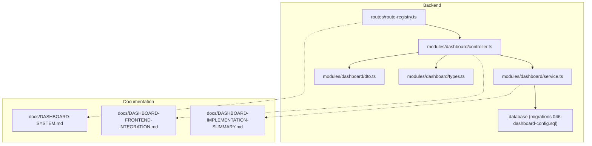
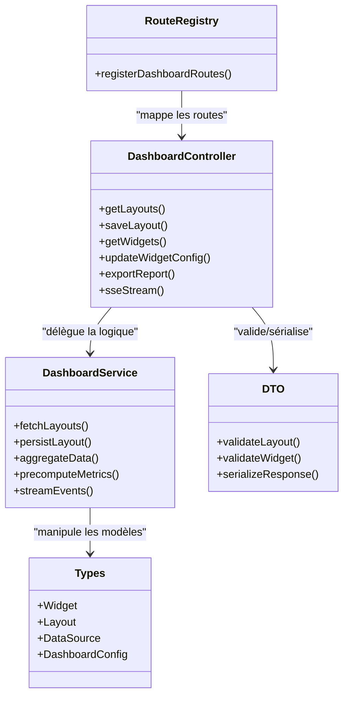
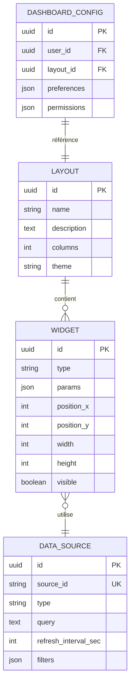
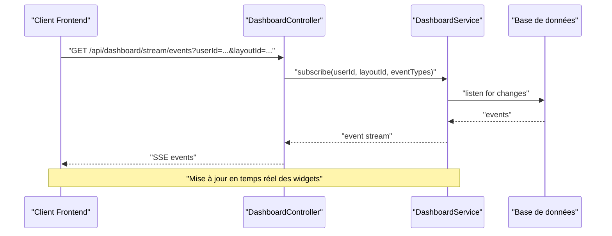
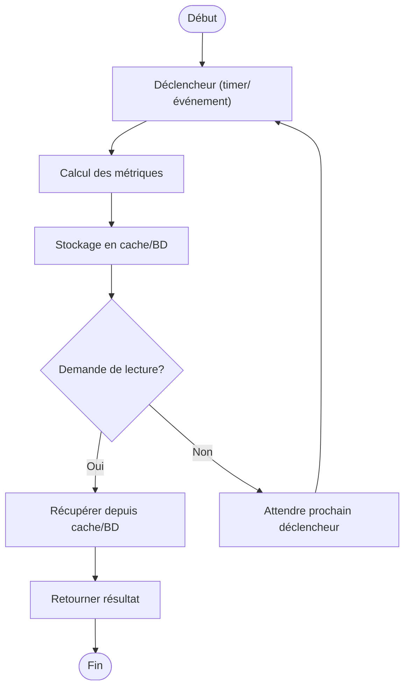
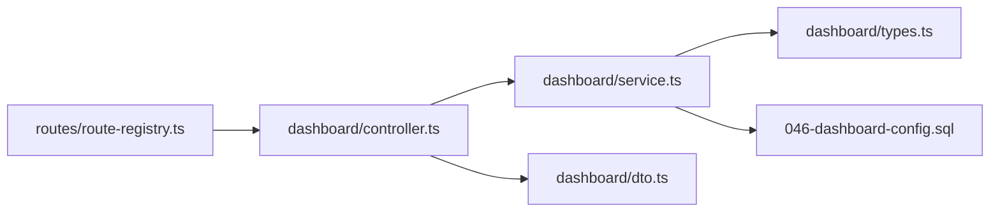

# API Tableaux de Bord Personnalisables

<cite>
**Fichiers référencés dans ce document**
- [DASHBOARD-SYSTEM.md](file://backend/docs/DASHBOARD-SYSTEM.md)
- [DASHBOARD-FRONTEND-INTEGRATION.md](file://backend/docs/DASHBOARD-FRONTEND-INTEGRATION.md)
- [DASHBOARD-IMPLEMENTATION-SUMMARY.md](file://backend/docs/DASHBOARD-IMPLEMENTATION-SUMMARY.md)
- [046-dashboard-config.sql](file://backend/database/migrations/046-dashboard-config.sql)
- [dashboard/index.ts](file://backend/src/modules/dashboard/index.ts)
- [dashboard/controller.ts](file://backend/src/modules/dashboard/controller.ts)
- [dashboard/service.ts](file://backend/src/modules/dashboard/service.ts)
- [dashboard/dto.ts](file://backend/src/modules/dashboard/dto.ts)
- [dashboard/types.ts](file://backend/src/modules/dashboard/types.ts)
- [routes/route-registry.ts](file://backend/src/routes/route-registry.ts)
</cite>

## Table des matières
1. [Introduction](#introduction)
2. [Structure du projet](#structure-du-projet)
3. [Composants clés](#composants-clés)
4. [Vue d'ensemble de l'architecture](#vue-densemble-de-larchitecture)
5. [Analyse détaillée des composants](#analyse-detaillee-des-composants)
6. [Analyse des dépendances](#analyse-des-dependances)
7. [Considérations de performance](#considerations-de-performance)
8. [Guide de dépannage](#guide-de-depannage)
9. [Conclusion](#conclusion)
10. [Annexes](#annexes)

## Introduction
Ce document présente l’API complète pour les tableaux de bord personnalisables eLISAschool. Il couvre la gestion des widgets, layouts et configurations de dashboard, ainsi que les schémas de données associés (types de widgets, sources de données, paramètres). Il inclut également des exemples d’intégration pour les données en temps réel via SSE, les calculs précalculés et les agrégations de données, ainsi que les fonctionnalités de personnalisation par utilisateur, partage de dashboards et export de rapports.

## Structure du projet
Le module Dashboard est organisé selon une architecture modulaire avec séparation claire entre contrôleurs, services, DTOs, types et migrations de base de données. Les routes sont centralisées et le frontend dispose d’une documentation dédiée à l’intégration.

**Sources de diagramme**
- [routes/route-registry.ts](file://backend/src/routes/route-registry.ts)
- [dashboard/controller.ts](file://backend/src/modules/dashboard/controller.ts)
- [dashboard/service.ts](file://backend/src/modules/dashboard/service.ts)
- [dashboard/dto.ts](file://backend/src/modules/dashboard/dto.ts)
- [dashboard/types.ts](file://backend/src/modules/dashboard/types.ts)
- [046-dashboard-config.sql](file://backend/database/migrations/046-dashboard-config.sql)
- [DASHBOARD-SYSTEM.md](file://backend/docs/DASHBOARD-SYSTEM.md)
- [DASHBOARD-FRONTEND-INTEGRATION.md](file://backend/docs/DASHBOARD-FRONTEND-INTEGRATION.md)
- [DASHBOARD-IMPLEMENTATION-SUMMARY.md](file://backend/docs/DASHBOARD-IMPLEMENTATION-SUMMARY.md)

**Sources de section**
- [DASHBOARD-SYSTEM.md](file://backend/docs/DASHBOARD-SYSTEM.md)
- [DASHBOARD-FRONTEND-INTEGRATION.md](file://backend/docs/DASHBOARD-FRONTEND-INTEGRATION.md)
- [DASHBOARD-IMPLEMENTATION-SUMMARY.md](file://backend/docs/DASHBOARD-IMPLEMENTATION-SUMMARY.md)

## Composants clés
- Contrôleurs: exposent les endpoints REST et gèrent les flux de requêtes/réponses.
- Services: implémentent la logique métier, l’accès aux données et les agrégations.
- DTOs: définissent les structures de validation et de sérialisation des payloads.
- Types: définissent les modèles de données (widgets, layouts, sources, paramètres).
- Migrations: structure de persistance pour les configurations de dashboard.

**Sources de section**
- [dashboard/controller.ts](file://backend/src/modules/dashboard/controller.ts)
- [dashboard/service.ts](file://backend/src/modules/dashboard/service.ts)
- [dashboard/dto.ts](file://backend/src/modules/dashboard/dto.ts)
- [dashboard/types.ts](file://backend/src/modules/dashboard/types.ts)
- [046-dashboard-config.sql](file://backend/database/migrations/046-dashboard-config.sql)

## Vue d'ensemble de l'architecture
L’API suit un pattern MVC classique : les routes redirigent vers les contrôleurs qui délèguent au service pour la logique métier et la persistance. Les DTOs assurent la cohérence des données entrantes/sortantes. Le schéma de base de données est défini par les migrations.

**Sources de diagramme**
- [routes/route-registry.ts](file://backend/src/routes/route-registry.ts)
- [dashboard/controller.ts](file://backend/src/modules/dashboard/controller.ts)
- [dashboard/service.ts](file://backend/src/modules/dashboard/service.ts)
- [dashboard/dto.ts](file://backend/src/modules/dashboard/dto.ts)
- [dashboard/types.ts](file://backend/src/modules/dashboard/types.ts)

## Analyse détaillée des composants

### Endpoints REST pour Widgets et Layouts
- GET /api/dashboard/layouts: liste les layouts disponibles.
- POST /api/dashboard/layouts: sauvegarde ou met à jour un layout.
- GET /api/dashboard/widgets: liste les widgets configurés.
- PUT /api/dashboard/widgets/:id/config: met à jour la configuration d’un widget.
- DELETE /api/dashboard/widgets/:id: supprime un widget.
- GET /api/dashboard/export/report: exporte un rapport (PDF/CSV).

Exemple de payload pour mise à jour de configuration de widget:
- Clés attendues: id, type, params, position, taille, visibilité.

Exemple de payload pour création de layout:
- Clés attendues: nom, description, widgets[], colonnes, thème.

**Sources de section**
- [dashboard/controller.ts](file://backend/src/modules/dashboard/controller.ts)
- [dashboard/dto.ts](file://backend/src/modules/dashboard/dto.ts)
- [dashboard/types.ts](file://backend/src/modules/dashboard/types.ts)

### Schémas de données
Types principaux:
- Widget: identifiant, type, paramètres, position, taille, visibilité.
- Layout: identifiant, nom, description, widgets[], colonnes, thème.
- DataSource: sourceId, type, query, interval, filtres.
- DashboardConfig: userId, layoutId, preferences, permissions.

Relations:
- Un utilisateur possède un DashboardConfig.
- Un DashboardConfig référence un Layout.
- Un Layout contient plusieurs Widgets.
- Chaque Widget peut pointer vers une DataSource.

**Sources de diagramme**
- [dashboard/types.ts](file://backend/src/modules/dashboard/types.ts)
- [046-dashboard-config.sql](file://backend/database/migrations/046-dashboard-config.sql)

**Sources de section**
- [dashboard/types.ts](file://backend/src/modules/dashboard/types.ts)
- [046-dashboard-config.sql](file://backend/database/migrations/046-dashboard-config.sql)

### Flux SSE pour données en temps réel
Endpoints:
- GET /api/dashboard/stream/events: établit un flux SSE.
- Paramètres: userId, layoutId, eventTypes, interval.

Flux typique:
- Le client ouvre une connexion SSE.
- Le serveur émet des événements périodiques ou sur changement de données.
- Le client met à jour les widgets concernés.

**Sources de diagramme**
- [dashboard/controller.ts](file://backend/src/modules/dashboard/controller.ts)
- [dashboard/service.ts](file://backend/src/modules/dashboard/service.ts)

**Sources de section**
- [DASHBOARD-FRONTEND-INTEGRATION.md](file://backend/docs/DASHBOARD-FRONTEND-INTEGRATION.md)
- [dashboard/controller.ts](file://backend/src/modules/dashboard/controller.ts)
- [dashboard/service.ts](file://backend/src/modules/dashboard/service.ts)

### Calculs précalculés et agrégations
Points clés:
- Précalcul: métriques calculées à intervalles réguliers pour réduire la latence.
- Agrégations: regroupements par période, classe, matière, etc.
- Cache: résultats mis en cache pour optimiser les lectures fréquentes.

Algorithme simplifié:
- Déclencheur: timer ou événement de modification.
- Exécution: calcul des métriques et stockage.
- Lecture: récupération depuis cache ou base de données.

**Sources de diagramme**
- [dashboard/service.ts](file://backend/src/modules/dashboard/service.ts)

**Sources de section**
- [dashboard/service.ts](file://backend/src/modules/dashboard/service.ts)
- [DASHBOARD-IMPLEMENTATION-SUMMARY.md](file://backend/docs/DASHBOARD-IMPLEMENTATION-SUMMARY.md)

### Personnalisation par utilisateur, partage et export
- Personnalisation: chaque utilisateur peut définir son propre layout et ses widgets.
- Partage: possibilité de partager un layout avec d’autres utilisateurs ou groupes.
- Export: génération de rapports PDF/CSV à partir des données affichées.

Opérations:
- GET /api/dashboard/layouts/:id/share: obtient les métadonnées de partage.
- POST /api/dashboard/layouts/:id/share: configure les permissions de partage.
- GET /api/dashboard/export/report: génère un rapport basé sur le layout actuel.

**Sources de section**
- [dashboard/controller.ts](file://backend/src/modules/dashboard/controller.ts)
- [dashboard/service.ts](file://backend/src/modules/dashboard/service.ts)
- [DASHBOARD-SYSTEM.md](file://backend/docs/DASHBOARD-SYSTEM.md)

## Analyse des dépendances
Les dépendances principales sont:
- Routes vers contrôleurs.
- Contrôleurs vers services.
- Services vers types et base de données.
- DTOs utilisés par les contrôleurs pour valider les entrées.

**Sources de diagramme**
- [routes/route-registry.ts](file://backend/src/routes/route-registry.ts)
- [dashboard/controller.ts](file://backend/src/modules/dashboard/controller.ts)
- [dashboard/service.ts](file://backend/src/modules/dashboard/service.ts)
- [dashboard/dto.ts](file://backend/src/modules/dashboard/dto.ts)
- [dashboard/types.ts](file://backend/src/modules/dashboard/types.ts)
- [046-dashboard-config.sql](file://backend/database/migrations/046-dashboard-config.sql)

**Sources de section**
- [routes/route-registry.ts](file://backend/src/routes/route-registry.ts)
- [dashboard/controller.ts](file://backend/src/modules/dashboard/controller.ts)
- [dashboard/service.ts](file://backend/src/modules/dashboard/service.ts)
- [dashboard/dto.ts](file://backend/src/modules/dashboard/dto.ts)
- [dashboard/types.ts](file://backend/src/modules/dashboard/types.ts)
- [046-dashboard-config.sql](file://backend/database/migrations/046-dashboard-config.sql)

## Considérations de performance
- Utiliser des index sur les champs fréquemment filtrés (userId, layoutId, widgetId).
- Mettre en cache les résultats de calculs précalculés.
- Limiter la charge SSE en filtrant les événements par type et intervalle.
- Optimiser les requêtes SQL avec des jointures minimales et des projections ciblées.

[Pas de sources nécessaires car cette section fournit des conseils généraux]

## Guide de dépannage
Problèmes courants:
- Erreurs 400: vérifier la validité des DTOs envoyés.
- Erreurs 401/403: vérifier les permissions d’accès aux layouts et widgets.
- Latence élevée: examiner les requêtes SQL et l’état du cache.
- SSE instable: vérifier la connectivité et le nombre d’émissions.

Actions recommandées:
- Activer les logs détaillés pour les erreurs de validation.
- Vérifier les index et les plans d’exécution des requêtes.
- Surveiller l’utilisation mémoire du cache.

**Sources de section**
- [dashboard/controller.ts](file://backend/src/modules/dashboard/controller.ts)
- [dashboard/service.ts](file://backend/src/modules/dashboard/service.ts)

## Conclusion
L’API des tableaux de bord personnalisables eLISAschool offre une architecture modulaire et performante, permettant une grande flexibilité dans la gestion des widgets, layouts et configurations. Grâce aux flux SSE, aux calculs précalculés et aux capacités d’export, elle répond aux besoins de personnalisation, partage et reporting des utilisateurs.

[Pas de sources nécessaires car cette section résume sans analyser de fichiers spécifiques]

## Annexes
- Documentation intégration frontend: [DASHBOARD-FRONTEND-INTEGRATION.md](file://backend/docs/DASHBOARD-FRONTEND-INTEGRATION.md)
- Résumé d’implémentation: [DASHBOARD-IMPLEMENTATION-SUMMARY.md](file://backend/docs/DASHBOARD-IMPLEMENTATION-SUMMARY.md)
- Système complet: [DASHBOARD-SYSTEM.md](file://backend/docs/DASHBOARD-SYSTEM.md)

**Sources de section**
- [DASHBOARD-FRONTEND-INTEGRATION.md](file://backend/docs/DASHBOARD-FRONTEND-INTEGRATION.md)
- [DASHBOARD-IMPLEMENTATION-SUMMARY.md](file://backend/docs/DASHBOARD-IMPLEMENTATION-SUMMARY.md)
- [DASHBOARD-SYSTEM.md](file://backend/docs/DASHBOARD-SYSTEM.md)