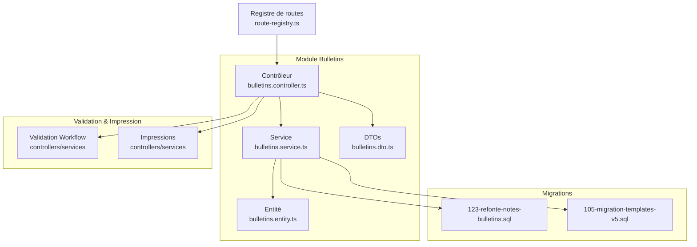
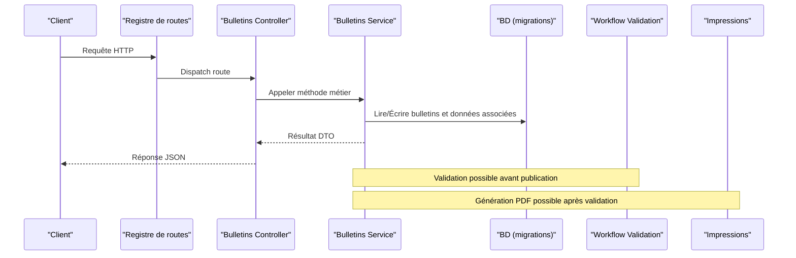
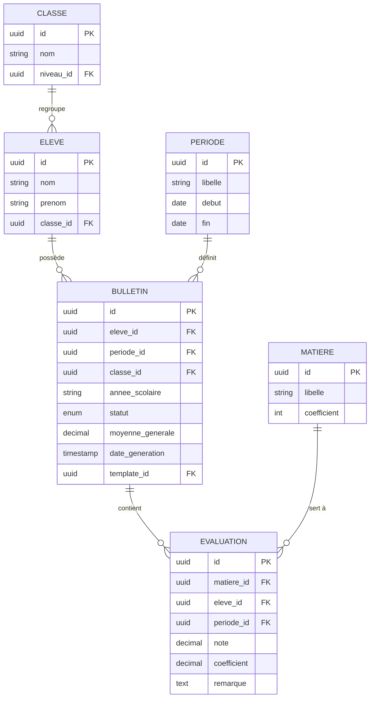
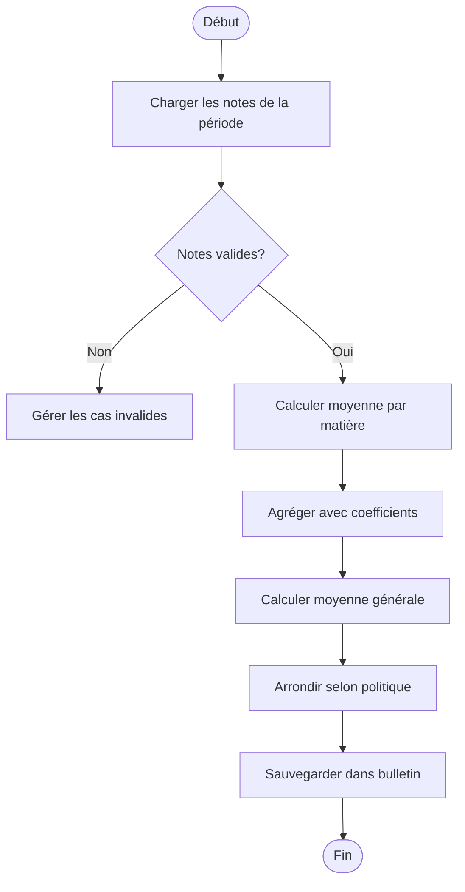
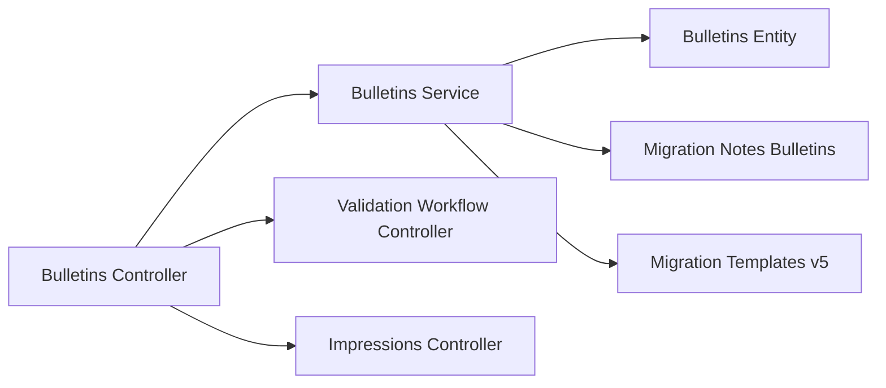

# API Bulletins Scolaires

<cite>
**Fichiers référencés dans ce document**
- [bulletins.controller.ts](file://backend/src/modules/bulletins/controllers/bulletins.controller.ts)
- [bulletins.service.ts](file://backend/src/modules/bulletins/services/bulletins.service.ts)
- [bulletins.entity.ts](file://backend/src/modules/bulletins/entities/bulletins.entity.ts)
- [bulletins.dto.ts](file://backend/src/modules/bulletins/dto/bulletins.dto.ts)
- [123-refonte-notes-bulletins.sql](file://backend/database/migrations/123-refonte-notes-bulletins.sql)
- [105-migration-templates-v5.sql](file://backend/database/migrations/105-migration-templates-v5.sql)
- [validation-workflow.controller.ts](file://backend/src/modules/validation-workflow/controllers/validation-workflow.controller.ts)
- [validation-workflow.service.ts](file://backend/src/modules/validation-workflow/services/validation-workflow.service.ts)
- [impressions.controller.ts](file://backend/src/modules/impressions/controllers/impressions.controller.ts)
- [impressions.service.ts](file://backend/src/modules/impressions/services/impressions.service.ts)
- [route-registry.ts](file://backend/src/routes/route-registry.ts)
</cite>

## Table des matières
1. [Introduction](#introduction)
2. [Structure du projet](#structure-du-projet)
3. [Composants clés](#composants-clés)
4. [Vue d’ensemble de l’architecture](#vue-densemble-de-larchitecture)
5. [Analyse détaillée des composants](#analyse-detallee-des-composants)
6. [Analyse des dépendances](#analyse-des-dependances)
7. [Considérations de performance](#considerations-de-performance)
8. [Guide de dépannage](#guide-de-depannage)
9. [Conclusion](#conclusion)
10. [Annexes](#annexes)

## Introduction
Ce document présente l’API eLISAschool dédiée à la génération et au cycle de vie des bulletins scolaires. Il couvre les endpoints pour la création (par élève, par période, par classe), la personnalisation des modèles, la génération PDF, ainsi que les workflows de validation et diffusion. Vous y trouverez également les schémas de données des bulletins, les templates configurables, les règles de calcul des moyennes générales et les statuts de validation. Des exemples concrets sont fournis pour les secrétaires et directeurs d’établissement.

## Structure du projet
Le module bulletins est organisé en couches classiques : contrôleurs (routes HTTP), services (logique métier), entités (modèles de données), DTOs (schémas de requêtes/réponses). Les migrations définissent le schéma de base et les évolutions des templates. Le registre de routes expose les endpoints.

**Sources du diagramme**
- [bulletins.controller.ts](file://backend/src/modules/bulletins/controllers/bulletins.controller.ts)
- [bulletins.service.ts](file://backend/src/modules/bulletins/services/bulletins.service.ts)
- [bulletins.entity.ts](file://backend/src/modules/bulletins/entities/bulletins.entity.ts)
- [bulletins.dto.ts](file://backend/src/modules/bulletins/dto/bulletins.dto.ts)
- [123-refonte-notes-bulletins.sql](file://backend/database/migrations/123-refonte-notes-bulletins.sql)
- [105-migration-templates-v5.sql](file://backend/database/migrations/105-migration-templates-v5.sql)
- [validation-workflow.controller.ts](file://backend/src/modules/validation-workflow/controllers/validation-workflow.controller.ts)
- [validation-workflow.service.ts](file://backend/src/modules/validation-workflow/services/validation-workflow.service.ts)
- [impressions.controller.ts](file://backend/src/modules/impressions/controllers/impressions.controller.ts)
- [impressions.service.ts](file://backend/src/modules/impressions/services/impressions.service.ts)
- [route-registry.ts](file://backend/src/routes/route-registry.ts)

**Sources de section**
- [route-registry.ts](file://backend/src/routes/route-registry.ts)

## Composants clés
- Contrôleurs : exposition des endpoints REST pour bulletins, validation et impressions.
- Services : orchestration des calculs de moyennes, agrégation des notes, génération de documents et gestion des workflows.
- Entités : modèle persistant des bulletins et relations avec élèves, périodes, classes et matières.
- DTOs : schémas de validation des entrées/sorties (création, filtres, réponses).
- Migrations : définition du schéma des bulletins et des templates.
- Modules externes : validation workflow (états et transitions) et impressions (génération PDF).

**Sources de section**
- [bulletins.controller.ts](file://backend/src/modules/bulletins/controllers/bulletins.controller.ts)
- [bulletins.service.ts](file://backend/src/modules/bulletins/services/bulletins.service.ts)
- [bulletins.entity.ts](file://backend/src/modules/bulletins/entities/bulletins.entity.ts)
- [bulletins.dto.ts](file://backend/src/modules/bulletins/dto/bulletins.dto.ts)
- [123-refonte-notes-bulletins.sql](file://backend/database/migrations/123-refonte-notes-bulletins.sql)
- [105-migration-templates-v5.sql](file://backend/database/migrations/105-migration-templates-v5.sql)

## Vue d’ensemble de l’architecture
L’API suit une architecture modulaire où les contrôleurs reçoivent les requêtes, délèguent au service pour la logique métier, puis retournent des réponses structurées via DTOs. Les bulletins s’appuient sur les données académiques (élèves, périodes, matières, notes) et peuvent être validés via un workflow avant impression PDF.

**Sources du diagramme**
- [route-registry.ts](file://backend/src/routes/route-registry.ts)
- [bulletins.controller.ts](file://backend/src/modules/bulletins/controllers/bulletins.controller.ts)
- [bulletins.service.ts](file://backend/src/modules/bulletins/services/bulletins.service.ts)
- [123-refonte-notes-bulletins.sql](file://backend/database/migrations/123-refonte-notes-bulletins.sql)
- [validation-workflow.controller.ts](file://backend/src/modules/validation-workflow/controllers/validation-workflow.controller.ts)
- [validation-workflow.service.ts](file://backend/src/modules/validation-workflow/services/validation-workflow.service.ts)
- [impressions.controller.ts](file://backend/src/modules/impressions/controllers/impressions.controller.ts)
- [impressions.service.ts](file://backend/src/modules/impressions/services/impressions.service.ts)

## Analyse détaillée des composants

### Endpoints Bulletins
- Création de bulletin par élève : POST /bulletins/by-eleve
  - Corps : identifiant élève, année scolaire, période, options de template.
  - Réponse : id bulletin, statut, lien vers détails.
- Création de bulletin par période : POST /bulletins/by-periode
  - Corps : id période, année scolaire, filtre classe si nécessaire.
  - Réponse : liste des bulletins générés ou tâche asynchrone.
- Création de bulletin par classe : POST /bulletins/by-classe
  - Corps : id classe, année scolaire, période.
  - Réponse : lot de bulletins ou job ID.
- Lecture et mise à jour : GET/PUT /bulletins/:id
  - Détails du bulletin, modification des paramètres d’impression/template.
- Suppression : DELETE /bulletins/:id
  - Suppression soft/hard selon politique.

Exemple d’utilisation (secrétaire) :
- Générer les bulletins d’une classe pour une période donnée.
- Vérifier les erreurs de saisie (notes manquantes, coefficients invalides).
- Exporter un PDF pour archivage.

Exemple d’utilisation (directeur) :
- Valider les bulletins produits.
- Publier pour diffusion aux parents.

**Sources de section**
- [bulletins.controller.ts](file://backend/src/modules/bulletins/controllers/bulletins.controller.ts)
- [bulletins.dto.ts](file://backend/src/modules/bulletins/dto/bulletins.dto.ts)

### Personnalisation des modèles
- Templates configurables par établissement/période.
- Variables injectées : nom élève, classe, matière, note, coefficient, moyenne, remarques.
- Points d’extension : logo, couleurs, sections personnalisées.

Actions API :
- GET /templates : liste des templates actifs.
- POST /templates : créer/modifier un template.
- GET /templates/:id : détails d’un template.
- PUT /templates/:id : mise à jour.
- DELETE /templates/:id : suppression.

Exemple d’utilisation (secrétaire) :
- Adapter le template pour inclure les compétences ou les remarques pédagogiques.

**Sources de section**
- [105-migration-templates-v5.sql](file://backend/database/migrations/105-migration-templates-v5.sql)
- [bulletins.controller.ts](file://backend/src/modules/bulletins/controllers/bulletins.controller.ts)

### Génération PDF
- Endpoint dédié : POST /impressions/pdf
  - Corps : id bulletin, options (format, orientation, watermark).
  - Réponse : URL de téléchargement ou blob binaire.
- Historique des impressions : GET /impressions/history
  - Filtres par bulletin, utilisateur, date.

Exemple d’utilisation (directeur) :
- Générer le PDF validé et archiver dans le dossier numérique.

**Sources de section**
- [impressions.controller.ts](file://backend/src/modules/impressions/controllers/impressions.controller.ts)
- [impressions.service.ts](file://backend/src/modules/impressions/services/impressions.service.ts)

### Workflows de validation et diffusion
- États possibles : Brouillon, En révision, Validé, Publié, Annulé.
- Actions : soumettre, valider, publier, annuler.
- Traçabilité : historique des actions, responsable, date.

Endpoints :
- POST /bulletins/:id/workflow/action
  - Corps : action, commentaire.
  - Réponse : nouvel état, audit.
- GET /bulletins/:id/workflow/history
  - Liste chronologique des transitions.

Exemple d’utilisation (directeur) :
- Valider un bulletin après vérification des moyennes et remarques.
- Publier pour diffusion aux responsables.

**Sources de section**
- [validation-workflow.controller.ts](file://backend/src/modules/validation-workflow/controllers/validation-workflow.controller.ts)
- [validation-workflow.service.ts](file://backend/src/modules/validation-workflow/services/validation-workflow.service.ts)

### Schémas de données des bulletins
- Entités principales : bulletin, eleve, periode, classe, matiere, evaluation/note.
- Relations : un bulletin appartient à un élève et une période ; contient plusieurs lignes de matières avec notes et coefficients.
- Champs clés : id, eleve_id, periode_id, classe_id, annee_scolaire, statut, moyenne_generale, date_generation, template_id.

**Sources du diagramme**
- [bulletins.entity.ts](file://backend/src/modules/bulletins/entities/bulletins.entity.ts)
- [123-refonte-notes-bulletins.sql](file://backend/database/migrations/123-refonte-notes-bulletins.sql)

**Sources de section**
- [bulletins.entity.ts](file://backend/src/modules/bulletins/entities/bulletins.entity.ts)
- [123-refonte-notes-bulletins.sql](file://backend/database/migrations/123-refonte-notes-bulletins.sql)

### Calculs de moyennes générales
- Moyenne par matière : pondération par coefficient.
- Moyenne générale : somme pondérée des matières divisée par la somme des coefficients.
- Règles : exclusion des notes nulles non significatives, gestion des absences, arrondis conformes à la politique de l’établissement.

Algorithme simplifié :

**Sources du diagramme**
- [bulletins.service.ts](file://backend/src/modules/bulletins/services/bulletins.service.ts)
- [123-refonte-notes-bulletins.sql](file://backend/database/migrations/123-refonte-notes-bulletins.sql)

**Sources de section**
- [bulletins.service.ts](file://backend/src/modules/bulletins/services/bulletins.service.ts)
- [123-refonte-notes-bulletins.sql](file://backend/database/migrations/123-refonte-notes-bulletins.sql)

### Statuts de validation
- Brouillon : bulletin généré mais non soumis.
- En révision : soumis pour examen par le directeur.
- Validé : approuvé sans réserve.
- Publié : diffusé aux responsables.
- Annulé : retiré de la circulation.

Transitions autorisées :
- Brouillon → En révision
- En révision → Validé ou Retourner
- Validé → Publié
- Publié → Annulé (avec justification)

**Sources de section**
- [validation-workflow.controller.ts](file://backend/src/modules/validation-workflow/controllers/validation-workflow.controller.ts)
- [validation-workflow.service.ts](file://backend/src/modules/validation-workflow/services/validation-workflow.service.ts)

## Analyse des dépendances
Les contrôleurs dépendent des services qui interagissent avec les entités et les migrations. La validation et les impressions sont des modules externes intégrés via leurs propres contrôleurs/services.

**Sources du diagramme**
- [bulletins.controller.ts](file://backend/src/modules/bulletins/controllers/bulletins.controller.ts)
- [bulletins.service.ts](file://backend/src/modules/bulletins/services/bulletins.service.ts)
- [bulletins.entity.ts](file://backend/src/modules/bulletins/entities/bulletins.entity.ts)
- [123-refonte-notes-bulletins.sql](file://backend/database/migrations/123-refonte-notes-bulletins.sql)
- [105-migration-templates-v5.sql](file://backend/database/migrations/105-migration-templates-v5.sql)
- [validation-workflow.controller.ts](file://backend/src/modules/validation-workflow/controllers/validation-workflow.controller.ts)
- [impressions.controller.ts](file://backend/src/modules/impressions/controllers/impressions.controller.ts)

**Sources de section**
- [bulletins.controller.ts](file://backend/src/modules/bulletins/controllers/bulletins.controller.ts)
- [bulletins.service.ts](file://backend/src/modules/bulletins/services/bulletins.service.ts)

## Considérations de performance
- Agrégation des notes par requêtes optimisées (index sur eleve_id, periode_id, matiere_id).
- Génération PDF asynchrone pour les gros lots (classe entière).
- Mise en cache des templates fréquemment utilisés.
- Pagination des listes de bulletins pour éviter les charges lourdes.

[Section sans sources spécifiques]

## Guide de dépannage
- Erreurs de génération : vérifier la présence de notes pour chaque matière et la cohérence des coefficients.
- Problèmes de template : valider les variables injectées et les chemins de ressources (logo, styles).
- Blocages de workflow : examiner l’historique des transitions et les permissions de l’utilisateur.
- Performances : analyser les temps de réponse et les requêtes SQL lentes.

**Sources de section**
- [bulletins.service.ts](file://backend/src/modules/bulletins/services/bulletins.service.ts)
- [validation-workflow.service.ts](file://backend/src/modules/validation-workflow/services/validation-workflow.service.ts)
- [impressions.service.ts](file://backend/src/modules/impressions/services/impressions.service.ts)

## Conclusion
L’API bulletins d’eLISAschool offre un ensemble complet pour la génération, la personnalisation, la validation et l’impression des bulletins scolaires. Elle s’intègre naturellement avec les modules académiques et permet aux secrétaires et directeurs de piloter efficacement le cycle de vie des bulletins, depuis la collecte des notes jusqu’à la diffusion finale.

[Section sans sources spécifiques]

## Annexes

### Exemples d’utilisation

- Secrétaire :
  - Générer les bulletins d’une classe pour une période donnée.
  - Adapter le template pour ajouter les compétences.
  - Exporter un PDF pour archivage.

- Directeur :
  - Examiner les bulletins en révision.
  - Valider et publier pour diffusion aux responsables.
  - Consulter l’historique des validations.

[Section sans sources spécifiques]