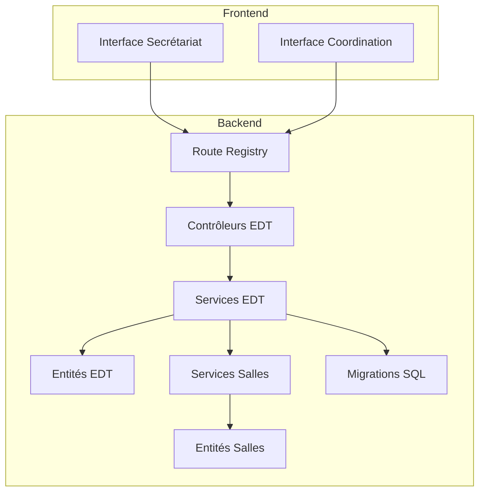
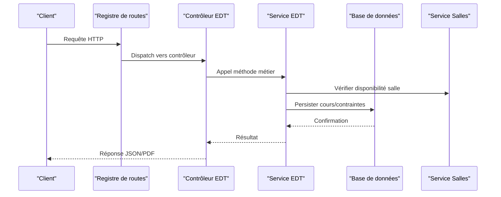
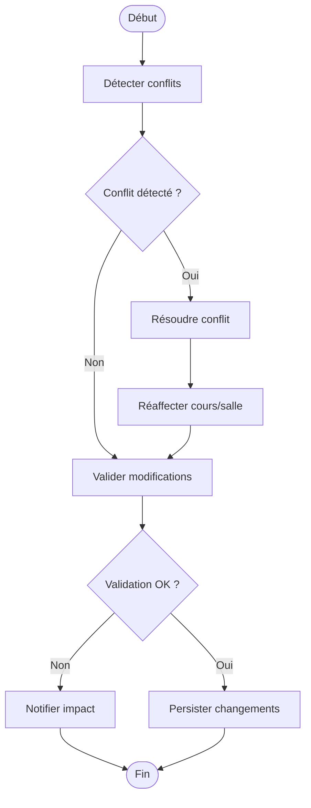
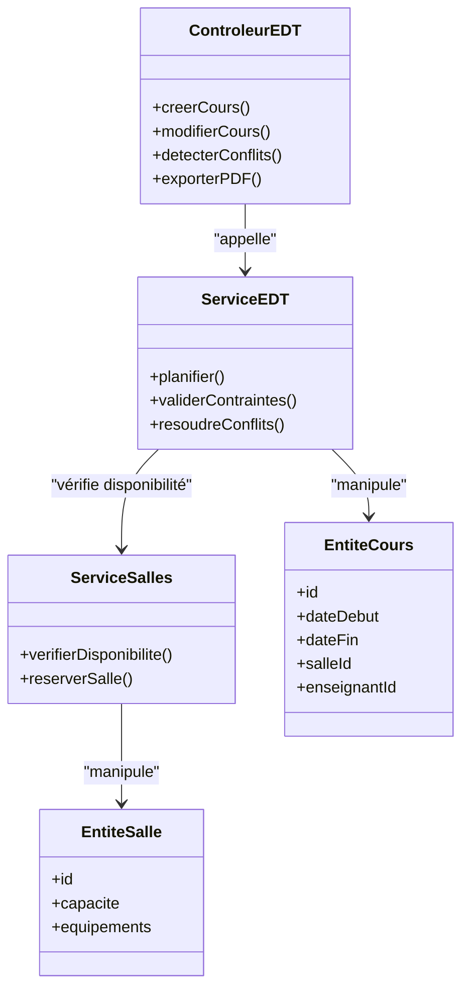

# API Emploi du Temps

<cite>
**Fichiers référencés dans ce document**
- [backend/src/modules/emploi-du-temps/index.ts](file://backend/src/modules/emploi-du-temps/index.ts)
- [backend/src/modules/emploi-du-temps/controllers/emploi-du-temps.controller.ts](file://backend/src/modules/emploi-du-temps/controllers/emploi-du-temps.controller.ts)
- [backend/src/modules/emploi-du-temps/services/emploi-du-temps.service.ts](file://backend/src/modules/emploi-du-temps/services/emploi-du-temps.service.ts)
- [backend/src/modules/emploi-du-temps/dto/emploi-du-temps.dto.ts](file://backend/src/modules/emploi-du-temps/dto/emploi-du-temps.dto.ts)
- [backend/src/modules/emploi-du-temps/entities/emploi-du-temps.entity.ts](file://backend/src/modules/emploi-du-temps/entities/emploi-du-temps.entity.ts)
- [backend/src/modules/salles/index.ts](file://backend/src/modules/salles/index.ts)
- [backend/src/modules/salles/controllers/salles.controller.ts](file://backend/src/modules/salles/controllers/salles.controller.ts)
- [backend/src/modules/salles/services/salles.service.ts](file://backend/src/modules/salles/services/salles.service.ts)
- [backend/src/modules/salles/dto/salles.dto.ts](file://backend/src/modules/salles/dto/salles.dto.ts)
- [backend/src/modules/salles/entities/salles.entity.ts](file://backend/src/modules/salles/entities/salles.entity.ts)
- [backend/src/routes/route-registry.ts](file://backend/src/routes/route-registry.ts)
- [backend/src/config/swagger.config.ts](file://backend/src/config/swagger.config.ts)
- [backend/database/migrations/063-creer-module-emploi-du-temps.sql](file://backend/database/migrations/063-creer-module-emploi-du-temps.sql)
- [backend/database/migrations/070-module-salles.sql](file://backend/database/migrations/070-module-salles.sql)
- [backend/database/migrations/065-creer-templates-emploi-du-temps.sql](file://backend/database/migrations/065-creer-templates-emploi-du-temps.sql)
- [backend/database/migrations/114-fusion-creneaux-horaires.sql](file://backend/database/migrations/114-fusion-creneaux-horaires.sql)
- [backend/database/migrations/116-programme-intemporel.sql](file://backend/database/migrations/116-programme-intemporel.sql)
- [backend/database/migrations/117-heure-cours-classe-annee.sql](file://backend/database/migrations/117-heure-cours-classe-annee.sql)
- [backend/database/migrations/118-preferences-edt-enrichi.sql](file://backend/database/migrations/118-preferences-edt-enrichi.sql)
- [backend/database/migrations/103-templates-periode-personnalisables.sql](file://backend/database/migrations/103-templates-periode-personnalisables.sql)
- [backend/database/migrations/105-migration-templates-v5.sql](file://backend/database/migrations/105-migration-templates-v5.sql)
- [backend/database/migrations/100-classes-salle-principale.sql](file://backend/database/migrations/100-classes-salle-principale.sql)
- [backend/database/migrations/120-correction-vues-materialisees-organisation.sql](file://backend/database/migrations/120-correction-vues-materialisees-organisation.sql)
- [backend/database/migrations/121-fonction-categorie-drop-type-personnel.sql](file://backend/database/migrations/121-fonction-categorie-drop-type-personnel.sql)
- [backend/database/migrations/122-hierarchie-uperieur-poste.sql](file://backend/database/migrations/122-hierarchie-uperieur-poste.sql)
- [backend/database/migrations/123-refonte-notes-bulletins.sql](file://backend/database/migrations/123-refonte-notes-bulletins.sql)
- [backend/database/migrations/124-fix-hierarchie-orphelins.sql](file://backend/database/migrations/124-fix-hierarchie-orphelins.sql)
- [backend/database/migrations/125-organigramme-read-tous-roles.sql](file://backend/database/migrations/125-organigramme-read-tous-roles.sql)
- [backend/database/migrations/126-fix-vues-materialisees-statuts.sql](file://backend/database/migrations/126-fix-vues-materialisees-statuts.sql)
- [backend/database/migrations/127-templates-organisation-categorisation.sql](file://backend/database/migrations/127-templates-organisation-categorisation.sql)
</cite>

## Table des matières
1. [Introduction](#introduction)
2. [Structure du projet](#structure-du-projet)
3. [Composants clés](#composants-clés)
4. [Vue d’ensemble de l’architecture](#vue-densemble-de-larchitecture)
5. [Analyse détaillée des composants](#analyse-detaillee-des-composants)
6. [Analyse des dépendances](#analyse-des-dependances)
7. [Considérations de performance](#considerations-de-performance)
8. [Guide de dépannage](#guide-de-depannage)
9. [Conclusion](#conclusion)
10. [Annexes](#annexes)

## Introduction
Ce document présente une documentation API complète pour le module d’emploi du temps d’eLISAschool. Il couvre les endpoints pour la création et modification des emplois du temps, la détection automatique des conflits, la gestion des salles et créneaux horaires, ainsi que les templates réutilisables. Il inclut également les schémas de données (cours, contraintes d’occupation), les algorithmes de résolution de conflits et les exports PDF, avec des exemples d’utilisation adaptés aux secrétaires et coordinateurs pédagogiques.

## Structure du projet
Le module emploi du temps est organisé en modules NestJS classiques : controllers, services, DTOs, entités et migrations. Les routes sont enregistrées via un registre centralisé. Les données sont persistées via des migrations SQL et des entités TypeORM.

**Sources de diagramme**
- [backend/src/routes/route-registry.ts](file://backend/src/routes/route-registry.ts)
- [backend/src/modules/emploi-du-temps/controllers/emploi-du-temps.controller.ts](file://backend/src/modules/emploi-du-temps/controllers/emploi-du-temps.controller.ts)
- [backend/src/modules/emploi-du-temps/services/emploi-du-temps.service.ts](file://backend/src/modules/emploi-du-temps/services/emploi-du-temps.service.ts)
- [backend/src/modules/salles/controllers/salles.controller.ts](file://backend/src/modules/salles/controllers/salles.controller.ts)
- [backend/src/modules/salles/services/salles.service.ts](file://backend/src/modules/salles/services/salles.service.ts)

**Sources de section**
- [backend/src/routes/route-registry.ts](file://backend/src/routes/route-registry.ts)
- [backend/src/modules/emploi-du-temps/index.ts](file://backend/src/modules/emploi-du-temps/index.ts)
- [backend/src/modules/salles/index.ts](file://backend/src/modules/salles/index.ts)

## Composants clés
- Contrôleurs : exposition des endpoints REST pour l’emploi du temps et les salles.
- Services : logique métier (création/modification, détection de conflits, planification, export).
- DTOs : validation et typage des requêtes/réponses.
- Entités : modèles de données (cours, créneaux, salles, templates).
- Migrations : schéma de base de données et évolutions.

**Sources de section**
- [backend/src/modules/emploi-du-temps/controllers/emploi-du-temps.controller.ts](file://backend/src/modules/emploi-du-temps/controllers/emploi-du-temps.controller.ts)
- [backend/src/modules/emploi-du-temps/services/emploi-du-temps.service.ts](file://backend/src/modules/emploi-du-temps/services/emploi-du-temps.service.ts)
- [backend/src/modules/emploi-du-temps/dto/emploi-du-temps.dto.ts](file://backend/src/modules/emploi-du-temps/dto/emploi-du-temps.dto.ts)
- [backend/src/modules/emploi-du-temps/entities/emploi-du-temps.entity.ts](file://backend/src/modules/emploi-du-temps/entities/emploi-du-temps.entity.ts)
- [backend/src/modules/salles/controllers/salles.controller.ts](file://backend/src/modules/salles/controllers/salles.controller.ts)
- [backend/src/modules/salles/services/salles.service.ts](file://backend/src/modules/salles/services/salles.service.ts)
- [backend/src/modules/salles/dto/salles.dto.ts](file://backend/src/modules/salles/dto/salles.dto.ts)
- [backend/src/modules/salles/entities/salles.entity.ts](file://backend/src/modules/salles/entities/salles.entity.ts)

## Vue d’ensemble de l’architecture
Le flux suit un pattern MVC classique : les contrôleurs reçoivent les requêtes HTTP, délèguent au service qui applique les règles métier et interagit avec les entités et la base de données. Les routes sont centralisées et Swagger expose la documentation API.

**Sources de diagramme**
- [backend/src/routes/route-registry.ts](file://backend/src/routes/route-registry.ts)
- [backend/src/modules/emploi-du-temps/controllers/emploi-du-temps.controller.ts](file://backend/src/modules/emploi-du-temps/controllers/emploi-du-temps.controller.ts)
- [backend/src/modules/emploi-du-temps/services/emploi-du-temps.service.ts](file://backend/src/modules/emploi-du-temps/services/emploi-du-temps.service.ts)
- [backend/src/modules/salles/services/salles.service.ts](file://backend/src/modules/salles/services/salles.service.ts)

## Analyse détaillée des composants

### Endpoints Emploi du Temps
- Création de cours : POST /api/emploi-du-temps/cours
- Modification de cours : PUT /api/emploi-du-temps/cours/:id
- Suppression de cours : DELETE /api/emploi-du-temps/cours/:id
- Détection de conflits : GET /api/emploi-du-temps/conflits?params=...
- Planification automatique : POST /api/emploi-du-temps/planning/auto
- Export PDF : GET /api/emploi-du-temps/export/pdf?params=...

Exemples d’utilisation :
- Secrétaire : créer un cours, vérifier les conflits, exporter le planning hebdomadaire.
- Coordinateur : planifier automatiquement les cours d’une classe sur une période donnée.

**Sources de section**
- [backend/src/modules/emploi-du-temps/controllers/emploi-du-temps.controller.ts](file://backend/src/modules/emploi-du-temps/controllers/emploi-du-temps.controller.ts)
- [backend/src/modules/emploi-du-temps/services/emploi-du-temps.service.ts](file://backend/src/modules/emploi-du-temps/services/emploi-du-temps.service.ts)
- [backend/src/config/swagger.config.ts](file://backend/src/config/swagger.config.ts)

### Gestion des Salles
- Lister les salles : GET /api/salles
- Créer une salle : POST /api/salles
- Modifier une salle : PUT /api/salles/:id
- Supprimer une salle : DELETE /api/salles/:id
- Vérifier disponibilité : GET /api/salles/disponibilite?date=...&heure=...

Exemple : vérifier qu’une salle n’est pas déjà occupée avant de réserver.

**Sources de section**
- [backend/src/modules/salles/controllers/salles.controller.ts](file://backend/src/modules/salles/controllers/salles.controller.ts)
- [backend/src/modules/salles/services/salles.service.ts](file://backend/src/modules/salles/services/salles.service.ts)
- [backend/src/modules/salles/dto/salles.dto.ts](file://backend/src/modules/salles/dto/salles.dto.ts)
- [backend/src/modules/salles/entities/salles.entity.ts](file://backend/src/modules/salles/entities/salles.entity.ts)

### Créneaux Horaires
- Définition des créneaux : heures de début/fin, jours de la semaine, capacité.
- Fusion des créneaux : optimisation des plages horaires.
- Heures par classe/année : configuration spécifique par niveau.

**Sources de section**
- [backend/database/migrations/114-fusion-creneaux-horaires.sql](file://backend/database/migrations/114-fusion-creneaux-horaires.sql)
- [backend/database/migrations/117-heure-cours-classe-annee.sql](file://backend/database/migrations/117-heure-cours-classe-annee.sql)

### Templates Réutilisables
- Création de templates : définir des séquences de cours récurrentes.
- Application de templates : appliquer à une classe/période.
- Personnalisation par période : adapter les templates selon les besoins.

**Sources de section**
- [backend/database/migrations/065-creer-templates-emploi-du-temps.sql](file://backend/database/migrations/065-creer-templates-emploi-du-temps.sql)
- [backend/database/migrations/103-templates-periode-personnalisables.sql](file://backend/database/migrations/103-templates-periode-personnalisables.sql)
- [backend/database/migrations/105-migration-templates-v5.sql](file://backend/database/migrations/105-migration-templates-v5.sql)

### Contraintes d’Occupation
- Règles de non-chevauchement : un enseignant ne peut être dans deux cours simultanément.
- Capacité des salles : respecter les limites d’occupation.
- Préférences : éviter certains créneaux ou salles.

**Sources de section**
- [backend/database/migrations/063-creer-module-emploi-du-temps.sql](file://backend/database/migrations/063-creer-module-emploi-du-temps.sql)
- [backend/database/migrations/070-module-salles.sql](file://backend/database/migrations/070-module-salles.sql)

### Algorithmes de Résolution de Conflits
- Détection : comparer les chevauchements temporels et ressources.
- Résolution : réaffecter cours, modifier salles/heures, notifier les impacts.
- Validation : s’assurer qu’aucune contrainte n’est violée après modification.

**Sources de diagramme**
- [backend/src/modules/emploi-du-temps/services/emploi-du-temps.service.ts](file://backend/src/modules/emploi-du-temps/services/emploi-du-temps.service.ts)

### Exports PDF
- Génération : créer un PDF du planning hebdomadaire/mensuel.
- Paramètres : filtrer par classe, enseignant, salle, période.
- Diffusion : télécharger ou envoyer par email.

**Sources de section**
- [backend/src/modules/emploi-du-temps/controllers/emploi-du-temps.controller.ts](file://backend/src/modules/emploi-du-temps/controllers/emploi-du-temps.controller.ts)
- [backend/src/modules/emploi-du-temps/services/emploi-du-temps.service.ts](file://backend/src/modules/emploi-du-temps/services/emploi-du-temps.service.ts)

## Analyse des dépendances
Les composants sont faiblement couplés grâce à l’injection de dépendances NestJS. Les services dépendent des entités et des repositories, les contrôleurs dépendent des services.

**Sources de diagramme**
- [backend/src/modules/emploi-du-temps/controllers/emploi-du-temps.controller.ts](file://backend/src/modules/emploi-du-temps/controllers/emploi-du-temps.controller.ts)
- [backend/src/modules/emploi-du-temps/services/emploi-du-temps.service.ts](file://backend/src/modules/emploi-du-temps/services/emploi-du-temps.service.ts)
- [backend/src/modules/salles/services/salles.service.ts](file://backend/src/modules/salles/services/salles.service.ts)
- [backend/src/modules/emploi-du-temps/entities/emploi-du-temps.entity.ts](file://backend/src/modules/emploi-du-temps/entities/emploi-du-temps.entity.ts)
- [backend/src/modules/salles/entities/salles.entity.ts](file://backend/src/modules/salles/entities/salles.entity.ts)

**Sources de section**
- [backend/src/modules/emploi-du-temps/index.ts](file://backend/src/modules/emploi-du-temps/index.ts)
- [backend/src/modules/salles/index.ts](file://backend/src/modules/salles/index.ts)

## Considérations de performance
- Indexation : utiliser des index sur les champs fréquemment interrogés (date, salle, enseignant).
- Requêtes optimisées : éviter les N+1 queries, utiliser des jointures.
- Cache : mettre en cache les résultats de détection de conflits pour des périodes statiques.
- Export asynchrone : générer les PDF en tâche de fond pour les grands emplois du temps.

[Pas de sources nécessaires car cette section fournit des conseils généraux]

## Guide de dépannage
- Erreurs de validation : vérifier les DTOs et les messages d’erreur retournés.
- Conflits persistants : examiner les règles de chevauchement et les capacités des salles.
- Problèmes de migration : vérifier l’exécution des scripts SQL et les logs de migration.
- Performance lente : analyser les requêtes SQL lentes et ajouter des index si nécessaire.

**Sources de section**
- [backend/src/modules/emploi-du-temps/dto/emploi-du-temps.dto.ts](file://backend/src/modules/emploi-du-temps/dto/emploi-du-temps.dto.ts)
- [backend/database/migrations/063-creer-module-emploi-du-temps.sql](file://backend/database/migrations/063-creer-module-emploi-du-temps.sql)
- [backend/database/migrations/120-correction-vues-materialisees-organisation.sql](file://backend/database/migrations/120-correction-vues-materialisees-organisation.sql)

## Conclusion
Le module d’emploi du temps d’eLISAschool offre une API robuste pour gérer les cours, les salles, les créneaux et les templates, avec une détection automatique des conflits et des exports PDF. La structure modulaire et les bonnes pratiques de développement facilitent la maintenance et l’évolution du système.

[Pas de sources nécessaires car cette section résume sans analyser de fichiers spécifiques]

## Annexes
- Schémas de données : consulter les migrations SQL pour les structures détaillées.
- Exemples d’utilisation : tester les endpoints via Swagger ou Postman.
- Intégration frontend : suivre les hooks et les appels API dans le frontend.

**Sources de section**
- [backend/database/migrations/063-creer-module-emploi-du-temps.sql](file://backend/database/migrations/063-creer-module-emploi-du-temps.sql)
- [backend/database/migrations/070-module-salles.sql](file://backend/database/migrations/070-module-salles.sql)
- [backend/database/migrations/065-creer-templates-emploi-du-temps.sql](file://backend/database/migrations/065-creer-templates-emploi-du-temps.sql)
- [backend/database/migrations/114-fusion-creneaux-horaires.sql](file://backend/database/migrations/114-fusion-creneaux-horaires.sql)
- [backend/database/migrations/117-heure-cours-classe-annee.sql](file://backend/database/migrations/117-heure-cours-classe-annee.sql)
- [backend/database/migrations/118-preferences-edt-enrichi.sql](file://backend/database/migrations/118-preferences-edt-enrichi.sql)
- [backend/database/migrations/103-templates-periode-personnalisables.sql](file://backend/database/migrations/103-templates-periode-personnalisables.sql)
- [backend/database/migrations/105-migration-templates-v5.sql](file://backend/database/migrations/105-migration-templates-v5.sql)
- [backend/database/migrations/100-classes-salle-principale.sql](file://backend/database/migrations/100-classes-salle-principale.sql)