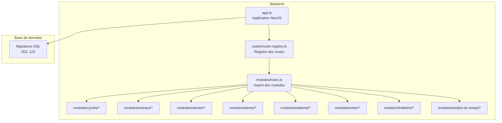
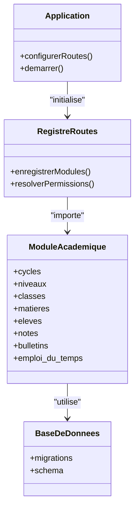
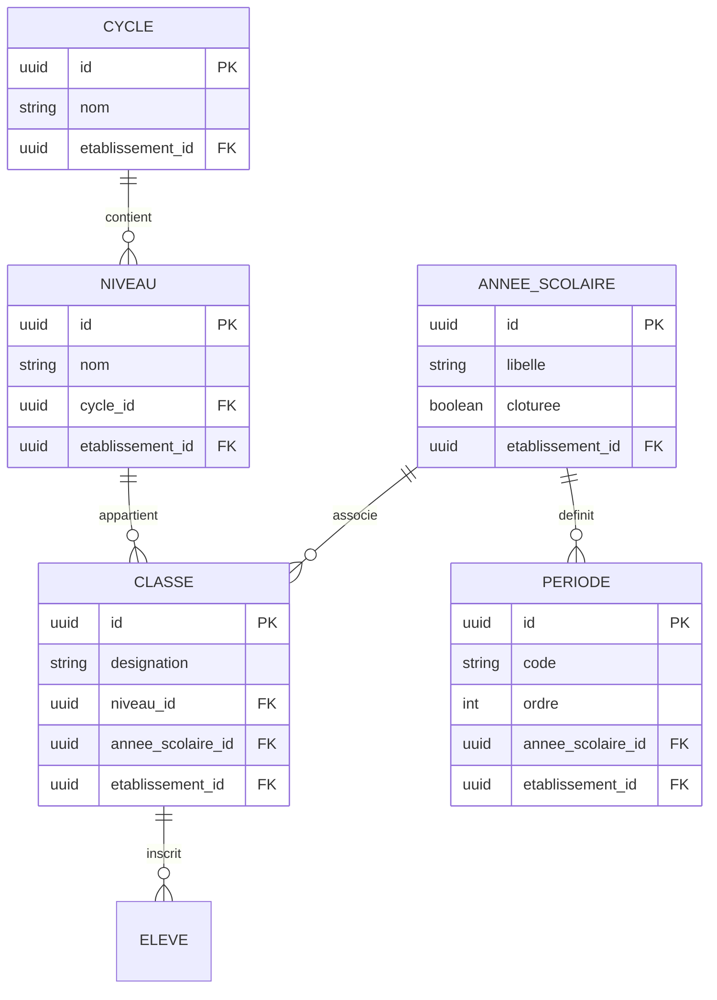
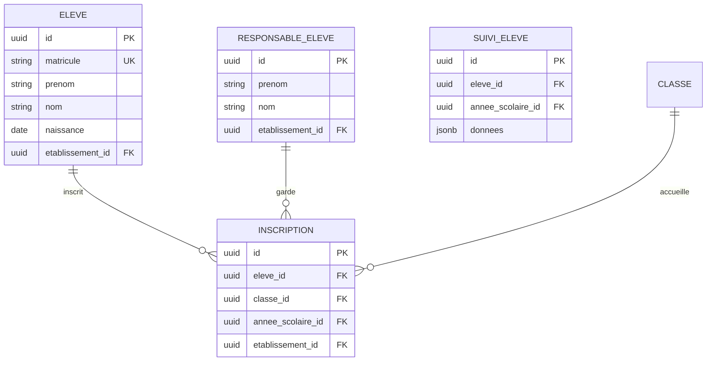
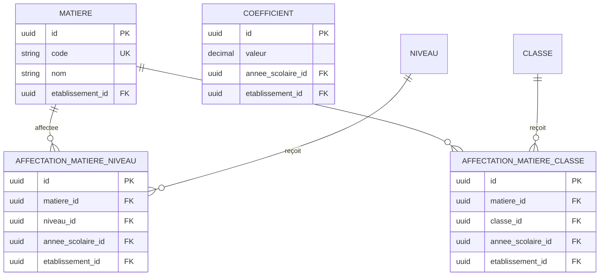
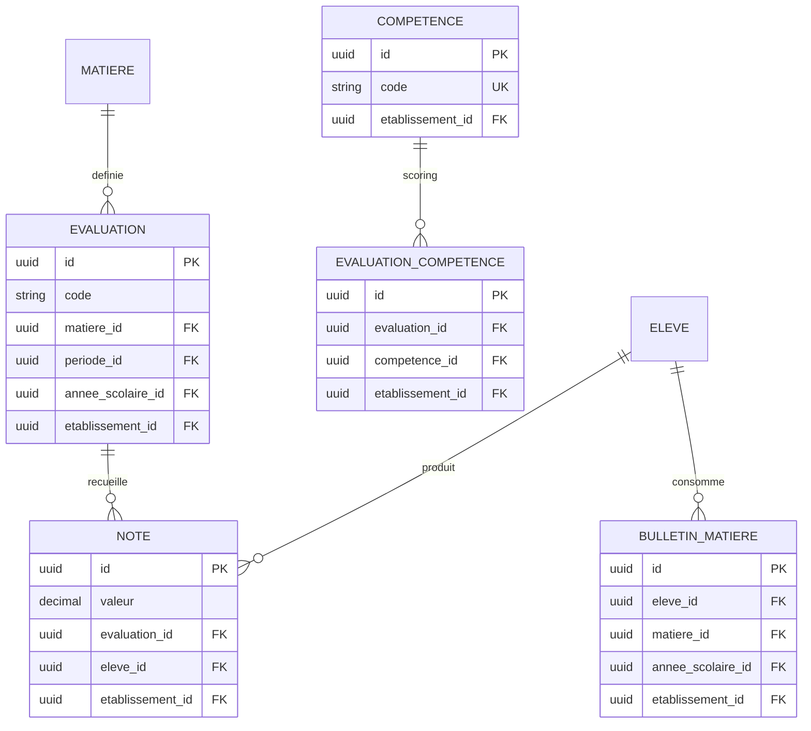
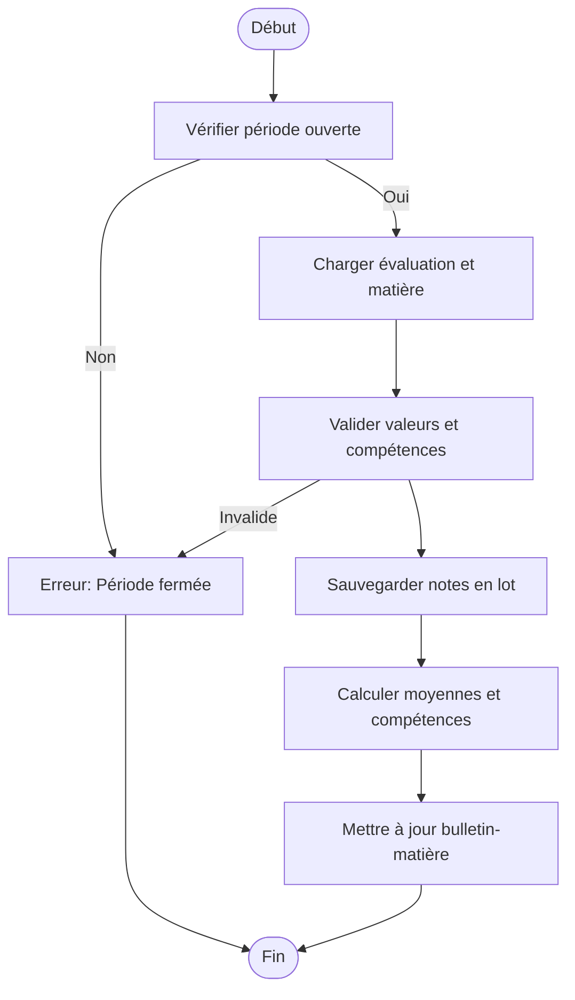
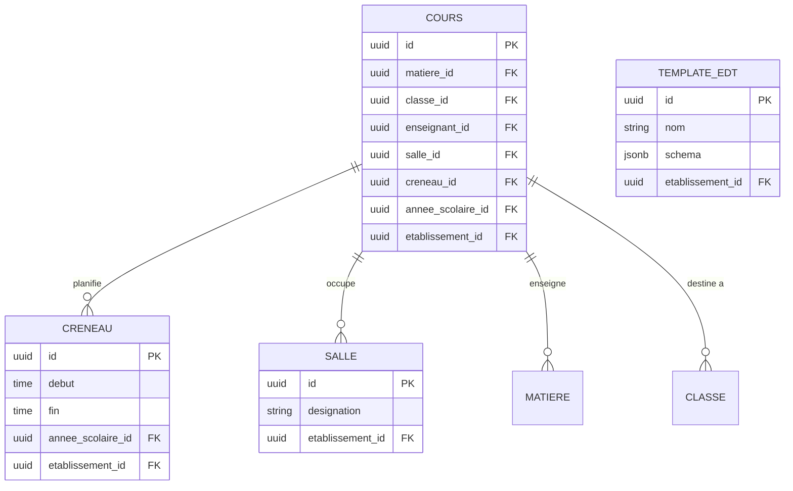
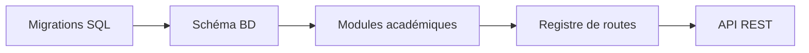

# API Gestion Académique

<cite>
**Fichiers référencés dans ce document**
- [app.ts](file://backend/src/app.ts)
- [route-registry.ts](file://backend/src/routes/route-registry.ts)
- [053-structure-academique-complete.sql](file://backend/database/migrations/053-structure-academique-complete.sql)
- [054-refonte-structure-academique-v2.sql](file://backend/database/migrations/054-refonte-structure-academique-v2.sql)
- [058-multi-tenant-structure-academique.sql](file://backend/database/migrations/058-multi-tenant-structure-academique.sql)
- [059-ajouter-matiere-sous-systeme.sql](file://backend/database/migrations/059-ajouter-matiere-sous-systeme.sql)
- [060-ajouter-affectation-matiere-coefficient.sql](file://backend/database/migrations/060-ajouter-affectation-matiere-coefficient.sql)
- [061-creer-table-bulletins-matieres.sql](file://backend/database/migrations/061-creer-table-bulletins-matieres.sql)
- [062-creer-table-evaluations-competences.sql](file://backend/database/migrations/062-creer-table-evaluations-competences.sql)
- [063-creer-module-emploi-du-temps.sql](file://backend/database/migrations/063-creer-module-emploi-du-temps.sql)
- [065-templates-emploi-du-temps.sql](file://backend/database/migrations/065-templates-emploi-du-temps.sql)
- [072-scoping-cycles-niveaux.sql](file://backend/database/migrations/072-scoping-cycles-niveaux.sql)
- [073-competence-unique-composite.sql](file://backend/database/migrations/073-competence-unique-composite.sql)
- [074-matiere-niveau-unique-composite.sql](file://backend/database/migrations/074-matiere-niveau-unique-composite.sql)
- [088-refactorisation-architecture-academique.sql](file://backend/database/migrations/088-refactorisation-architecture-academique.sql)
- [089-finalisation-architecture-academique-v2.sql](file://backend/database/migrations/089-finalisation-architecture-academique-v2.sql)
- [091-peuplement-architecture-academique.sql](file://backend/database/migrations/091-peuplement-architecture-academique.sql)
- [092-refactorisation-classeAnneeId.sql](file://backend/database/migrations/092-refactorisation-classeAnneeId.sql)
- [100-classes-salle-principale.sql](file://backend/database/migrations/100-classes-salle-principale.sql)
- [101-normalisation-annee-scolaire-cloture.sql](file://backend/database/migrations/101-normalisation-annee-scolaire-cloture.sql)
- [102-periodes-hierarchie.sql](file://backend/database/migrations/102-periodes-hierarchie.sql)
- [103-templates-periode-personnalisables.sql](file://backend/database/migrations/103-templates-periode-personnalisables.sql)
- [104-refonte-periodes-niveaux-configurables.sql](file://backend/database/migrations/104-refonte-periodes-niveaux-configurables.sql)
- [105-migration-templates-v5.sql](file://backend/database/migrations/105-migration-templates-v5.sql)
- [106-rename-sequence-to-evaluation.sql](file://backend/database/migrations/106-rename-sequence-to-evaluation.sql)
- [116-programme-intemporel.sql](file://backend/database/migrations/116-programme-intemporel.sql)
- [117-heure-cours-classe-annee.sql](file://backend/database/migrations/117-heure-cours-classe-annee.sql)
- [118-preferences-edt-enrichi.sql](file://backend/database/migrations/118-preferences-edt-enrichi.sql)
- [123-refonte-notes-bulletins.sql](file://backend/database/migrations/123-refonte-notes-bulletins.sql)
- [index.ts](file://backend/src/modules/index.ts)
- [routes/route-registry.ts](file://backend/src/routes/route-registry.ts)
</cite>

## Table des matières
1. [Introduction](#introduction)
2. [Structure du projet](#structure-du-projet)
3. [Composants clés](#composants-clés)
4. [Vue d’ensemble de l’architecture](#vue-densemble-de-larchitecture)
5. [Analyse détaillée des composants](#analyse-detallee-des-composants)
6. [Analyse des dépendances](#analyse-des-dependances)
7. [Considérations de performance](#considerations-de-performance)
8. [Guide de dépannage](#guide-de-depannage)
9. [Conclusion](#conclusion)
10. [Annexes](#annexes)

## Introduction
Ce document présente une documentation API complète pour le module de gestion académique eLISAschool. Il couvre la structure académique (cycles, niveaux, classes), la gestion des élèves et inscriptions, les matières et coefficients, le système de notes et évaluations, la génération de bulletins, ainsi que l’emploi du temps. Le contenu s’appuie sur les migrations de schéma et les registres de routes disponibles dans le backend pour garantir la cohérence entre le modèle de données et les endpoints exposés.

## Structure du projet
Le backend est organisé en modules par domaine fonctionnel. Les routes sont centralisées via un registre qui importe les contrôleurs/services associés à chaque module. Les schémas de données sont définis et évoluent via des migrations SQL.

**Sources de diagramme**
- [app.ts](file://backend/src/app.ts)
- [route-registry.ts](file://backend/src/routes/route-registry.ts)
- [index.ts](file://backend/src/modules/index.ts)

**Sources de section**
- [app.ts](file://backend/src/app.ts)
- [route-registry.ts](file://backend/src/routes/route-registry.ts)
- [index.ts](file://backend/src/modules/index.ts)

## Composants clés
- Structure académique : cycles, niveaux, classes, années scolaires, périodes.
- Élèves et responsables : CRUD, affectations, inscriptions.
- Matières et coefficients : définitions, affectations par niveau/classe, sous-systèmes.
- Notes et évaluations : séquences d’évaluations, saisie, calculs, compétences.
- Bulletins : agrégation des notes, modèles, génération.
- Emploi du temps : créneaux, salles, enseignants, templates.

**Sources de section**
- [053-structure-academique-complete.sql](file://backend/database/migrations/053-structure-academique-complete.sql)
- [054-refonte-structure-academique-v2.sql](file://backend/database/migrations/054-refonte-structure-academique-v2.sql)
- [058-multi-tenant-structure-academique.sql](file://backend/database/migrations/058-multi-tenant-structure-academique.sql)
- [059-ajouter-matiere-sous-systeme.sql](file://backend/database/migrations/059-ajouter-matiere-sous-systeme.sql)
- [060-ajouter-affectation-matiere-coefficient.sql](file://backend/database/migrations/060-ajouter-affectation-matiere-coefficient.sql)
- [061-creer-table-bulletins-matieres.sql](file://backend/database/migrations/061-creer-table-bulletins-matieres.sql)
- [062-creer-table-evaluations-competences.sql](file://backend/database/migrations/062-creer-table-evaluations-competences.sql)
- [063-creer-module-emploi-du-temps.sql](file://backend/database/migrations/063-creer-module-emploi-du-temps.sql)
- [065-templates-emploi-du-temps.sql](file://backend/database/migrations/065-templates-emploi-du-temps.sql)
- [072-scoping-cycles-niveaux.sql](file://backend/database/migrations/072-scoping-cycles-niveaux.sql)
- [073-competence-unique-composite.sql](file://backend/database/migrations/073-competence-unique-composite.sql)
- [074-matiere-niveau-unique-composite.sql](file://backend/database/migrations/074-matiere-niveau-unique-composite.sql)
- [088-refactorisation-architecture-academique.sql](file://backend/database/migrations/088-refactorisation-architecture-academique.sql)
- [089-finalisation-architecture-academique-v2.sql](file://backend/database/migrations/089-finalisation-architecture-academique-v2.sql)
- [091-peuplement-architecture-academique.sql](file://backend/database/migrations/091-peuplement-architecture-academique.sql)
- [092-refactorisation-classeAnneeId.sql](file://backend/database/migrations/092-refactorisation-classeAnneeId.sql)
- [100-classes-salle-principale.sql](file://backend/database/migrations/100-classes-salle-principale.sql)
- [101-normalisation-annee-scolaire-cloture.sql](file://backend/database/migrations/101-normalisation-annee-scolaire-cloture.sql)
- [102-periodes-hierarchie.sql](file://backend/database/migrations/102-periodes-hierarchie.sql)
- [103-templates-periode-personnalisables.sql](file://backend/database/migrations/103-templates-periode-personnalisables.sql)
- [104-refonte-periodes-niveaux-configurables.sql](file://backend/database/migrations/104-refonte-periodes-niveaux-configurables.sql)
- [105-migration-templates-v5.sql](file://backend/database/migrations/105-migration-templates-v5.sql)
- [106-rename-sequence-to-evaluation.sql](file://backend/database/migrations/106-rename-sequence-to-evaluation.sql)
- [116-programme-intemporel.sql](file://backend/database/migrations/116-programme-intemporel.sql)
- [117-heure-cours-classe-annee.sql](file://backend/database/migrations/117-heure-cours-classe-annee.sql)
- [118-preferences-edt-enrichi.sql](file://backend/database/migrations/118-preferences-edt-enrichi.sql)
- [123-refonte-notes-bulletins.sql](file://backend/database/migrations/123-refonte-notes-bulletins.sql)

## Vue d’ensemble de l’architecture
Le système suit une architecture modulaire avec un registre de routes qui expose les endpoints par domaine. La base de données est versionnée par migrations SQL assurant la cohérence du schéma. Les modules interagissent via des services et contrôleurs typés, avec validation et autorisation intégrées.

**Sources de diagramme**
- [app.ts](file://backend/src/app.ts)
- [route-registry.ts](file://backend/src/routes/route-registry.ts)
- [index.ts](file://backend/src/modules/index.ts)

## Analyse détaillée des composants

### Structure académique : cycles, niveaux, classes
- Entités principales : cycle, niveau, classe, année scolaire, période.
- Relations : un cycle contient plusieurs niveaux ; un niveau peut appartenir à un cycle ; une classe est rattachée à un niveau et une année scolaire ; les périodes hiérarchisent les évaluations.
- Scoping multi-tenant : toutes les entités sont scoper par établissement.

**Sources de diagramme**
- [053-structure-academique-complete.sql](file://backend/database/migrations/053-structure-academique-complete.sql)
- [054-refonte-structure-academique-v2.sql](file://backend/database/migrations/054-refonte-structure-academique-v2.sql)
- [058-multi-tenant-structure-academique.sql](file://backend/database/migrations/058-multi-tenant-structure-academique.sql)
- [072-scoping-cycles-niveaux.sql](file://backend/database/migrations/072-scoping-cycles-niveaux.sql)
- [092-refactorisation-classeAnneeId.sql](file://backend/database/migrations/092-refactorisation-classeAnneeId.sql)
- [101-normalisation-annee-scolaire-cloture.sql](file://backend/database/migrations/101-normalisation-annee-scolaire-cloture.sql)
- [102-periodes-hierarchie.sql](file://backend/database/migrations/102-periodes-hierarchie.sql)

Endpoints suggérés (basés sur le registre de routes et les modules) :
- GET /api/cycles, POST /api/cycles, PUT /api/cycles/:id, DELETE /api/cycles/:id
- GET /api/niveaux, POST /api/niveaux, PUT /api/niveaux/:id, DELETE /api/niveaux/:id
- GET /api/classes, POST /api/classes, PUT /api/classes/:id, DELETE /api/classes/:id
- GET /api/annees-scolaires, POST /api/annees-scolaires, PUT /api/annees-scolaires/:id
- GET /api/periodes, POST /api/periodes, PUT /api/periodes/:id

Validation métier :
- Un niveau doit appartenir à un cycle existant et au même établissement.
- Une classe doit être liée à un niveau et une année scolaire active.
- Les périodes doivent respecter l’ordre hiérarchique et être clôturées selon l’année scolaire.

**Sources de section**
- [053-structure-academique-complete.sql](file://backend/database/migrations/053-structure-academique-complete.sql)
- [054-refonte-structure-academique-v2.sql](file://backend/database/migrations/054-refonte-structure-academique-v2.sql)
- [058-multi-tenant-structure-academique.sql](file://backend/database/migrations/058-multi-tenant-structure-academique.sql)
- [072-scoping-cycles-niveaux.sql](file://backend/database/migrations/072-scoping-cycles-niveaux.sql)
- [092-refactorisation-classeAnneeId.sql](file://backend/database/migrations/092-refactorisation-classeAnneeId.sql)
- [101-normalisation-annee-scolaire-cloture.sql](file://backend/database/migrations/101-normalisation-annee-scolaire-cloture.sql)
- [102-periodes-hierarchie.sql](file://backend/database/migrations/102-periodes-hierarchie.sql)

### Gestion des élèves et inscriptions
- Entités : élève, responsable, préinscription, inscription, suivi.
- Relations : un élève appartient à une classe ; un responsable est lié à un ou plusieurs élèves ; les inscriptions lient un élève à une classe et une année scolaire.

Endpoints suggérés :
- GET /api/eleves, POST /api/eleves, PUT /api/eleves/:id, DELETE /api/eleves/:id
- GET /api/responsables, POST /api/responsables, PUT /api/responsables/:id
- POST /api/inscriptions, GET /api/inscriptions?classeId=...&anneeId=...
- GET /api/suivi-eleves?eleveId=...&anneeId=...

Validation métier :
- Matricule unique par établissement.
- Inscription valide si l’élève existe, la classe est active et l’année scolaire non clôturée.
- Responsables liés uniquement aux élèves de leur établissement.

**Sources de section**
- [053-structure-academique-complete.sql](file://backend/database/migrations/053-structure-academique-complete.sql)
- [058-multi-tenant-structure-academique.sql](file://backend/database/migrations/058-multi-tenant-structure-academique.sql)
- [091-peuplement-architecture-academique.sql](file://backend/database/migrations/091-peuplement-architecture-academique.sql)

### Matières et coefficients
- Entités : matière, coefficient, affectation matière-niveau/classe, sous-système.
- Relations : une matière peut avoir plusieurs coefficients selon le niveau/classe ; les affectations garantissent l’unicité matière-niveau.

Endpoints suggérés :
- GET /api/matieres, POST /api/matieres, PUT /api/matieres/:id
- GET /api/affectations-matieres?niveauId=...&anneeId=...
- GET /api/coefficients?anneeId=...

Validation métier :
- Code matière unique par établissement.
- Affectation matière-niveau unique par année scolaire.
- Coefficients validés par plage et cohérence avec le programme.

**Sources de section**
- [059-ajouter-matiere-sous-systeme.sql](file://backend/database/migrations/059-ajouter-matiere-sous-systeme.sql)
- [060-ajouter-affectation-matiere-coefficient.sql](file://backend/database/migrations/060-ajouter-affectation-matiere-coefficient.sql)
- [074-matiere-niveau-unique-composite.sql](file://backend/database/migrations/074-matiere-niveau-unique-composite.sql)

### Système de notes et évaluations
- Entités : évaluation (renommée depuis sequence), note, compétence, bulletin-matière.
- Relations : une évaluation appartient à une période et une matière ; une note lie un élève à une évaluation ; les compétences permettent un scoring granulaire.

Endpoints suggérés :
- GET /api/evaluations, POST /api/evaluations, PUT /api/evaluations/:id
- POST /api/notes/batch, GET /api/notes?evaluationId=...&eleveId=...
- GET /api/bulletins-matieres?eleveId=...&anneeId=...

Workflow de saisie des notes :

**Sources de section**
- [061-creer-table-bulletins-matieres.sql](file://backend/database/migrations/061-creer-table-bulletins-matieres.sql)
- [062-creer-table-evaluations-competences.sql](file://backend/database/migrations/062-creer-table-evaluations-competences.sql)
- [106-rename-sequence-to-evaluation.sql](file://backend/database/migrations/106-rename-sequence-to-evaluation.sql)
- [123-refonte-notes-bulletins.sql](file://backend/database/migrations/123-refonte-notes-bulletins.sql)

### Génération de bulletins
- Entrées : bulletin-matière, agrégats de notes, compétences.
- Sorties : PDF/JSON consolidé par élève et année scolaire.

Endpoints suggérés :
- GET /api/bulletins?eleveId=...&anneeId=...
- POST /api/bulletins/generate?eleveId=...&anneeId=...

Validation métier :
- Seules les périodes ouvertes et clôturées selon politique peuvent être incluses.
- Cohérence des coefficients et pondérations.

**Sources de section**
- [061-creer-table-bulletins-matieres.sql](file://backend/database/migrations/061-creer-table-bulletins-matieres.sql)
- [123-refonte-notes-bulletins.sql](file://backend/database/migrations/123-refonte-notes-bulletins.sql)

### Emploi du temps
- Entités : créneau horaire, salle, cours, enseignant, template.
- Relations : un cours lie un enseignant, une matière, une classe, une salle et un créneau ; les templates accélèrent la création.

Endpoints suggérés :
- GET /api/emplois-du-temps?classeId=...&anneeId=...
- POST /api/emplois-du-temps/templates, POST /api/emplois-du-temps/cours
- PUT /api/emplois-du-temps/cours/:id

Validation métier :
- Pas de chevauchement de salles ni de conflits enseignants.
- Créneaux valides par rapport à l’horaire de la classe et de l’année scolaire.

**Sources de section**
- [063-creer-module-emploi-du-temps.sql](file://backend/database/migrations/063-creer-module-emploi-du-temps.sql)
- [065-templates-emploi-du-temps.sql](file://backend/database/migrations/065-templates-emploi-du-temps.sql)
- [100-classes-salle-principale.sql](file://backend/database/migrations/100-classes-salle-principale.sql)
- [116-programme-intemporel.sql](file://backend/database/migrations/116-programme-intemporel.sql)
- [117-heure-cours-classe-annee.sql](file://backend/database/migrations/117-heure-cours-classe-annee.sql)
- [118-preferences-edt-enrichi.sql](file://backend/database/migrations/118-preferences-edt-enrichi.sql)

## Analyse des dépendances
Les modules académiques dépendent des migrations SQL pour le schéma et du registre de routes pour l’exposition des endpoints. Les relations entre entités sont imposées par des contraintes de clé étrangère et des index composites.

**Sources de diagramme**
- [053-structure-academique-complete.sql](file://backend/database/migrations/053-structure-academique-complete.sql)
- [088-refactorisation-architecture-academique.sql](file://backend/database/migrations/088-refactorisation-architecture-academique.sql)
- [089-finalisation-architecture-academique-v2.sql](file://backend/database/migrations/089-finalisation-architecture-academique-v2.sql)
- [route-registry.ts](file://backend/src/routes/route-registry.ts)

**Sources de section**
- [route-registry.ts](file://backend/src/routes/route-registry.ts)
- [088-refactorisation-architecture-academique.sql](file://backend/database/migrations/088-refactorisation-architecture-academique.sql)
- [089-finalisation-architecture-academique-v2.sql](file://backend/database/migrations/089-finalisation-architecture-academique-v2.sql)

## Considérations de performance
- Index composites sur les jointures fréquentes (matiere-niveau, evaluation-eleve).
- Requêtes batch pour la saisie des notes et la génération de bulletins.
- Clôture des années scolaires pour limiter les écritures hors périmètre.
- Préférences EDT pour optimiser le rendu et la planification.

[Pas de sources nécessaires car cette section fournit des conseils généraux]

## Guide de dépannage
Problèmes courants :
- Erreur de période fermée lors de la saisie des notes : vérifier l’état de la période et l’année scolaire.
- Conflits d’emploi du temps : détecter les chevauchements de salles et enseignants avant validation.
- Incohérences de coefficients : valider les affectations matière-niveau et les règles de pondération.

Actions recommandées :
- Utiliser les endpoints de validation intégrés avant les opérations critiques.
- Consulter les logs de migration et les erreurs de contraintes pour identifier les violations.
- Réexécuter les scripts de vérification après corrections.

**Sources de section**
- [106-rename-sequence-to-evaluation.sql](file://backend/database/migrations/106-rename-sequence-to-evaluation.sql)
- [123-refonte-notes-bulletins.sql](file://backend/database/migrations/123-refonte-notes-bulletins.sql)
- [118-preferences-edt-enrichi.sql](file://backend/database/migrations/118-preferences-edt-enrichi.sql)

## Conclusion
La documentation API du module de gestion académique eLISAschool repose sur un schéma de données robuste et évolutif, garanti par des migrations SQL, et sur un registre de routes structuré par modules. Les workflows de saisie des notes, de génération de bulletins et de planification de l’emploi du temps sont conçus pour garantir la cohérence métier et la performance. Cette documentation sert de référence pour les enseignants et administrateurs afin d’utiliser efficacement les endpoints et de comprendre les validations associées.

[Pas de sources nécessaires car cette section résume sans analyser de fichiers spécifiques]

## Annexes
Exemples d’utilisation pour enseignants et administrateurs :
- Enseignant : créer une évaluation, saisir les notes par lot, consulter les compétences associées.
- Administrateur : configurer cycles/niveaux/classes, définir coefficients, planifier l’emploi du temps, générer les bulletins.

[Pas de sources nécessaires car cette section propose des usages conceptuels]