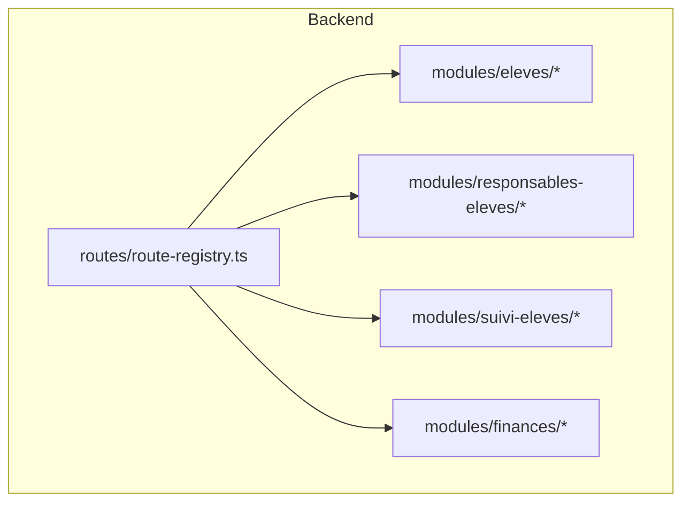
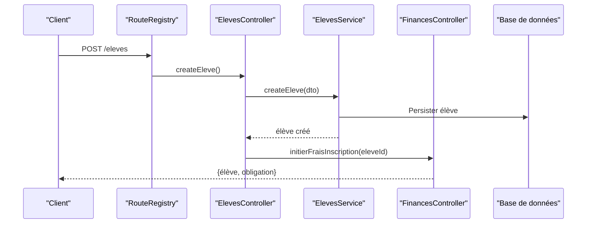
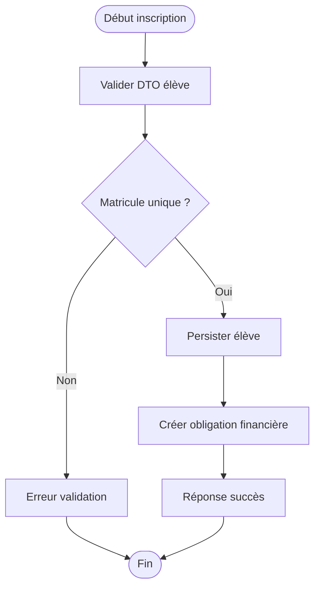
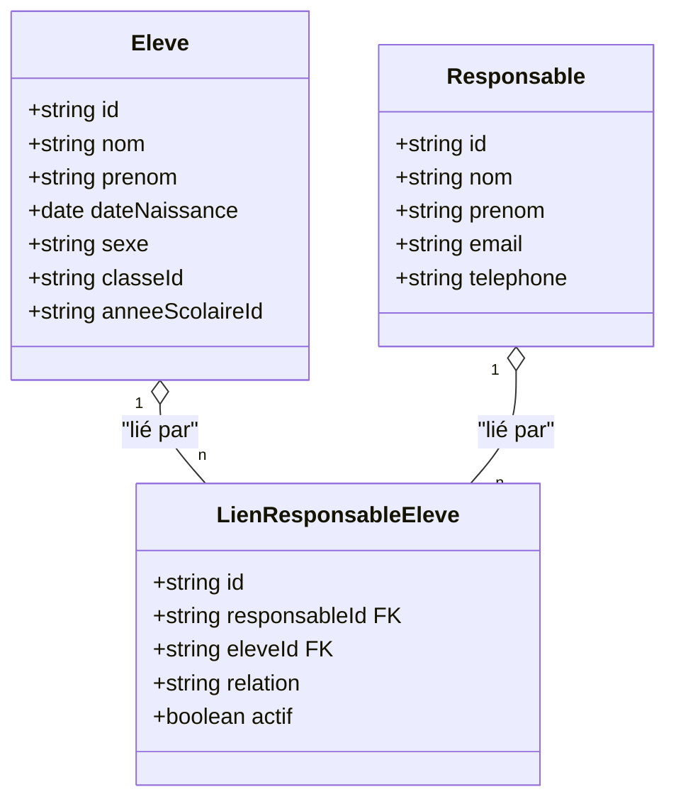
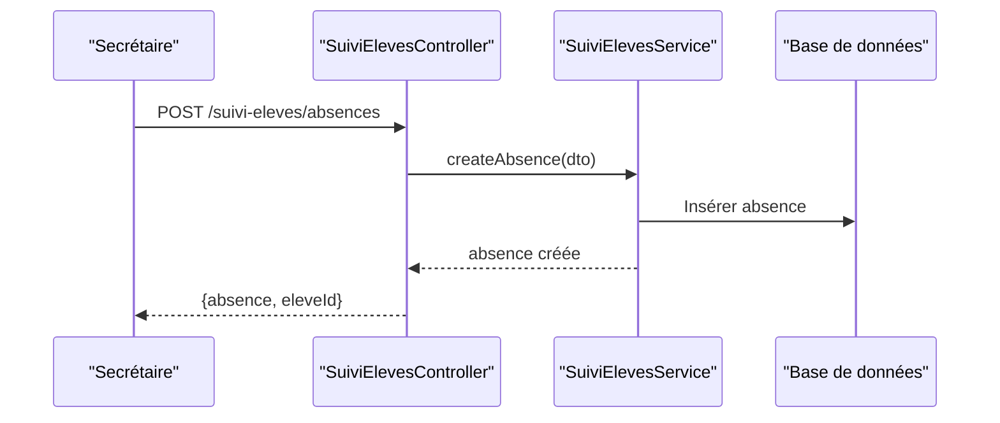
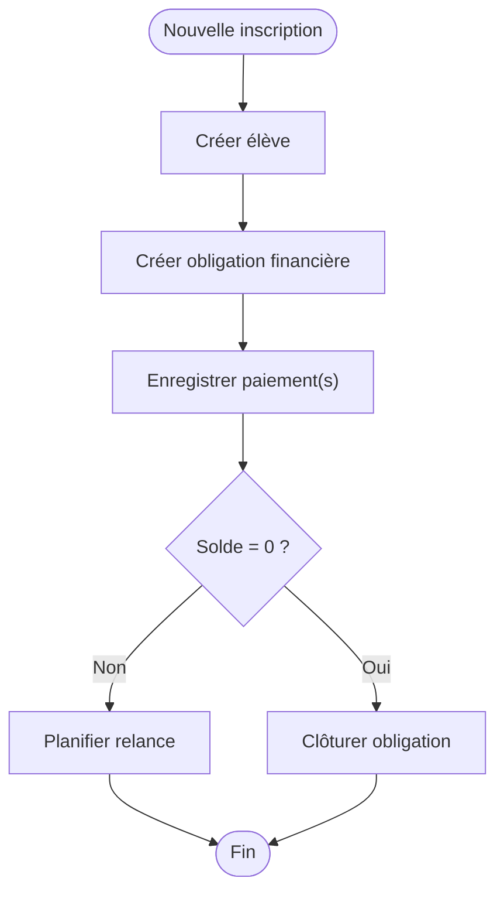
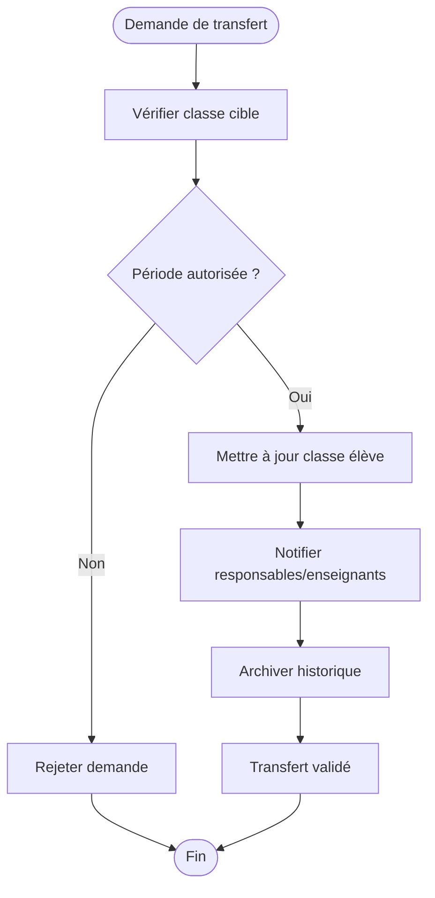
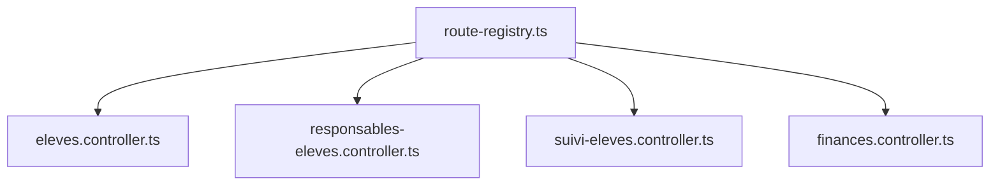

# API Gestion des Élèves

<cite>
**Fichiers référencés dans ce document**
- [eleves.controller.ts](file://backend/src/modules/eleves/controllers/eleves.controller.ts)
- [eleves.service.ts](file://backend/src/modules/eleves/services/eleves.service.ts)
- [eleves.entity.ts](file://backend/src/modules/eleves/entities/eleves.entity.ts)
- [responsables-eleves.controller.ts](file://backend/src/modules/responsables-eleves/controllers/responsables-eleves.controller.ts)
- [responsables-eleves.service.ts](file://backend/src/modules/responsables-eleves/services/responsables-eleves.service.ts)
- [responsables-eleves.entity.ts](file://backend/src/modules/responsables-eleves/entities/responsables-eleves.entity.ts)
- [suivi-eleves.controller.ts](file://backend/src/modules/suivi-eleves/controllers/suivi-eleves.controller.ts)
- [suivi-eleves.service.ts](file://backend/src/modules/suivi-eleves/services/suivi-eleves.service.ts)
- [suivi-eleves.entity.ts](file://backend/src/modules/suivi-eleves/entities/suivi-eleves.entity.ts)
- [finances.controller.ts](file://backend/src/modules/finances/controllers/finances.controller.ts)
- [finances.service.ts](file://backend/src/modules/finances/services/finances.service.ts)
- [finances.entity.ts](file://backend/src/modules/finances/entities/finances.entity.ts)
- [route-registry.ts](file://backend/src/routes/route-registry.ts)
- [030-suivi-eleves.sql](file://backend/database/migrations/030-suivi-eleves.sql)
- [051-champs-preinscription-enrichis.sql](file://backend/database/migrations/051-champs-preinscription-enrichis.sql)
- [052-approche-hybride-parents.sql](file://backend/database/migrations/052-approche-hybride-parents.sql)
- [049-ameliorations-inscription-finances.sql](file://backend/database/migrations/049-ameliorations-inscription-finances.sql)
- [050-ameliorations-inscription-relances.sql](file://backend/database/migrations/050-ameliorations-inscription-relances.sql)
</cite>

## Table des matières
1. [Introduction](#introduction)
2. [Structure du projet](#structure-du-projet)
3. [Composants clés](#composants-clés)
4. [Vue d’ensemble de l’architecture](#vue-densemble-de-larchitecture)
5. [Analyse détaillée des composants](#analyse-detaillee-des-composants)
6. [Analyse des dépendances](#analyse-des-dependances)
7. [Considérations de performance](#considerations-de-performance)
8. [Guide de dépannage](#guide-de-depannage)
9. [Conclusion](#conclusion)
10. [Annexes](#annexes)

## Introduction
Ce document présente une documentation API complète pour la gestion des élèves eLISAschool. Il couvre le CRUD des élèves (inscriptions, modifications, suppressions), la gestion des responsables légaux (liens parents-enfants), et le suivi scolaire (absences, comportement, progressions). Il inclut les schémas de données enrichis, les validations d’inscription, les workflows de transfert entre classes, et les intégrations avec le module financier. Des exemples d’utilisation sont fournis pour les secrétaires et administrateurs.

## Structure du projet
Le backend est organisé en modules NestJS par domaine. Les modules pertinents pour cette documentation sont :
- eleves : entités, services et contrôleurs liés aux élèves
- responsables-eleves : liens parents-enfants et gestion des responsables
- suivi-eleves : absences, comportement, progressions
- finances : frais, paiements et relances liés à l’inscription
- routes : registre centralisé des routes

**Sources de la section**
- [route-registry.ts](file://backend/src/routes/route-registry.ts)

## Composants clés
- Contrôleurs : exposent les endpoints REST pour chaque domaine
- Services : implémentent la logique métier et orchestrent les opérations
- Entités : modèles de données persistés via TypeORM
- Migrations SQL : définitions et évolutions du schéma

**Sources de la section**
- [eleves.controller.ts](file://backend/src/modules/eleves/controllers/eleves.controller.ts)
- [eleves.service.ts](file://backend/src/modules/eleves/services/eleves.service.ts)
- [eleves.entity.ts](file://backend/src/modules/eleves/entities/eleves.entity.ts)
- [responsables-eleves.controller.ts](file://backend/src/modules/responsables-eleves/controllers/responsables-eleves.controller.ts)
- [responsables-eleves.service.ts](file://backend/src/modules/responsables-eleves/services/responsables-eleves.service.ts)
- [responsables-eleves.entity.ts](file://backend/src/modules/responsables-eleves/entities/responsables-eleves.entity.ts)
- [suivi-eleves.controller.ts](file://backend/src/modules/suivi-eleves/controllers/suivi-eleves.controller.ts)
- [suivi-eleves.service.ts](file://backend/src/modules/suivi-eleves/services/suivi-eleves.service.ts)
- [suivi-eleves.entity.ts](file://backend/src/modules/suivi-eleves/entities/suivi-eleves.entity.ts)
- [finances.controller.ts](file://backend/src/modules/finances/controllers/finances.controller.ts)
- [finances.service.ts](file://backend/src/modules/finances/services/finances.service.ts)
- [finances.entity.ts](file://backend/src/modules/finances/entities/finances.entity.ts)

## Vue d’ensemble de l’architecture
Les requêtes HTTP arrivent au registre de routes qui redirigent vers les contrôleurs appropriés. Chaque contrôleur délègue au service correspondant, qui interagit avec les entités et la base de données. Le module finances peut être invoqué depuis les flux d’inscription ou de suivi pour créer des obligations financières.

**Sources de diagramme**
- [route-registry.ts](file://backend/src/routes/route-registry.ts)
- [eleves.controller.ts](file://backend/src/modules/eleves/controllers/eleves.controller.ts)
- [eleves.service.ts](file://backend/src/modules/eleves/services/eleves.service.ts)
- [finances.controller.ts](file://backend/src/modules/finances/controllers/finances.controller.ts)

## Analyse détaillée des composants

### Module Élèves (CRUD)
- Endpoints principaux :
  - Création d’un élève (POST /eleves)
  - Lecture d’un élève (GET /eleves/:id)
  - Mise à jour d’un élève (PUT /eleves/:id)
  - Suppression d’un élève (DELETE /eleves/:id)
  - Liste paginée (GET /eleves?limit=&page=)
- Validations d’inscription :
  - Champs requis (nom, prénom, date de naissance, sexe, classe, année scolaire)
  - Vérification de l’unicité du matricule si configuré
  - Validation des dates et formats
- Workflow d’inscription financière :
  - Après création, génération automatique d’une obligation financière liée à l’élève
  - Possibilité de déclencher des relances automatiques selon la configuration

**Sources de la section**
- [eleves.controller.ts](file://backend/src/modules/eleves/controllers/eleves.controller.ts)
- [eleves.service.ts](file://backend/src/modules/eleves/services/eleves.service.ts)
- [eleves.entity.ts](file://backend/src/modules/eleves/entities/eleves.entity.ts)
- [051-champs-preinscription-enrichis.sql](file://backend/database/migrations/051-champs-preinscription-enrichis.sql)
- [049-ameliorations-inscription-finances.sql](file://backend/database/migrations/049-ameliorations-inscription-finances.sql)
- [050-ameliorations-inscription-relances.sql](file://backend/database/migrations/050-ameliorations-inscription-relances.sql)

### Module Responsables Élèves (Liens Parents-Enfants)
- Endpoints principaux :
  - Lier un responsable à un élève (POST /responsables-eleves/link)
  - Délier un responsable (DELETE /responsables-eleves/unlink)
  - Lister les responsables d’un élève (GET /responsables-eleves/by-eleve/:eleveId)
  - Lister les enfants d’un responsable (GET /responsables-eleves/by-responsable/:responsableId)
- Règles métier :
  - Un responsable peut avoir plusieurs enfants
  - Un enfant peut avoir plusieurs responsables
  - Contraintes d’intégrité et vérifications de cohérence multi-tenant

**Sources de la section**
- [responsables-eleves.controller.ts](file://backend/src/modules/responsables-eleves/controllers/responsables-eleves.controller.ts)
- [responsables-eleves.service.ts](file://backend/src/modules/responsables-eleves/services/responsables-eleves.service.ts)
- [responsables-eleves.entity.ts](file://backend/src/modules/responsables-eleves/entities/responsables-eleves.entity.ts)
- [052-approche-hybride-parents.sql](file://backend/database/migrations/052-approche-hybride-parents.sql)

### Module Suivi Élèves (Absences, Comportement, Progressions)
- Endpoints principaux :
  - Enregistrer une absence (POST /suivi-eleves/absences)
  - Mettre à jour une absence (PUT /suivi-eleves/absences/:id)
  - Supprimer une absence (DELETE /suivi-eleves/absences/:id)
  - Lister les absences d’un élève (GET /suivi-eleves/absences?eleveId=)
  - Enregistrer un événement comportemental (POST /suivi-eleves/comportements)
  - Saisie de progression (POST /suivi-eleves/progressions)
- Règles métier :
  - Absences liées à une période scolaire et classe
  - Événements comportementaux catégorisés et datés
  - Progressions associées à des compétences ou matières

**Sources de la section**
- [suivi-eleves.controller.ts](file://backend/src/modules/suivi-eleves/controllers/suivi-eleves.controller.ts)
- [suivi-eleves.service.ts](file://backend/src/modules/suivi-eleves/services/suivi-eleves.service.ts)
- [suivi-eleves.entity.ts](file://backend/src/modules/suivi-eleves/entities/suivi-eleves.entity.ts)
- [030-suivi-eleves.sql](file://backend/database/migrations/030-suivi-eleves.sql)

### Intégration Financière (Frais, Paiements, Relances)
- Endpoints principaux :
  - Créer une obligation financière (POST /finances/obligations)
  - Enregistrer un paiement (POST /finances/paiements)
  - Lister les obligations d’un élève (GET /finances/obligations?eleveId=)
  - Lancer des relances (POST /finances/relances/batch)
- Workflow intégré :
  - Lors de l’inscription d’un élève, une obligation est créée automatiquement
  - Les paiements réduisent le solde restant
  - Les relances peuvent être planifiées selon les seuils de retard

**Sources de la section**
- [finances.controller.ts](file://backend/src/modules/finances/controllers/finances.controller.ts)
- [finances.service.ts](file://backend/src/modules/finances/services/finances.service.ts)
- [finances.entity.ts](file://backend/src/modules/finances/entities/finances.entity.ts)
- [049-ameliorations-inscription-finances.sql](file://backend/database/migrations/049-ameliorations-inscription-finances.sql)
- [050-ameliorations-inscription-relances.sql](file://backend/database/migrations/050-ameliorations-inscription-relances.sql)

### Transfert entre Classes (Workflow)
- Étapes :
  - Vérifier la disponibilité de la classe cible
  - Valider la période de transfert (ouverture/clôture)
  - Mettre à jour la classe de l’élève
  - Notifier les parties prenantes (responsables, enseignants)
  - Archiver l’historique de transfert

[Ce diagramme est conceptuel et ne mape pas directement des fichiers spécifiques]

## Analyse des dépendances
Les modules communiquent via leurs services et contrôleurs. Les routes centralisées assurent la cohérence des chemins API. Les migrations SQL définissent les relations et contraintes.

**Sources de la section**
- [route-registry.ts](file://backend/src/routes/route-registry.ts)

## Considérations de performance
- Pagination systématique sur les listes (éléments, absences, obligations)
- Indexation des champs fréquemment filtrés (eleveId, responsableId, periode)
- Transactions pour les opérations critiques (création élève + obligation financière)
- Limitation des charges en lecture avec des vues matérialisées si nécessaire

## Guide de dépannage
- Erreurs de validation : vérifier les DTO et messages d’erreur retournés
- Violations de contraintes : examiner les relations parents-enfants et les clés étrangères
- Problèmes financiers : vérifier l’état des obligations et paiements
- Logs et audit : consulter les traces d’actions sensibles

**Sources de la section**
- [eleves.controller.ts](file://backend/src/modules/eleves/controllers/eleves.controller.ts)
- [responsables-eleves.controller.ts](file://backend/src/modules/responsables-eleves/controllers/responsables-eleves.controller.ts)
- [suivi-eleves.controller.ts](file://backend/src/modules/suivi-eleves/controllers/suivi-eleves.controller.ts)
- [finances.controller.ts](file://backend/src/modules/finances/controllers/finances.controller.ts)

## Conclusion
Cette documentation fournit une vue complète des APIs de gestion des élèves, responsables et suivi scolaire, ainsi que leur intégration financière. Elle permet aux développeurs, secrétaires et administrateurs de comprendre les flux, valider les données et résoudre les problèmes courants.

## Annexes

### Exemples d’utilisation pour secrétaires et administrateurs
- Secrétaires :
  - Inscription d’un élève avec création automatique d’obligation financière
  - Liaison d’un responsable à un élève
  - Saisie quotidienne des absences et événements comportementaux
- Administrateurs :
  - Transfert d’élèves entre classes
  - Supervision des paiements et relances financières
  - Consultation des tableaux de bord de suivi scolaire

### Schémas de données enrichis
- Élèves : informations personnelles, scolarité, statut
- Responsables : coordonnées, relations familiales
- Suivi : absences, comportements, progressions
- Finances : obligations, paiements, relances

**Sources de la section**
- [eleves.entity.ts](file://backend/src/modules/eleves/entities/eleves.entity.ts)
- [responsables-eleves.entity.ts](file://backend/src/modules/responsables-eleves/entities/responsables-eleves.entity.ts)
- [suivi-eleves.entity.ts](file://backend/src/modules/suivi-eleves/entities/suivi-eleves.entity.ts)
- [finances.entity.ts](file://backend/src/modules/finances/entities/finances.entity.ts)
- [030-suivi-eleves.sql](file://backend/database/migrations/030-suivi-eleves.sql)
- [051-champs-preinscription-enrichis.sql](file://backend/database/migrations/051-champs-preinscription-enrichis.sql)
- [052-approche-hybride-parents.sql](file://backend/database/migrations/052-approche-hybride-parents.sql)
- [049-ameliorations-inscription-finances.sql](file://backend/database/migrations/049-ameliorations-inscription-finances.sql)
- [050-ameliorations-inscription-relances.sql](file://backend/database/migrations/050-ameliorations-inscription-relances.sql)