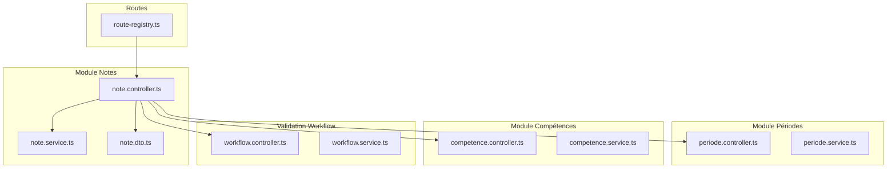
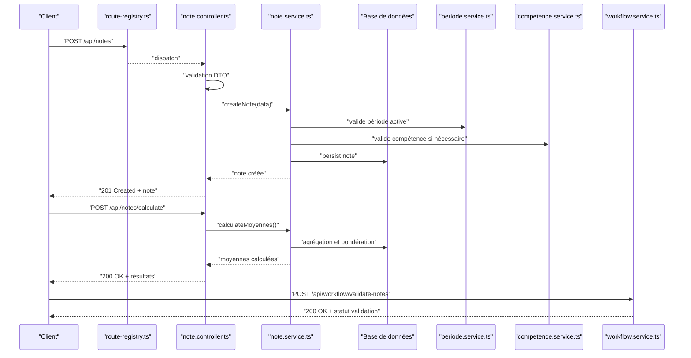
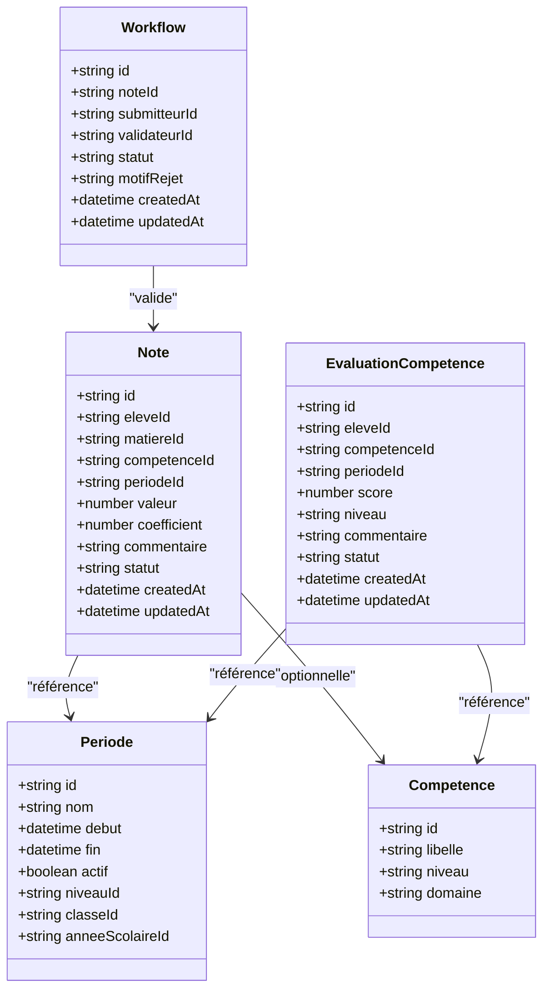
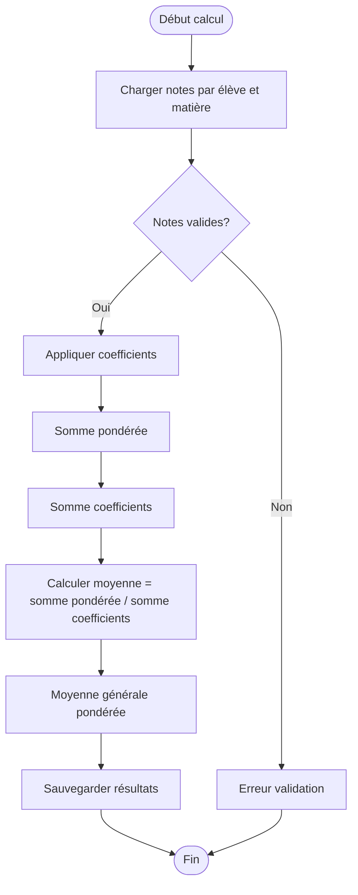
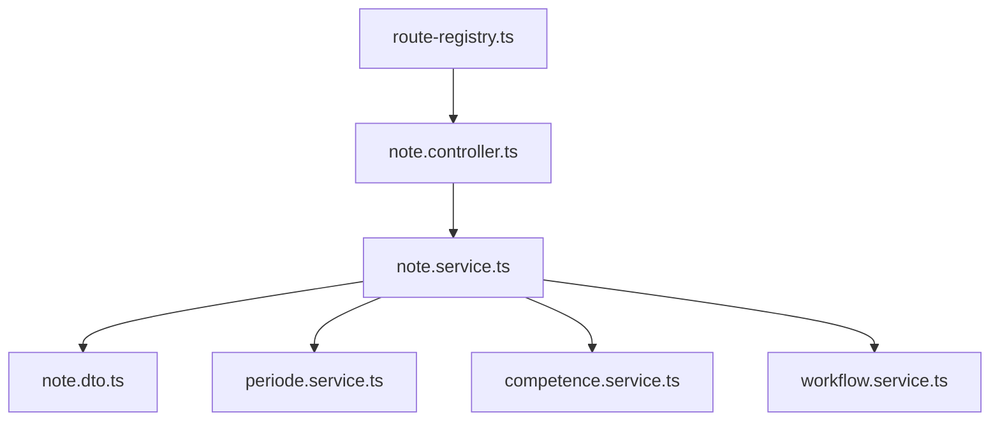

# API Notes et Évaluations

<cite>
**Fichiers référencés dans ce document**
- [backend/src/modules/notes/index.ts](file://backend/src/modules/notes/index.ts)
- [backend/src/modules/notes/controllers/note.controller.ts](file://backend/src/modules/notes/controllers/note.controller.ts)
- [backend/src/modules/notes/services/note.service.ts](file://backend/src/modules/notes/services/note.service.ts)
- [backend/src/modules/notes/dto/note.dto.ts](file://backend/src/modules/notes/dto/note.dto.ts)
- [backend/src/modules/periodes/index.ts](file://backend/src/modules/periodes/index.ts)
- [backend/src/modules/periodes/controllers/periode.controller.ts](file://backend/src/modules/periodes/controllers/periode.controller.ts)
- [backend/src/modules/periodes/services/periode.service.ts](file://backend/src/modules/periodes/services/periode.service.ts)
- [backend/src/modules/competences/index.ts](file://backend/src/modules/competences/index.ts)
- [backend/src/modules/competences/controllers/competence.controller.ts](file://backend/src/modules/competences/controllers/competence.controller.ts)
- [backend/src/modules/competences/services/competence.service.ts](file://backend/src/modules/competences/services/competence.service.ts)
- [backend/src/routes/route-registry.ts](file://backend/src/routes/route-registry.ts)
- [backend/database/migrations/123-refonte-notes-bulletins.sql](file://backend/database/migrations/123-refonte-notes-bulletins.sql)
- [backend/database/migrations/062-creer-table-evaluations-competences.sql](file://backend/database/migrations/062-creer-table-evaluations-competences.sql)
- [backend/database/migrations/104-refonte-periodes-niveaux-configurables.sql](file://backend/database/migrations/104-refonte-periodes-niveaux-configurables.sql)
- [backend/database/migrations/059-ajouter-matiere-sous-systeme.sql](file://backend/database/migrations/059-ajouter-matiere-sous-systeme.sql)
- [backend/database/migrations/060-ajouter-affectation-matiere-coefficient.sql](file://backend/database/migrations/060-ajouter-affectation-matiere-coefficient.sql)
- [backend/database/migrations/084-cleanup-classe-id-notes.sql](file://backend/database/migrations/084-cleanup-classe-id-notes.sql)
- [backend/database/migrations/106-rename-sequence-to-evaluation.sql](file://backend/database/migrations/106-rename-sequence-to-evaluation.sql)
- [backend/database/migrations/107-cleanup-configuration-modules-actif.sql](file://backend/database/migrations/107-cleanup-configuration-modules-actif.sql)
- [backend/database/migrations/115-supprimer-config-matiere-classe.sql](file://backend/database/migrations/115-supprimer-config-matiere-classe.sql)
- [backend/database/migrations/123-refonte-notes-bulletins.sql](file://backend/database/migrations/123-refonte-notes-bulletins.sql)
- [backend/database/migrations/124-fix-hierarchie-orphelins.sql](file://backend/database/migrations/124-fix-hierarchie-orphelins.sql)
- [backend/database/migrations/125-organigramme-read-tous-roles.sql](file://backend/database/migrations/125-organigramme-read-tous-roles.sql)
- [backend/database/migrations/126-fix-vues-materialisees-statuts.sql](file://backend/database/migrations/126-fix-vues-materialisees-statuts.sql)
- [backend/database/migrations/127-templates-organisation-categorisation.sql](file://backend/database/migrations/127-templates-organisation-categorisation.sql)
- [backend/src/modules/validation-workflow/index.ts](file://backend/src/modules/validation-workflow/index.ts)
- [backend/src/modules/validation-workflow/controllers/workflow.controller.ts](file://backend/src/modules/validation-workflow/controllers/workflow.controller.ts)
- [backend/src/modules/validation-workflow/services/workflow.service.ts](file://backend/src/modules/validation-workflow/services/workflow.service.ts)
</cite>

## Table des matières
1. [Introduction](#introduction)
2. [Structure du projet](#structure-du-projet)
3. [Composants clés](#composants-clés)
4. [Vue d’ensemble de l’architecture](#vue-densemble-de-larchitecture)
5. [Analyse détaillée des composants](#analyse-detaillee-des-composants)
6. [Analyse des dépendances](#analyse-des-dependances)
7. [Considérations de performance](#considerations-de-performance)
8. [Guide de dépannage](#guide-de-depannage)
9. [Conclusion](#conclusion)
10. [Annexes](#annexes)

## Introduction
Ce document présente une documentation API complète pour le système de notes et évaluations eLISAschool. Il couvre les endpoints pour la saisie des notes (par matière et par compétence), la gestion des périodes d’évaluation, les calculs de moyennes et pondérations, ainsi que les compétences à évaluer. Il inclut également les schémas de données, les règles de calcul, les validations de saisie, et les workflows de validation des notes par les chefs de département. Des exemples d’utilisation sont fournis pour les enseignants et directeurs pédagogiques.

## Structure du projet
Le module Notes est organisé en couches classiques : contrôleurs, services, DTOs et migrations. Les routes sont enregistrées via un registre centralisé. Les modules connexes (Périodes, Compétences, Validation Workflow) interagissent avec le module Notes pour fournir une expérience complète de gestion académique.

**Sources des diagrammes**
- [backend/src/routes/route-registry.ts](file://backend/src/routes/route-registry.ts)
- [backend/src/modules/notes/controllers/note.controller.ts](file://backend/src/modules/notes/controllers/note.controller.ts)
- [backend/src/modules/notes/services/note.service.ts](file://backend/src/modules/notes/services/note.service.ts)
- [backend/src/modules/notes/dto/note.dto.ts](file://backend/src/modules/notes/dto/note.dto.ts)
- [backend/src/modules/periodes/controllers/periode.controller.ts](file://backend/src/modules/periodes/controllers/periode.controller.ts)
- [backend/src/modules/periodes/services/periode.service.ts](file://backend/src/modules/periodes/services/periode.service.ts)
- [backend/src/modules/competences/controllers/competence.controller.ts](file://backend/src/modules/competences/controllers/competence.controller.ts)
- [backend/src/modules/competences/services/competence.service.ts](file://backend/src/modules/competences/services/competence.service.ts)
- [backend/src/modules/validation-workflow/controllers/workflow.controller.ts](file://backend/src/modules/validation-workflow/controllers/workflow.controller.ts)
- [backend/src/modules/validation-workflow/services/workflow.service.ts](file://backend/src/modules/validation-workflow/services/workflow.service.ts)

**Sources de section**
- [backend/src/routes/route-registry.ts](file://backend/src/routes/route-registry.ts)
- [backend/src/modules/notes/index.ts](file://backend/src/modules/notes/index.ts)
- [backend/src/modules/periodes/index.ts](file://backend/src/modules/periodes/index.ts)
- [backend/src/modules/competences/index.ts](file://backend/src/modules/competences/index.ts)
- [backend/src/modules/validation-workflow/index.ts](file://backend/src/modules/validation-workflow/index.ts)

## Composants clés
- Contrôleurs Notes : exposent les endpoints REST pour créer, mettre à jour, supprimer et récupérer des notes, ainsi que pour déclencher les calculs de moyennes et valider les données.
- Services Notes : implémentent la logique métier, y compris les calculs de moyennes, pondérations, et interactions avec les bases de données.
- DTOs Notes : définissent les schémas de validation pour les requêtes et réponses.
- Modules Périodes et Compétences : fournissent les entités de référence nécessaires aux évaluations.
- Validation Workflow : orchestre les étapes de validation par les chefs de département.

**Sources de section**
- [backend/src/modules/notes/controllers/note.controller.ts](file://backend/src/modules/notes/controllers/note.controller.ts)
- [backend/src/modules/notes/services/note.service.ts](file://backend/src/modules/notes/services/note.service.ts)
- [backend/src/modules/notes/dto/note.dto.ts](file://backend/src/modules/notes/dto/note.dto.ts)
- [backend/src/modules/periodes/controllers/periode.controller.ts](file://backend/src/modules/periodes/controllers/periode.controller.ts)
- [backend/src/modules/competences/controllers/competence.controller.ts](file://backend/src/modules/competences/controllers/competence.controller.ts)
- [backend/src/modules/validation-workflow/controllers/workflow.controller.ts](file://backend/src/modules/validation-workflow/controllers/workflow.controller.ts)

## Vue d’ensemble de l’architecture
Le flux typique commence par une requête HTTP vers le registre de routes, qui redirige vers le contrôleur Notes. Le contrôleur valide les entrées via les DTOs, délègue au service Notes pour exécuter la logique métier (calculs, persistance), puis retourne une réponse structurée. Les modules Périodes et Compétences sont consultés pour garantir la cohérence des références. Le workflow de validation peut être invoqué pour soumettre les notes à la validation hiérarchique.

**Sources des diagrammes**
- [backend/src/routes/route-registry.ts](file://backend/src/routes/route-registry.ts)
- [backend/src/modules/notes/controllers/note.controller.ts](file://backend/src/modules/notes/controllers/note.controller.ts)
- [backend/src/modules/notes/services/note.service.ts](file://backend/src/modules/notes/services/note.service.ts)
- [backend/src/modules/periodes/services/periode.service.ts](file://backend/src/modules/periodes/services/periode.service.ts)
- [backend/src/modules/competences/services/competence.service.ts](file://backend/src/modules/competences/services/competence.service.ts)
- [backend/src/modules/validation-workflow/services/workflow.service.ts](file://backend/src/modules/validation-workflow/services/workflow.service.ts)

## Analyse détaillée des composants

### Endpoints Notes
- POST /api/notes : création d’une note (par matière ou compétence).
- PUT /api/notes/:id : mise à jour d’une note.
- DELETE /api/notes/:id : suppression d’une note.
- GET /api/notes?eleveId=&matiereId=&periodeId= : liste filtrée de notes.
- POST /api/notes/calculate : calcul des moyennes et pondérations.
- POST /api/notes/batch : saisie groupée de notes.

Schémas de données (DTOs)
- Note : eleveId, matiereId, competenceId (optionnel), periodeId, valeur, coefficient, commentaire, statut.
- Règles de validation : valeurs numériques entre 0 et 20, coefficient positif, période active, élève inscrit dans la classe associée.

Calculs et pondérations
- Moyenne par matière = somme(valeur × coefficient) / somme(coefficients).
- Moyenne générale = moyenne pondérée par matière selon coefficients globaux.
- Gestion des absences et non-notés : exclus du calcul ou marqués comme N/A selon configuration.

Exemples d’utilisation (enseignants)
- Saisie individuelle : POST /api/notes avec corps contenant eleveId, matiereId, periodeId, valeur, coefficient.
- Saisie groupée : POST /api/notes/batch avec tableau de notes pour un élève ou une classe.

**Sources de section**
- [backend/src/modules/notes/controllers/note.controller.ts](file://backend/src/modules/notes/controllers/note.controller.ts)
- [backend/src/modules/notes/services/note.service.ts](file://backend/src/modules/notes/services/note.service.ts)
- [backend/src/modules/notes/dto/note.dto.ts](file://backend/src/modules/notes/dto/note.dto.ts)

### Endpoints Périodes
- GET /api/periodes : liste des périodes actives.
- POST /api/periodes : création d’une période.
- PUT /api/periodes/:id : modification d’une période.
- DELETE /api/periodes/:id : suppression d’une période.

Règles de gestion
- Une seule période active par niveau/classe/anée scolaire.
- Clôture automatique après date limite.
- Interdiction de modifier les notes après clôture.

**Sources de section**
- [backend/src/modules/periodes/controllers/periode.controller.ts](file://backend/src/modules/periodes/controllers/periode.controller.ts)
- [backend/src/modules/periodes/services/periode.service.ts](file://backend/src/modules/periodes/services/periode.service.ts)

### Endpoints Compétences
- GET /api/competences : liste des compétences disponibles.
- POST /api/competences : ajout d’une compétence.
- PUT /api/competences/:id : modification d’une compétence.
- DELETE /api/competences/:id : suppression d’une compétence.

Règles de compétences
- Chaque compétence possède un libellé, un niveau, et un domaine.
- Liens possibles avec des matières ou évaluations spécifiques.

**Sources de section**
- [backend/src/modules/competences/controllers/competence.controller.ts](file://backend/src/modules/competences/controllers/competence.controller.ts)
- [backend/src/modules/competences/services/competence.service.ts](file://backend/src/modules/competences/services/competence.service.ts)

### Workflow de validation des notes
- POST /api/workflow/submit-for-validation : soumission des notes pour validation.
- POST /api/workflow/approve : approbation par chef de département.
- POST /api/workflow/reject : rejet avec motif.

Étapes du workflow
- Soumission par enseignant → vérification par chef de département → publication finale.
- Historique des actions conservé pour traçabilité.

**Sources de section**
- [backend/src/modules/validation-workflow/controllers/workflow.controller.ts](file://backend/src/modules/validation-workflow/controllers/workflow.controller.ts)
- [backend/src/modules/validation-workflow/services/workflow.service.ts](file://backend/src/modules/validation-workflow/services/workflow.service.ts)

### Schémas de données et migrations
Tables principales liées aux notes et évaluations :
- evaluations_notes : id, eleve_id, matiere_id, periode_id, valeur, coefficient, commentaire, statut, created_at, updated_at.
- evaluations_competences : id, eleve_id, competence_id, periode_id, score, niveau, commentaire, statut, created_at, updated_at.
- periodes : id, nom, debut, fin, actif, niveau_id, classe_id, annee_scolaire_id.
- matieres : id, nom, domaine, actif.
- affectation_matiere_coefficient : matiere_id, niveau_id, coefficient.

Migrations pertinentes
- 123-refonte-notes-bulletins.sql : refonte structure notes et bulletins.
- 062-creer-table-evaluations-competences.sql : création table compétences.
- 104-refonte-periodes-niveaux-configurables.sql : gestion configurable des périodes.
- 059-ajouter-matiere-sous-systeme.sql : intégration matières.
- 060-ajouter-affectation-matiere-coefficient.sql : coefficients par matière/niveau.
- 084-cleanup-classe-id-notes.sql : nettoyage relations classes/notes.
- 106-rename-sequence-to-evaluation.sql : renommage séquences.

**Sources de section**
- [backend/database/migrations/123-refonte-notes-bulletins.sql](file://backend/database/migrations/123-refonte-notes-bulletins.sql)
- [backend/database/migrations/062-creer-table-evaluations-competences.sql](file://backend/database/migrations/062-creer-table-evaluations-competences.sql)
- [backend/database/migrations/104-refonte-periodes-niveaux-configurables.sql](file://backend/database/migrations/104-refonte-periodes-niveaux-configurables.sql)
- [backend/database/migrations/059-ajouter-matiere-sous-systeme.sql](file://backend/database/migrations/059-ajouter-matiere-sous-systeme.sql)
- [backend/database/migrations/060-ajouter-affectation-matiere-coefficient.sql](file://backend/database/migrations/060-ajouter-affectation-matiere-coefficient.sql)
- [backend/database/migrations/084-cleanup-classe-id-notes.sql](file://backend/database/migrations/084-cleanup-classe-id-notes.sql)
- [backend/database/migrations/106-rename-sequence-to-evaluation.sql](file://backend/database/migrations/106-rename-sequence-to-evaluation.sql)

### Diagramme de classes (Notes, Périodes, Compétences, Workflow)

**Sources des diagrammes**
- [backend/src/modules/notes/dto/note.dto.ts](file://backend/src/modules/notes/dto/note.dto.ts)
- [backend/database/migrations/123-refonte-notes-bulletins.sql](file://backend/database/migrations/123-refonte-notes-bulletins.sql)
- [backend/database/migrations/062-creer-table-evaluations-competences.sql](file://backend/database/migrations/062-creer-table-evaluations-competences.sql)
- [backend/database/migrations/104-refonte-periodes-niveaux-configurables.sql](file://backend/database/migrations/104-refonte-periodes-niveaux-configurables.sql)

### Flux de calcul de moyennes

**Sources des diagrammes**
- [backend/src/modules/notes/services/note.service.ts](file://backend/src/modules/notes/services/note.service.ts)
- [backend/database/migrations/060-ajouter-affectation-matiere-coefficient.sql](file://backend/database/migrations/060-ajouter-affectation-matiere-coefficient.sql)

## Analyse des dépendances
Les contrôleurs dépendent des services pour la logique métier, qui eux-mêmes dépendent des DTOs pour la validation et des migrations pour la structure de données. Les modules Périodes et Compétences sont utilisés par le service Notes pour garantir la cohérence des références. Le workflow interagit avec les notes pour orchestrer la validation hiérarchique.

**Sources des diagrammes**
- [backend/src/routes/route-registry.ts](file://backend/src/routes/route-registry.ts)
- [backend/src/modules/notes/controllers/note.controller.ts](file://backend/src/modules/notes/controllers/note.controller.ts)
- [backend/src/modules/notes/services/note.service.ts](file://backend/src/modules/notes/services/note.service.ts)
- [backend/src/modules/notes/dto/note.dto.ts](file://backend/src/modules/notes/dto/note.dto.ts)
- [backend/src/modules/periodes/services/periode.service.ts](file://backend/src/modules/periodes/services/periode.service.ts)
- [backend/src/modules/competences/services/competence.service.ts](file://backend/src/modules/competences/services/competence.service.ts)
- [backend/src/modules/validation-workflow/services/workflow.service.ts](file://backend/src/modules/validation-workflow/services/workflow.service.ts)

**Sources de section**
- [backend/src/routes/route-registry.ts](file://backend/src/routes/route-registry.ts)
- [backend/src/modules/notes/index.ts](file://backend/src/modules/notes/index.ts)
- [backend/src/modules/periodes/index.ts](file://backend/src/modules/periodes/index.ts)
- [backend/src/modules/competences/index.ts](file://backend/src/modules/competences/index.ts)
- [backend/src/modules/validation-workflow/index.ts](file://backend/src/modules/validation-workflow/index.ts)

## Considérations de performance
- Indexation des colonnes fréquemment interrogées (eleveId, matiereId, periodeId).
- Agrégations SQL optimisées pour les calculs de moyennes.
- Mise en cache des listes de périodes et compétences.
- Batch processing pour les saisies groupées.

[Pas de sources nécessaires car cette section fournit des conseils généraux]

## Guide de dépannage
- Erreurs de validation : vérifier les DTOs et les règles de saisie (valeurs entre 0 et 20, coefficient positif).
- Problèmes de périodes : s’assurer qu’une période active existe et n’est pas clôturée.
- Calculs incorrects : vérifier les coefficients et les notes valides.
- Workflow bloqué : examiner les statuts et motifs de rejet.

**Sources de section**
- [backend/src/modules/notes/dto/note.dto.ts](file://backend/src/modules/notes/dto/note.dto.ts)
- [backend/src/modules/periodes/services/periode.service.ts](file://backend/src/modules/periodes/services/periode.service.ts)
- [backend/src/modules/validation-workflow/services/workflow.service.ts](file://backend/src/modules/validation-workflow/services/workflow.service.ts)

## Conclusion
Le système de notes et évaluations eLISAschool offre une API robuste et flexible pour la gestion académique. Grâce à une architecture modulaire, des validations rigoureuses et un workflow de validation hiérarchique, il répond aux besoins des enseignants et directeurs pédagogiques. Les migrations assurent une évolution cohérente du schéma de données.

[Pas de sources nécessaires car cette section résume sans analyser de fichiers spécifiques]

## Annexes
- Exemples d’appels API pour enseignants et directeurs pédagogiques.
- Références aux migrations et schémas de données.
- Bonnes pratiques de validation et de calcul.

[Pas de sources nécessaires car cette section ne contient pas d’analyse spécifique de fichiers]