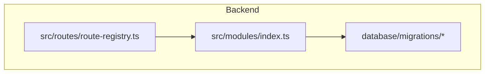
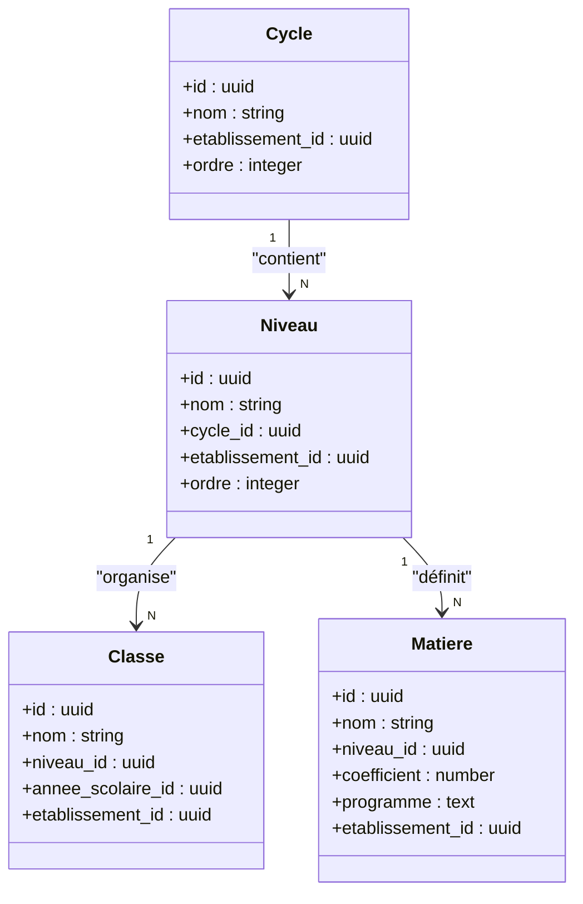
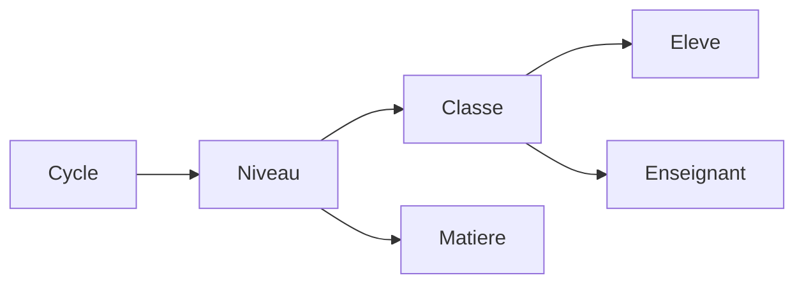

# API Structure Académique

<cite>
**Fichiers référencés dans ce document**
- [043-structure-academique-v4.sql](file://backend/database/migrations/043-structure-academique-v4.sql)
- [053-structure-academique-complete.sql](file://backend/database/migrations/053-structure-academique-complete.sql)
- [054-refonte-structure-academique-v2.sql](file://backend/database/migrations/054-refonte-structure-academique-v2.sql)
- [058-multi-tenant-structure-academique.sql](file://backend/database/migrations/058-multi-tenant-structure-academique.sql)
- [059-ajouter-matiere-sous-systeme.sql](file://backend/database/migrations/059-ajouter-matiere-sous-systeme.sql)
- [060-ajouter-affectation-matiere-coefficient.sql](file://backend/database/migrations/060-ajouter-affectation-matiere-coefficient.sql)
- [072-scoping-cycles-niveaux.sql](file://backend/database/migrations/072-scoping-cycles-niveaux.sql)
- [074-matiere-niveau-unique-composite.sql](file://backend/database/migrations/074-matiere-niveau-unique-composite.sql)
- [088-refactorisation-architecture-academique.sql](file://backend/database/migrations/088-refactorisation-architecture-academique.sql)
- [089-finalisation-architecture-academique-v2.sql](file://backend/database/migrations/089-finalisation-architecture-academique-v2.sql)
- [091-peuplement-architecture-academique.sql](file://backend/database/migrations/091-peuplement-architecture-academique.sql)
- [092-refactorisation-classeAnneeId.sql](file://backend/database/migrations/092-refactorisation-classeAnneeId.sql)
- [routes-registry.ts](file://backend/src/routes/route-registry.ts)
- [index.ts](file://backend/src/modules/index.ts)
</cite>

## Table des matières
1. [Introduction](#introduction)
2. [Structure du projet](#structure-du-projet)
3. [Composants clés](#composants-clés)
4. [Vue d’ensemble de l’architecture](#vue-densemble-de-larchitecture)
5. [Analyse détaillée des composants](#analyse-detaillee-des-composants)
6. [Analyse des dépendances](#analyse-des-dependances)
7. [Considérations de performance](#considerations-de-performance)
8. [Guide de dépannage](#guide-de-depannage)
9. [Conclusion](#conclusion)
10. [Annexes](#annexes)

## Introduction
Ce document présente une documentation API complète pour la structure académique eLISAschool, centrée sur les entités suivantes : cycles, niveaux, classes et matières. Il couvre les opérations CRUD, la hiérarchie pédagogique, l’affectation élèves et enseignants, ainsi que les coefficients et programmes associés aux matières. Des schémas de données, des relations hiérarchiques, des validations métier et des workflows de configuration sont fournis, accompagnés d’exemples d’utilisation à destination des administrateurs académiques.

## Structure du projet
La structure académique est implémentée via plusieurs migrations SQL qui définissent le schéma de base de données et les contraintes assurant la cohérence académique. Les routes sont centralisées dans un registre de routes et les modules sont indexés pour l’activation.

**Sources de diagramme**
- [routes-registry.ts](file://backend/src/routes/route-registry.ts)
- [index.ts](file://backend/src/modules/index.ts)

**Sources de section**
- [routes-registry.ts](file://backend/src/routes/route-registry.ts)
- [index.ts](file://backend/src/modules/index.ts)

## Composants clés
Les composants clés de la structure académique incluent :
- Gestion des cycles (CRUD, hiérarchie, scoping multi-tenant)
- Niveaux pédagogiques (organisation, relation avec cycles)
- Classes (affectation élèves et enseignants, année scolaire)
- Matières (coefficients, programmes, relation avec niveaux)

Ces composants sont définis et contraints par les migrations SQL listées ci-dessus.

**Sources de section**
- [043-structure-academique-v4.sql](file://backend/database/migrations/043-structure-academique-v4.sql)
- [053-structure-academique-complete.sql](file://backend/database/migrations/053-structure-academique-complete.sql)
- [054-refonte-structure-academique-v2.sql](file://backend/database/migrations/054-refonte-structure-academique-v2.sql)
- [058-multi-tenant-structure-academique.sql](file://backend/database/migrations/058-multi-tenant-structure-academique.sql)
- [059-ajouter-matiere-sous-systeme.sql](file://backend/database/migrations/059-ajouter-matiere-sous-systeme.sql)
- [060-ajouter-affectation-matiere-coefficient.sql](file://backend/database/migrations/060-ajouter-affectation-matiere-coefficient.sql)
- [072-scoping-cycles-niveaux.sql](file://backend/database/migrations/072-scoping-cycles-niveaux.sql)
- [074-matiere-niveau-unique-composite.sql](file://backend/database/migrations/074-matiere-niveau-unique-composite.sql)
- [088-refactorisation-architecture-academique.sql](file://backend/database/migrations/088-refactorisation-architecture-academique.sql)
- [089-finalisation-architecture-academique-v2.sql](file://backend/database/migrations/089-finalisation-architecture-academique-v2.sql)
- [091-peuplement-architecture-academique.sql](file://backend/database/migrations/091-peuplement-architecture-academique.sql)
- [092-refactorisation-classeAnneeId.sql](file://backend/database/migrations/092-refactorisation-classeAnneeId.sql)

## Vue d’ensemble de l’architecture
L’architecture de la structure académique repose sur un modèle hiérarchique clair :
- Cycle → Niveau → Classe
- Matière liée à un Niveau avec coefficient et programme
- Multi-tenant via établissement_id pour isoler les données

**Sources de diagramme**
- [053-structure-academique-complete.sql](file://backend/database/migrations/053-structure-academique-complete.sql)
- [054-refonte-structure-academique-v2.sql](file://backend/database/migrations/054-refonte-structure-academique-v2.sql)
- [059-ajouter-matiere-sous-systeme.sql](file://backend/database/migrations/059-ajouter-matiere-sous-systeme.sql)
- [060-ajouter-affectation-matiere-coefficient.sql](file://backend/database/migrations/060-ajouter-affectation-matiere-coefficient.sql)
- [072-scoping-cycles-niveaux.sql](file://backend/database/migrations/072-scoping-cycles-niveaux.sql)
- [074-matiere-niveau-unique-composite.sql](file://backend/database/migrations/074-matiere-niveau-unique-composite.sql)
- [088-refactorisation-architecture-academique.sql](file://backend/database/migrations/088-refactorisation-architecture-academique.sql)
- [089-finalisation-architecture-academique-v2.sql](file://backend/database/migrations/089-finalisation-architecture-academique-v2.sql)
- [092-refactorisation-classeAnneeId.sql](file://backend/database/migrations/092-refactorisation-classeAnneeId.sql)

## Analyse détaillée des composants

### Gestion des Cycles
- Opérations CRUD : création, lecture, mise à jour, suppression
- Hiérarchie : ordre et parenté au sein d’un établissement
- Scoping multi-tenant : isolation par établissement_id

Exemple de workflow :
1. Créer un cycle pour un établissement
2. Définir son ordre et ses niveaux associés
3. Vérifier les contraintes uniques et les relations

**Sources de section**
- [043-structure-academique-v4.sql](file://backend/database/migrations/043-structure-academique-v4.sql)
- [053-structure-academique-complete.sql](file://backend/database/migrations/053-structure-academique-complete.sql)
- [058-multi-tenant-structure-academique.sql](file://backend/database/migrations/058-multi-tenant-structure-academique.sql)
- [072-scoping-cycles-niveaux.sql](file://backend/database/migrations/072-scoping-cycles-niveaux.sql)

### Organisation des Niveaux
- Relation avec Cycle : chaque niveau appartient à un cycle
- Ordre pédagogique : séquence logique dans le parcours scolaire
- Contraintes : unicité par niveau et cycle, intégrité référentielle

Exemple de validation métier :
- Un niveau ne peut exister sans cycle valide
- L’ordre doit être cohérent au sein du cycle

**Sources de section**
- [053-structure-academique-complete.sql](file://backend/database/migrations/053-structure-academique-complete.sql)
- [054-refonte-structure-academique-v2.sql](file://backend/database/migrations/054-refonte-structure-academique-v2.sql)
- [072-scoping-cycles-niveaux.sql](file://backend/database/migrations/072-scoping-cycles-niveaux.sql)

### Classes et Affectations
- Association à un Niveau et Année Scolaire
- Affectation des élèves et enseignants
- Intégrité : vérification de l’appartenance de la classe au niveau

Exemple de workflow :
1. Associer une classe à un niveau et une année scolaire
2. Affecter les élèves et enseignants
3. Valider les relations et les permissions

**Sources de section**
- [053-structure-academique-complete.sql](file://backend/database/migrations/053-structure-academique-complete.sql)
- [088-refactorisation-architecture-academique.sql](file://backend/database/migrations/088-refactorisation-architecture-academique.sql)
- [092-refactorisation-classeAnneeId.sql](file://backend/database/migrations/092-refactorisation-classeAnneeId.sql)

### Matières, Coefficients et Programmes
- Définition des matières par niveau
- Coefficient associé pour le calcul des moyennes
- Programme pédagogique lié à la matière

Exemple de validation :
- Une matière doit être unique par niveau
- Le coefficient doit être positif

**Sources de section**
- [059-ajouter-matiere-sous-systeme.sql](file://backend/database/migrations/059-ajouter-matiere-sous-systeme.sql)
- [060-ajouter-affectation-matiere-coefficient.sql](file://backend/database/migrations/060-ajouter-affectation-matiere-coefficient.sql)
- [074-matiere-niveau-unique-composite.sql](file://backend/database/migrations/074-matiere-niveau-unique-composite.sql)

## Analyse des dépendances
Les dépendances entre les entités sont strictement contrôlées par des contraintes référentielles et des index.

**Sources de diagramme**
- [053-structure-academique-complete.sql](file://backend/database/migrations/053-structure-academique-complete.sql)
- [088-refactorisation-architecture-academique.sql](file://backend/database/migrations/088-refactorisation-architecture-academique.sql)

**Sources de section**
- [053-structure-academique-complete.sql](file://backend/database/migrations/053-structure-academique-complete.sql)
- [088-refactorisation-architecture-academique.sql](file://backend/database/migrations/088-refactorisation-architecture-academique.sql)

## Considérations de performance
- Indexation des clés étrangères pour optimiser les jointures
- Utilisation de vues matérialisées pour les statistiques
- Limitation des requêtes complexes par pagination et filtrage

[No sources needed since this section provides general guidance]

## Guide de dépannage
Problèmes courants :
- Erreurs de contrainte référentielle lors de la suppression d’un cycle ou niveau
- Incohérences de coefficients pour les matières
- Problèmes de scoping multi-tenant

Solutions :
- Vérifier les relations avant suppression
- Utiliser les scripts de validation intégrés
- S’assurer que tous les IDs d’établissement sont corrects

**Sources de section**
- [088-refactorisation-architecture-academique.sql](file://backend/database/migrations/088-refactorisation-architecture-academique.sql)
- [089-finalisation-architecture-academique-v2.sql](file://backend/database/migrations/089-finalisation-architecture-academique-v2.sql)

## Conclusion
La structure académique d’eLISAschool offre une gestion robuste et flexible des cycles, niveaux, classes et matières. Grâce à des migrations bien structurées et des validations métier strictes, elle garantit la cohérence pédagogique et administrative. Les exemples de workflows et les recommandations de performance facilitent l’intégration et l’administration du système.

[No sources needed since this section summarizes without analyzing specific files]

## Annexes
- Exemples d’utilisation API pour l’administration académique
- Schémas de données complets
- Workflows de configuration détaillés

[No sources needed since this section provides general guidance]