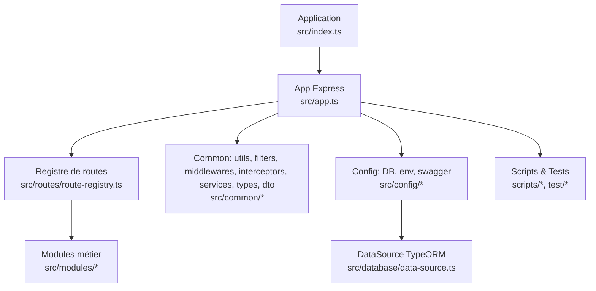
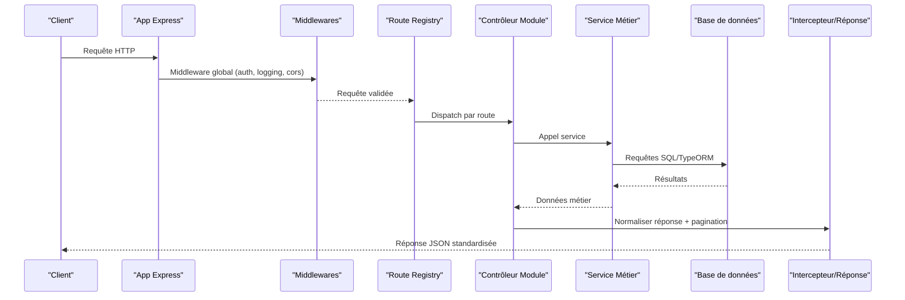
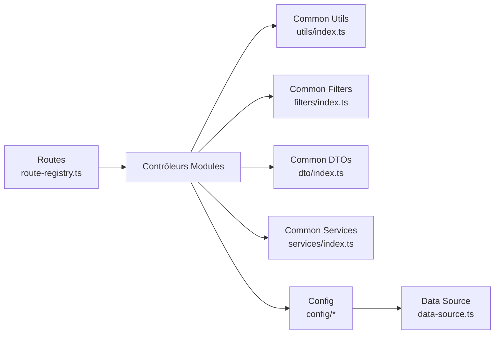

# API Générale et Utilitaires

<cite>
**Fichiers référencés dans ce document**
- [pagination-guide.md](file://backend/docs/pagination-guide.md)
- [pagination-migration-status.ts](file://backend/docs/pagination-migration-status.ts)
- [index.ts](file://backend/src/index.ts)
- [app.ts](file://backend/src/app.ts)
- [route-registry.ts](file://backend/src/routes/route-registry.ts)
- [common/index.ts](file://backend/src/common/index.ts)
- [utils/index.ts](file://backend/src/common/utils/index.ts)
- [filters/index.ts](file://backend/src/common/filters/index.ts)
- [interceptors/index.ts](file://backend/src/common/interceptors/index.ts)
- [middlewares/index.ts](file://backend/src/common/middlewares/index.ts)
- [services/index.ts](file://backend/src/common/services/index.ts)
- [types/index.ts](file://backend/src/common/types/index.ts)
- [dto/index.ts](file://backend/src/common/dto/index.ts)
- [database.config.ts](file://backend/src/config/database.config.ts)
- [env.config.ts](file://backend/src/config/env.config.ts)
- [swagger.config.ts](file://backend/src/config/swagger.config.ts)
- [data-source.ts](file://backend/src/database/data-source.ts)
- [pre-sync-cleanup.ts](file://backend/src/database/pre-sync-cleanup.ts)
- [load-test-pagination.ts](file://backend/scripts/load-test-pagination.ts)
- [verify-pagination.sh](file://backend/scripts/verify-pagination.sh)
- [pagination.util.spec.ts](file://backend/test/unit/pagination.util.spec.ts)
</cite>

## Table des matières
1. [Introduction](#introduction)
2. [Structure du projet](#structure-du-projet)
3. [Composants clés](#composants-clés)
4. [Vue d'ensemble de l'architecture](#vue-densemble-de-larchitecture)
5. [Analyse détaillée des composants](#analyse-detaillee-des-composants)
6. [Analyse des dépendances](#analyse-des-dependances)
7. [Considérations de performance](#considerations-de-performance)
8. [Guide de dépannage](#guide-de-depannage)
9. [Conclusion](#conclusion)
10. [Annexes](#annexes)

## Introduction
Ce document décrit les fonctionnalités générales et utilitaires d’eLISAschool, en se concentrant sur les patterns de pagination, les formats de réponse standardisés, les utilitaires de validation, les filtres communs et les helpers de traitement. Il fournit également les schémas de pagination, les codes d’erreur standardisés, les headers de réponse et les conventions de nommage, avec des exemples d’utilisation transversaux à toutes les APIs.

## Structure du projet
Le backend est organisé par modules et par couches communes (common). Les utilitaires, filtres, middlewares, intercepteurs, services et types sont centralisés dans le dossier common pour être réutilisés par tous les modules. La configuration (base de données, environnement, Swagger) est isolée dans config. Les routes sont enregistrées via un registre centralisé.

**Sources de diagramme**
- [index.ts](file://backend/src/index.ts)
- [app.ts](file://backend/src/app.ts)
- [route-registry.ts](file://backend/src/routes/route-registry.ts)
- [common/index.ts](file://backend/src/common/index.ts)
- [database.config.ts](file://backend/src/config/database.config.ts)
- [data-source.ts](file://backend/src/database/data-source.ts)

**Sources de section**
- [index.ts](file://backend/src/index.ts)
- [app.ts](file://backend/src/app.ts)
- [route-registry.ts](file://backend/src/routes/route-registry.ts)
- [common/index.ts](file://backend/src/common/index.ts)

## Composants clés
- Pagination: schéma standardisé, paramètres de requête, en-têtes de pagination et réponses paginées.
- Réponses standardisées: structure uniforme pour succès, erreurs et métadonnées.
- Validation: DTOs et validateurs partagés.
- Filtres: opérateurs communs (recherche, tri, filtrage par plage, booléens).
- Middlewares et intercepteurs: gestion d’erreurs, logging, traçabilité, sécurité.
- Services utilitaires: fonctions de transformation, formatage, calculs, helpers génériques.
- Types et DTOs: contrats de données partagés entre modules.

**Sources de section**
- [pagination-guide.md](file://backend/docs/pagination-guide.md)
- [pagination-migration-status.ts](file://backend/docs/pagination-migration-status.ts)
- [utils/index.ts](file://backend/src/common/utils/index.ts)
- [filters/index.ts](file://backend/src/common/filters/index.ts)
- [interceptors/index.ts](file://backend/src/common/interceptors/index.ts)
- [middlewares/index.ts](file://backend/src/common/middlewares/index.ts)
- [services/index.ts](file://backend/src/common/services/index.ts)
- [types/index.ts](file://backend/src/common/types/index.ts)
- [dto/index.ts](file://backend/src/common/dto/index.ts)

## Vue d'ensemble de l'architecture
Les requêtes HTTP entrent dans l’application Express, passent par les middlewares globaux, sont acheminées vers les contrôleurs via le registre de routes, puis traitées par les services métier. Les réponses sont normalisées par des intercepteurs ou des wrappers de contrôleur, incluant pagination et métadonnées.

**Sources de diagramme**
- [app.ts](file://backend/src/app.ts)
- [route-registry.ts](file://backend/src/routes/route-registry.ts)
- [middlewares/index.ts](file://backend/src/common/middlewares/index.ts)
- [interceptors/index.ts](file://backend/src/common/interceptors/index.ts)

## Analyse détaillée des composants

### Schéma de pagination
- Paramètres de requête: page, limit, sort, order, search, filtres spécifiques au contexte.
- En-têtes de réponse: X-Total-Count, X-Page, X-Limit, X-Has-Next, X-Has-Prev.
- Corps de réponse: data (tableau), meta (page, limit, total, has_next, has_prev), links (self, next, prev).
- Tri et recherche: support multi-champs, opérateurs de comparaison, recherche textuelle.

Exemple d’utilisation:
- GET /api/v1/eleves?page=1&limit=20&sort=nom&order=asc&search=dupont
- Headers retournés: X-Total-Count: 120, X-Page: 1, X-Limit: 20, X-Has-Next: true, X-Has-Prev: false
- Corps: { data: [...], meta: {...}, links: {...} }

**Sources de section**
- [pagination-guide.md](file://backend/docs/pagination-guide.md)
- [pagination-migration-status.ts](file://backend/docs/pagination-migration-status.ts)
- [load-test-pagination.ts](file://backend/scripts/load-test-pagination.ts)
- [verify-pagination.sh](file://backend/scripts/verify-pagination.sh)
- [pagination.util.spec.ts](file://backend/test/unit/pagination.util.spec.ts)

### Formats de réponse API standardisés
- Succès: { status: "success", data: T, meta?: Meta }
- Erreur: { status: "error", code: string, message: string, details?: any }
- Pagination: { data: T[], meta: Meta, links: Links }
- En-têtes standards: Content-Type: application/json, X-Request-Id, X-Trace-Id, Cache-Control, ETag (quand applicable).

Conventions de nommage:
- Clés en camelCase pour les payloads.
- Codes d’erreur en minuscules avec tirets (ex: not_found, validation_failed).
- Messages lisibles en français, sans détails sensibles.

**Sources de section**
- [dto/index.ts](file://backend/src/common/dto/index.ts)
- [interceptors/index.ts](file://backend/src/common/interceptors/index.ts)
- [swagger.config.ts](file://backend/src/config/swagger.config.ts)

### Utilitaires de validation
- DTOs partagés: définitions de schémas pour les entrées courantes (identifiants, emails, dates, montants).
- Validateurs: vérification stricte des types, plages, formats; retour structuré d’erreurs.
- Intégration: appel avant traitement métier, arrêt immédiat en cas d’échec.

Exemple d’utilisation:
- Valider un payload de création d’élève avant insertion.
- Retourner une erreur 422 avec détails de champs invalides.

**Sources de section**
- [dto/index.ts](file://backend/src/common/dto/index.ts)
- [utils/index.ts](file://backend/src/common/utils/index.ts)

### Filtres communs
- Recherche textuelle: recherche insensible à la casse sur plusieurs colonnes.
- Tri: multi-champs, ordre asc/desc.
- Filtrage par plage: dates, montants, quantités.
- Booléens et enums: statuts, catégories, rôles.
- Pagination intégrée: combinaison avec page/limit/sort.

Exemple d’utilisation:
- GET /api/v1/notes?filter[periode]=S1&sort[matiere]=asc&search=math&limit=10&page=1

**Sources de section**
- [filters/index.ts](file://backend/src/common/filters/index.ts)

### Middlewares et intercepteurs
- Middlewares: authentification, autorisation, logging, rate limiting, validation d’en-têtes.
- Intercepteurs: normalisation de réponse, gestion d’erreurs, ajout de métadonnées, traçabilité.
- Sécurité: CORS, CSRF (si applicable), protection contre injections.

Exemple d’utilisation:
- Appliquer un middleware d’audit sur les routes critiques.
- Intercepter les exceptions non gérées et retourner un format d’erreur standard.

**Sources de section**
- [middlewares/index.ts](file://backend/src/common/middlewares/index.ts)
- [interceptors/index.ts](file://backend/src/common/interceptors/index.ts)

### Helpers de traitement
- Transformateurs: conversion de types, formatage de dates, monnaies, unités.
- Calculs: agrégations simples, ratios, moyennes.
- Utilitaires: manipulation de chaînes, tableaux, objets, hashage, génération d’IDs.

Exemple d’utilisation:
- Formater un montant en FCFA avec séparateur de milliers.
- Convertir une date ISO en format local pour l’affichage.

**Sources de section**
- [utils/index.ts](file://backend/src/common/utils/index.ts)
- [services/index.ts](file://backend/src/common/services/index.ts)

### Configuration et base de données
- Config DB: connexion, pool, retry, timeouts, SSL.
- Config Env: variables d’environnement, chargement sécurisé.
- Config Swagger: documentation OpenAPI, schémas, sécurisation.
- DataSource: initialisation TypeORM, migrations, seeds.

**Sources de section**
- [database.config.ts](file://backend/src/config/database.config.ts)
- [env.config.ts](file://backend/src/config/env.config.ts)
- [swagger.config.ts](file://backend/src/config/swagger.config.ts)
- [data-source.ts](file://backend/src/database/data-source.ts)
- [pre-sync-cleanup.ts](file://backend/src/database/pre-sync-cleanup.ts)

## Analyse des dépendances
Les modules dépendent des utilitaires communs pour la pagination, la validation et les filtres. Le registre de routes centralise les points d’entrée. La configuration est injectée via des modules dédiés.

**Sources de diagramme**
- [route-registry.ts](file://backend/src/routes/route-registry.ts)
- [utils/index.ts](file://backend/src/common/utils/index.ts)
- [filters/index.ts](file://backend/src/common/filters/index.ts)
- [dto/index.ts](file://backend/src/common/dto/index.ts)
- [services/index.ts](file://backend/src/common/services/index.ts)
- [database.config.ts](file://backend/src/config/database.config.ts)
- [data-source.ts](file://backend/src/database/data-source.ts)

**Sources de section**
- [route-registry.ts](file://backend/src/routes/route-registry.ts)
- [common/index.ts](file://backend/src/common/index.ts)

## Considérations de performance
- Pagination: utiliser LIMIT/OFFSET ou cursor-based selon la taille des datasets.
- Indexation: indexer les colonnes fréquemment filtrées/triées.
- Cache: mettre en cache les résultats stables (ETag, Cache-Control).
- Requêtes N+1: éviter via jointures optimisées ou chargements batch.
- Monitoring: tracer les temps de réponse et les erreurs.

[Pas de sources nécessaires car cette section fournit des conseils généraux]

## Guide de dépannage
- Erreurs de pagination: vérifier les paramètres page/limit, les indices de base, et les en-têtes retournés.
- Échecs de validation: inspecter les DTOs et les messages d’erreur structurés.
- Problèmes de filtre: valider les opérateurs et les types de colonnes.
- Logs et traces: activer le logging et les IDs de trace pour suivre les requêtes.

**Sources de section**
- [pagination-guide.md](file://backend/docs/pagination-guide.md)
- [pagination.util.spec.ts](file://backend/test/unit/pagination.util.spec.ts)
- [dto/index.ts](file://backend/src/common/dto/index.ts)
- [filters/index.ts](file://backend/src/common/filters/index.ts)

## Conclusion
Les utilitaires eLISAschool offrent une base cohérente et réutilisable pour construire des APIs robustes, performantes et maintenables. La pagination standardisée, les réponses uniformes, les validations partagées et les filtres communs permettent d’accélérer le développement tout en garantissant la qualité et la fiabilité.

[Pas de sources nécessaires car cette section résume sans analyser de fichiers spécifiques]

## Annexes
- Exemples d’appels API avec pagination et filtres.
- Liste des codes d’erreur standardisés.
- Conventions de nommage et de formatage.
- Checklist de déploiement et de vérification.

[Pas de sources nécessaires car cette section est informative]