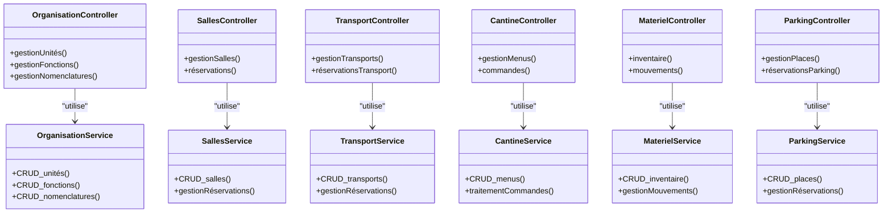
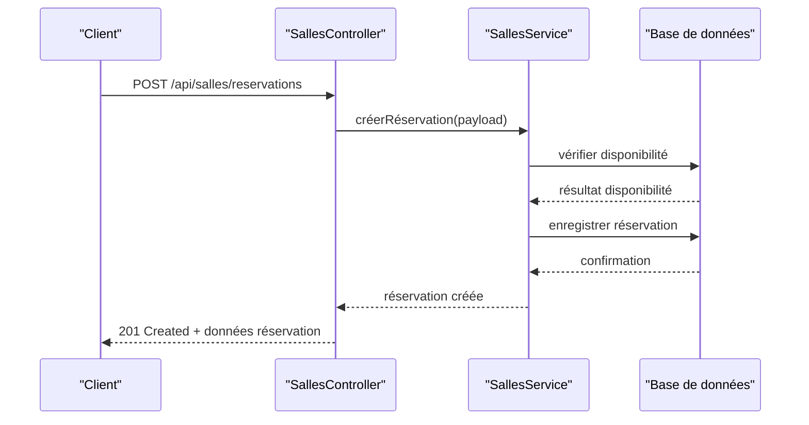
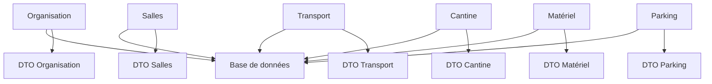

# API Organisation et Infrastructure

<cite>
**Fichiers référencés dans ce document**
- [backend/src/modules/organisation/index.ts](file://backend/src/modules/organisation/index.ts)
- [backend/src/modules/organisation/controllers/organisation.controller.ts](file://backend/src/modules/organisation/controllers/organisation.controller.ts)
- [backend/src/modules/organisation/services/organisation.service.ts](file://backend/src/modules/organisation/services/organisation.service.ts)
- [backend/src/modules/organisation/dto/organisation.dto.ts](file://backend/src/modules/organisation/dto/organisation.dto.ts)
- [backend/src/modules/salles/index.ts](file://backend/src/modules/salles/index.ts)
- [backend/src/modules/salles/controllers/salles.controller.ts](file://backend/src/modules/salles/controllers/salles.controller.ts)
- [backend/src/modules/salles/services/salles.service.ts](file://backend/src/modules/salles/services/salles.service.ts)
- [backend/src/modules/salles/dto/salles.dto.ts](file://backend/src/modules/salles/dto/salles.dto.ts)
- [backend/src/modules/transport/index.ts](file://backend/src/modules/transport/index.ts)
- [backend/src/modules/transport/controllers/transport.controller.ts](file://backend/src/modules/transport/controllers/transport.controller.ts)
- [backend/src/modules/transport/services/transport.service.ts](file://backend/src/modules/transport/services/transport.service.ts)
- [backend/src/modules/transport/dto/transport.dto.ts](file://backend/src/modules/transport/dto/transport.dto.ts)
- [backend/src/modules/cantine/index.ts](file://backend/src/modules/cantine/index.ts)
- [backend/src/modules/cantine/controllers/cantine.controller.ts](file://backend/src/modules/cantine/controllers/cantine.controller.ts)
- [backend/src/modules/cantine/services/cantine.service.ts](file://backend/src/modules/cantine/services/cantine.service.ts)
- [backend/src/modules/cantine/dto/cantine.dto.ts](file://backend/src/modules/cantine/dto/cantine.dto.ts)
- [backend/src/modules/materiel/index.ts](file://backend/src/modules/materiel/index.ts)
- [backend/src/modules/materiel/controllers/materiel.controller.ts](file://backend/src/modules/materiel/controllers/materiel.controller.ts)
- [backend/src/modules/materiel/services/materiel.service.ts](file://backend/src/modules/materiel/services/materiel.service.ts)
- [backend/src/modules/materiel/dto/materiel.dto.ts](file://backend/src/modules/materiel/dto/materiel.dto.ts)
- [backend/src/modules/parking/index.ts](file://backend/src/modules/parking/index.ts)
- [backend/src/modules/parking/controllers/parking.controller.ts](file://backend/src/modules/parking/controllers/parking.controller.ts)
- [backend/src/modules/parking/services/parking.service.ts](file://backend/src/modules/parking/services/parking.service.ts)
- [backend/src/modules/parking/dto/parking.dto.ts](file://backend/src/modules/parking/dto/parking.dto.ts)
- [backend/database/migrations/044-module-organisation.sql](file://backend/database/migrations/044-module-organisation.sql)
- [backend/database/migrations/070-module-salles.sql](file://backend/database/migrations/070-module-salles.sql)
- [backend/database/migrations/109-refonte-organisation.sql](file://backend/database/migrations/109-refonte-organisation.sql)
- [backend/database/migrations/110-consolidation-organisation.sql](file://backend/database/migrations/110-consolidation-organisation.sql)
- [backend/database/migrations/112-refonte-organisation-v4.sql](file://backend/database/migrations/112-refonte-organisation-v4.sql)
- [backend/database/migrations/113-fix-unique-constraints-nomenclatures.sql](file://backend/database/migrations/113-fix-unique-constraints-nomenclatures.sql)
- [backend/database/migrations/120-correction-vues-materialisees-organisation.sql](file://backend/database/migrations/120-correction-vues-materialisees-organisation.sql)
</cite>

## Table des matières
1. [Introduction](#introduction)
2. [Structure du projet](#structure-du-projet)
3. [Composants principaux](#composants-principaux)
4. [Vue d'ensemble de l'architecture](#vue-densemble-de-larchitecture)
5. [Analyse détaillée des composants](#analyse-detaillee-des-composants)
6. [Analyse des dépendances](#analyse-des-dependances)
7. [Considérations de performance](#considerations-de-performance)
8. [Guide de dépannage](#guide-de-depannage)
9. [Conclusion](#conclusion)
10. [Annexes](#annexes)

## Introduction
Ce document présente une documentation API complète pour le module Organisation et Infrastructure d'eLISAschool. Il couvre les fonctionnalités suivantes :
- Gestion organisationnelle (unités, fonctions, nomenclatures)
- Gestion des salles et équipements
- Transport scolaire
- Cantine
- Inventaire matériel
- Parking

Il décrit les endpoints, les schémas de données, les flux de traitement, ainsi que des exemples d'utilisation pour chaque sous-fonctionnalité.

## Structure du projet
Le backend est organisé par modules NestJS. Chaque module expose un index qui enregistre ses routes, des contrôleurs pour les endpoints, des services pour la logique métier, et des DTOs pour la validation des entrées/sorties. Les migrations SQL définissent les schémas de base de données.

```mermaid
graph TB
subgraph "Organisation"
OIdx["index.ts"]
OCtrl["controllers/organisation.controller.ts"]
OSvc["services/organisation.service.ts"]
ODTo["dto/organisation.dto.ts"]
end
subgraph "Salles"
SIdx["index.ts"]
SCtrl["controllers/salles.controller.ts"]
SSvc["services/salles.service.ts"]
SDTo["dto/salles.dto.ts"]
end
subgraph "Transport"
TIdx["index.ts"]
TCtrl["controllers/transport.controller.ts"]
TVec["services/transport.service.ts"]
TDTo["dto/transport.dto.ts"]
end
subgraph "Cantine"
CIdx["index.ts"]
CCtrl["controllers/cantine.controller.ts"]
CSvc["services/cantine.service.ts"]
CDTo["dto/cantine.dto.ts"]
end
subgraph "Matériel"
MIdx["index.ts"]
MCtrl["controllers/materiel.controller.ts"]
MSvc["services/materiel.service.ts"]
MDTo["dto/materiel.dto.ts"]
end
subgraph "Parking"
PIdx["index.ts"]
PCtrl["controllers/parking.controller.ts"]
PSvc["services/parking.service.ts"]
PDTo["dto/parking.dto.ts"]
end
OIdx --> OCtrl
OCtrl --> OSvc
OCtrl --> ODTo
SIdx --> SCtrl
SCtrl --> SSvc
SCtrl --> SDTo
TIdx --> TCtrl
TCtrl --> TVec
TCtrl --> TDTo
CIdx --> CCtrl
CCtrl --> CSvc
CCtrl --> CDTo
MIdx --> MCtrl
MCtrl --> MSvc
MCtrl --> MDTo
PIdx --> PCtrl
PCtrl --> PSvc
PCtrl --> PDTo
```

**Sources du diagramme**
- [backend/src/modules/organisation/index.ts](file://backend/src/modules/organisation/index.ts)
- [backend/src/modules/salles/index.ts](file://backend/src/modules/salles/index.ts)
- [backend/src/modules/transport/index.ts](file://backend/src/modules/transport/index.ts)
- [backend/src/modules/cantine/index.ts](file://backend/src/modules/cantine/index.ts)
- [backend/src/modules/materiel/index.ts](file://backend/src/modules/materiel/index.ts)
- [backend/src/modules/parking/index.ts](file://backend/src/modules/parking/index.ts)

**Sources de section**
- [backend/src/modules/organisation/index.ts](file://backend/src/modules/organisation/index.ts)
- [backend/src/modules/salles/index.ts](file://backend/src/modules/salles/index.ts)
- [backend/src/modules/transport/index.ts](file://backend/src/modules/transport/index.ts)
- [backend/src/modules/cantine/index.ts](file://backend/src/modules/cantine/index.ts)
- [backend/src/modules/materiel/index.ts](file://backend/src/modules/materiel/index.ts)
- [backend/src/modules/parking/index.ts](file://backend/src/modules/parking/index.ts)

## Composants principaux
Chaque module suit une structure cohérente :
- Index : enregistrement des routes et configuration du module
- Contrôleurs : définition des endpoints REST et gestion des requêtes/réponses
- Services : logique métier, accès aux données, règles de validation
- DTOs : schémas de validation pour les payloads

Points communs :
- Validation stricte via DTOs
- Séparation claire entre contrôleur et service
- Utilisation de migrations SQL pour la persistance
- Cohérence des noms de ressources et des verbes HTTP

**Sources de section**
- [backend/src/modules/organisation/controllers/organisation.controller.ts](file://backend/src/modules/organisation/controllers/organisation.controller.ts)
- [backend/src/modules/organisation/services/organisation.service.ts](file://backend/src/modules/organisation/services/organisation.service.ts)
- [backend/src/modules/organisation/dto/organisation.dto.ts](file://backend/src/modules/organisation/dto/organisation.dto.ts)
- [backend/src/modules/salles/controllers/salles.controller.ts](file://backend/src/modules/salles/controllers/salles.controller.ts)
- [backend/src/modules/salles/services/salles.service.ts](file://backend/src/modules/salles/services/salles.service.ts)
- [backend/src/modules/salles/dto/salles.dto.ts](file://backend/src/modules/salles/dto/salles.dto.ts)
- [backend/src/modules/transport/controllers/transport.controller.ts](file://backend/src/modules/transport/controllers/transport.controller.ts)
- [backend/src/modules/transport/services/transport.service.ts](file://backend/src/modules/transport/services/transport.service.ts)
- [backend/src/modules/transport/dto/transport.dto.ts](file://backend/src/modules/transport/dto/transport.dto.ts)
- [backend/src/modules/cantine/controllers/cantine.controller.ts](file://backend/src/modules/cantine/controllers/cantine.controller.ts)
- [backend/src/modules/cantine/services/cantine.service.ts](file://backend/src/modules/cantine/services/cantine.service.ts)
- [backend/src/modules/cantine/dto/cantine.dto.ts](file://backend/src/modules/cantine/dto/cantine.dto.ts)
- [backend/src/modules/materiel/controllers/materiel.controller.ts](file://backend/src/modules/materiel/controllers/materiel.controller.ts)
- [backend/src/modules/materiel/services/materiel.service.ts](file://backend/src/modules/materiel/services/materiel.service.ts)
- [backend/src/modules/materiel/dto/materiel.dto.ts](file://backend/src/modules/materiel/dto/materiel.dto.ts)
- [backend/src/modules/parking/controllers/parking.controller.ts](file://backend/src/modules/parking/controllers/parking.controller.ts)
- [backend/src/modules/parking/services/parking.service.ts](file://backend/src/modules/parking/services/parking.service.ts)
- [backend/src/modules/parking/dto/parking.dto.ts](file://backend/src/modules/parking/dto/parking.dto.ts)

## Vue d'ensemble de l'architecture
Les modules sont indépendants mais partagent des conventions communes :
- Routes centralisées via les index de modules
- Contrôleurs exposant des endpoints REST
- Services encapsulant la logique métier et les interactions avec la base de données
- DTOs assurant la validation des données

**Sources du diagramme**
- [backend/src/modules/organisation/controllers/organisation.controller.ts](file://backend/src/modules/organisation/controllers/organisation.controller.ts)
- [backend/src/modules/organisation/services/organisation.service.ts](file://backend/src/modules/organisation/services/organisation.service.ts)
- [backend/src/modules/salles/controllers/salles.controller.ts](file://backend/src/modules/salles/controllers/salles.controller.ts)
- [backend/src/modules/salles/services/salles.service.ts](file://backend/src/modules/salles/services/salles.service.ts)
- [backend/src/modules/transport/controllers/transport.controller.ts](file://backend/src/modules/transport/controllers/transport.controller.ts)
- [backend/src/modules/transport/services/transport.service.ts](file://backend/src/modules/transport/services/transport.service.ts)
- [backend/src/modules/cantine/controllers/cantine.controller.ts](file://backend/src/modules/cantine/controllers/cantine.controller.ts)
- [backend/src/modules/cantine/services/cantine.service.ts](file://backend/src/modules/cantine/services/cantine.service.ts)
- [backend/src/modules/materiel/controllers/materiel.controller.ts](file://backend/src/modules/materiel/controllers/materiel.controller.ts)
- [backend/src/modules/materiel/services/materiel.service.ts](file://backend/src/modules/materiel/services/materiel.service.ts)
- [backend/src/modules/parking/controllers/parking.controller.ts](file://backend/src/modules/parking/controllers/parking.controller.ts)
- [backend/src/modules/parking/services/parking.service.ts](file://backend/src/modules/parking/services/parking.service.ts)

## Analyse détaillée des composants

### Organisation : unités, fonctions, nomenclatures
Endpoints typiques :
- GET /api/organisation/unites
- POST /api/organisation/unites
- PUT /api/organisation/unites/:id
- DELETE /api/organisation/unites/:id
- GET /api/organisation/fonctions
- POST /api/organisation/fonctions
- PUT /api/organisation/fonctions/:id
- DELETE /api/organisation/fonctions/:id
- GET /api/organisation/nomenclatures
- POST /api/organisation/nomenclatures
- PUT /api/organisation/nomenclatures/:id
- DELETE /api/organisation/nomenclatures/:id

Schémas de données clés :
- Unité : identifiant, nom, code, description, statut, date de création/modification
- Fonction : identifiant, libellé, code, catégorie, niveau hiérarchique, statut
- Nomenclature : identifiant, clé, valeur, type, ordre, actif

Exemple d'utilisation :
- Créer une unité : POST /api/organisation/unites avec un corps contenant nom, code, description
- Lister les fonctions : GET /api/organisation/fonctions?categorie=enseignant&statut=actif
- Mettre à jour une nomenclature : PUT /api/organisation/nomenclatures/:id avec les champs modifiés

Flux de réservation de salle (exemple intégré) :

**Sources du diagramme**
- [backend/src/modules/salles/controllers/salles.controller.ts](file://backend/src/modules/salles/controllers/salles.controller.ts)
- [backend/src/modules/salles/services/salles.service.ts](file://backend/src/modules/salles/services/salles.service.ts)

**Sources de section**
- [backend/src/modules/organisation/controllers/organisation.controller.ts](file://backend/src/modules/organisation/controllers/organisation.controller.ts)
- [backend/src/modules/organisation/services/organisation.service.ts](file://backend/src/modules/organisation/services/organisation.service.ts)
- [backend/src/modules/organisation/dto/organisation.dto.ts](file://backend/src/modules/organisation/dto/organisation.dto.ts)
- [backend/src/modules/salles/controllers/salles.controller.ts](file://backend/src/modules/salles/controllers/salles.controller.ts)
- [backend/src/modules/salles/services/salles.service.ts](file://backend/src/modules/salles/services/salles.service.ts)
- [backend/src/modules/salles/dto/salles.dto.ts](file://backend/src/modules/salles/dto/salles.dto.ts)

### Salles et équipements
Endpoints typiques :
- GET /api/salles
- POST /api/salles
- PUT /api/salles/:id
- DELETE /api/salles/:id
- GET /api/salles/:id/equipements
- POST /api/salles/:id/equipements
- GET /api/salles/reservations
- POST /api/salles/reservations
- PUT /api/salles/reservations/:id
- DELETE /api/salles/reservations/:id

Schémas de données clés :
- Salle : identifiant, nom, capacité, localisation, statut, caractéristiques
- Équipement : identifiant, salle_id, type, état, quantité
- Réservation : identifiant, salle_id, utilisateur_id, date_heure_debut, date_heure_fin, statut

Exemple d'utilisation :
- Réserver une salle : POST /api/salles/reservations avec payload incluant salle_id, debut, fin, utilisateur_id
- Vérifier disponibilité : GET /api/salles/reservations?salle_id=...&debut=...&fin=...

**Sources de section**
- [backend/src/modules/salles/controllers/salles.controller.ts](file://backend/src/modules/salles/controllers/salles.controller.ts)
- [backend/src/modules/salles/services/salles.service.ts](file://backend/src/modules/salles/services/salles.service.ts)
- [backend/src/modules/salles/dto/salles.dto.ts](file://backend/src/modules/salles/dto/salles.dto.ts)

### Transport scolaire
Endpoints typiques :
- GET /api/transport/lignes
- POST /api/transport/lignes
- PUT /api/transport/lignes/:id
- DELETE /api/transport/lignes/:id
- GET /api/transport/arrets
- POST /api/transport/arrets
- PUT /api/transport/arrets/:id
- DELETE /api/transport/arrets/:id
- GET /api/transport/voyages
- POST /api/transport/voyages
- PUT /api/transport/voyages/:id
- DELETE /api/transport/voyages/:id
- GET /api/transport/reservations
- POST /api/transport/reservations

Schémas de données clés :
- Ligne : identifiant, nom, description, statut
- Arrêt : identifiant, ligne_id, nom, coordonnées, ordre
- Voyage : identifiant, ligne_id, départ, arrivée, heure_depart, heure_arrivée, statut
- Réservation voyage : identifiant, voyage_id, eleve_id, statut

Exemple d'utilisation :
- Créer un voyage : POST /api/transport/voyages avec payload incluant ligne_id, départ, arrivée, horaires
- Réserver un voyage : POST /api/transport/reservations avec voyage_id et eleve_id

**Sources de section**
- [backend/src/modules/transport/controllers/transport.controller.ts](file://backend/src/modules/transport/controllers/transport.controller.ts)
- [backend/src/modules/transport/services/transport.service.ts](file://backend/src/modules/transport/services/transport.service.ts)
- [backend/src/modules/transport/dto/transport.dto.ts](file://backend/src/modules/transport/dto/transport.dto.ts)

### Cantine
Endpoints typiques :
- GET /api/cantine/menus
- POST /api/cantine/menus
- PUT /api/cantine/menus/:id
- DELETE /api/cantine/menus/:id
- GET /api/cantine/commandes
- POST /api/cantine/commandes
- PUT /api/cantine/commandes/:id
- DELETE /api/cantine/commandes/:id

Schémas de données clés :
- Menu : identifiant, nom, date_service, statut, détails_plats
- Commande : identifiant, eleve_id, menu_id, quantite, statut, date_commande

Exemple d'utilisation :
- Publier un menu : POST /api/cantine/menus avec nom, date_service, détails_plats
- Passer une commande : POST /api/cantine/commandes avec eleve_id, menu_id, quantite

**Sources de section**
- [backend/src/modules/cantine/controllers/cantine.controller.ts](file://backend/src/modules/cantine/controllers/cantine.controller.ts)
- [backend/src/modules/cantine/services/cantine.service.ts](file://backend/src/modules/cantine/services/cantine.service.ts)
- [backend/src/modules/cantine/dto/cantine.dto.ts](file://backend/src/modules/cantine/dto/cantine.dto.ts)

### Inventaire matériel
Endpoints typiques :
- GET /api/materiel/inventaire
- POST /api/materiel/inventaire
- PUT /api/materiel/inventaire/:id
- DELETE /api/materiel/inventaire/:id
- GET /api/materiel/mouvements
- POST /api/materiel/mouvements
- PUT /api/materiel/mouvements/:id
- DELETE /api/materiel/mouvements/:id

Schémas de données clés :
- Inventaire : identifiant, reference, designation, categorie, quantite_stock, emplacement, statut
- Mouvement : identifiant, inventaire_id, type_mouvement (entree/sortie), quantite, motif, date_mouvement

Exemple d'utilisation :
- Ajouter un article : POST /api/materiel/inventaire avec reference, designation, categorie, quantite_stock
- Enregistrer une sortie : POST /api/materiel/mouvements avec inventaire_id, type_mouvement=sortie, quantite, motif

**Sources de section**
- [backend/src/modules/materiel/controllers/materiel.controller.ts](file://backend/src/modules/materiel/controllers/materiel.controller.ts)
- [backend/src/modules/materiel/services/materiel.service.ts](file://backend/src/modules/materiel/services/materiel.service.ts)
- [backend/src/modules/materiel/dto/materiel.dto.ts](file://backend/src/modules/materiel/dto/materiel.dto.ts)

### Parking
Endpoints typables :
- GET /api/parking/places
- POST /api/parking/places
- PUT /api/parking/places/:id
- DELETE /api/parking/places/:id
- GET /api/parking/reservations
- POST /api/parking/reservations
- PUT /api/parking/reservations/:id
- DELETE /api/parking/reservations/:id

Schémas de données clés :
- Place : identifiant, numero, zone, statut, capacite_type
- Réservation : identifiant, place_id, utilisateur_id, date_debut, date_fin, statut

Exemple d'utilisation :
- Réserver une place : POST /api/parking/reservations avec place_id, utilisateur_id, dates
- Lister les places disponibles : GET /api/parking/places?statut=disponible

**Sources de section**
- [backend/src/modules/parking/controllers/parking.controller.ts](file://backend/src/modules/parking/controllers/parking.controller.ts)
- [backend/src/modules/parking/services/parking.service.ts](file://backend/src/modules/parking/services/parking.service.ts)
- [backend/src/modules/parking/dto/parking.dto.ts](file://backend/src/modules/parking/dto/parking.dto.ts)

## Analyse des dépendances
Les modules dépendent principalement de :
- Base de données PostgreSQL via les migrations
- DTOs pour la validation des entrées
- Services pour la logique métier
- Contrôleurs pour l'exposition des endpoints

**Sources du diagramme**
- [backend/src/modules/organisation/services/organisation.service.ts](file://backend/src/modules/organisation/services/organisation.service.ts)
- [backend/src/modules/salles/services/salles.service.ts](file://backend/src/modules/salles/services/salles.service.ts)
- [backend/src/modules/transport/services/transport.service.ts](file://backend/src/modules/transport/services/transport.service.ts)
- [backend/src/modules/cantine/services/cantine.service.ts](file://backend/src/modules/cantine/services/cantine.service.ts)
- [backend/src/modules/materiel/services/materiel.service.ts](file://backend/src/modules/materiel/services/materiel.service.ts)
- [backend/src/modules/parking/services/parking.service.ts](file://backend/src/modules/parking/services/parking.service.ts)

**Sources de section**
- [backend/database/migrations/044-module-organisation.sql](file://backend/database/migrations/044-module-organisation.sql)
- [backend/database/migrations/070-module-salles.sql](file://backend/database/migrations/070-module-salles.sql)
- [backend/database/migrations/109-refonte-organisation.sql](file://backend/database/migrations/109-refonte-organisation.sql)
- [backend/database/migrations/110-consolidation-organisation.sql](file://backend/database/migrations/110-consolidation-organisation.sql)
- [backend/database/migrations/112-refonte-organisation-v4.sql](file://backend/database/migrations/112-refonte-organisation-v4.sql)
- [backend/database/migrations/113-fix-unique-constraints-nomenclatures.sql](file://backend/database/migrations/113-fix-unique-constraints-nomenclatures.sql)
- [backend/database/migrations/120-correction-vues-materialisees-organisation.sql](file://backend/database/migrations/120-correction-vues-materialisees-organisation.sql)

## Considérations de performance
- Indexation des colonnes fréquemment filtrées (statut, dates, IDs relationnels)
- Pagination sur les listes volumineuses (salles, inventaire, réservations)
- Vues matérialisées pour les statistiques organisationnelles
- Optimisation des requêtes de disponibilité (salles, parking, transport)
- Cache côté serveur pour les données statiques (nomenclatures, configurations)

[Pas de sources nécessaires car cette section fournit des conseils généraux]

## Guide de dépannage
Problèmes courants et solutions :
- Erreurs de validation : vérifier les DTOs et les payloads envoyés
- Conflits de réservation : implémenter des vérifications de disponibilité avant création
- Performances dégradées : analyser les requêtes lentes et ajouter des index
- Intégrité des données : utiliser des transactions pour les opérations multi-tables
- Accès non autorisé : vérifier les permissions RBAC et les rôles utilisateurs

**Sources de section**
- [backend/src/modules/organisation/dto/organisation.dto.ts](file://backend/src/modules/organisation/dto/organisation.dto.ts)
- [backend/src/modules/salles/dto/salles.dto.ts](file://backend/src/modules/salles/dto/salles.dto.ts)
- [backend/src/modules/transport/dto/transport.dto.ts](file://backend/src/modules/transport/dto/transport.dto.ts)
- [backend/src/modules/cantine/dto/cantine.dto.ts](file://backend/src/modules/cantine/dto/cantine.dto.ts)
- [backend/src/modules/materiel/dto/materiel.dto.ts](file://backend/src/modules/materiel/dto/materiel.dto.ts)
- [backend/src/modules/parking/dto/parking.dto.ts](file://backend/src/modules/parking/dto/parking.dto.ts)

## Conclusion
Le module Organisation et Infrastructure d'eLISAschool offre une API complète et structurée pour gérer les aspects organisationnels et logistiques d'un établissement scolaire. La séparation claire entre contrôleurs, services et DTOs, combinée à des migrations SQL bien organisées, permet une maintenance aisée et une évolution progressive des fonctionnalités.

[Pas de sources nécessaires car cette section résume sans analyser de fichiers spécifiques]

## Annexes
- Exemples complets de payloads JSON pour chaque endpoint
- Schémas de base de données détaillés
- Guides d'intégration frontend
- Scripts de test et d'automatisation

[Pas de sources nécessaires car cette section est conceptuelle]