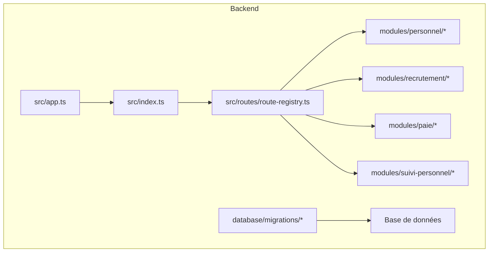
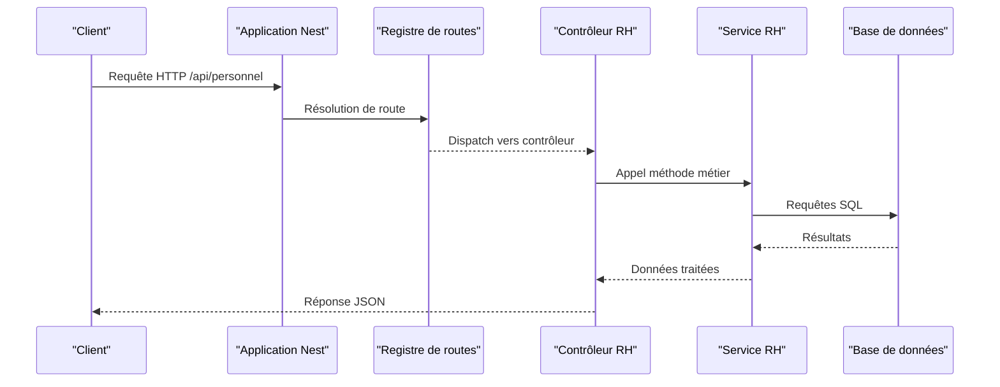
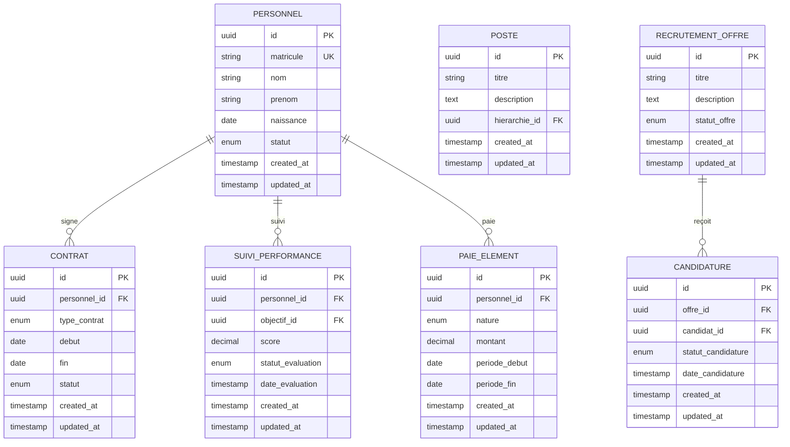
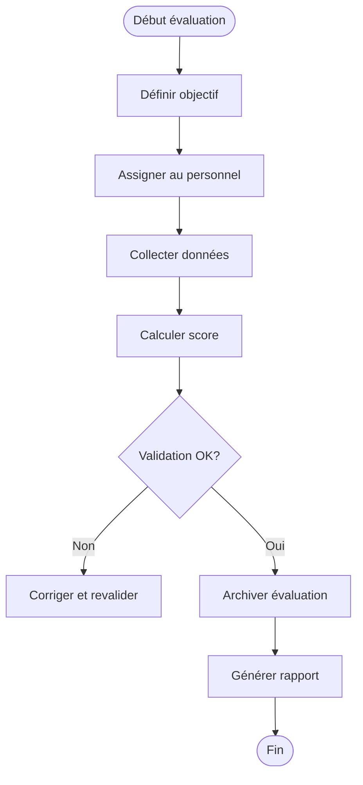
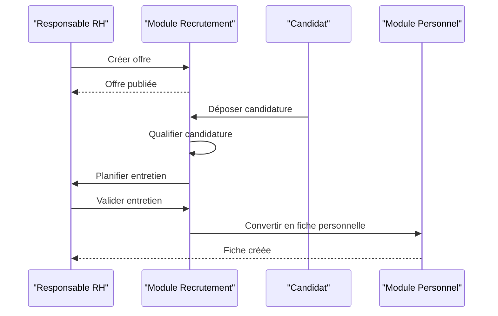
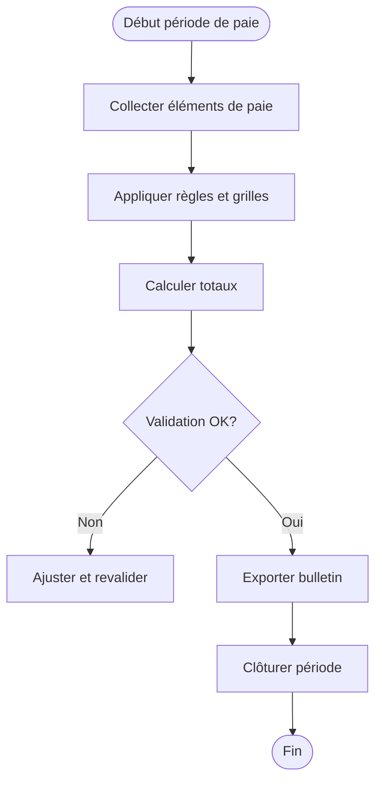
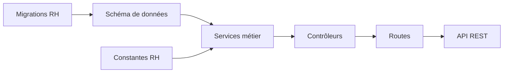

# API Ressources Humaines

<cite>
**Fichiers référencés dans ce document**
- [016-module-personnel-rh-phase1.sql](file://backend/database/migrations/016-module-personnel-rh-phase1.sql)
- [017-module-personnel-rh-phase2.sql](file://backend/database/migrations/017-module-personnel-rh-phase2.sql)
- [018-module-personnel-rh-phase3.sql](file://backend/database/migrations/018-module-personnel-rh-phase3.sql)
- [019-module-personnel-rh-phase4.sql](file://backend/database/migrations/019-module-personnel-rh-phase4.sql)
- [020-module-personnel-rh-phase5.sql](file://backend/database/migrations/020-module-personnel-rh-phase5.sql)
- [021-module-personnel-rh-permissions-attribution.sql](file://backend/database/migrations/021-module-personnel-rh-permissions-attribution.sql)
- [022-module-personnel-rh-complete.sql](file://backend/database/migrations/022-module-personnel-rh-complete.sql)
- [029-paie-etendue.sql](file://backend/database/migrations/029-paie-etendue.sql)
- [045-module-recrutement.sql](file://backend/database/migrations/045-module-recrutement.sql)
- [031-suivi-personnel.sql](file://backend/database/migrations/031-suivi-personnel.sql)
- [039-scoring-personnel.ts](file://backend/database/migrations/039-scoring-personnel.ts)
- [personnel.constants.ts](file://backend/src/shared/constants/personnel.constants.ts)
- [route-registry.ts](file://backend/src/routes/route-registry.ts)
- [app.ts](file://backend/src/app.ts)
- [index.ts](file://backend/src/index.ts)
</cite>

## Table des matières
1. [Introduction](#introduction)
2. [Structure du projet](#structure-du-projet)
3. [Composants clés](#composants-clés)
4. [Vue d'ensemble de l'architecture](#vue-densemble-de-larchitecture)
5. [Analyse détaillée des composants](#analyse-detaillee-des-composants)
6. [Analyse des dépendances](#analyse-des-dependances)
7. [Considérations de performance](#considerations-de-performance)
8. [Guide de dépannage](#guide-de-depannage)
9. [Conclusion](#conclusion)
10. [Annexes](#annexes)

## Introduction
Ce document présente une documentation API complète pour le module de ressources humaines d’eLISAschool, couvrant la gestion du personnel (fiches, contrats, postes), le suivi des performances, le recrutement et l’intégration avec le système de paie. Il inclut les schémas de données RH, les workflows de gestion de carrière, les évaluations de performance et les processus de recrutement, ainsi que des exemples illustrant le cycle de vie complet du personnel.

## Structure du projet
Le backend est organisé en modules NestJS par domaine. Les migrations SQL définissent le schéma de données RH, tandis que les routes sont enregistrées via un registre central. L’application s’initialise dans les points d’entrée principaux.

**Sources du diagramme**
- [app.ts](file://backend/src/app.ts)
- [index.ts](file://backend/src/index.ts)
- [route-registry.ts](file://backend/src/routes/route-registry.ts)

**Sources de section**
- [route-registry.ts](file://backend/src/routes/route-registry.ts)
- [app.ts](file://backend/src/app.ts)
- [index.ts](file://backend/src/index.ts)

## Composants clés
- Gestion du personnel: fiches, contrats, postes, hiérarchie, affectations, types de contrat.
- Suivi des performances: objectifs, évaluations, scoring, indicateurs.
- Recrutement: offres, candidatures, entretiens, embauches.
- Paie: éléments de paie, grilles, périodes, intégration avec le personnel.

**Sources de section**
- [016-module-personnel-rh-phase1.sql](file://backend/database/migrations/016-module-personnel-rh-phase1.sql)
- [017-module-personnel-rh-phase2.sql](file://backend/database/migrations/017-module-personnel-rh-phase2.sql)
- [018-module-personnel-rh-phase3.sql](file://backend/database/migrations/018-module-personnel-rh-phase3.sql)
- [019-module-personnel-rh-phase4.sql](file://backend/database/migrations/019-module-personnel-rh-phase4.sql)
- [020-module-personnel-rh-phase5.sql](file://backend/database/migrations/020-module-personnel-rh-phase5.sql)
- [029-paie-etendue.sql](file://backend/database/migrations/029-paie-etendue.sql)
- [045-module-recrutement.sql](file://backend/database/migrations/045-module-recrutement.sql)
- [031-suivi-personnel.sql](file://backend/database/migrations/031-suivi-personnel.sql)
- [039-scoring-personnel.ts](file://backend/database/migrations/039-scoring-personnel.ts)
- [personnel.constants.ts](file://backend/src/shared/constants/personnel.constants.ts)

## Vue d'ensemble de l'architecture
L’API expose des endpoints REST organisés par fonctionnalité. Le registre de routes centralise les chemins et les contrôleurs associés. Les migrations garantissent la cohérence du schéma de données entre les environnements.

**Sources du diagramme**
- [app.ts](file://backend/src/app.ts)
- [index.ts](file://backend/src/index.ts)
- [route-registry.ts](file://backend/src/routes/route-registry.ts)

## Analyse détaillée des composants

### Schémas de données RH
Les tables principales incluent:
- Personnels: fiches individuelles, identifiants, statuts.
- Contrats: types, dates, affectations, hiérarchies.
- Postes: rôles, responsabilités, rattachements organisationnels.
- Suivi: objectifs, évaluations, scoring, indicateurs.
- Recrutement: offres, candidatures, entretiens, embauches.
- Paie: éléments, grilles, périodes, liens au personnel.

**Sources du diagramme**
- [016-module-personnel-rh-phase1.sql](file://backend/database/migrations/016-module-personnel-rh-phase1.sql)
- [017-module-personnel-rh-phase2.sql](file://backend/database/migrations/017-module-personnel-rh-phase2.sql)
- [018-module-personnel-rh-phase3.sql](file://backend/database/migrations/018-module-personnel-rh-phase3.sql)
- [019-module-personnel-rh-phase4.sql](file://backend/database/migrations/019-module-personnel-rh-phase4.sql)
- [020-module-personnel-rh-phase5.sql](file://backend/database/migrations/020-module-personnel-rh-phase5.sql)
- [029-paie-etendue.sql](file://backend/database/migrations/029-paie-etendue.sql)
- [045-module-recrutement.sql](file://backend/database/migrations/045-module-recrutement.sql)
- [031-suivi-personnel.sql](file://backend/database/migrations/031-suivi-personnel.sql)

**Sources de section**
- [016-module-personnel-rh-phase1.sql](file://backend/database/migrations/016-module-personnel-rh-phase1.sql)
- [017-module-personnel-rh-phase2.sql](file://backend/database/migrations/017-module-personnel-rh-phase2.sql)
- [018-module-personnel-rh-phase3.sql](file://backend/database/migrations/018-module-personnel-rh-phase3.sql)
- [019-module-personnel-rh-phase4.sql](file://backend/database/migrations/019-module-personnel-rh-phase4.sql)
- [020-module-personnel-rh-phase5.sql](file://backend/database/migrations/020-module-personnel-rh-phase5.sql)
- [029-paie-etendue.sql](file://backend/database/migrations/029-paie-etendue.sql)
- [045-module-recrutement.sql](file://backend/database/migrations/045-module-recrutement.sql)
- [031-suivi-personnel.sql](file://backend/database/migrations/031-suivi-personnel.sql)

### Endpoints de gestion du personnel
- Fiches personnelles: création, lecture, mise à jour, suppression, recherche.
- Contrats: signature, renouvellement, résiliation, historique.
- Postes: définition, hiérarchie, affectation, évolution.
- Permissions: attribution et vérification des accès RH.

Exemples de flux:
- Création d’une fiche: validation → persistance → indexation → réponse.
- Mise à jour d’un contrat: vérification de chevauchement → validation → mise à jour → audit.

**Sources de section**
- [021-module-personnel-rh-permissions-attribution.sql](file://backend/database/migrations/021-module-personnel-rh-permissions-attribution.sql)
- [022-module-personnel-rh-complete.sql](file://backend/database/migrations/022-module-personnel-rh-complete.sql)
- [personnel.constants.ts](file://backend/src/shared/constants/personnel.constants.ts)

### Endpoints de suivi des performances
- Objectifs: définition, assignation, suivi.
- Évaluations: saisie des scores, validation, archivage.
- Scoring: calcul agrégé, indicateurs, rapports.

Workflow d’évaluation:

**Sources du diagramme**
- [031-suivi-personnel.sql](file://backend/database/migrations/031-suivi-personnel.sql)
- [039-scoring-personnel.ts](file://backend/database/migrations/039-scoring-personnel.ts)

**Sources de section**
- [031-suivi-personnel.sql](file://backend/database/migrations/031-suivi-personnel.sql)
- [039-scoring-personnel.ts](file://backend/database/migrations/039-scoring-personnel.ts)

### Endpoints de recrutement
- Offres: publication, modification, clôture.
- Candidatures: dépôt, qualification, entretien.
- Embauches: conversion en personnel, onboarding.

Séquence de recrutement:

**Sources du diagramme**
- [045-module-recrutement.sql](file://backend/database/migrations/045-module-recrutement.sql)

**Sources de section**
- [045-module-recrutement.sql](file://backend/database/migrations/045-module-recrutement.sql)

### Intégration avec le système de paie
- Éléments de paie: salaires, primes, retenues.
- Grilles: échelles, coefficients, évolutions.
- Périodes: mensualisation, clôtures, export.

Flux de paie mensuelle:

**Sources du diagramme**
- [029-paie-etendue.sql](file://backend/database/migrations/029-paie-etendue.sql)

**Sources de section**
- [029-paie-etendue.sql](file://backend/database/migrations/029-paie-etendue.sql)

### Workflows de gestion de carrière
- Promotion: évaluation → validation → mise à jour poste → contrat.
- Mutation: demande → approbation → affectation → mise à jour.
- Départ: préavis → liquidation → archivage.

**Sources de section**
- [016-module-personnel-rh-phase1.sql](file://backend/database/migrations/016-module-personnel-rh-phase1.sql)
- [017-module-personnel-rh-phase2.sql](file://backend/database/migrations/017-module-personnel-rh-phase2.sql)
- [018-module-personnel-rh-phase3.sql](file://backend/database/migrations/018-module-personnel-rh-phase3.sql)
- [019-module-personnel-rh-phase4.sql](file://backend/database/migrations/019-module-personnel-rh-phase4.sql)
- [020-module-personnel-rh-phase5.sql](file://backend/database/migrations/020-module-personnel-rh-phase5.sql)

### Exemples de cycle de vie du personnel
- Embauche: recrutement → création fiche → contrat initial → intégration paie.
- Évolution: évaluation positive → promotion → ajustement salaire.
- Fin de contrat: résiliation → liquidation → archivage.

**Sources de section**
- [045-module-recrutement.sql](file://backend/database/migrations/045-module-recrutement.sql)
- [029-paie-etendue.sql](file://backend/database/migrations/029-paie-etendue.sql)
- [016-module-personnel-rh-phase1.sql](file://backend/database/migrations/016-module-personnel-rh-phase1.sql)

## Analyse des dépendances
Les modules RH dépendent des migrations pour le schéma, du registre de routes pour l’exposition API, et des constantes partagées pour les valeurs énumérées.

**Sources du diagramme**
- [016-module-personnel-rh-phase1.sql](file://backend/database/migrations/016-module-personnel-rh-phase1.sql)
- [022-module-personnel-rh-complete.sql](file://backend/database/migrations/022-module-personnel-rh-complete.sql)
- [personnel.constants.ts](file://backend/src/shared/constants/personnel.constants.ts)
- [route-registry.ts](file://backend/src/routes/route-registry.ts)

**Sources de section**
- [route-registry.ts](file://backend/src/routes/route-registry.ts)
- [personnel.constants.ts](file://backend/src/shared/constants/personnel.constants.ts)

## Considérations de performance
- Indexation: optimiser les requêtes fréquentes sur matricule, statut, dates.
- Pagination: implémenter pagination côté serveur pour listes volumineuses.
- Cache: mettre en cache les nomenclatures et configurations RH.
- Transactions: utiliser des transactions pour les opérations critiques (contrats, paie).

[Pas de sources nécessaires car cette section fournit des conseils généraux]

## Guide de dépannage
- Erreurs de validation: vérifier les contraintes et messages d’erreur retournés.
- Problèmes de permissions: examiner les attributions et les rôles.
- Incohérences de données: auditer les relations et les clés étrangères.
- Performances lentes: analyser les plans d’exécution et ajouter des index si nécessaire.

**Sources de section**
- [021-module-personnel-rh-permissions-attribution.sql](file://backend/database/migrations/021-module-personnel-rh-permissions-attribution.sql)
- [022-module-personnel-rh-complete.sql](file://backend/database/migrations/022-module-personnel-rh-complete.sql)

## Conclusion
L’API RH d’eLISAschool offre une gestion complète du personnel, du recrutement à la paie, en passant par le suivi des performances. La structure modulaire et les migrations garantissent évolutivité et cohérence. Pour une intégration réussie, respecter les schémas de données, les workflows validés et les bonnes pratiques de performance.

[Pas de sources nécessaires car cette section résume sans analyser de fichiers spécifiques]

## Annexes
- Glossaire: termes RH utilisés dans l’API.
- Matrice des permissions: rôles et accès associés aux endpoints.
- Exemples de payloads: formats de requêtes et réponses attendus.

[Pas de sources nécessaires car cette section est informative]