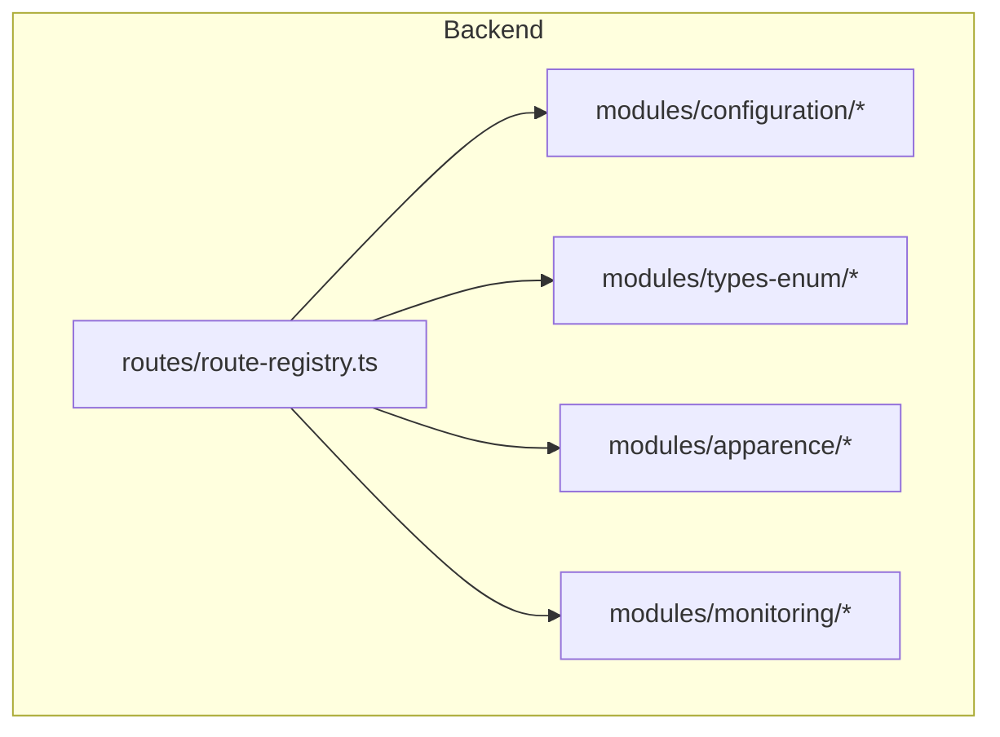
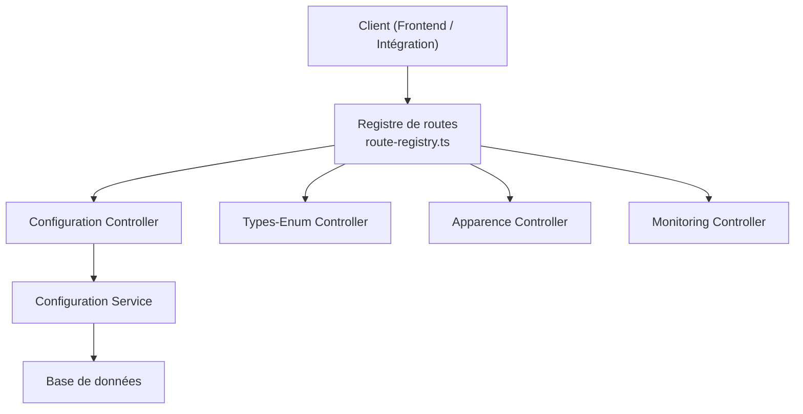
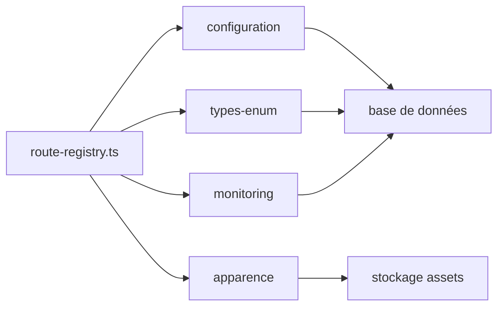

# API Système et Configuration

<cite>
**Fichiers référencés dans ce document**
- [backend/src/modules/configuration/index.ts](file://backend/src/modules/configuration/index.ts)
- [backend/src/modules/configuration/controllers/config.controller.ts](file://backend/src/modules/configuration/controllers/config.controller.ts)
- [backend/src/modules/configuration/services/config.service.ts](file://backend/src/modules/configuration/services/config.service.ts)
- [backend/src/modules/types-enum/index.ts](file://backend/src/modules/types-enum/index.ts)
- [backend/src/modules/types-enum/controllers/types-enum.controller.ts](file://backend/src/modules/types-enum/controllers/types-enum.controller.ts)
- [backend/src/modules/apparence/index.ts](file://backend/src/modules/apparence/index.ts)
- [backend/src/modules/apparence/controllers/apparence.controller.ts](file://backend/src/modules/apparence/controllers/apparence.controller.ts)
- [backend/src/modules/monitoring/index.ts](file://backend/src/modules/monitoring/index.ts)
- [backend/src/modules/monitoring/controllers/monitoring.controller.ts](file://backend/src/modules/monitoring/controllers/monitoring.controller.ts)
- [backend/src/routes/route-registry.ts](file://backend/src/routes/route-registry.ts)
- [backend/src/config/swagger.config.ts](file://backend/src/config/swagger.config.ts)
- [backend/database/migrations/099-add-monitoring-params.sql](file://backend/database/migrations/099-add-monitoring-params.sql)
- [backend/database/migrations/081-module-apparence-fonds.sql](file://backend/database/migrations/081-module-apparence-fonds.sql)
- [backend/database/migrations/036-module-types-enum.sql](file://backend/database/migrations/036-module-types-enum.sql)
</cite>

## Table des matières
1. [Introduction](#introduction)
2. [Structure du projet](#structure-du-projet)
3. [Composants principaux](#composants-principaux)
4. [Vue d'ensemble de l'architecture](#vue-densemble-de-larchitecture)
5. [Analyse détaillée des composants](#analyse-detaillee-des-composants)
6. [Analyse des dépendances](#analyse-des-dependances)
7. [Considérations de performance](#considerations-de-performance)
8. [Guide de dépannage](#guide-de-depannage)
9. [Conclusion](#conclusion)
10. [Annexes](#annexes)

## Introduction
Ce document présente une documentation API complète pour les APIs système et configuration d'eLISAschool. Il couvre la configuration globale, la gestion des types énumérés, l'apparence et le branding, le monitoring et les métriques, ainsi que les outils système. Vous y trouverez les schémas de configuration, les paramètres système, les hooks de personnalisation et les points d'extension, accompagnés d'exemples concrets de configuration et de personnalisation avancée.

## Structure du projet
Le backend est organisé en modules NestJS par fonctionnalité. Les modules pertinents pour cette documentation sont :
- configuration : gestion des paramètres globaux et préférences
- types-enum : exposition et gestion des types énumérés
- apparence : thème, couleurs, logos et fonds d'écran
- monitoring : métriques, santé et diagnostics
- routes : registre central des routes qui expose les endpoints

**Sources de diagramme**
- [backend/src/routes/route-registry.ts](file://backend/src/routes/route-registry.ts)

**Sources de section**
- [backend/src/routes/route-registry.ts](file://backend/src/routes/route-registry.ts)

## Composants principaux
- Configuration globale : lecture/écriture de paramètres système et préférences avec validation et persistance.
- Types énumérés : catalogue et versionnement des enums utilisés par le système.
- Apparence et branding : gestion des thèmes, couleurs, logos et fonds d'écran.
- Monitoring et métriques : indicateurs de santé, métriques applicatives et paramétrage.
- Outils système : utilitaires d’administration (diagnostics, maintenance).

**Sources de section**
- [backend/src/modules/configuration/index.ts](file://backend/src/modules/configuration/index.ts)
- [backend/src/modules/types-enum/index.ts](file://backend/src/modules/types-enum/index.ts)
- [backend/src/modules/apparence/index.ts](file://backend/src/modules/apparence/index.ts)
- [backend/src/modules/monitoring/index.ts](file://backend/src/modules/monitoring/index.ts)

## Vue d'ensemble de l'architecture
Les contrôleurs exposent les endpoints REST, les services implémentent la logique métier et la persistance, et le registre de routes assemble les modules. Swagger est configuré pour la documentation interactive.

**Sources de diagramme**
- [backend/src/routes/route-registry.ts](file://backend/src/routes/route-registry.ts)
- [backend/src/modules/configuration/controllers/config.controller.ts](file://backend/src/modules/configuration/controllers/config.controller.ts)
- [backend/src/modules/configuration/services/config.service.ts](file://backend/src/modules/configuration/services/config.service.ts)

## Analyse détaillée des composants

### Configuration globale
Endpoints typiques :
- GET /api/system/config : liste des paramètres système
- GET /api/system/config/:key : valeur d’une clé spécifique
- PUT /api/system/config : mise à jour groupée de paramètres
- POST /api/system/config : ajout/modification d’une clé
- DELETE /api/system/config/:key : suppression d’une clé

Schéma de configuration :
- Clé : chaîne identifiant unique du paramètre
- Valeur : type flexible (chaîne, nombre, booléen, objet JSON)
- Métadonnées : description, catégorie, version, permissions

Validation et sécurité :
- Validation stricte des clés autorisées
- Vérification des permissions administrateur
- Journalisation des modifications sensibles

Hooks et extensions :
- Hook post-update : déclencheurs après modification de paramètres
- Hook validate : validation personnalisée avant écriture
- Point d’extension pour plugins de configuration

Exemple de configuration avancée :
- Activer/désactiver des modules
- Personnaliser les règles de workflow
- Configurer les fournisseurs de notification

**Sources de section**
- [backend/src/modules/configuration/controllers/config.controller.ts](file://backend/src/modules/configuration/controllers/config.controller.ts)
- [backend/src/modules/configuration/services/config.service.ts](file://backend/src/modules/configuration/services/config.service.ts)

### Gestion des types énumérés
Endpoints typiques :
- GET /api/system/enums : catalogue des enums
- GET /api/system/enums/:name : détails d’un enum
- PUT /api/system/enums/:name : mise à jour des valeurs
- POST /api/system/enums : ajout d’un nouvel enum

Schéma des enums :
- Nom : identifiant de l’enum
- Valeurs : liste de chaînes ou objets structurés
- Version : version de définition
- Permissions : accès restreints si nécessaire

Versionnement et cohérence :
- Migration automatique des références
- Dépréciation progressive des anciennes valeurs
- Validation croisée entre modules

Exemple d’usage :
- Ajouter un statut personnalisé pour les contrats
- Étoffer les catégories de personnel

**Sources de section**
- [backend/src/modules/types-enum/controllers/types-enum.controller.ts](file://backend/src/modules/types-enum/controllers/types-enum.controller.ts)
- [backend/database/migrations/036-module-types-enum.sql](file://backend/database/migrations/036-module-types-enum.sql)

### Apparence et branding
Endpoints typiques :
- GET /api/system/appearance : thème courant et palette
- PUT /api/system/appearance : mise à jour du thème
- GET /api/system/appearance/logos : liste des logos
- POST /api/system/appearance/logos : upload d’un logo
- GET /api/system/appearance/fonds : catalogues de fonds
- PUT /api/system/appearance/fonds : sélection d’un fond

Schéma d’apparence :
- Thème : clair/sombre, accents, typographie
- Couleurs : primaires, secondaires, contrastes
- Logos : versions web/print, formats supportés
- Fonds : URL, rotation, filtres

Persistance et migration :
- Stockage des assets via base de données ou stockage externe
- Migration des anciens paramètres d’établissement vers le nouveau modèle

Exemple de personnalisation :
- Appliquer un thème institutionnel
- Définir un fond dynamique par période scolaire

**Sources de section**
- [backend/src/modules/apparence/controllers/apparence.controller.ts](file://backend/src/modules/apparence/controllers/apparence.controller.ts)
- [backend/database/migrations/081-module-apparence-fonds.sql](file://backend/database/migrations/081-module-apparence-fonds.sql)

### Monitoring et métriques
Endpoints typiques :
- GET /api/system/health : état de santé
- GET /api/system/metrics : métriques applicatives
- GET /api/system/metrics/:scope : métriques ciblées
- PUT /api/system/monitoring/config : configuration des sondes

Schéma des métriques :
- Latence, taux d’erreur, files d’attente
- Métriques de base de données et cache
- Indicateurs de modules actifs

Paramètres de monitoring :
- Intervalles de collecte
- Seuils d’alerte
- Persistance des historiques

**Sources de section**
- [backend/src/modules/monitoring/controllers/monitoring.controller.ts](file://backend/src/modules/monitoring/controllers/monitoring.controller.ts)
- [backend/database/migrations/099-add-monitoring-params.sql](file://backend/database/migrations/099-add-monitoring-params.sql)

### Outils système
Fonctionnalités :
- Diagnostic de configuration
- Nettoyage de caches
- Export/Import de configurations
- Réinitialisation contrôlée de paramètres

Sécurité :
- Accès réservé aux administrateurs
- Audit des actions critiques
- Confirmation obligatoire pour les opérations destructives

**Sources de section**
- [backend/src/modules/configuration/controllers/config.controller.ts](file://backend/src/modules/configuration/controllers/config.controller.ts)

## Analyse des dépendances
Les modules s’articulent autour du registre de routes et partagent des services communs. La configuration influence le comportement des autres modules. Le monitoring observe l’état global.

**Sources de diagramme**
- [backend/src/routes/route-registry.ts](file://backend/src/routes/route-registry.ts)

**Sources de section**
- [backend/src/routes/route-registry.ts](file://backend/src/routes/route-registry.ts)

## Considérations de performance
- Cache des paramètres fréquemment lus
- Pagination et filtrage pour les listes volumineuses
- Limitation de taille pour les uploads d’assets
- Agrégation asynchrone des métriques
- Indexation des clés de configuration

[Pas de sources nécessaires car cette section fournit des conseils généraux]

## Guide de dépannage
Problèmes courants :
- Erreur 403 sur les endpoints système : vérifier les permissions
- Erreur 422 lors de la mise à jour de config : valider le schéma
- Timeout sur les métriques : ajuster les intervalles
- Assets non chargés : vérifier les chemins et permissions

Diagnostics :
- Utiliser /api/system/health pour vérifier l’état
- Consulter les logs d’audit pour les modifications
- Exécuter les scripts de vérification intégrés

**Sources de section**
- [backend/src/modules/monitoring/controllers/monitoring.controller.ts](file://backend/src/modules/monitoring/controllers/monitoring.controller.ts)

## Conclusion
Les APIs système et configuration d’eLISAschool offrent un socle robuste pour gérer les paramètres, l’apparence, les types énumérés et le monitoring. Leur architecture modulaire et leurs hooks permettent une extensibilité forte tout en garantissant la cohérence et la sécurité.

[Pas de sources nécessaires car cette section résume sans analyser de fichiers spécifiques]

## Annexes

### Schémas de configuration
- Paramètres globaux : clés, valeurs, métadonnées, permissions
- Préférences utilisateur : scope, héritage, fusion
- Hooks de personnalisation : validation, post-update, extension

**Sources de section**
- [backend/src/modules/configuration/services/config.service.ts](file://backend/src/modules/configuration/services/config.service.ts)

### Points d’extension
- Plugins de configuration : validation et transformation
- Providers de stockage : assets et médias
- Sondes de monitoring : métriques personnalisées

**Sources de section**
- [backend/src/modules/apparence/controllers/apparence.controller.ts](file://backend/src/modules/apparence/controllers/apparence.controller.ts)
- [backend/src/modules/monitoring/controllers/monitoring.controller.ts](file://backend/src/modules/monitoring/controllers/monitoring.controller.ts)

### Exemples de configuration et personnalisation avancée
- Activation conditionnelle de modules
- Définition de workflows personnalisés
- Application de thèmes dynamiques
- Configuration multi-tenant des paramètres

**Sources de section**
- [backend/src/modules/configuration/controllers/config.controller.ts](file://backend/src/modules/configuration/controllers/config.controller.ts)
- [backend/src/config/swagger.config.ts](file://backend/src/config/swagger.config.ts)