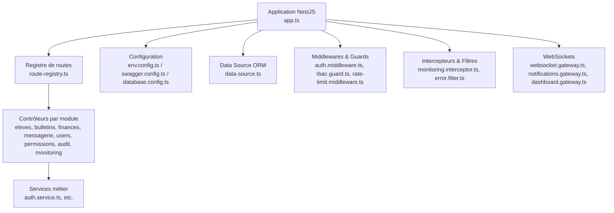
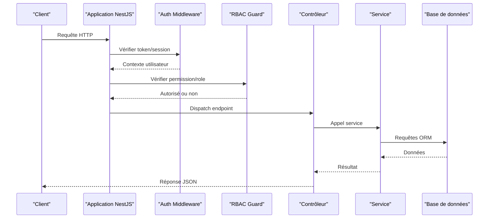
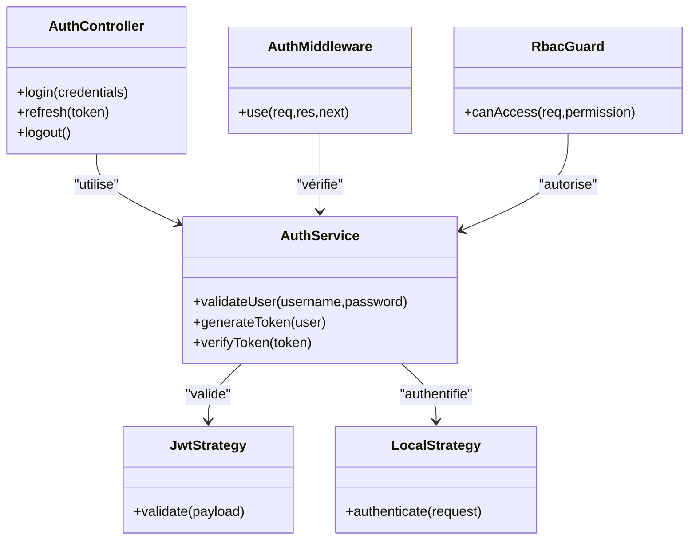
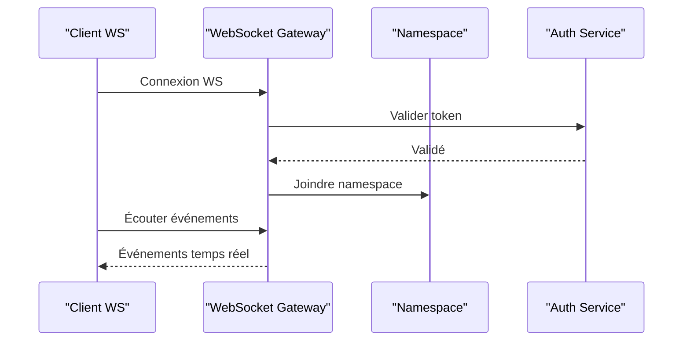
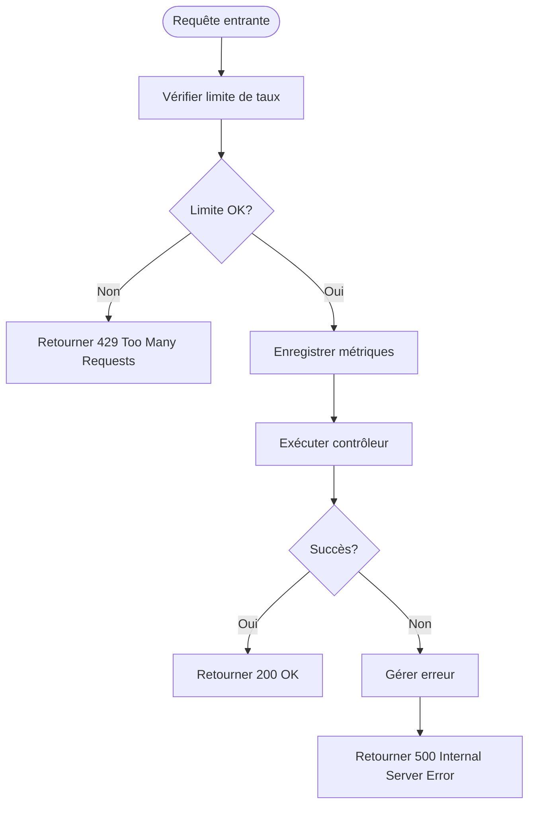
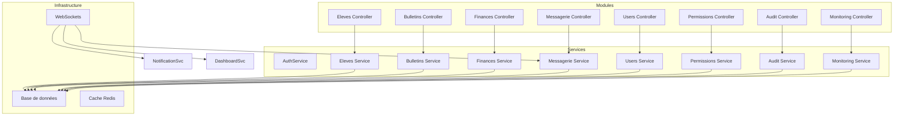

# Référence API

<cite>
**Fichiers référencés dans ce document**
- [app.ts](file://backend/src/app.ts)
- [index.ts](file://backend/src/index.ts)
- [route-registry.ts](file://backend/src/routes/route-registry.ts)
- [swagger.config.ts](file://backend/src/config/swagger.config.ts)
- [env.config.ts](file://backend/src/config/env.config.ts)
- [database.config.ts](file://backend/src/config/database.config.ts)
- [data-source.ts](file://backend/src/data-source.ts)
- [auth.controller.ts](file://backend/src/modules/auth/controllers/auth.controller.ts)
- [auth.service.ts](file://backend/src/modules/auth/services/auth.service.ts)
- [jwt.strategy.ts](file://backend/src/modules/auth/strategies/jwt.strategy.ts)
- [local.strategy.ts](file://backend/src/modules/auth/strategies/local.strategy.ts)
- [auth.middleware.ts](file://backend/src/modules/auth/middlewares/auth.middleware.ts)
- [rbac.guard.ts](file://backend/src/modules/rbac/guards/rbac.guard.ts)
- [monitoring.interceptor.ts](file://backend/src/common/interceptors/monitoring.interceptor.ts)
- [rate-limit.middleware.ts](file://backend/src/common/middlewares/rate-limit.middleware.ts)
- [error.filter.ts](file://backend/src/common/filters/error.filter.ts)
- [pagination.util.ts](file://backend/src/common/utils/pagination.util.ts)
- [websocket.gateway.ts](file://backend/src/modules/messagerie/websocket.gateway.ts)
- [websocket.adapter.ts](file://backend/src/common/adapters/websocket.adapter.ts)
- [notifications.gateway.ts](file://backend/src/modules/notifications/websocket.gateway.ts)
- [dashboard.gateway.ts](file://backend/src/modules/dashboard/websocket.gateway.ts)
- [eleves.controller.ts](file://backend/src/modules/eleves/controllers/eleves.controller.ts)
- [bulletins.controller.ts](file://backend/src/modules/bulletins/controllers/bulletins.controller.ts)
- [finances.controller.ts](file://backend/src/modules/finances/controllers/finances.controller.ts)
- [messagerie.controller.ts](file://backend/src/modules/messagerie/controllers/messagerie.controller.ts)
- [configuration.controller.ts](file://backend/src/modules/configuration/controllers/configuration.controller.ts)
- [users.controller.ts](file://backend/src/modules/utilisateurs/controllers/users.controller.ts)
- [permissions.controller.ts](file://backend/src/modules/rbac/controllers/permissions.controller.ts)
- [audit.controller.ts](file://backend/src/modules/audit/controllers/audit.controller.ts)
- [monitoring.controller.ts](file://backend/src/modules/monitoring/controllers/monitoring.controller.ts)
</cite>

## Table des matières
1. [Introduction](#introduction)
2. [Structure du projet](#structure-du-projet)
3. [Composants clés](#composants-clés)
4. [Vue d'ensemble de l'architecture](#vue-densemble-de-larchitecture)
5. [Analyse détaillée des composants](#analyse-detaillee-des-composants)
6. [Analyse des dépendances](#analyse-des-dependances)
7. [Considérations de performance](#considerations-de-performance)
8. [Guide de dépannage](#guide-de-depannage)
9. [Conclusion](#conclusion)
10. [Annexes](#annexes)

## Introduction
Ce document est la référence API complète pour eLISAschool. Il couvre les APIs RESTful et WebSockets, incluant les méthodes HTTP, les patterns d’URL, les schémas de requête/réponse, l’authentification, le rate limiting, la sécurité, le versioning, ainsi que les cas d’usage courants, les directives d’implémentation client, les conseils d’optimisation, les outils de débogage et monitoring, et les guides de migration pour les fonctionnalités obsolètes.

## Structure du projet
Le backend est structuré par modules (par domaine métier), avec une séparation claire entre contrôleurs, services, middlewares, garde-fous, intercepteurs et filtres d’erreurs. Le registre de routes centralise l’exposition des endpoints. La configuration gère l’environnement, Swagger et la base de données.

**Sources de diagramme**
- [app.ts](file://backend/src/app.ts)
- [route-registry.ts](file://backend/src/routes/route-registry.ts)
- [env.config.ts](file://backend/src/config/env.config.ts)
- [swagger.config.ts](file://backend/src/config/swagger.config.ts)
- [database.config.ts](file://backend/src/config/database.config.ts)
- [data-source.ts](file://backend/src/data-source.ts)

**Sources de section**
- [app.ts](file://backend/src/app.ts)
- [index.ts](file://backend/src/index.ts)
- [route-registry.ts](file://backend/src/routes/route-registry.ts)

## Composants clés
- Authentification et autorisation: stratégie JWT et locale, middleware d’authentification, garde RBAC.
- Contrôleurs par module: Eleves, Bulletins, Finances, Messagerie, Utilisateurs, Permissions, Audit, Monitoring.
- Middlewares et intercepteurs: Rate limiting, monitoring, gestion globale des erreurs.
- WebSockets: Gateway générique, Notifications, Dashboard.
- Configuration: Environnement, Swagger, Base de données.

**Sources de section**
- [auth.controller.ts](file://backend/src/modules/auth/controllers/auth.controller.ts)
- [auth.service.ts](file://backend/src/modules/auth/services/auth.service.ts)
- [jwt.strategy.ts](file://backend/src/modules/auth/strategies/jwt.strategy.ts)
- [local.strategy.ts](file://backend/src/modules/auth/strategies/local.strategy.ts)
- [auth.middleware.ts](file://backend/src/modules/auth/middlewares/auth.middleware.ts)
- [rbac.guard.ts](file://backend/src/modules/rbac/guards/rbac.guard.ts)
- [rate-limit.middleware.ts](file://backend/src/common/middlewares/rate-limit.middleware.ts)
- [monitoring.interceptor.ts](file://backend/src/common/interceptors/monitoring.interceptor.ts)
- [error.filter.ts](file://backend/src/common/filters/error.filter.ts)

## Vue d'ensemble de l'architecture
L’application suit un pattern MVC avec NestJS. Les contrôleurs exposent les endpoints REST, les services implémentent la logique métier, les middlewares interceptent les requêtes (authentification, rate limit), les intercepteurs ajoutent des préoccupations transversales (monitoring), et les filtres capturent les exceptions. Les WebSockets sont organisés par gateway spécifiques aux domaines (notifications, tableau de bord).

**Sources de diagramme**
- [auth.middleware.ts](file://backend/src/modules/auth/middlewares/auth.middleware.ts)
- [rbac.guard.ts](file://backend/src/modules/rbac/guards/rbac.guard.ts)
- [monitoring.interceptor.ts](file://backend/src/common/interceptors/monitoring.interceptor.ts)
- [error.filter.ts](file://backend/src/common/filters/error.filter.ts)

## Analyse détaillée des composants

### Authentification et Autorisation
- Stratégies: JWT et Local.
- Middleware: Validation du contexte utilisateur et injection dans la requête.
- Garde RBAC: Vérification des permissions avant l’accès aux ressources.

**Sources de diagramme**
- [auth.controller.ts](file://backend/src/modules/auth/controllers/auth.controller.ts)
- [auth.service.ts](file://backend/src/modules/auth/services/auth.service.ts)
- [jwt.strategy.ts](file://backend/src/modules/auth/strategies/jwt.strategy.ts)
- [local.strategy.ts](file://backend/src/modules/auth/strategies/local.strategy.ts)
- [auth.middleware.ts](file://backend/src/modules/auth/middlewares/auth.middleware.ts)
- [rbac.guard.ts](file://backend/src/modules/rbac/guards/rbac.guard.ts)

**Sources de section**
- [auth.controller.ts](file://backend/src/modules/auth/controllers/auth.controller.ts)
- [auth.service.ts](file://backend/src/modules/auth/services/auth.service.ts)
- [jwt.strategy.ts](file://backend/src/modules/auth/strategies/jwt.strategy.ts)
- [local.strategy.ts](file://backend/src/modules/auth/strategies/local.strategy.ts)
- [auth.middleware.ts](file://backend/src/modules/auth/middlewares/auth.middleware.ts)
- [rbac.guard.ts](file://backend/src/modules/rbac/guards/rbac.guard.ts)

### Endpoints REST par module

#### Eleves
- Méthodes: GET, POST, PUT, DELETE sur /api/eleves.
- Schémas: Pagination, filtrage, tri.
- Exemple de réponse: Liste paginée d’élèves avec métadonnées.

**Sources de section**
- [eleves.controller.ts](file://backend/src/modules/eleves/controllers/eleves.controller.ts)
- [pagination.util.ts](file://backend/src/common/utils/pagination.util.ts)

#### Bulletins
- Méthodes: GET, POST, PUT, DELETE sur /api/bulletins.
- Schémas: Notes, compétences, périodes.
- Exemple de réponse: Bulletin consolidé par élève.

**Sources de section**
- [bulletins.controller.ts](file://backend/src/modules/bulletins/controllers/bulletins.controller.ts)

#### Finances
- Méthodes: GET, POST, PUT, DELETE sur /api/finances.
- Schémas: Frais, paiements, remises, factures.
- Exemple de réponse: État financier par élève.

**Sources de section**
- [finances.controller.ts](file://backend/src/modules/finances/controllers/finances.controller.ts)

#### Messagerie
- Méthodes: GET, POST, PUT, DELETE sur /api/messagerie.
- Schémas: Messages, destinataires, statuts.
- Exemple de réponse: Boîte de réception avec pagination.

**Sources de section**
- [messagerie.controller.ts](file://backend/src/modules/messagerie/controllers/messagerie.controller.ts)

#### Utilisateurs
- Méthodes: GET, POST, PUT, DELETE sur /api/users.
- Schémas: Profils, rôles, états.
- Exemple de réponse: Liste des utilisateurs avec métadonnées.

**Sources de section**
- [users.controller.ts](file://backend/src/modules/utilisateurs/controllers/users.controller.ts)

#### Permissions
- Méthodes: GET, POST, PUT, DELETE sur /api/permissions.
- Schémas: Rôles, permissions, attributions.
- Exemple de réponse: Matrice de permissions.

**Sources de section**
- [permissions.controller.ts](file://backend/src/modules/rbac/controllers/permissions.controller.ts)

#### Audit
- Méthodes: GET, POST sur /api/audit.
- Schémas: Logs d’actions, traçabilité.
- Exemple de réponse: Historique d’événements.

**Sources de section**
- [audit.controller.ts](file://backend/src/modules/audit/controllers/audit.controller.ts)

#### Monitoring
- Méthodes: GET sur /api/monitoring.
- Schémas: Health check, métriques, indicateurs.
- Exemple de réponse: Statut système.

**Sources de section**
- [monitoring.controller.ts](file://backend/src/modules/monitoring/controllers/monitoring.controller.ts)

#### Configuration
- Méthodes: GET, PUT sur /api/configuration.
- Schémas: Paramètres globaux et par établissement.
- Exemple de réponse: Configuration actuelle.

**Sources de section**
- [configuration.controller.ts](file://backend/src/modules/configuration/controllers/configuration.controller.ts)

### WebSockets
- Gestion des connexions: Connexion initiale via handshake, authentification par token.
- Formats de message: Payloads JSON structurés par type d’événement.
- Types d’événements: Notifications, mises à jour en temps réel, messages.
- Patterns d’interaction: Pub/Sub, salons, événements personnalisés.

**Sources de diagramme**
- [websocket.gateway.ts](file://backend/src/modules/messagerie/websocket.gateway.ts)
- [websocket.adapter.ts](file://backend/src/common/adapters/websocket.adapter.ts)
- [notifications.gateway.ts](file://backend/src/modules/notifications/websocket.gateway.ts)
- [dashboard.gateway.ts](file://backend/src/modules/dashboard/websocket.gateway.ts)

**Sources de section**
- [websocket.gateway.ts](file://backend/src/modules/messagerie/websocket.gateway.ts)
- [websocket.adapter.ts](file://backend/src/common/adapters/websocket.adapter.ts)
- [notifications.gateway.ts](file://backend/src/modules/notifications/websocket.gateway.ts)
- [dashboard.gateway.ts](file://backend/src/modules/dashboard/websocket.gateway.ts)

### Middlewares et Intercepteurs
- Rate Limiting: Limite de requêtes par IP/utilisateur.
- Monitoring: Mesure des temps de réponse et métriques.
- Erreurs: Filtre global pour réponses cohérentes.

**Sources de diagramme**
- [rate-limit.middleware.ts](file://backend/src/common/middlewares/rate-limit.middleware.ts)
- [monitoring.interceptor.ts](file://backend/src/common/interceptors/monitoring.interceptor.ts)
- [error.filter.ts](file://backend/src/common/filters/error.filter.ts)

**Sources de section**
- [rate-limit.middleware.ts](file://backend/src/common/middlewares/rate-limit.middleware.ts)
- [monitoring.interceptor.ts](file://backend/src/common/interceptors/monitoring.interceptor.ts)
- [error.filter.ts](file://backend/src/common/filters/error.filter.ts)

### Configuration et Base de données
- Configuration environnementale: Variables d’environnement, chemins, ports.
- Swagger: Documentation interactive des endpoints.
- Data Source: Connexion et configuration ORM.

**Sources de section**
- [env.config.ts](file://backend/src/config/env.config.ts)
- [swagger.config.ts](file://backend/src/config/swagger.config.ts)
- [database.config.ts](file://backend/src/config/database.config.ts)
- [data-source.ts](file://backend/src/data-source.ts)

## Analyse des dépendances
Les modules dépendent des services et des middlewares. Les contrôleurs appellent les services qui interagissent avec la base de données via l’ORM. Les WebSockets utilisent des gateways spécifiques.

**Sources de diagramme**
- [eleves.controller.ts](file://backend/src/modules/eleves/controllers/eleves.controller.ts)
- [bulletins.controller.ts](file://backend/src/modules/bulletins/controllers/bulletins.controller.ts)
- [finances.controller.ts](file://backend/src/modules/finances/controllers/finances.controller.ts)
- [messagerie.controller.ts](file://backend/src/modules/messagerie/controllers/messagerie.controller.ts)
- [users.controller.ts](file://backend/src/modules/utilisateurs/controllers/users.controller.ts)
- [permissions.controller.ts](file://backend/src/modules/rbac/controllers/permissions.controller.ts)
- [audit.controller.ts](file://backend/src/modules/audit/controllers/audit.controller.ts)
- [monitoring.controller.ts](file://backend/src/modules/monitoring/controllers/monitoring.controller.ts)

**Sources de section**
- [eleves.controller.ts](file://backend/src/modules/eleves/controllers/eleves.controller.ts)
- [bulletins.controller.ts](file://backend/src/modules/bulletins/controllers/bulletins.controller.ts)
- [finances.controller.ts](file://backend/src/modules/finances/controllers/finances.controller.ts)
- [messagerie.controller.ts](file://backend/src/modules/messagerie/controllers/messagerie.controller.ts)
- [users.controller.ts](file://backend/src/modules/utilisateurs/controllers/users.controller.ts)
- [permissions.controller.ts](file://backend/src/modules/rbac/controllers/permissions.controller.ts)
- [audit.controller.ts](file://backend/src/modules/audit/controllers/audit.controller.ts)
- [monitoring.controller.ts](file://backend/src/modules/monitoring/controllers/monitoring.controller.ts)

## Considérations de performance
- Pagination: Utilisation systématique pour les listes volumineuses.
- Indexation: Optimisation des requêtes SQL via index.
- Cache: Mise en cache des données fréquentes.
- Monitoring: Suivi des performances et détection des goulets d’étranglement.

[No sources needed since this section provides general guidance]

## Guide de dépannage
- Erreurs HTTP: Codes standardisés (400, 401, 403, 404, 429, 500).
- Logs: Centralisation des logs pour diagnostic.
- Outils: Swagger pour tester les endpoints, logs applicatifs, métriques de performance.
- WebSockets: Gestion des reconnectations, rejeu des messages critiques.

**Sources de section**
- [error.filter.ts](file://backend/src/common/filters/error.filter.ts)
- [monitoring.interceptor.ts](file://backend/src/common/interceptors/monitoring.interceptor.ts)

## Conclusion
eLISAschool offre une API robuste et modulaire, avec une architecture claire, une sécurité renforcée, et des capacités temps réel via WebSockets. Ce guide fournit les bases pour intégrer efficacement les clients et optimiser les performances.

[No sources needed since this section summarizes without analyzing specific files]

## Annexes

### Versioning et Compatibilité ascendante
- Versioning par URL: /api/v1/, /api/v2/.
- Dépréciation: Headers indiquant les versions obsolètes.
- Migration: Guides étape par étape pour les changements majeurs.

[No sources needed since this section provides general guidance]

### Sécurité et Rate Limiting
- HTTPS obligatoire.
- Tokens JWT avec expiration courte.
- Rate limiting par IP et utilisateur.
- Validation stricte des entrées.

[No sources needed since this section provides general guidance]

### Exemples de requêtes et réponses
- Authentification: POST /api/auth/login avec credentials.
- Élèves: GET /api/eleves?page=1&limit=10.
- Bulletins: GET /api/bulletins?eleveId=123.
- Finances: POST /api/finances/payments.
- Messagerie: GET /api/messagerie/messages.
- Utilisateurs: GET /api/users?role=enseignant.
- Permissions: GET /api/permissions/roles.
- Audit: GET /api/audit/logs?date=2023-01-01.
- Monitoring: GET /api/monitoring/health.
- Configuration: GET /api/configuration/global.

[No sources needed since this section provides general guidance]

### Cas d'utilisation courants
- Gestion scolaire: Inscriptions, notes, bulletins.
- Communication: Messagerie interne, notifications.
- Administration: Utilisateurs, permissions, audits.
- Monitoring: Santé du système, métriques.

[No sources needed since this section provides general guidance]

### Directives d'implémentation client
- Gérer les erreurs HTTP et reconnecter les WebSockets.
- Utiliser la pagination pour les listes.
- Stocker les tokens de manière sécurisée.
- Implémenter le retry avec backoff exponentiel.

[No sources needed since this section provides general guidance]

### Conseils d'optimisation des performances
- Mettre en cache les données statiques.
- Utiliser les index de base de données.
- Limiter les appels réseau inutiles.
- Surveiller les performances avec des outils dédiés.

[No sources needed since this section provides general guidance]

### Outils de débogage et monitoring
- Swagger UI pour tester les endpoints.
- Logs applicatifs centralisés.
- Métriques de performance et alertes.
- Tracing des requêtes WebSockets.

[No sources needed since this section provides general guidance]

### Guides de migration
- Migrer vers les nouvelles versions d’API.
- Adapter les clients aux changements de schémas.
- Tester la compatibilité ascendante.
- Documenter les breaking changes.

[No sources needed since this section provides general guidance]