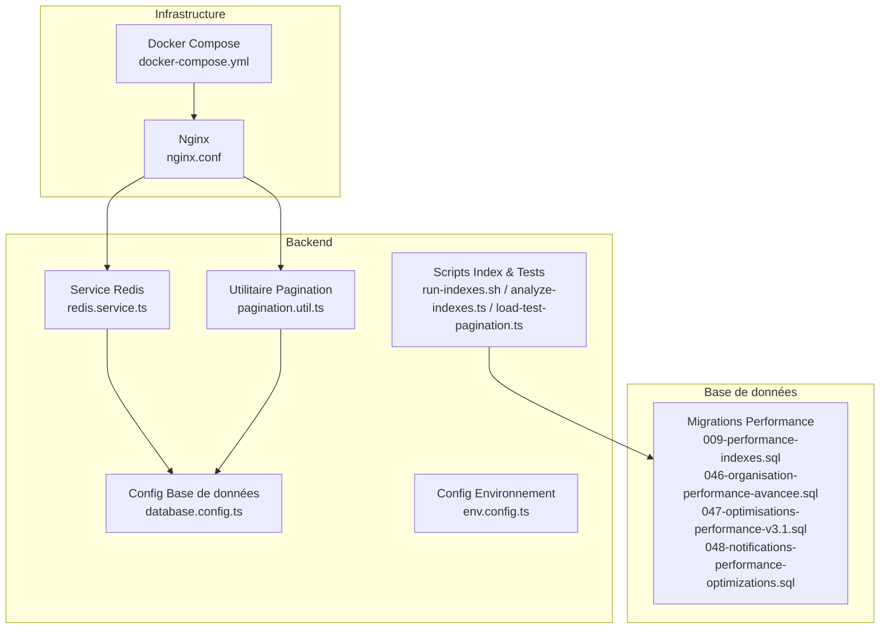
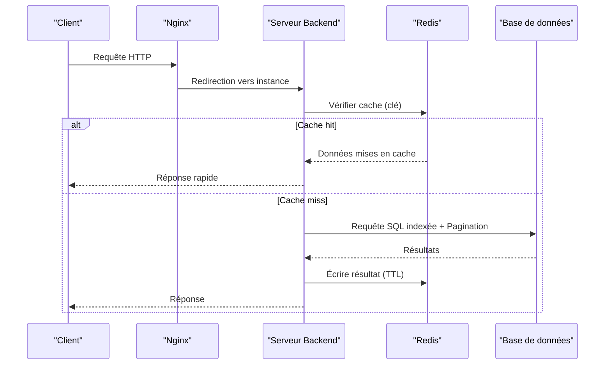
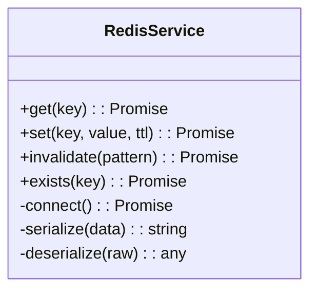
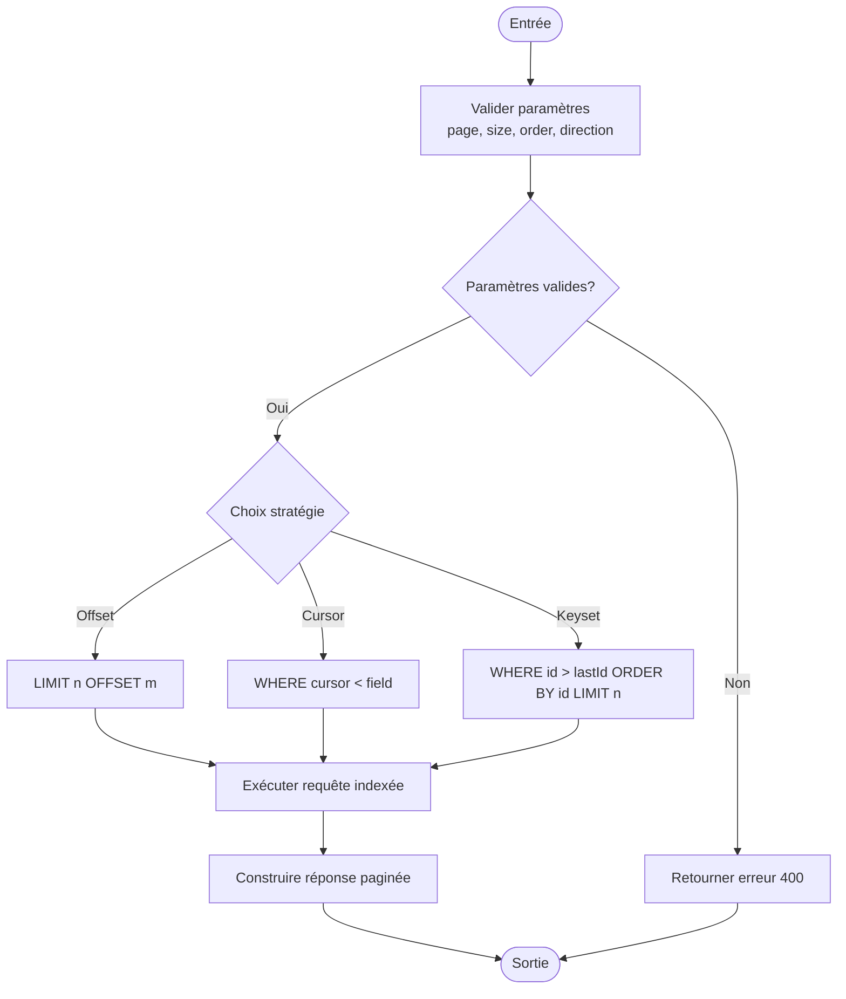
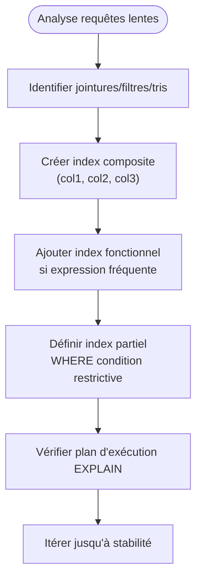
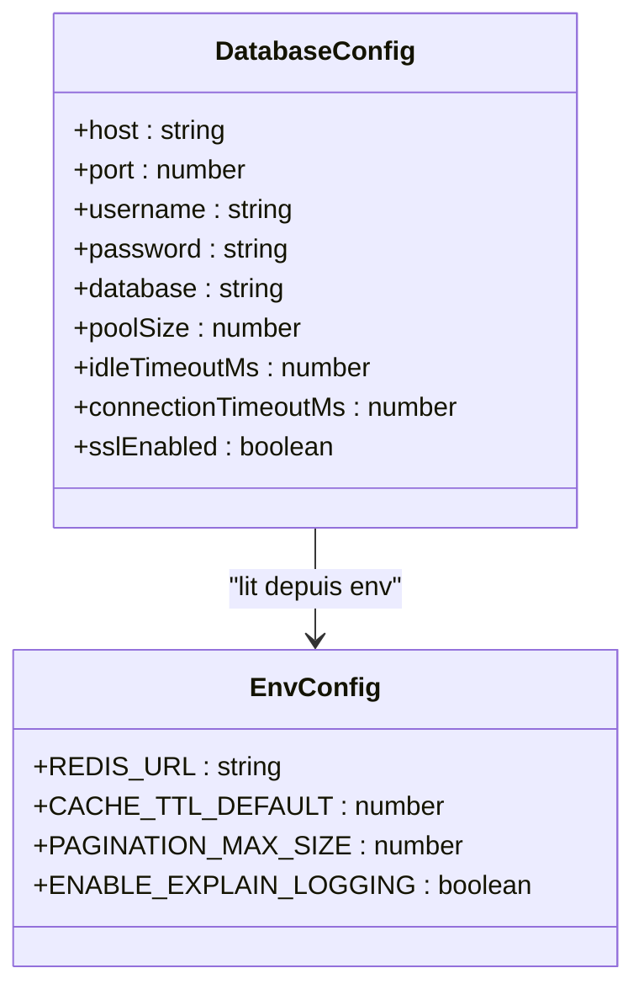
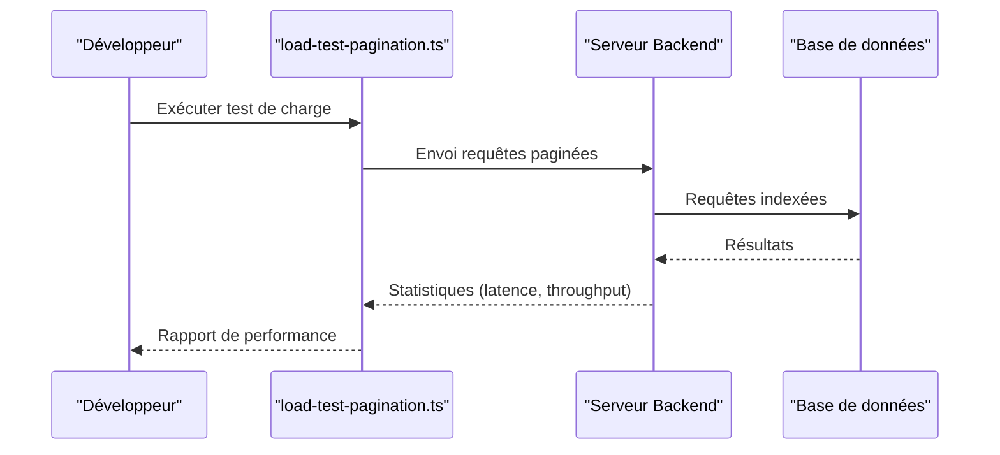
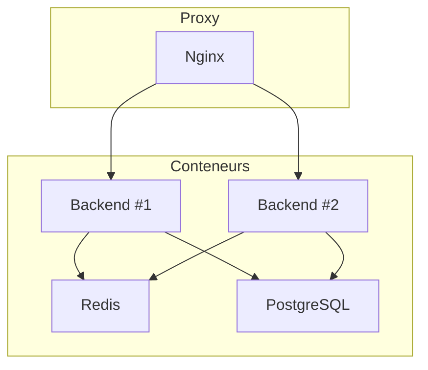
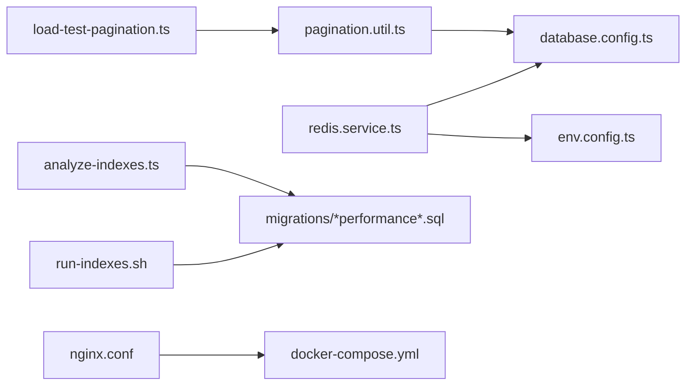

# Optimisation des Performances

<cite>
**Fichiers référencés dans ce document**
- [backend/src/modules/monitoring/service/redis.service.ts](file://backend/src/modules/monitoring/service/redis.service.ts)
- [backend/src/common/utils/pagination.util.ts](file://backend/src/common/utils/pagination.util.ts)
- [backend/database/migrations/009-performance-indexes.sql](file://backend/database/migrations/009-performance-indexes.sql)
- [backend/database/migrations/047-optimisations-performance-v3.1.sql](file://backend/database/migrations/047-optimisations-performance-v3.1.sql)
- [backend/database/migrations/048-notifications-performance-optimizations.sql](file://backend/database/migrations/048-notifications-performance-optimizations.sql)
- [backend/database/migrations/046-organisation-performance-avancee.sql](file://backend/database/migrations/046-organisation-performance-avancee.sql)
- [backend/scripts/load-test-pagination.ts](file://backend/scripts/load-test-pagination.ts)
- [backend/scripts/run-indexes.sh](file://backend/scripts/run-indexes.sh)
- [backend/scripts/analyze-indexes.ts](file://backend/scripts/analyze-indexes.ts)
- [backend/src/config/database.config.ts](file://backend/src/config/database.config.ts)
- [backend/src/config/env.config.ts](file://backend/src/config/env.config.ts)
- [docker/docker-compose.yml](file://docker/docker-compose.yml)
- [docker/nginx.conf](file://docker/nginx.conf)
- [backend/docs/pagination-guide.md](file://backend/docs/pagination-guide.md)
- [docs/guides/GUIDE-MONITORING-PERFORMANCE-RBAC.md](file://docs/guides/GUIDE-MONITORING-PERFORMANCE-RBAC.md)
</cite>

## Table des matières
1. [Introduction](#introduction)
2. [Structure du projet](#structure-du-projet)
3. [Composants clés](#composants-clés)
4. [Vue d'ensemble de l'architecture](#vue-densemble-de-larchitecture)
5. [Analyse détaillée des composants](#analyse-detailee-des-composants)
6. [Analyse des dépendances](#analyse-des-dependances)
7. [Considérations de performance](#considerations-de-performance)
8. [Guide de dépannage](#guide-de-depannage)
9. [Conclusion](#conclusion)
10. [Annexes](#annexes)

## Introduction
Ce document synthétise les stratégies d’optimisation des performances d’eLISAschool autour de trois axes majeurs : le caching Redis, la pagination avancée et les index de base de données. Il couvre également les métriques de performance, les outils de monitoring, les techniques de profiling, ainsi que les bonnes pratiques pour le scaling horizontal et le load balancing. L’objectif est de fournir une référence complète, accessible aux développeurs comme aux responsables techniques, pour garantir réactivité, évolutivité et fiabilité à grande échelle.

## Structure du projet
Le backend expose des services de monitoring (Redis), des utilitaires de pagination, des migrations SQL dédiées aux index et optimisations, et des scripts de tests de charge et d’analyse d’index. La configuration DB et environnement définit les paramètres critiques pour la performance. Le déploiement Docker inclut Nginx pour le reverse proxy et le load balancing.

**Sources du diagramme**
- [backend/src/modules/monitoring/service/redis.service.ts](file://backend/src/modules/monitoring/service/redis.service.ts)
- [backend/src/common/utils/pagination.util.ts](file://backend/src/common/utils/pagination.util.ts)
- [backend/src/config/database.config.ts](file://backend/src/config/database.config.ts)
- [backend/src/config/env.config.ts](file://backend/src/config/env.config.ts)
- [backend/scripts/run-indexes.sh](file://backend/scripts/run-indexes.sh)
- [backend/scripts/analyze-indexes.ts](file://backend/scripts/analyze-indexes.ts)
- [backend/scripts/load-test-pagination.ts](file://backend/scripts/load-test-pagination.ts)
- [backend/database/migrations/009-performance-indexes.sql](file://backend/database/migrations/009-performance-indexes.sql)
- [backend/database/migrations/046-organisation-performance-avancee.sql](file://backend/database/migrations/046-organisation-performance-avancee.sql)
- [backend/database/migrations/047-optimisations-performance-v3.1.sql](file://backend/database/migrations/047-optimisations-performance-v3.1.sql)
- [backend/database/migrations/048-notifications-performance-optimizations.sql](file://backend/database/migrations/048-notifications-performance-optimizations.sql)
- [docker/docker-compose.yml](file://docker/docker-compose.yml)
- [docker/nginx.conf](file://docker/nginx.conf)

**Sources de la section**
- [backend/src/modules/monitoring/service/redis.service.ts](file://backend/src/modules/monitoring/service/redis.service.ts)
- [backend/src/common/utils/pagination.util.ts](file://backend/src/common/utils/pagination.util.ts)
- [backend/src/config/database.config.ts](file://backend/src/config/database.config.ts)
- [backend/src/config/env.config.ts](file://backend/src/config/env.config.ts)
- [backend/scripts/run-indexes.sh](file://backend/scripts/run-indexes.sh)
- [backend/scripts/analyze-indexes.ts](file://backend/scripts/analyze-indexes.ts)
- [backend/scripts/load-test-pagination.ts](file://backend/scripts/load-test-pagination.ts)
- [backend/database/migrations/009-performance-indexes.sql](file://backend/database/migrations/009-performance-indexes.sql)
- [backend/database/migrations/046-organisation-performance-avancee.sql](file://backend/database/migrations/046-organisation-performance-avancee.sql)
- [backend/database/migrations/047-optimisations-performance-v3.1.sql](file://backend/database/migrations/047-optimisations-performance-v3.1.sql)
- [backend/database/migrations/048-notifications-performance-optimizations.sql](file://backend/database/migrations/048-notifications-performance-optimizations.sql)
- [docker/docker-compose.yml](file://docker/docker-compose.yml)
- [docker/nginx.conf](file://docker/nginx.conf)

## Composants clés
- Service Redis : centralise les opérations de cache (lecture/écriture, expiration, invalidation).
- Utilitaire Pagination : implémente des patterns avancés (offset, cursor-based, keyset) avec validation et normalisation des paramètres.
- Migrations d’index et d’optimisations : créent ou ajustent les index composites, fonctionnels et partielles pour accélérer les requêtes fréquentes.
- Scripts de test et d’analyse : chargement de pagination, analyse d’index, exécution ciblée des migrations.
- Configuration DB et environnement : pool de connexions, timeouts, options de lecture seule, limites de mémoire.
- Infrastructure Docker/Nginx : orchestration des conteneurs, reverse proxy, load balancing et health checks.

**Sources de la section**
- [backend/src/modules/monitoring/service/redis.service.ts](file://backend/src/modules/monitoring/service/redis.service.ts)
- [backend/src/common/utils/pagination.util.ts](file://backend/src/common/utils/pagination.util.ts)
- [backend/database/migrations/009-performance-indexes.sql](file://backend/database/migrations/009-performance-indexes.sql)
- [backend/database/migrations/047-optimisations-performance-v3.1.sql](file://backend/database/migrations/047-optimisations-performance-v3.1.sql)
- [backend/database/migrations/048-notifications-performance-optimizations.sql](file://backend/database/migrations/048-notifications-performance-optimizations.sql)
- [backend/database/migrations/046-organisation-performance-avancee.sql](file://backend/database/migrations/046-organisation-performance-avancee.sql)
- [backend/scripts/load-test-pagination.ts](file://backend/scripts/load-test-pagination.ts)
- [backend/scripts/run-indexes.sh](file://backend/scripts/run-indexes.sh)
- [backend/scripts/analyze-indexes.ts](file://backend/scripts/analyze-indexes.ts)
- [backend/src/config/database.config.ts](file://backend/src/config/database.config.ts)
- [backend/src/config/env.config.ts](file://backend/src/config/env.config.ts)
- [docker/docker-compose.yml](file://docker/docker-compose.yml)
- [docker/nginx.conf](file://docker/nginx.conf)

## Vue d'ensemble de l'architecture
Le flux typique combine cache Redis, requêtes SQL indexées et pagination efficace. Les clients passent par Nginx qui répartit la charge entre instances backend. Les services utilisent la configuration DB pour gérer les pools et timeouts. Les scripts permettent de valider les performances et d’ajuster les index.

**Sources du diagramme**
- [docker/nginx.conf](file://docker/nginx.conf)
- [backend/src/modules/monitoring/service/redis.service.ts](file://backend/src/modules/monitoring/service/redis.service.ts)
- [backend/src/common/utils/pagination.util.ts](file://backend/src/common/utils/pagination.util.ts)
- [backend/database/migrations/009-performance-indexes.sql](file://backend/database/migrations/009-performance-indexes.sql)

## Analyse détaillée des composants

### Service Redis
Responsabilités :
- Lecture/écriture de clés avec TTL configurables.
- Invalidation sélective par préfixe ou pattern.
- Gestion des erreurs réseau et fallbacks.
- Métriques de taux de hit/miss et latence.

Bonnes pratiques :
- Clés hiérarchiques tenant-aware (préfixe établissement).
- TTL courts pour données volatiles, longs pour références statiques.
- Éviter les gros objets JSON ; préférer des fragments ou des agrégats.
- Utiliser des pipelines pour batcher les opérations.

**Sources du diagramme**
- [backend/src/modules/monitoring/service/redis.service.ts](file://backend/src/modules/monitoring/service/redis.service.ts)

**Sources de la section**
- [backend/src/modules/monitoring/service/redis.service.ts](file://backend/src/modules/monitoring/service/redis.service.ts)

### Utilitaire Pagination
Patterns supportés :
- Offset/Limit classique pour petits jeux de résultats.
- Cursor-based pour grands volumes et navigation fluide.
- Keyset (WHERE id > lastId ORDER BY id LIMIT n) pour haute performance.

Validation et normalisation :
- Contraintes sur page, size, order, direction.
- Sanitization des filtres et sécurisation des tris.

**Sources du diagramme**
- [backend/src/common/utils/pagination.util.ts](file://backend/src/common/utils/pagination.util.ts)

**Sources de la section**
- [backend/src/common/utils/pagination.util.ts](file://backend/src/common/utils/pagination.util.ts)
- [backend/docs/pagination-guide.md](file://backend/docs/pagination-guide.md)

### Index et Optimisations SQL
Les migrations ajoutent des index composites, fonctionnels et partielles pour :
- Jointures fréquentes (relations métier).
- Filtrage par colonnes discriminantes (statuts, dates, identifiants multi-tenant).
- Tris fréquents (ordre chronologique, hiérarchie).

Points clés :
- Index composites sur (etablissement_id, date, statut) pour scoping tenant et tri temporel.
- Index fonctionnels sur expressions courantes (LOWER(nom), COALESCE(champs)).
- Index partielles WHERE statut = 'actif' pour réduire taille et améliorer scans.

**Sources du diagramme**
- [backend/database/migrations/009-performance-indexes.sql](file://backend/database/migrations/009-performance-indexes.sql)
- [backend/database/migrations/046-organisation-performance-avancee.sql](file://backend/database/migrations/046-organisation-performance-avancee.sql)
- [backend/database/migrations/047-optimisations-performance-v3.1.sql](file://backend/database/migrations/047-optimisations-performance-v3.1.sql)
- [backend/database/migrations/048-notifications-performance-optimizations.sql](file://backend/database/migrations/048-notifications-performance-optimizations.sql)

**Sources de la section**
- [backend/database/migrations/009-performance-indexes.sql](file://backend/database/migrations/009-performance-indexes.sql)
- [backend/database/migrations/046-organisation-performance-avancee.sql](file://backend/database/migrations/046-organisation-performance-avancee.sql)
- [backend/database/migrations/047-optimisations-performance-v3.1.sql](file://backend/database/migrations/047-optimisations-performance-v3.1.sql)
- [backend/database/migrations/048-notifications-performance-optimizations.sql](file://backend/database/migrations/048-notifications-performance-optimizations.sql)

### Configuration Base de données et Environnement
Paramètres critiques :
- Pool de connexions (max, min, idle timeout).
- Read replicas si disponibles.
- Timeouts de requête et retry policy.
- Options de journalisation et tracing.

**Sources du diagramme**
- [backend/src/config/database.config.ts](file://backend/src/config/database.config.ts)
- [backend/src/config/env.config.ts](file://backend/src/config/env.config.ts)

**Sources de la section**
- [backend/src/config/database.config.ts](file://backend/src/config/database.config.ts)
- [backend/src/config/env.config.ts](file://backend/src/config/env.config.ts)

### Scripts de Test et d’Analyse
- load-test-pagination.ts : simule des requêtes paginées sous charge pour mesurer latence et débit.
- run-indexes.sh : applique les migrations d’index de manière contrôlée.
- analyze-indexes.ts : génère des rapports sur l’utilisation et l’efficacité des index.

**Sources du diagramme**
- [backend/scripts/load-test-pagination.ts](file://backend/scripts/load-test-pagination.ts)

**Sources de la section**
- [backend/scripts/load-test-pagination.ts](file://backend/scripts/load-test-pagination.ts)
- [backend/scripts/run-indexes.sh](file://backend/scripts/run-indexes.sh)
- [backend/scripts/analyze-indexes.ts](file://backend/scripts/analyze-indexes.ts)

### Infrastructure Docker et Nginx
- docker-compose.yml : orchestre les services (backend, redis, db, nginx).
- nginx.conf : configure le reverse proxy, le load balancing round-robin, les health checks et les timeouts.

**Sources du diagramme**
- [docker/docker-compose.yml](file://docker/docker-compose.yml)
- [docker/nginx.conf](file://docker/nginx.conf)

**Sources de la section**
- [docker/docker-compose.yml](file://docker/docker-compose.yml)
- [docker/nginx.conf](file://docker/nginx.conf)

## Analyse des dépendances
Le service Redis dépend de la configuration DB et des variables d’environnement. L’utilitaire Pagination interagit avec la couche DB via des requêtes indexées. Les scripts d’index dépendent des migrations SQL. Nginx dépend de docker-compose pour découvrir les instances backend.

**Sources du diagramme**
- [backend/src/modules/monitoring/service/redis.service.ts](file://backend/src/modules/monitoring/service/redis.service.ts)
- [backend/src/common/utils/pagination.util.ts](file://backend/src/common/utils/pagination.util.ts)
- [backend/src/config/database.config.ts](file://backend/src/config/database.config.ts)
- [backend/src/config/env.config.ts](file://backend/src/config/env.config.ts)
- [backend/scripts/load-test-pagination.ts](file://backend/scripts/load-test-pagination.ts)
- [backend/scripts/run-indexes.sh](file://backend/scripts/run-indexes.sh)
- [backend/scripts/analyze-indexes.ts](file://backend/scripts/analyze-indexes.ts)
- [backend/database/migrations/009-performance-indexes.sql](file://backend/database/migrations/009-performance-indexes.sql)
- [backend/database/migrations/046-organisation-performance-avancee.sql](file://backend/database/migrations/046-organisation-performance-avancee.sql)
- [backend/database/migrations/047-optimisations-performance-v3.1.sql](file://backend/database/migrations/047-optimisations-performance-v3.1.sql)
- [backend/database/migrations/048-notifications-performance-optimizations.sql](file://backend/database/migrations/048-notifications-performance-optimizations.sql)
- [docker/docker-compose.yml](file://docker/docker-compose.yml)
- [docker/nginx.conf](file://docker/nginx.conf)

**Sources de la section**
- [backend/src/modules/monitoring/service/redis.service.ts](file://backend/src/modules/monitoring/service/redis.service.ts)
- [backend/src/common/utils/pagination.util.ts](file://backend/src/common/utils/pagination.util.ts)
- [backend/src/config/database.config.ts](file://backend/src/config/database.config.ts)
- [backend/src/config/env.config.ts](file://backend/src/config/env.config.ts)
- [backend/scripts/load-test-pagination.ts](file://backend/scripts/load-test-pagination.ts)
- [backend/scripts/run-indexes.sh](file://backend/scripts/run-indexes.sh)
- [backend/scripts/analyze-indexes.ts](file://backend/scripts/analyze-indexes.ts)
- [backend/database/migrations/009-performance-indexes.sql](file://backend/database/migrations/009-performance-indexes.sql)
- [backend/database/migrations/046-organisation-performance-avancee.sql](file://backend/database/migrations/046-organisation-performance-avancee.sql)
- [backend/database/migrations/047-optimisations-performance-v3.1.sql](file://backend/database/migrations/047-optimisations-performance-v3.1.sql)
- [backend/database/migrations/048-notifications-performance-optimizations.sql](file://backend/database/migrations/048-notifications-performance-optimizations.sql)
- [docker/docker-compose.yml](file://docker/docker-compose.yml)
- [docker/nginx.conf](file://docker/nginx.conf)

## Considérations de performance
- Caching Redis :
  - Stratégies : read-through, write-through, cache-aside selon la criticité des données.
  - TTL dynamiques basés sur la fraîcheur attendue et la fréquence de mise à jour.
  - Prévention du thundering herd via verrous distribués ou pré-warming.
- Pagination :
  - Privilégier cursor-based/keyset pour les grandes tables.
  - Limiter size maximal et imposer des ordres stables.
  - Éviter les offsets profonds ; utiliser des curseurs persistants.
- Indexation :
  - Cibler les prédicats WHERE, JOIN et ORDER BY.
  - Surveiller la fragmentation et reconstruire les index périodiquement.
  - Éviter les index redondants ou non utilisés.
- Monitoring et profiling :
  - Mesurer latence p95/p99, taux d’erreur, hit ratio Redis, temps d’exécution SQL.
  - Utiliser EXPLAIN ANALYZE pour valider les plans d’exécution.
  - Instrumenter les endpoints critiques avec timers et logs structurés.
- Scaling horizontal et load balancing :
  - Instances stateless derrière Nginx avec session sticky si nécessaire.
  - Partitionnement des données tenant-aware pour limiter la portée des caches.
  - Auto-scaling basé sur CPU/RAM et métriques applicatives.

[No sources needed since this section provides general guidance]

## Guide de dépannage
Problèmes courants :
- Cache misses élevés : vérifier TTL, cohérence des clés et invalidation.
- Latence SQL élevée : analyser les plans EXPLAIN, ajouter ou ajuster les index.
- Pagination lente : remplacer offset par cursor/keyset, vérifier les index sur colonnes triées.
- Connexions DB saturées : augmenter poolSize, identifier les fuites de transactions.
- Nginx timeouts : ajuster proxy_read_timeout et upstream keepalive.

Actions recommandées :
- Exécuter analyze-indexes.ts pour détecter les index inutilisés.
- Lancer load-test-pagination.ts pour reproduire les goulets d’étranglement.
- Appliquer run-indexes.sh après validation des plans EXPLAIN.
- Consulter GUIDE-MONITORING-PERFORMANCE-RBAC.md pour les métriques et dashboards.

**Sources de la section**
- [backend/scripts/analyze-indexes.ts](file://backend/scripts/analyze-indexes.ts)
- [backend/scripts/load-test-pagination.ts](file://backend/scripts/load-test-pagination.ts)
- [backend/scripts/run-indexes.sh](file://backend/scripts/run-indexes.sh)
- [docs/guides/GUIDE-MONITORING-PERFORMANCE-RBAC.md](file://docs/guides/GUIDE-MONITORING-PERFORMANCE-RBAC.md)

## Conclusion
La performance d’eLISAschool repose sur un équilibre entre cache Redis efficace, pagination adaptée aux volumes et index SQL ciblés. Le monitoring continu, les tests de charge et l’analyse d’index permettent d’anticiper les dégradations. Le scaling horizontal et le load balancing assurent la résilience et la capacité d’absorption de charge. Suivre ces bonnes pratiques garantit une expérience utilisateur fluide et une infrastructure évolutive.

[No sources needed since this section summarizes without analyzing specific files]

## Annexes
- Exemples de requêtes SQL optimisées : privilégier des jointures explicites, filtrer tôt, éviter SELECT *, utiliser des index composites adaptés aux clauses WHERE/ORDER BY.
- Stratégies de mise en cache : cache-aside pour lectures fréquentes, write-through pour cohérence forte, pré-warming pour pages critiques.
- Patterns de chargement asynchrone : prefetch des données liées, lazy loading des détails, background jobs pour calculs lourds.
- Bonnes pratiques de développement performant : profiler avant d’optimiser, mesurer avant de modifier, documenter les décisions d’indexation et de cache.

[No sources needed since this section provides general guidance]