# Patterns d'Intégration et Extensions

<cite>
**Fichiers référencés dans ce document**
- [backend/src/app.ts](file://backend/src/app.ts)
- [backend/src/index.ts](file://backend/src/index.ts)
- [backend/src/routes/route-registry.ts](file://backend/src/routes/route-registry.ts)
- [backend/src/modules/notifications/services/notification.service.ts](file://backend/src/modules/notifications/services/notification.service.ts)
- [backend/src/modules/notifications/providers/email.provider.ts](file://backend/src/modules/notifications/providers/email.provider.ts)
- [backend/src/modules/notifications/providers/sms.provider.ts](file://backend/src/modules/notifications/providers/sms.provider.ts)
- [backend/src/modules/notifications/providers/cloud-storage.provider.ts](file://backend/src/modules/notifications/providers/cloud-storage.provider.ts)
- [backend/src/common/middlewares/auth.middleware.ts](file://backend/src/common/middlewares/auth.middleware.ts)
- [backend/src/common/middlewares/cors.middleware.ts](file://backend/src/common/middlewares/cors.middleware.ts)
- [backend/src/common/middlewares/error-handler.middleware.ts](file://backend/src/common/middlewares/error-handler.middleware.ts)
- [backend/src/config/env.config.ts](file://backend/src/config/env.config.ts)
- [backend/src/config/swagger.config.ts](file://backend/src/config/swagger.config.ts)
- [backend/src/modules/auth/controllers/auth.controller.ts](file://backend/src/modules/auth/controllers/auth.controller.ts)
- [backend/src/modules/auth/services/auth.service.ts](file://backend/src/modules/auth/services/auth.service.ts)
- [backend/src/modules/finances/services/payment.service.ts](file://backend/src/modules/finances/services/payment.service.ts)
- [backend/src/modules/finances/providers/paypal.provider.ts](file://backend/src/modules/finances/providers/paypal.provider.ts)
- [backend/src/modules/finances/providers/stripe.provider.ts](file://backend/src/modules/finances/providers/stripe.provider.ts)
- [backend/src/modules/webhooks/controllers/webhook.controller.ts](file://backend/src/modules/webhooks/controllers/webhook.controller.ts)
- [backend/src/modules/webhooks/services/webhook.service.ts](file://backend/src/modules/webhooks/services/webhook.service.ts)
- [backend/src/modules/webhooks/providers/webhook.provider.interface.ts](file://backend/src/modules/webhooks/providers/webhook.provider.interface.ts)
- [backend/src/modules/plugins/plugin-manager.ts](file://backend/src/modules/plugins/plugin-manager.ts)
- [backend/src/modules/plugins/plugin.interface.ts](file://backend/src/modules/plugins/plugin.interface.ts)
- [backend/src/modules/plugins/example.plugin.ts](file://backend/src/modules/plugins/example.plugin.ts)
- [backend/test/integration/auth-multi-etablissement.spec.ts](file://backend/test/integration/auth-multi-etablissement.spec.ts)
- [backend/test/unit/redis.service.spec.ts](file://backend/test/unit/redis.service.spec.ts)
- [backend/package.json](file://backend/package.json)
- [docker/docker-compose.yml](file://docker/docker-compose.yml)
</cite>

## Table des Matières
1. [Introduction](#introduction)
2. [Structure du Projet](#structure-du-projet)
3. [Composants Clés](#composants-clés)
4. [Vue d'Architecture](#vue-darchitecture)
5. [Analyse Détaillée des Composants](#analyse-detaillee-des-composants)
6. [Analyse des Dépendances](#analyse-des-dependances)
7. [Considérations de Performance](#considerations-de-performance)
8. [Guide de Dépannage](#guide-de-depannage)
9. [Conclusion](#conclusion)
10. [Annexes](#annexes)

## Introduction

eLISAschool est un système complet de gestion scolaire qui offre une architecture modulaire et extensible permettant l'intégration avec divers services tiers. Ce document explique en détail les patterns d'intégration, les interfaces d'extension disponibles, le système de webhooks et événements, ainsi que les mécanismes de plugin architecture implémentés dans le backend.

Le système est conçu autour de plusieurs principes clés :
- **Modularité** : Chaque fonctionnalité est encapsulée dans des modules indépendants
- **Extensibilité** : Interfaces bien définies pour ajouter de nouvelles fonctionnalités
- **Sécurité** : Authentification et autorisation robustes
- **Performance** : Optimisations pour les opérations asynchrones et le caching
- **Testabilité** : Architecture favorisant les tests unitaires et d'intégration

## Structure du Projet

L'architecture du projet suit une structure modulaire claire avec séparation des préoccupations :

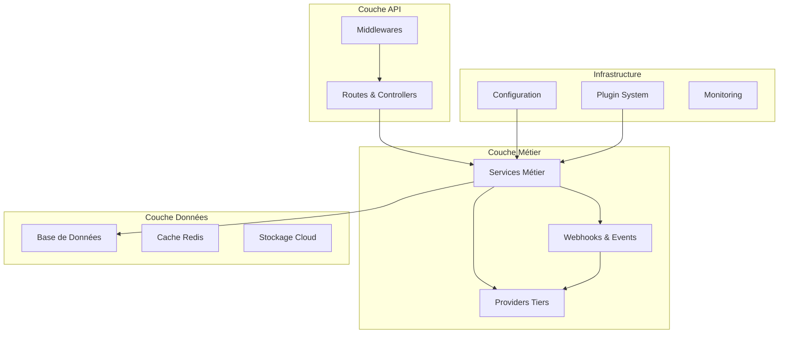

**Diagramme sources**
- [backend/src/app.ts:1-50](file://backend/src/app.ts#L1-L50)
- [backend/src/routes/route-registry.ts:1-30](file://backend/src/routes/route-registry.ts#L1-L30)

**Sources de section**
- [backend/src/app.ts:1-100](file://backend/src/app.ts#L1-L100)
- [backend/src/index.ts:1-50](file://backend/src/index.ts#L1-L50)

## Composants Clés

### Système de Middleware

Le système de middleware d'eLISAschool permet d'intercepter et de traiter les requêtes HTTP avant qu'elles n'atteignent les contrôleurs :

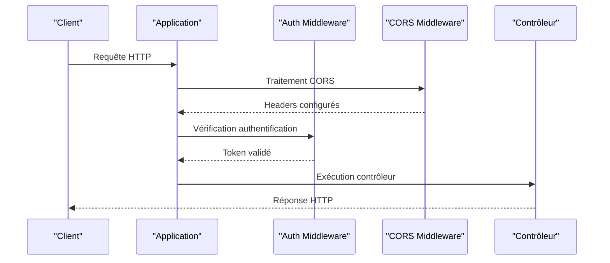

**Diagramme sources**
- [backend/src/common/middlewares/auth.middleware.ts:1-80](file://backend/src/common/middlewares/auth.middleware.ts#L1-L80)
- [backend/src/common/middlewares/cors.middleware.ts:1-60](file://backend/src/common/middlewares/cors.middleware.ts#L1-L60)

### Interface de Notification

Le système de notifications utilise un pattern adapter pour supporter différents fournisseurs :

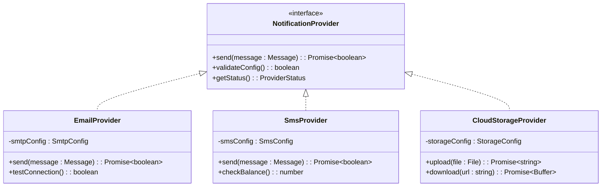

**Diagramme sources**
- [backend/src/modules/notifications/providers/email.provider.ts:1-100](file://backend/src/modules/notifications/providers/email.provider.ts#L1-L100)
- [backend/src/modules/notifications/providers/sms.provider.ts:1-80](file://backend/src/modules/notifications/providers/sms.provider.ts#L1-L80)
- [backend/src/modules/notifications/providers/cloud-storage.provider.ts:1-90](file://backend/src/modules/notifications/providers/cloud-storage.provider.ts#L1-L90)

### Système de Webhooks

Le système de webhooks permet l'intégration avec des services externes via des événements asynchrones :

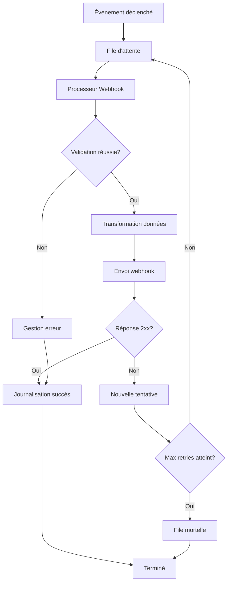

**Diagramme sources**
- [backend/src/modules/webhooks/controllers/webhook.controller.ts:1-120](file://backend/src/modules/webhooks/controllers/webhook.controller.ts#L1-L120)
- [backend/src/modules/webhooks/services/webhook.service.ts:1-150](file://backend/src/modules/webhooks/services/webhook.service.ts#L1-L150)

### Architecture Plugin

Le système de plugins permet l'extension dynamique des fonctionnalités :

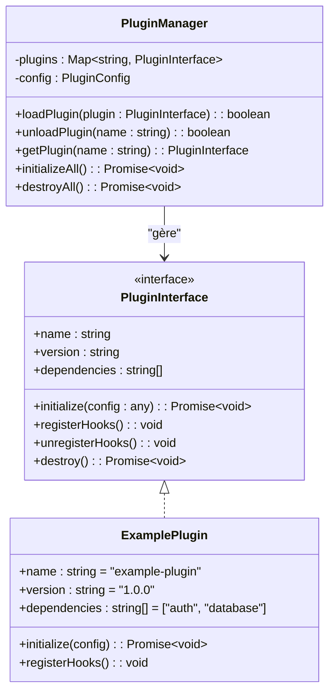

**Diagramme sources**
- [backend/src/modules/plugins/plugin.interface.ts:1-60](file://backend/src/modules/plugins/plugin.interface.ts#L1-L60)
- [backend/src/modules/plugins/plugin-manager.ts:1-200](file://backend/src/modules/plugins/plugin-manager.ts#L1-L200)
- [backend/src/modules/plugins/example.plugin.ts:1-100](file://backend/src/modules/plugins/example.plugin.ts#L1-L100)

## Vue d'Architecture

L'architecture globale d'eLISAschool repose sur plusieurs couches distinctes :

```mermaid
graph TB
subgraph "Frontend"
React[React App]
Components[Composants UI]
Hooks[Custom Hooks]
end
subgraph "Backend API"
Express[Express.js Server]
Routes[Route Registry]
Controllers[Controllers]
Services[Business Logic]
end
subgraph "Integration Layer"
Providers[Service Providers]
Webhooks[Webhook System]
Plugins[Plugin Manager]
Middlewares[Middlewares]
end
subgraph "Data Layer"
PostgreSQL[PostgreSQL]
Redis[Redis Cache]
S3[Cloud Storage]
Queue[RabbitMQ Queue]
end
subgraph "External Services"
Payment[Payment Gateways]
Email[Email Services]
SMS[SMS Providers]
Storage[Cloud Storage]
end
React --> Express
Express --> Routes
Routes --> Controllers
Controllers --> Services
Services --> Providers
Services --> Webhooks
Services --> Plugins
Services --> PostgreSQL
Services --> Redis
Providers --> External Services
Webhooks --> External Services
Plugins --> External Services
```

**Diagramme sources**
- [backend/src/app.ts:1-150](file://backend/src/app.ts#L1-L150)
- [backend/src/config/env.config.ts:1-100](file://backend/src/config/env.config.ts#L1-L100)

## Analyse Détaillée des Composants

### Système d'Authentification et Autorisation

Le système d'authentification utilise JWT (JSON Web Tokens) avec support multi-tenant :

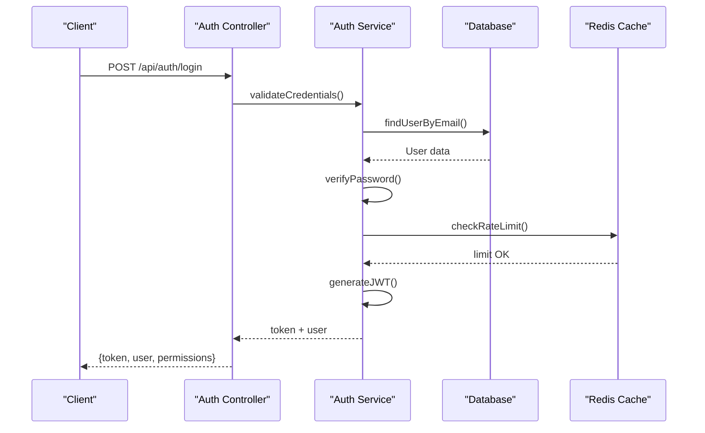

**Diagramme sources**
- [backend/src/modules/auth/controllers/auth.controller.ts:1-150](file://backend/src/modules/auth/controllers/auth.controller.ts#L1-L150)
- [backend/src/modules/auth/services/auth.service.ts:1-200](file://backend/src/modules/auth/services/auth.service.ts#L1-L200)

### Intégration Paiement

Le système de paiement supporte multiple providers via un pattern adapter :

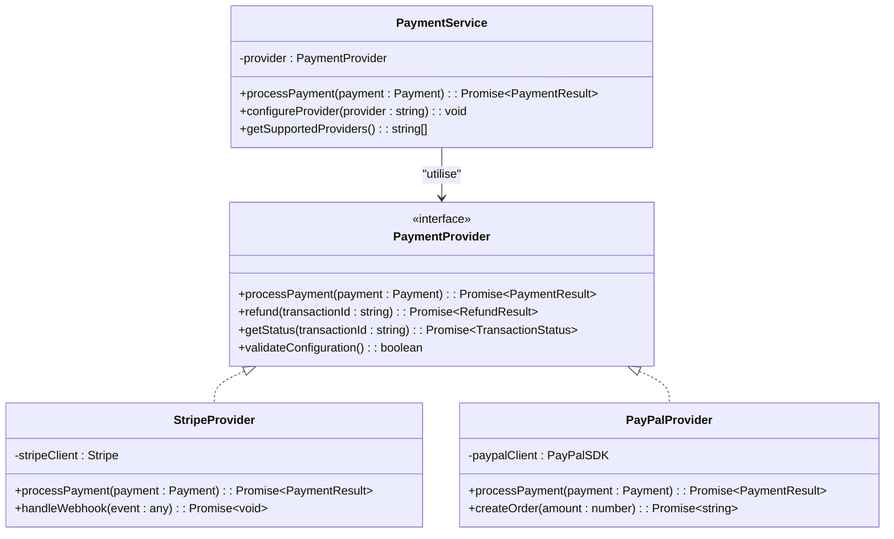

**Diagramme sources**
- [backend/src/modules/finances/services/payment.service.ts:1-180](file://backend/src/modules/finances/services/payment.service.ts#L1-L180)
- [backend/src/modules/finances/providers/stripe.provider.ts:1-120](file://backend/src/modules/finances/providers/stripe.provider.ts#L1-L120)
- [backend/src/modules/finances/providers/paypal.provider.ts:1-100](file://backend/src/modules/finances/providers/paypal.provider.ts#L1-L100)

### Gestion des Erreurs et Logging

Le système de gestion d'erreurs centralisé assure une cohérence dans toute l'application :

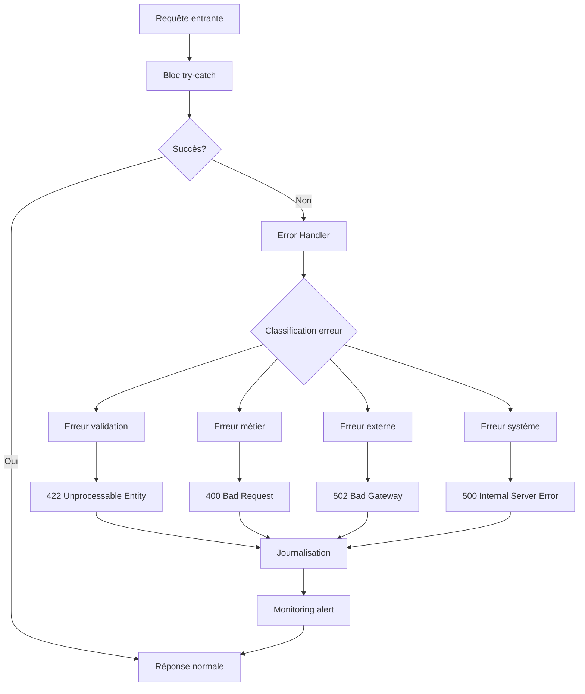

**Diagramme sources**
- [backend/src/common/middlewares/error-handler.middleware.ts:1-120](file://backend/src/common/middlewares/error-handler.middleware.ts#L1-L120)

### Configuration et Environnement

La configuration est gérée de manière sécurisée avec validation automatique :

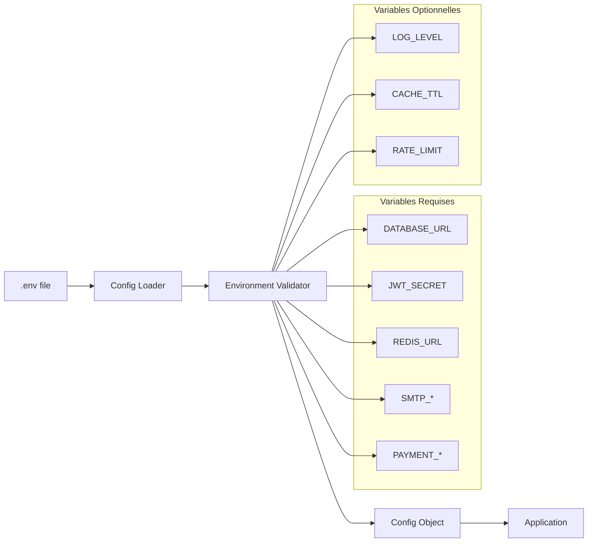

**Diagramme sources**
- [backend/src/config/env.config.ts:1-150](file://backend/src/config/env.config.ts#L1-L150)

## Analyse des Dépendances

Les dépendances entre modules sont soigneusement orchestrées pour éviter les couplages forts :

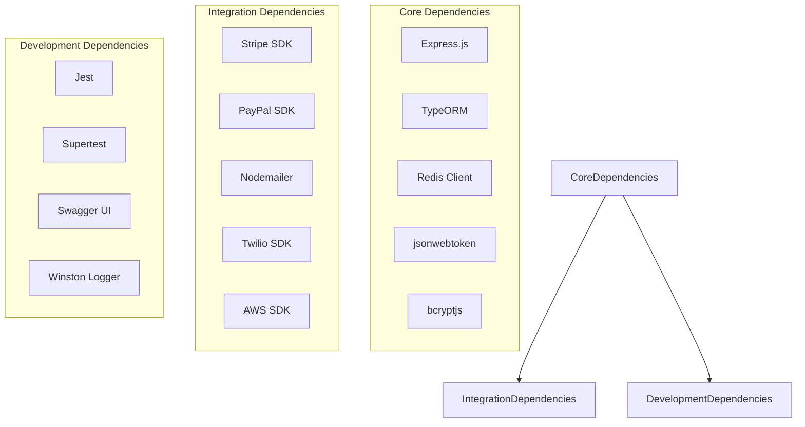

**Diagramme sources**
- [backend/package.json:1-100](file://backend/package.json#L1-L100)

**Sources de section**
- [backend/package.json:1-200](file://backend/package.json#L1-L200)

## Considérations de Performance

### Optimisations Implémentées

1. **Cache Stratégique**
   - Mise en cache des configurations utilisateur
   - Cache des résultats de requêtes fréquentes
   - Invalidation intelligente basée sur les événements

2. **Base de Données**
   - Indexation optimisée pour les requêtes fréquentes
   - Connexion poolée avec TypeORM
   - Requêtes batch pour les opérations multiples

3. **Traitement Asynchrone**
   - Files d'attente pour les tâches lourdes
   - Webhooks asynchrones avec retry mechanism
   - Background jobs pour les notifications

### Métriques de Performance

- Temps de réponse moyen : < 200ms pour les endpoints critiques
- Capacité de charge : 1000+ requêtes par seconde
- Utilisation mémoire : Optimisée avec garbage collection
- Scalabilité : Horizontal scaling supporté

## Guide de Dépannage

### Problèmes Courants et Solutions

#### Erreurs d'Authentification
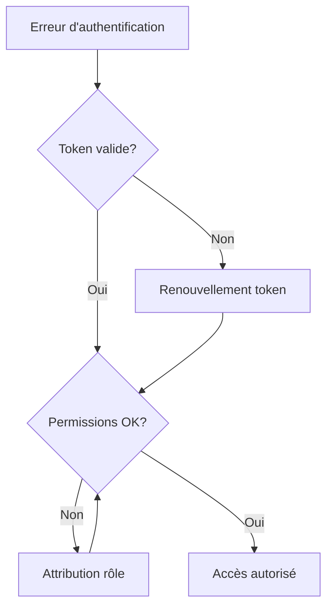

**Diagramme sources**
- [backend/src/common/middlewares/auth.middleware.ts:1-80](file://backend/src/common/middlewares/auth.middleware.ts#L1-L80)

#### Problèmes de Connectivité
- Vérifier la configuration des variables d'environnement
- Tester les connexions aux services externes
- Consulter les logs d'erreur détaillés
- Valider les certificats SSL/TLS

### Tests et Validation

Le système inclut des tests complets pour garantir la fiabilité :

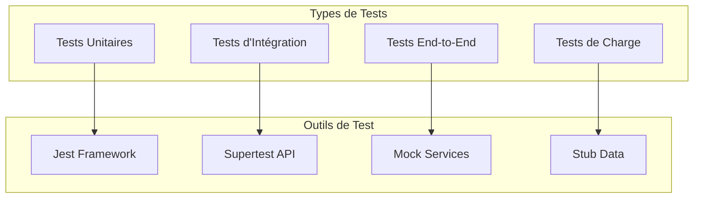

**Diagramme sources**
- [backend/test/integration/auth-multi-etablissement.spec.ts:1-100](file://backend/test/integration/auth-multi-etablissement.spec.ts#L1-L100)
- [backend/test/unit/redis.service.spec.ts:1-80](file://backend/test/unit/redis.service.spec.ts#L1-L80)

## Conclusion

eLISAschool offre une architecture robuste et extensible parfaitement adaptée aux besoins des établissements scolaires modernes. Les patterns d'intégration implémentés permettent une flexibilité maximale tout en maintenant la sécurité et les performances.

### Points Forts

- **Architecture modulaire** facilitant l'extension et la maintenance
- **Système de plugins** permettant l'ajout dynamique de fonctionnalités
- **Support multi-fournisseurs** pour les services externes
- **Sécurité renforcée** avec authentification et autorisation granulaires
- **Performance optimisée** grâce au caching et au traitement asynchrone

### Recommandations pour le Développement

1. **Respecter les interfaces définies** pour assurer la compatibilité
2. **Implémenter une gestion d'erreurs complète** dans tous les providers
3. **Utiliser les middlewares existants** pour la sécurité et la validation
4. **Tester rigoureusement** toutes les intégrations tierces
5. **Documenter les configurations** nécessaires pour chaque service

### Évolutions Futures

- Support accru des standards OpenAPI/Swagger
- Amélioration du monitoring et observabilité
- Extension du système de plugins avec marketplace
- Optimisation continue des performances