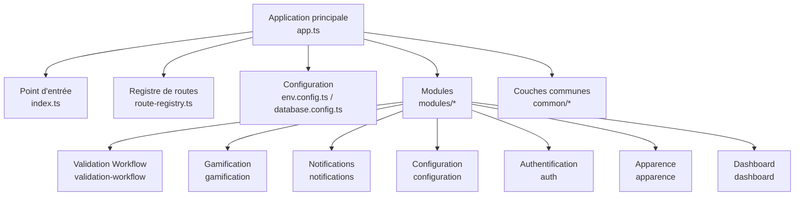
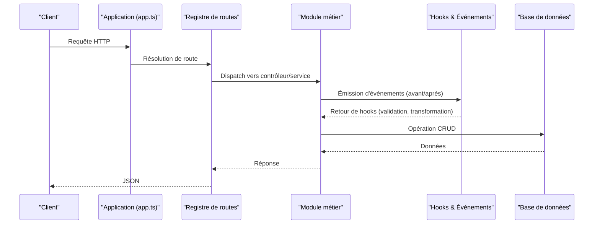
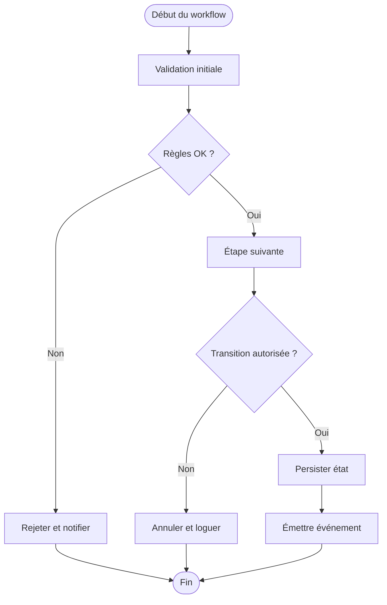
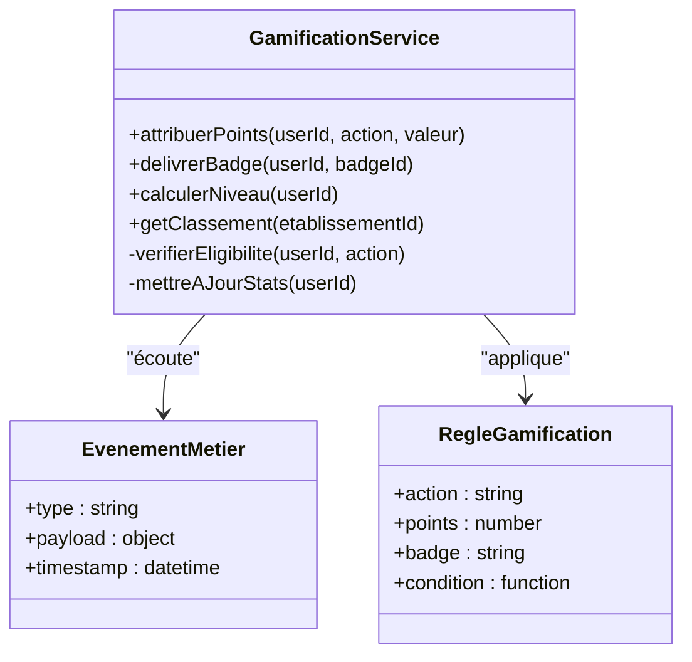
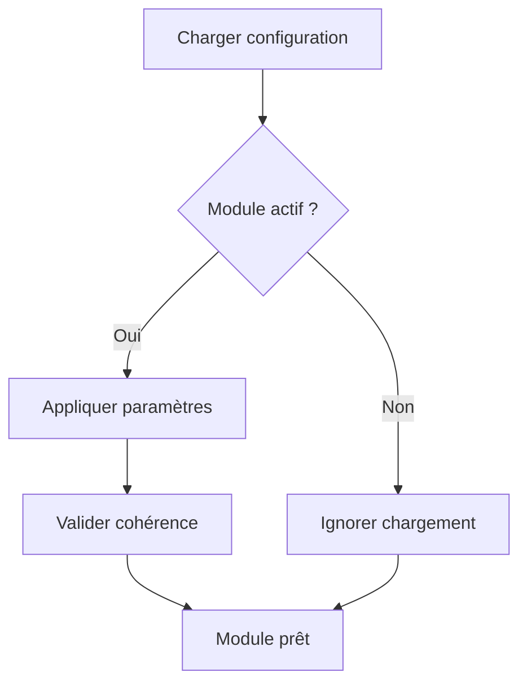
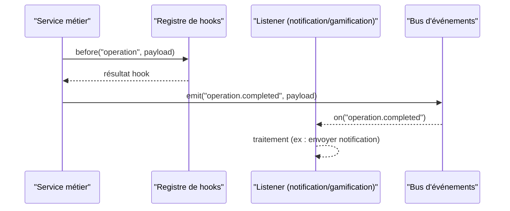
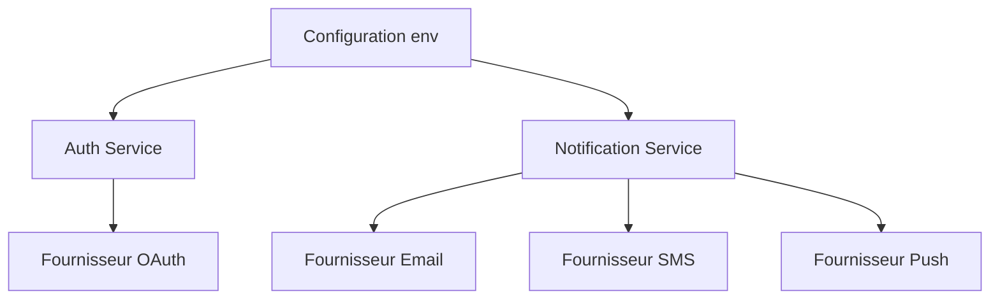
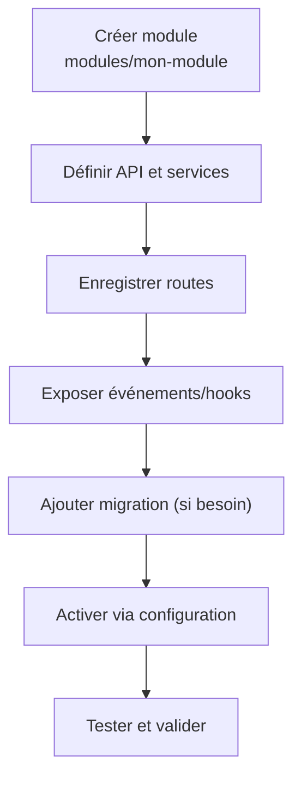
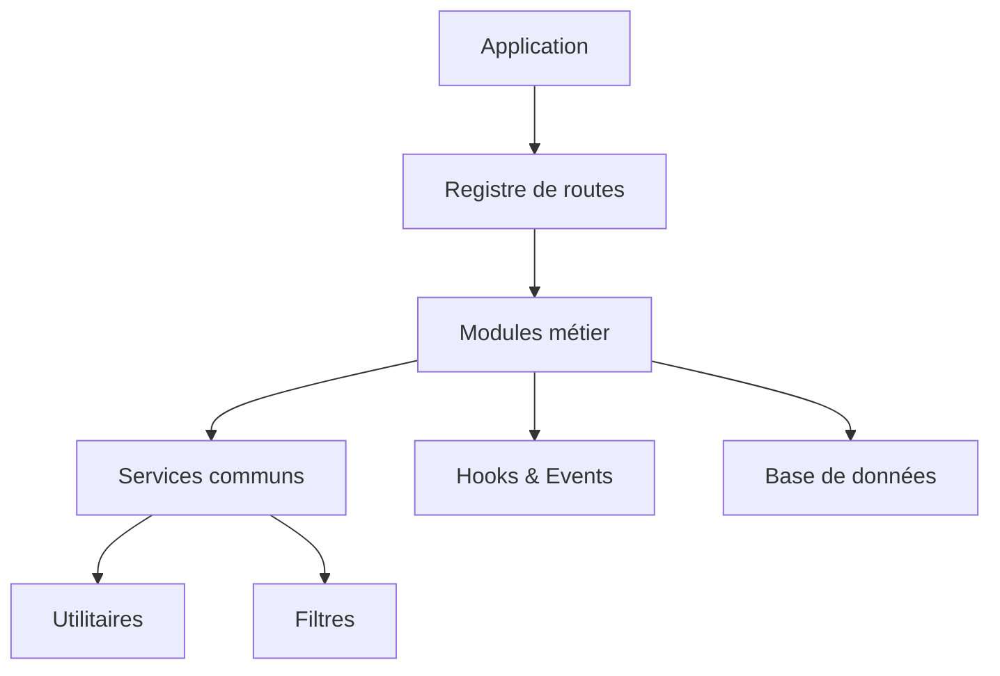

# Sujets Avancés et Personnalisation

<cite>
**Fichiers référencés dans ce document**
- [backend/src/modules/validation-workflow/index.ts](file://backend/src/modules/validation-workflow/index.ts)
- [backend/src/modules/gamification/index.ts](file://backend/src/modules/gamification/index.ts)
- [backend/src/modules/configuration/index.ts](file://backend/src/modules/configuration/index.ts)
- [backend/src/modules/notifications/index.ts](file://backend/src/modules/notifications/index.ts)
- [backend/src/modules/auth/index.ts](file://backend/src/modules/auth/index.ts)
- [backend/src/modules/apparence/index.ts](file://backend/src/modules/apparence/index.ts)
- [backend/src/modules/dashboard/index.ts](file://backend/src/modules/dashboard/index.ts)
- [backend/src/modules/types-enum/index.ts](file://backend/src/modules/types-enum/index.ts)
- [backend/src/routes/route-registry.ts](file://backend/src/routes/route-registry.ts)
- [backend/src/config/env.config.ts](file://backend/src/config/env.config.ts)
- [backend/src/config/database.config.ts](file://backend/src/config/database.config.ts)
- [backend/src/app.ts](file://backend/src/app.ts)
- [backend/src/index.ts](file://backend/src/index.ts)
- [backend/src/common/middlewares/index.ts](file://backend/src/common/middlewares/index.ts)
- [backend/src/common/interceptors/index.ts](file://backend/src/common/interceptors/index.ts)
- [backend/src/common/filters/index.ts](file://backend/src/common/filters/index.ts)
- [backend/src/common/services/index.ts](file://backend/src/common/services/index.ts)
- [backend/src/common/utils/index.ts](file://backend/src/common/utils/index.ts)
- [backend/src/modules/organisation/index.ts](file://backend/src/modules/organisation/index.ts)
- [backend/src/modules/utilisateurs/index.ts](file://backend/src/modules/utilisateurs/index.ts)
- [backend/src/modules/eleves/index.ts](file://backend/src/modules/eleves/index.ts)
- [backend/src/modules/personnel/index.ts](file://backend/src/modules/personnel/index.ts)
- [backend/src/modules/notes/index.ts](file://backend/src/modules/notes/index.ts)
- [backend/src/modules/bulletins/index.ts](file://backend/src/modules/bulletins/index.ts)
- [backend/src/modules/finances/index.ts](file://backend/src/modules/finances/index.ts)
- [backend/src/modules/suivi-eleves/index.ts](file://backend/src/modules/suivi-eleves/index.ts)
- [backend/src/modules/suivi-personnel/index.ts](file://backend/src/modules/suivi-personnel/index.ts)
- [backend/src/modules/scoring/index.ts](file://backend/src/modules/scoring/index.ts)
- [backend/src/modules/monitoring/index.ts](file://backend/src/modules/monitoring/index.ts)
- [backend/src/modules/options/index.ts](file://backend/src/modules/options/index.ts)
- [backend/src/modules/audit/index.ts](file://backend/src/modules/audit/index.ts)
- [backend/src/modules/permissions/index.ts](file://backend/src/modules/permissions/index.ts)
- [backend/src/modules/rbac/index.ts](file://backend/src/modules/rbac/index.ts)
- [backend/src/modules/etablissement/index.ts](file://backend/src/modules/etablissement/index.ts)
- [backend/src/modules/groupes-etablissements/index.ts](file://backend/src/modules/groupes-etablissements/index.ts)
- [backend/src/modules/annees-scolaires/index.ts](file://backend/src/modules/annees-scolaires/index.ts)
- [backend/src/modules/classes/index.ts](file://backend/src/modules/classes/index.ts)
- [backend/src/modules/matieres/index.ts](file://backend/src/modules/matieres/index.ts)
- [backend/src/modules/niveaux/index.ts](file://backend/src/modules/niveaux/index.ts)
- [backend/src/modules/cycles/index.ts](file://backend/src/modules/cycles/index.ts)
- [backend/src/modules/programmes/index.ts](file://backend/src/modules/programmes/index.ts)
- [backend/src/modules/competences/index.ts](file://backend/src/modules/competences/index.ts)
- [backend/src/modules/examens-nationaux/index.ts](file://backend/src/modules/examens-nationaux/index.ts)
- [backend/src/modules/diplomes-eleves/index.ts](file://backend/src/modules/diplomes-eleves/index.ts)
- [backend/src/modules/emploi-du-temps/index.ts](file://backend/src/modules/emploi-du-temps/index.ts)
- [backend/src/modules/salles/index.ts](file://backend/src/modules/salles/index.ts)
- [backend/src/modules/transport/index.ts](file://backend/src/modules/transport/index.ts)
- [backend/src/modules/cantine/index.ts](file://backend/src/modules/cantine/index.ts)
- [backend/src/modules/parking/index.ts](file://backend/src/modules/parking/index.ts)
- [backend/src/modules/materiel/index.ts](file://backend/src/modules/materiel/index.ts)
- [backend/src/modules/cartes/index.ts](file://backend/src/modules/cartes/index.ts)
- [backend/src/modules/impressions/index.ts](file://backend/src/modules/impressions/index.ts)
- [backend/src/modules/annonces/index.ts](file://backend/src/modules/annonces/index.ts)
- [backend/src/modules/sondages/index.ts](file://backend/src/modules/sondages/index.ts)
- [backend/src/modules/recrutement/index.ts](file://backend/src/modules/recrutement/index.ts)
- [backend/src/modules/orientation/index.ts](file://backend/src/modules/orientation/index.ts)
- [backend/src/modules/sante/index.ts](file://backend/src/modules/sante/index.ts)
- [backend/src/modules/responsables-eleves/index.ts](file://backend/src/modules/responsables-eleves/index.ts)
- [backend/src/modules/clubs/index.ts](file://backend/src/modules/clubs/index.ts)
- [backend/src/modules/types-enum/index.ts](file://backend/src/modules/types-enum/index.ts)
</cite>

## Table des matières
1. [Introduction](#introduction)
2. [Structure du projet](#structure-du-projet)
3. [Composants clés](#composants-clés)
4. [Vue d'ensemble de l'architecture](#vue-densemble-de-larchitecture)
5. [Analyse détaillée des composants](#analyse-detaillee-des-composants)
6. [Analyse des dépendances](#analyse-des-dependances)
7. [Considérations de performance](#considerations-de-performance)
8. [Guide de dépannage](#guide-de-depannage)
9. [Conclusion](#conclusion)
10. [Annexes](#annexes)

## Introduction
Ce document présente les mécanismes avancés de personnalisation et d’extension d’eLISAschool : points d’extension, configuration dynamique des modules, workflows de validation personnalisés, gamification, hooks et événements, plugins/extensions possibles, ainsi que des stratégies de customisation sans modification du code source. Il inclut des exemples d’implémentation, l’intégration de services tiers, des patterns d’extension, des considérations de performance, la maintenance des personnalisations et des bonnes pratiques pour créer des modules personnalisés adaptés aux besoins spécifiques des établissements.

## Structure du projet
Le backend est organisé en modules par fonctionnalité (par exemple, auth, notifications, gamification, configuration, etc.), avec un registre de routes centralisé et des couches communes (middlewares, interceptors, filtres, services, utilitaires). La configuration s’appuie sur des fichiers dédiés et une base de données versionnée via des migrations. Le frontend expose des fonctionnalités via des routes et des stores, mais ce document se concentre sur le backend et les mécanismes d’extension côté serveur.

**Sources de diagramme**
- [backend/src/app.ts](file://backend/src/app.ts)
- [backend/src/index.ts](file://backend/src/index.ts)
- [backend/src/routes/route-registry.ts](file://backend/src/routes/route-registry.ts)
- [backend/src/config/env.config.ts](file://backend/src/config/env.config.ts)
- [backend/src/config/database.config.ts](file://backend/src/config/database.config.ts)
- [backend/src/modules/validation-workflow/index.ts](file://backend/src/modules/validation-workflow/index.ts)
- [backend/src/modules/gamification/index.ts](file://backend/src/modules/gamification/index.ts)
- [backend/src/modules/notifications/index.ts](file://backend/src/modules/notifications/index.ts)
- [backend/src/modules/configuration/index.ts](file://backend/src/modules/configuration/index.ts)
- [backend/src/modules/auth/index.ts](file://backend/src/modules/auth/index.ts)
- [backend/src/modules/apparence/index.ts](file://backend/src/modules/apparence/index.ts)
- [backend/src/modules/dashboard/index.ts](file://backend/src/modules/dashboard/index.ts)

**Sources de section**
- [backend/src/app.ts](file://backend/src/app.ts)
- [backend/src/index.ts](file://backend/src/index.ts)
- [backend/src/routes/route-registry.ts](file://backend/src/routes/route-registry.ts)
- [backend/src/config/env.config.ts](file://backend/src/config/env.config.ts)
- [backend/src/config/database.config.ts](file://backend/src/config/database.config.ts)

## Composants clés
- Configuration dynamique des modules : activation, désactivation et paramétrage au runtime via le module configuration et les préférences globales ou par établissement.
- Workflows de validation personnalisés : définition de règles, étapes et transitions pour valider des entités critiques (inscriptions, notes, finances, RH).
- Gamification : attribution de points, badges, niveaux et tableaux de classement ; déclencheurs basés sur des événements métier.
- Notifications : orchestration des canaux (email, SMS, push) et templates configurables.
- Authentification et RBAC : gestion des rôles, permissions et scopes multi-tenant.
- Apparence et Dashboard : thèmes, fonds, widgets et configurations visuelles dynamiques.
- Types énumérés : extension des types de données sans modifier le schéma.

**Sources de section**
- [backend/src/modules/configuration/index.ts](file://backend/src/modules/configuration/index.ts)
- [backend/src/modules/validation-workflow/index.ts](file://backend/src/modules/validation-workflow/index.ts)
- [backend/src/modules/gamification/index.ts](file://backend/src/modules/gamification/index.ts)
- [backend/src/modules/notifications/index.ts](file://backend/src/modules/notifications/index.ts)
- [backend/src/modules/auth/index.ts](file://backend/src/modules/auth/index.ts)
- [backend/src/modules/apparence/index.ts](file://backend/src/modules/apparence/index.ts)
- [backend/src/modules/dashboard/index.ts](file://backend/src/modules/dashboard/index.ts)
- [backend/src/modules/types-enum/index.ts](file://backend/src/modules/types-enum/index.ts)

## Vue d'ensemble de l'architecture
L’application charge les modules, enregistre les routes et applique les middlewares/interceptors/filtres. Les hooks et événements sont exposés via des services communs et des modules spécialisés (validation workflow, gamification, notifications). La configuration est centralisée et peut être enrichie par des paramètres persistés en base.

**Sources de diagramme**
- [backend/src/app.ts](file://backend/src/app.ts)
- [backend/src/routes/route-registry.ts](file://backend/src/routes/route-registry.ts)
- [backend/src/modules/validation-workflow/index.ts](file://backend/src/modules/validation-workflow/index.ts)
- [backend/src/modules/gamification/index.ts](file://backend/src/modules/gamification/index.ts)
- [backend/src/modules/notifications/index.ts](file://backend/src/modules/notifications/index.ts)

## Analyse détaillée des composants

### Workflows de validation personnalisés
Les workflows permettent de définir des chaînes de validation et des transitions d’état pour des entités sensibles. Ils peuvent être activés par module et étendus sans toucher au code source grâce à des registres de validateurs et des règles configurables.

**Sources de diagramme**
- [backend/src/modules/validation-workflow/index.ts](file://backend/src/modules/validation-workflow/index.ts)

**Sources de section**
- [backend/src/modules/validation-workflow/index.ts](file://backend/src/modules/validation-workflow/index.ts)

### Gamification
La gamification attribue des points, badges et niveaux en réponse à des événements métier (création de note, présence, participation club). Elle est configurable par établissement et peut être étendue via des déclencheurs personnalisés.

**Sources de diagramme**
- [backend/src/modules/gamification/index.ts](file://backend/src/modules/gamification/index.ts)

**Sources de section**
- [backend/src/modules/gamification/index.ts](file://backend/src/modules/gamification/index.ts)

### Configuration dynamique des modules
Les modules peuvent être activés/désactivés et leurs paramètres ajustés dynamiquement. La configuration globale et par établissement permet une adaptation fine sans redéploiement.

**Sources de diagramme**
- [backend/src/modules/configuration/index.ts](file://backend/src/modules/configuration/index.ts)

**Sources de section**
- [backend/src/modules/configuration/index.ts](file://backend/src/modules/configuration/index.ts)

### Hooks et événements
Les hooks permettent d’injecter du comportement avant/après des opérations métier. Les événements publient des actions qui peuvent être consommées par des listeners (notifications, gamification, audit).

**Sources de diagramme**
- [backend/src/common/middlewares/index.ts](file://backend/src/common/middlewares/index.ts)
- [backend/src/common/interceptors/index.ts](file://backend/src/common/interceptors/index.ts)
- [backend/src/common/services/index.ts](file://backend/src/common/services/index.ts)

**Sources de section**
- [backend/src/common/middlewares/index.ts](file://backend/src/common/middlewares/index.ts)
- [backend/src/common/interceptors/index.ts](file://backend/src/common/interceptors/index.ts)
- [backend/src/common/services/index.ts](file://backend/src/common/services/index.ts)

### Intégration de services tiers
Les modules de notifications et d’authentification offrent des points d’extension pour intégrer des fournisseurs externes (SMTP, SMS, OAuth). La configuration permet de sélectionner le fournisseur et de passer des secrets via variables d’environnement.

**Sources de diagramme**
- [backend/src/modules/auth/index.ts](file://backend/src/modules/auth/index.ts)
- [backend/src/modules/notifications/index.ts](file://backend/src/modules/notifications/index.ts)
- [backend/src/config/env.config.ts](file://backend/src/config/env.config.ts)

**Sources de section**
- [backend/src/modules/auth/index.ts](file://backend/src/modules/auth/index.ts)
- [backend/src/modules/notifications/index.ts](file://backend/src/modules/notifications/index.ts)
- [backend/src/config/env.config.ts](file://backend/src/config/env.config.ts)

### Création de modules personnalisés
Pour ajouter un module personnalisé :
- Créer un dossier sous modules avec index.ts exposant endpoints, services et hooks.
- Enregistrer les routes via le registre de routes.
- Exposer des événements et hooks pour interagir avec les autres modules.
- Ajouter des migrations si nécessaire et des seeds pour les données initiales.
- Activer le module via la configuration dynamique.

**Sources de diagramme**
- [backend/src/routes/route-registry.ts](file://backend/src/routes/route-registry.ts)
- [backend/src/modules/configuration/index.ts](file://backend/src/modules/configuration/index.ts)

**Sources de section**
- [backend/src/routes/route-registry.ts](file://backend/src/routes/route-registry.ts)
- [backend/src/modules/configuration/index.ts](file://backend/src/modules/configuration/index.ts)

### Stratégies de customisation sans modification du code source
- Utiliser les hooks et événements pour injecter du comportement.
- Configurer les modules et paramètres via la configuration dynamique.
- Étendre les types énumérés pour enrichir les données.
- Ajouter des middlewares/interceptors pour traiter les requêtes/réponses.
- Utiliser les filtres pour gérer les erreurs et logs.

**Sources de section**
- [backend/src/common/middlewares/index.ts](file://backend/src/common/middlewares/index.ts)
- [backend/src/common/interceptors/index.ts](file://backend/src/common/interceptors/index.ts)
- [backend/src/common/filters/index.ts](file://backend/src/common/filters/index.ts)
- [backend/src/modules/types-enum/index.ts](file://backend/src/modules/types-enum/index.ts)

## Analyse des dépendances
Les modules interagissent via des services communs et des événements. Le registre de routes centralise les accès et les middlewares appliquent des transformations transversales.

**Sources de diagramme**
- [backend/src/app.ts](file://backend/src/app.ts)
- [backend/src/routes/route-registry.ts](file://backend/src/routes/route-registry.ts)
- [backend/src/common/services/index.ts](file://backend/src/common/services/index.ts)
- [backend/src/common/utils/index.ts](file://backend/src/common/utils/index.ts)
- [backend/src/common/filters/index.ts](file://backend/src/common/filters/index.ts)

**Sources de section**
- [backend/src/app.ts](file://backend/src/app.ts)
- [backend/src/routes/route-registry.ts](file://backend/src/routes/route-registry.ts)
- [backend/src/common/services/index.ts](file://backend/src/common/services/index.ts)
- [backend/src/common/utils/index.ts](file://backend/src/common/utils/index.ts)
- [backend/src/common/filters/index.ts](file://backend/src/common/filters/index.ts)

## Considérations de performance
- Indexation et optimisations SQL via migrations dédiées.
- Mise en cache des configurations et résultats fréquents.
- Limitation des appels réseau vers des services tiers avec retry et timeout.
- Monitoring et métriques pour identifier les goulots d’étranglement.
- Chargement paresseux des modules non actifs.

[Pas de sources nécessaires car cette section fournit des conseils généraux]

## Guide de dépannage
- Vérifier les logs et filtres d’erreurs pour comprendre les échecs de hooks ou de workflows.
- Valider la configuration active des modules et des paramètres.
- Tester les événements et listeners isolément.
- Utiliser les scripts de diagnostic et vérification fournis.

**Sources de section**
- [backend/src/common/filters/index.ts](file://backend/src/common/filters/index.ts)
- [backend/src/modules/configuration/index.ts](file://backend/src/modules/configuration/index.ts)
- [backend/src/modules/validation-workflow/index.ts](file://backend/src/modules/validation-workflow/index.ts)

## Conclusion
eLISAschool offre un cadre robuste pour la personnalisation et l’extension via des modules, hooks, événements et configuration dynamique. En suivant les bonnes pratiques décrites, il est possible d’adapter le système aux besoins spécifiques des établissements sans modifier le code source, tout en garantissant performance, maintenabilité et évolutivité.

[Pas de sources nécessaires car cette section résume sans analyser de fichiers spécifiques]

## Annexes
- Exemples d’implémentation de fonctionnalités personnalisées : utiliser les hooks pour enrichir les entités et les événements pour déclencher des actions transverses.
- Intégration de services tiers : configurer les fournisseurs via variables d’environnement et tester les connexions.
- Patterns d’extension : stratégie de plugin, observer, middleware, interceptor.
- Maintenance des personnalisations : versionner les migrations, documenter les hooks utilisés et tester les intégrations.

[Pas de sources nécessaires car cette section propose des références générales]