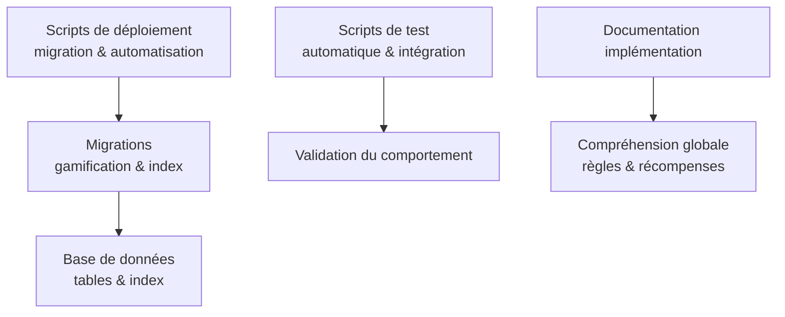
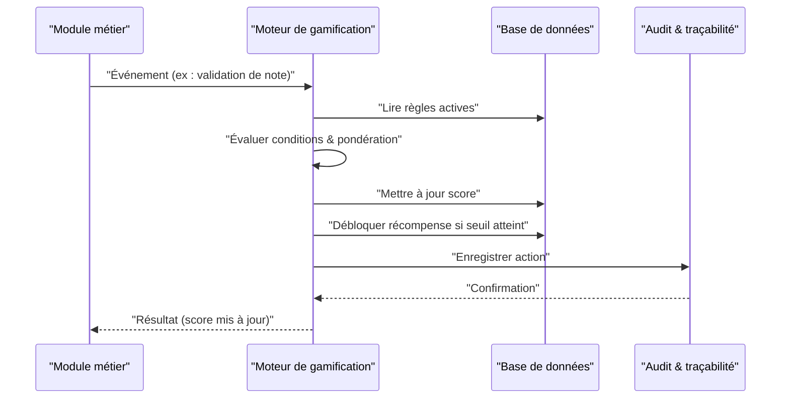
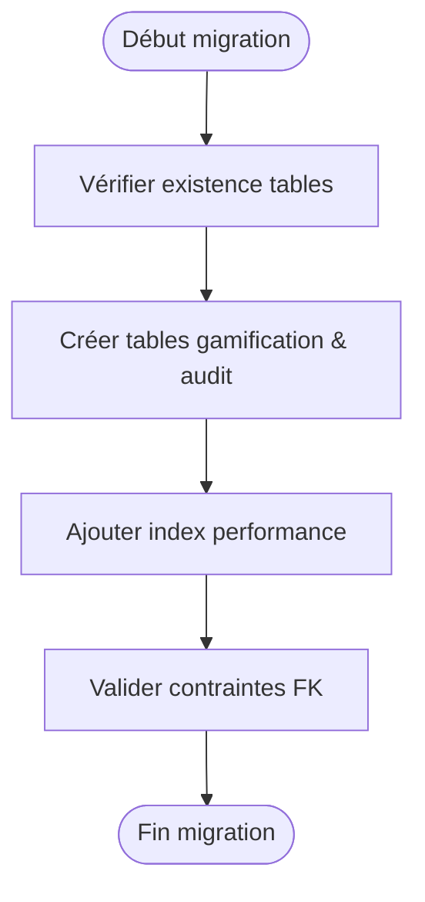
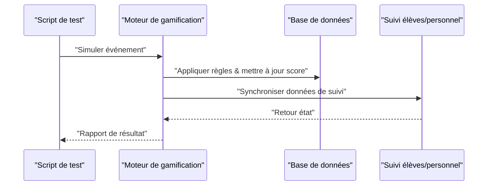
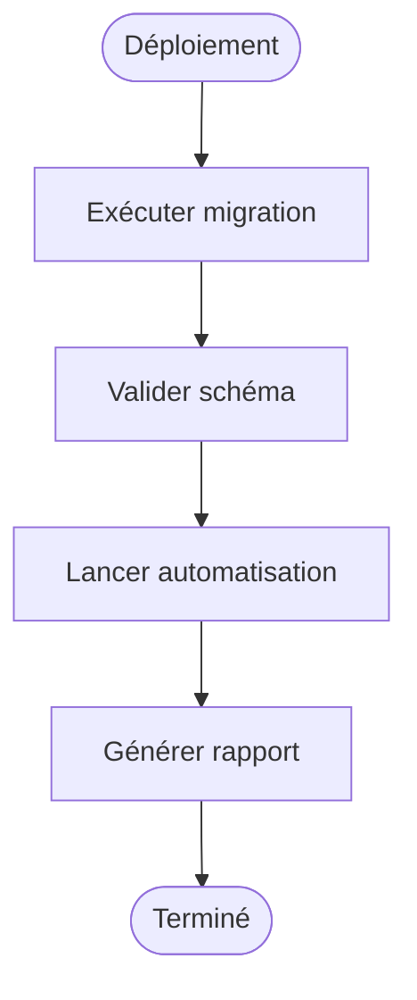
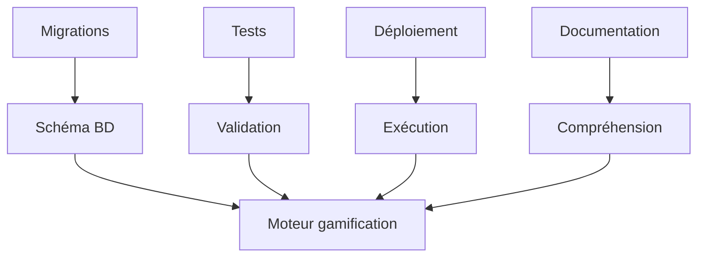

# Système de Gamification

<cite>
**Fichiers référencés dans ce document**
- [037-gamification-tracabilite.ts](file://backend/database/migrations/037-gamification-tracabilite.ts)
- [038-index-performance-gamification-suivi.ts](file://backend/database/migrations/038-index-performance-gamification-suivi.ts)
- [039-scoring-personnel.ts](file://backend/database/migrations/039-scoring-personnel.ts)
- [test-gamification-automatique.ts](file://backend/scripts/test-gamification-automatique.ts)
- [test-gamification-integration.ts](file://backend/scripts/test-gamification-integration.ts)
- [run-gamification-migration.sh](file://scripts/run-gamification-migration.sh)
- [run-gamification-automation.sh](file://scripts/run-gamification-automation.sh)
- [IMPLEMENTATION-GAMIFICATION-RESUME.md](file://docs/implementations/IMPLEMENTATION-GAMIFICATION-RESUME.md)
</cite>

## Table des matières
1. [Introduction](#introduction)
2. [Structure du projet](#structure-du-projet)
3. [Composants clés](#composants-clés)
4. [Vue d’ensemble de l’architecture](#vue-densemble-de-larchitecture)
5. [Analyse détaillée des composants](#analyse-detaillee-des-composants)
6. [Analyse des dépendances](#analyse-des-dependances)
7. [Considérations de performance](#considerations-de-performance)
8. [Guide de dépannage](#guide-de-depannage)
9. [Conclusion](#conclusion)
10. [Annexes](#annexes)

## Introduction
Ce document décrit le système de gamification d’eLISAschool : comment les points sont attribués automatiquement, comment les règles de gamification sont configurables, et comment les récompenses peuvent être personnalisées. Il couvre les entités de gamification, les déclencheurs (triggers), les intégrations avec les modules de suivi élèves et personnel, ainsi que les aspects de performance (caching des scores), la traçabilité et l’audit des actions.

## Structure du projet
Le système de gamification est principalement défini par des migrations de base de données et des scripts de test/utilisation. Les éléments pertinents se trouvent dans :
- Migrations de schéma et d’index pour la gamification et son intégration au suivi
- Scripts de test automatisé et d’intégration pour valider le comportement
- Scripts de déploiement et d’exécution des migrations et de l’automatisation
- Documentation résumée de l’implémentation

**Sources de diagramme**
- [037-gamification-tracabilite.ts](file://backend/database/migrations/037-gamification-tracabilite.ts)
- [038-index-performance-gamification-suivi.ts](file://backend/database/migrations/038-index-performance-gamification-suivi.ts)
- [test-gamification-automatique.ts](file://backend/scripts/test-gamification-automatique.ts)
- [test-gamification-integration.ts](file://backend/scripts/test-gamification-integration.ts)
- [run-gamification-migration.sh](file://scripts/run-gamification-migration.sh)
- [run-gamification-automation.sh](file://scripts/run-gamification-automation.sh)
- [IMPLEMENTATION-GAMIFICATION-RESUME.md](file://docs/implementations/IMPLEMENTATION-GAMIFICATION-RESUME.md)

**Sources de section**
- [037-gamification-tracabilite.ts](file://backend/database/migrations/037-gamification-tracabilite.ts)
- [038-index-performance-gamification-suivi.ts](file://backend/database/migrations/038-index-performance-gamification-suivi.ts)
- [039-scoring-personnel.ts](file://backend/database/migrations/039-scoring-personnel.ts)
- [test-gamification-automatique.ts](file://backend/scripts/test-gamification-automatique.ts)
- [test-gamification-integration.ts](file://backend/scripts/test-gamification-integration.ts)
- [run-gamification-migration.sh](file://scripts/run-gamification-migration.sh)
- [run-gamification-automation.sh](file://scripts/run-gamification-automation.sh)
- [IMPLEMENTATION-GAMIFICATION-RESUME.md](file://docs/implementations/IMPLEMENTATION-GAMIFICATION-RESUME.md)

## Composants clés
- Entités de gamification : tables et structures de données pour les règles, les événements, les scores et les récompenses.
- Déclencheurs (triggers) : mécanismes qui détectent des événements (par exemple, réussite d’une évaluation, présence en classe) et appliquent des règles.
- Scoring automatique : calcul et attribution de points en fonction des règles activées.
- Récompenses personnalisables : badges, niveaux, ou avantages liés à l’atteinte de seuils de score.
- Intégrations : liens avec les modules de suivi élèves et personnel pour enrichir les événements et les scores.
- Traçabilité et audit : historique des actions de gamification pour transparence et contrôle.

**Sources de section**
- [037-gamification-tracabilite.ts](file://backend/database/migrations/037-gamification-tracabilite.ts)
- [038-index-performance-gamification-suivi.ts](file://backend/database/migrations/038-index-performance-gamification-suivi.ts)
- [039-scoring-personnel.ts](file://backend/database/migrations/039-scoring-personnel.ts)

## Vue d’ensemble de l’architecture
Le système suit un flux événementiel :
- Un événement métier (par exemple, une note validée) est émis.
- Le moteur de gamification évalue les règles correspondantes.
- Si une règle est satisfaite, les points sont ajoutés et une récompense peut être débloquée.
- L’action est tracée pour l’audit et les rapports.

[Ce diagramme illustre un flux conceptuel ; il n’est pas lié à des fichiers spécifiques]

## Analyse détaillée des composants

### Migrations de schéma et d’index
- Migration de traçabilité : définit les tables et relations nécessaires pour enregistrer les actions de gamification et leur contexte.
- Index de performance : optimise les requêtes liées aux événements, scores et suivi élève/personnel.
- Migration scoring personnel : étend le scoring aux membres du personnel, permettant des règles spécifiques (présence, formation, etc.).

**Sources de diagramme**
- [037-gamification-tracabilite.ts](file://backend/database/migrations/037-gamification-tracabilite.ts)
- [038-index-performance-gamification-suivi.ts](file://backend/database/migrations/038-index-performance-gamification-suivi.ts)
- [039-scoring-personnel.ts](file://backend/database/migrations/039-scoring-personnel.ts)

**Sources de section**
- [037-gamification-tracabilite.ts](file://backend/database/migrations/037-gamification-tracabilite.ts)
- [038-index-performance-gamification-suivi.ts](file://backend/database/migrations/038-index-performance-gamification-suivi.ts)
- [039-scoring-personnel.ts](file://backend/database/migrations/039-scoring-personnel.ts)

### Scripts de test et d’intégration
- Test automatique : simule des événements et vérifie l’attribution de points et le déblocage de récompenses.
- Test d’intégration : valide les interactions entre gamification et modules de suivi élèves/personnel.

**Sources de diagramme**
- [test-gamification-automatique.ts](file://backend/scripts/test-gamification-automatique.ts)
- [test-gamification-integration.ts](file://backend/scripts/test-gamification-integration.ts)

**Sources de section**
- [test-gamification-automatique.ts](file://backend/scripts/test-gamification-automatique.ts)
- [test-gamification-integration.ts](file://backend/scripts/test-gamification-integration.ts)

### Scripts de déploiement et d’automatisation
- run-gamification-migration.sh : exécute les migrations de schéma et d’index.
- run-gamification-automation.sh : lance les tests et tâches planifiées pour l’automatisation du scoring.

**Sources de diagramme**
- [run-gamification-migration.sh](file://scripts/run-gamification-migration.sh)
- [run-gamification-automation.sh](file://scripts/run-gamification-automation.sh)

**Sources de section**
- [run-gamification-migration.sh](file://scripts/run-gamification-migration.sh)
- [run-gamification-automation.sh](file://scripts/run-gamification-automation.sh)

### Documentation d’implémentation
- IMPLEMENTATION-GAMIFICATION-RESUME.md : synthèse des règles, récompenses et intégrations mises en œuvre.

**Sources de section**
- [IMPLEMENTATION-GAMIFICATION-RESUME.md](file://docs/implementations/IMPLEMENTATION-GAMIFICATION-RESUME.md)

## Analyse des dépendances
Les composants dépendent des migrations pour la structure de données, des scripts de test pour la validation, et des scripts de déploiement pour l’exécution. La documentation résume les choix d’implémentation.

[Ce diagramme est conceptuel et ne mape pas directement des fichiers spécifiques]

**Sources de section**
- [037-gamification-tracabilite.ts](file://backend/database/migrations/037-gamification-tracabilite.ts)
- [038-index-performance-gamification-suivi.ts](file://backend/database/migrations/038-index-performance-gamification-suivi.ts)
- [039-scoring-personnel.ts](file://backend/database/migrations/039-scoring-personnel.ts)
- [test-gamification-automatique.ts](file://backend/scripts/test-gamification-automatique.ts)
- [test-gamification-integration.ts](file://backend/scripts/test-gamification-integration.ts)
- [run-gamification-migration.sh](file://scripts/run-gamification-migration.sh)
- [run-gamification-automation.sh](file://scripts/run-gamification-automation.sh)
- [IMPLEMENTATION-GAMIFICATION-RESUME.md](file://docs/implementations/IMPLEMENTATION-GAMIFICATION-RESUME.md)

## Considérations de performance
- Indexation : les index sur les colonnes d’événements et de scores accélèrent les évaluations de règles et les agrégations.
- Caching des scores : envisager un cache en mémoire pour les scores courants afin de réduire la charge sur la base de données lors de lectures fréquentes.
- Batch processing : regrouper les mises à jour de scores pour limiter les transactions coûteuses.
- Monitoring : surveiller les temps de réponse des requêtes critiques et ajuster les index selon les patterns d’accès.

[Section générale sans analyse de fichiers spécifiques]

## Guide de dépannage
- Vérifier l’exécution des migrations : s’assurer que les tables et index sont créés correctement.
- Valider les règles actives : confirmer que les conditions sont bien configurées et que les événements correspondent.
- Examiner les logs d’audit : utiliser la traçabilité pour identifier les échecs ou anomalies dans l’attribution de points.
- Tester avec les scripts fournis : exécuter les tests automatiques et d’intégration pour isoler les problèmes.

**Sources de section**
- [037-gamification-tracabilite.ts](file://backend/database/migrations/037-gamification-tracabilite.ts)
- [test-gamification-automatique.ts](file://backend/scripts/test-gamification-automatique.ts)
- [test-gamification-integration.ts](file://backend/scripts/test-gamification-integration.ts)

## Conclusion
Le système de gamification d’eLISAschool repose sur des migrations robustes, des scripts de test fiables et une architecture événementielle claire. Les performances sont optimisées par des index ciblés, et la traçabilité assure un audit complet des actions. Pour une configuration avancée, consulter la documentation d’implémentation et adapter les règles et récompenses aux besoins spécifiques de l’établissement.

[Section de synthèse sans analyse de fichiers spécifiques]

## Annexes
- Exemples de création de règles de gamification : définir des conditions basées sur les événements de suivi élèves/personnel.
- Configuration des récompenses : associer des seuils de score à des badges ou avantages.
- Suivi des performances : exploiter les logs d’audit et les indicateurs de scoring pour mesurer l’impact des règles.

[Section informative sans analyse de fichiers spécifiques]