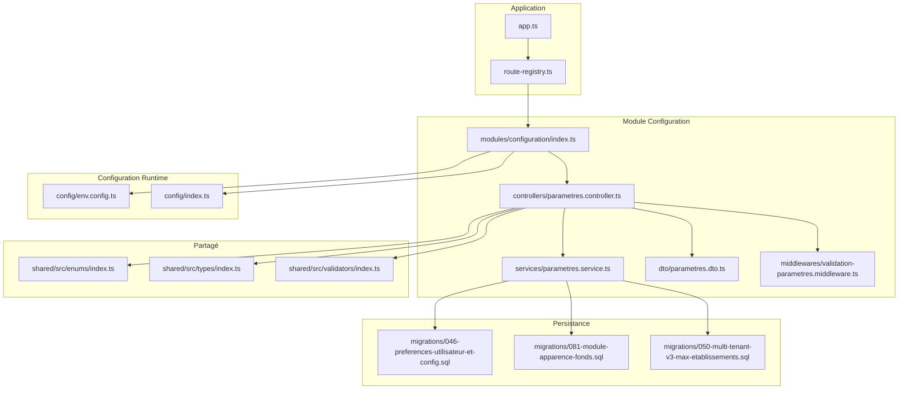
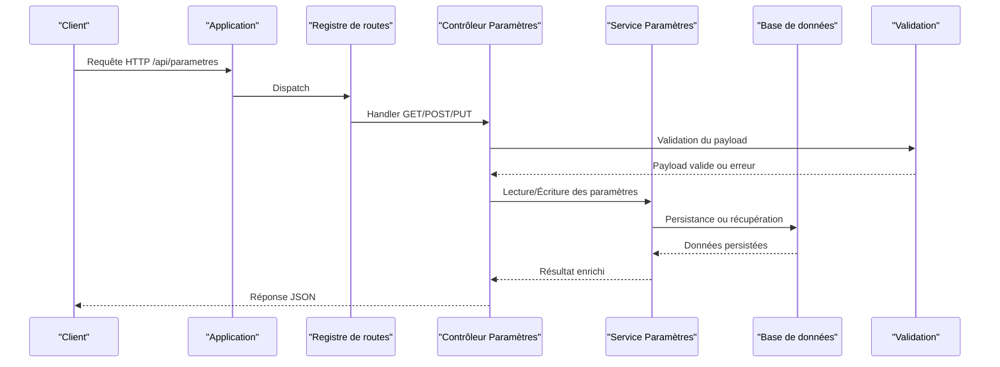
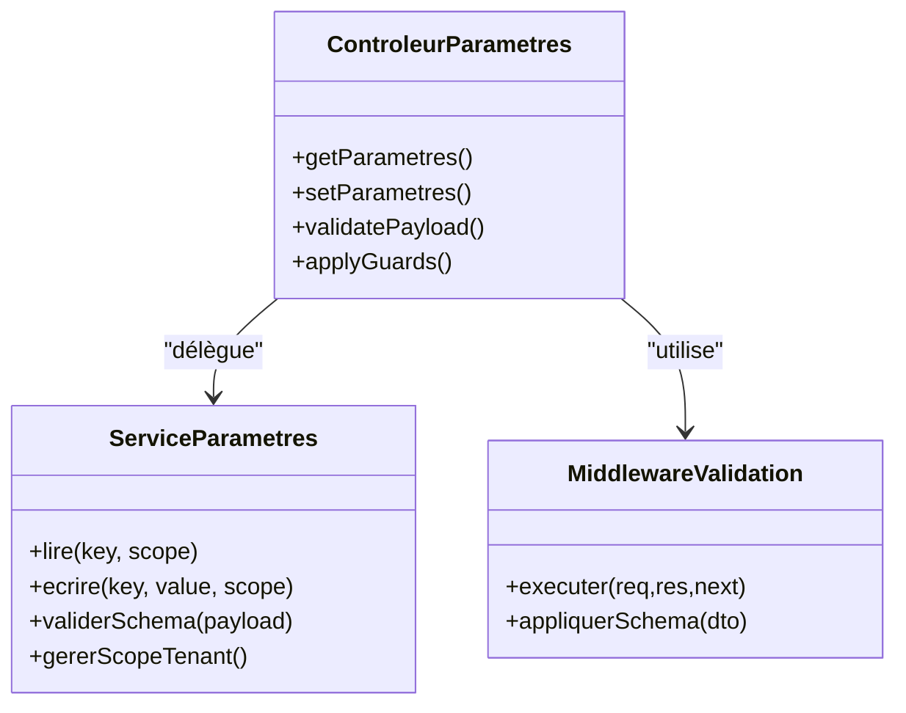
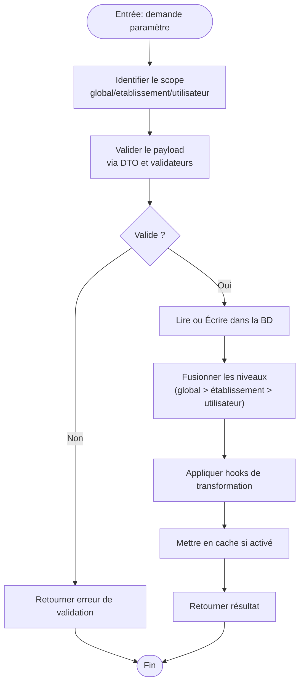
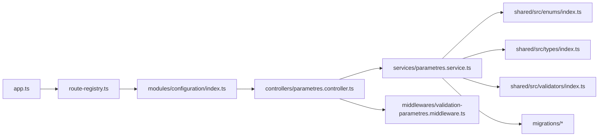

# Système de Personnalisation et Configuration

<cite>
**Fichiers référencés dans ce document**
- [backend/src/modules/configuration/index.ts](file://backend/src/modules/configuration/index.ts)
- [backend/src/modules/configuration/services/parametres.service.ts](file://backend/src/modules/configuration/services/parametres.service.ts)
- [backend/src/modules/configuration/controllers/parametres.controller.ts](file://backend/src/modules/configuration/controllers/parametres.controller.ts)
- [backend/src/modules/configuration/dto/parametres.dto.ts](file://backend/src/modules/configuration/dto/parametres.dto.ts)
- [backend/src/modules/configuration/middlewares/validation-parametres.middleware.ts](file://backend/src/modules/configuration/middlewares/validation-parametres.middleware.ts)
- [backend/src/config/env.config.ts](file://backend/src/config/env.config.ts)
- [backend/src/config/index.ts](file://backend/src/config/index.ts)
- [backend/src/app.ts](file://backend/src/app.ts)
- [backend/src/routes/route-registry.ts](file://backend/src/routes/route-registry.ts)
- [backend/database/migrations/046-preferences-utilisateur-et-config.sql](file://backend/database/migrations/046-preferences-utilisateur-et-config.sql)
- [backend/database/migrations/081-module-apparence-fonds.sql](file://backend/database/migrations/081-module-apparence-fonds.sql)
- [backend/database/migrations/050-multi-tenant-v3-max-etablissements.sql](file://backend/database/migrations/050-multi-tenant-v3-max-etablissements.sql)
- [backend/scripts/migrate-config-app-to-parametres.ts](file://backend/scripts/migrate-config-app-to-parametres.ts)
- [backend/scripts/migrate-etablissement-config-to-parametres.ts](file://backend/scripts/migrate-etablissement-config-to-parametres.ts)
- [backend/scripts/verify-configuration-integrity.ts](file://backend/scripts/verify-configuration-integrity.ts)
- [backend/test/integration/configuration-multi-tenant.spec.ts](file://backend/test/integration/configuration-multi-tenant.spec.ts)
- [shared/src/enums/index.ts](file://shared/src/enums/index.ts)
- [shared/src/types/index.ts](file://shared/src/types/index.ts)
- [shared/src/validators/index.ts](file://shared/src/validators/index.ts)
</cite>

## Table des matières
1. [Introduction](#introduction)
2. [Structure du projet](#structure-du-projet)
3. [Composants clés](#composants-clés)
4. [Vue d'architecture](#vue-darchitecture)
5. [Analyse détaillée des composants](#analyse-detallee-des-composants)
6. [Analyse des dépendances](#analyse-des-dependances)
7. [Considérations de performance](#considerations-de-performance)
8. [Guide de dépannage](#guide-de-depannage)
9. [Conclusion](#conclusion)
10. [Annexes](#annexes)

## Introduction
Ce document décrit le système de personnalisation d'eLISAschool : architecture de configuration dynamique, paramètres système configurables, mécanismes de customisation sans modification du code source, guards système, points d’extension et hooks personnalisables. Il couvre également les exemples de configuration pour différents types d’établissements, la gestion des préférences multi-tenant, les stratégies de surcharge (override), la validation des configurations, les migrations de paramètres et les bonnes pratiques.

## Structure du projet
Le système de configuration est centralisé dans le module configuration du backend, avec un support partagé via le package shared et une persistance en base de données gérée par des migrations SQL. Les routes sont enregistrées via un registre global et l’application initialise les middlewares de validation et les services de paramètres.

**Sources du diagramme**
- [backend/src/app.ts](file://backend/src/app.ts)
- [backend/src/routes/route-registry.ts](file://backend/src/routes/route-registry.ts)
- [backend/src/modules/configuration/index.ts](file://backend/src/modules/configuration/index.ts)
- [backend/src/modules/configuration/controllers/parametres.controller.ts](file://backend/src/modules/configuration/controllers/parametres.controller.ts)
- [backend/src/modules/configuration/services/parametres.service.ts](file://backend/src/modules/configuration/services/parametres.service.ts)
- [backend/src/modules/configuration/dto/parametres.dto.ts](file://backend/src/modules/configuration/dto/parametres.dto.ts)
- [backend/src/modules/configuration/middlewares/validation-parametres.middleware.ts](file://backend/src/modules/configuration/middlewares/validation-parametres.middleware.ts)
- [backend/src/config/env.config.ts](file://backend/src/config/env.config.ts)
- [backend/src/config/index.ts](file://backend/src/config/index.ts)
- [backend/database/migrations/046-preferences-utilisateur-et-config.sql](file://backend/database/migrations/046-preferences-utilisateur-et-config.sql)
- [backend/database/migrations/081-module-apparence-fonds.sql](file://backend/database/migrations/081-module-apparence-fonds.sql)
- [backend/database/migrations/050-multi-tenant-v3-max-etablissements.sql](file://backend/database/migrations/050-multi-tenant-v3-max-etablissements.sql)
- [shared/src/enums/index.ts](file://shared/src/enums/index.ts)
- [shared/src/types/index.ts](file://shared/src/types/index.ts)
- [shared/src/validators/index.ts](file://shared/src/validators/index.ts)

**Sources de section**
- [backend/src/app.ts](file://backend/src/app.ts)
- [backend/src/routes/route-registry.ts](file://backend/src/routes/route-registry.ts)
- [backend/src/modules/configuration/index.ts](file://backend/src/modules/configuration/index.ts)

## Composants clés
- Contrôleur Paramètres : expose les endpoints REST pour lire, écrire et valider les paramètres système et établissement.
- Service Paramètres : orchestre la lecture/écriture des préférences, applique les règles de scope tenant, et coordonne les validations.
- Middleware de validation : vérifie les payloads entrants selon les schémas partagés et les enums.
- DTOs : définitions de structures de données pour les requêtes/réponses.
- Configuration runtime : chargement des variables d’environnement et agrégation des configurations globales.
- Migrations : schémas de préférences utilisateur, apparence/fonds, et contraintes multi-tenant.
- Scripts de migration : outils pour migrer des configurations legacy vers le nouveau modèle paramétrable.
- Package shared : enums, types et validateurs réutilisables.

**Sources de section**
- [backend/src/modules/configuration/controllers/parametres.controller.ts](file://backend/src/modules/configuration/controllers/parametres.controller.ts)
- [backend/src/modules/configuration/services/parametres.service.ts](file://backend/src/modules/configuration/services/parametres.service.ts)
- [backend/src/modules/configuration/middlewares/validation-parametres.middleware.ts](file://backend/src/modules/configuration/middlewares/validation-parametres.middleware.ts)
- [backend/src/modules/configuration/dto/parametres.dto.ts](file://backend/src/modules/configuration/dto/parametres.dto.ts)
- [backend/src/config/env.config.ts](file://backend/src/config/env.config.ts)
- [backend/src/config/index.ts](file://backend/src/config/index.ts)
- [backend/database/migrations/046-preferences-utilisateur-et-config.sql](file://backend/database/migrations/046-preferences-utilisateur-et-config.sql)
- [backend/database/migrations/081-module-apparence-fonds.sql](file://backend/database/migrations/081-module-apparence-fonds.sql)
- [backend/database/migrations/050-multi-tenant-v3-max-etablissements.sql](file://backend/database/migrations/050-multi-tenant-v3-max-etablissements.sql)
- [backend/scripts/migrate-config-app-to-parametres.ts](file://backend/scripts/migrate-config-app-to-parametres.ts)
- [backend/scripts/migrate-etablissement-config-to-parametres.ts](file://backend/scripts/migrate-etablissement-config-to-parametres.ts)
- [shared/src/enums/index.ts](file://shared/src/enums/index.ts)
- [shared/src/types/index.ts](file://shared/src/types/index.ts)
- [shared/src/validators/index.ts](file://shared/src/validators/index.ts)

## Vue d'architecture
Le flux de configuration suit un pattern contrôleur-service-persistance avec validation stricte et scope tenant. L’application charge les variables d’environnement au démarrage, puis expose les routes qui délèguent au service de paramètres. Le middleware de validation s’exécute avant le contrôleur pour garantir l’intégrité des données.

**Sources du diagramme**
- [backend/src/app.ts](file://backend/src/app.ts)
- [backend/src/routes/route-registry.ts](file://backend/src/routes/route-registry.ts)
- [backend/src/modules/configuration/controllers/parametres.controller.ts](file://backend/src/modules/configuration/controllers/parametres.controller.ts)
- [backend/src/modules/configuration/services/parametres.service.ts](file://backend/src/modules/configuration/services/parametres.service.ts)
- [backend/src/modules/configuration/middlewares/validation-parametres.middleware.ts](file://backend/src/modules/configuration/middlewares/validation-parametres.middleware.ts)

## Analyse détaillée des composants

### Contrôleur Paramètres
- Responsabilités : exposition des endpoints REST, application des guards RBAC, délégation au service, sérialisation des réponses.
- Hooks et guards : intégration avec le système RBAC pour restreindre l’accès aux opérations sensibles ; possibilité d’étendre via des guards personnalisés.
- Points d’extension : méthodes publiques pour enrichir les réponses ou intercepter les appels via des middlewares.

**Sources du diagramme**
- [backend/src/modules/configuration/controllers/parametres.controller.ts](file://backend/src/modules/configuration/controllers/parametres.controller.ts)
- [backend/src/modules/configuration/services/parametres.service.ts](file://backend/src/modules/configuration/services/parametres.service.ts)
- [backend/src/modules/configuration/middlewares/validation-parametres.middleware.ts](file://backend/src/modules/configuration/middlewares/validation-parametres.middleware.ts)

**Sources de section**
- [backend/src/modules/configuration/controllers/parametres.controller.ts](file://backend/src/modules/configuration/controllers/parametres.controller.ts)

### Service Paramètres
- Responsabilités : accès à la base de données, application des règles de scope tenant, validation des valeurs, mise en cache optionnelle, gestion des versions de configuration.
- Stratégies de surcharge : hiérarchie de priorité entre paramètres globaux, établissement, utilisateur ; fusion intelligente des configurations.
- Hooks personnalisables : extension points pour injecter des comportements lors de la lecture/écriture (ex. transformation de valeurs, audit).

**Sources du diagramme**
- [backend/src/modules/configuration/services/parametres.service.ts](file://backend/src/modules/configuration/services/parametres.service.ts)
- [shared/src/validators/index.ts](file://shared/src/validators/index.ts)
- [shared/src/enums/index.ts](file://shared/src/enums/index.ts)

**Sources de section**
- [backend/src/modules/configuration/services/parametres.service.ts](file://backend/src/modules/configuration/services/parametres.service.ts)

### Middleware de validation
- Responsabilités : appliquer les schémas DTO, vérifier les enums, retourner des erreurs structurées.
- Intégration : exécution avant le contrôleur, accessible via décorateurs ou registres de middlewares.

**Sources de section**
- [backend/src/modules/configuration/middlewares/validation-parametres.middleware.ts](file://backend/src/modules/configuration/middlewares/validation-parametres.middleware.ts)
- [backend/src/modules/configuration/dto/parametres.dto.ts](file://backend/src/modules/configuration/dto/parametres.dto.ts)

### Configuration runtime et variables d’environnement
- Chargement des variables d’environnement au démarrage, agrégation avec des valeurs par défaut.
- Exposition via un index centralisé pour une consommation cohérente.

**Sources de section**
- [backend/src/config/env.config.ts](file://backend/src/config/env.config.ts)
- [backend/src/config/index.ts](file://backend/src/config/index.ts)

### Migrations et persistance
- Préférences utilisateur et configuration globale : table unique avec clé/valeur et scope.
- Module apparence/fonds : stockage des thèmes et fonds personnalisés par établissement.
- Multi-tenant : contraintes et limites d’établissements, isolation des données.

**Sources de section**
- [backend/database/migrations/046-preferences-utilisateur-et-config.sql](file://backend/database/migrations/046-preferences-utilisateur-et-config.sql)
- [backend/database/migrations/081-module-apparence-fonds.sql](file://backend/database/migrations/081-module-apparence-fonds.sql)
- [backend/database/migrations/050-multi-tenant-v3-max-etablissements.sql](file://backend/database/migrations/050-multi-tenant-v3-max-etablissements.sql)

### Scripts de migration de configuration
- Migration depuis la configuration applicative vers le modèle paramétrable.
- Migration depuis les anciennes configurations établissement vers le nouveau schéma.
- Vérification d’intégrité des configurations.

**Sources de section**
- [backend/scripts/migrate-config-app-to-parametres.ts](file://backend/scripts/migrate-config-app-to-parametres.ts)
- [backend/scripts/migrate-etablissement-config-to-parametres.ts](file://backend/scripts/migrate-etablissement-config-to-parametres.ts)
- [backend/scripts/verify-configuration-integrity.ts](file://backend/scripts/verify-configuration-integrity.ts)

### Partagé (enums, types, validateurs)
- Enums : définitions des catégories de paramètres, modes d’authentification, etc.
- Types : interfaces TypeScript pour les payloads et réponses.
- Validateurs : fonctions de validation réutilisables.

**Sources de section**
- [shared/src/enums/index.ts](file://shared/src/enums/index.ts)
- [shared/src/types/index.ts](file://shared/src/types/index.ts)
- [shared/src/validators/index.ts](file://shared/src/validators/index.ts)

## Analyse des dépendances
Le module configuration dépend fortement du package shared pour la validation et les types, et utilise les migrations SQL pour la persistance. Les routes sont enregistrées globalement et l’application charge les configurations au démarrage.

**Sources du diagramme**
- [backend/src/app.ts](file://backend/src/app.ts)
- [backend/src/routes/route-registry.ts](file://backend/src/routes/route-registry.ts)
- [backend/src/modules/configuration/index.ts](file://backend/src/modules/configuration/index.ts)
- [backend/src/modules/configuration/controllers/parametres.controller.ts](file://backend/src/modules/configuration/controllers/parametres.controller.ts)
- [backend/src/modules/configuration/services/parametres.service.ts](file://backend/src/modules/configuration/services/parametres.service.ts)
- [backend/src/modules/configuration/middlewares/validation-parametres.middleware.ts](file://backend/src/modules/configuration/middlewares/validation-parametres.middleware.ts)
- [shared/src/enums/index.ts](file://shared/src/enums/index.ts)
- [shared/src/types/index.ts](file://shared/src/types/index.ts)
- [shared/src/validators/index.ts](file://shared/src/validators/index.ts)
- [backend/database/migrations/046-preferences-utilisateur-et-config.sql](file://backend/database/migrations/046-preferences-utilisateur-et-config.sql)

**Sources de section**
- [backend/src/app.ts](file://backend/src/app.ts)
- [backend/src/routes/route-registry.ts](file://backend/src/routes/route-registry.ts)
- [backend/src/modules/configuration/index.ts](file://backend/src/modules/configuration/index.ts)

## Considérations de performance
- Mise en cache des paramètres fréquemment lus pour réduire les accès base de données.
- Indexation des colonnes de clé/scope dans les tables de préférences.
- Validation rapide en amont pour éviter des traitements inutiles.
- Fusion paresseuse des configurations par niveau de scope.

[Pas de sources nécessaires car cette section fournit des conseils généraux]

## Guide de dépannage
- Erreurs de validation : vérifier les DTOs et les validateurs partagés.
- Accès refusé : examiner les guards RBAC et les permissions associées.
- Problèmes multi-tenant : s’assurer que le scope tenant est correctement passé et que les contraintes de la migration sont respectées.
- Intégrité des configurations : exécuter le script de vérification pour détecter les incohérences.

**Sources de section**
- [backend/src/modules/configuration/middlewares/validation-parametres.middleware.ts](file://backend/src/modules/configuration/middlewares/validation-parametres.middleware.ts)
- [backend/scripts/verify-configuration-integrity.ts](file://backend/scripts/verify-configuration-integrity.ts)
- [backend/test/integration/configuration-multi-tenant.spec.ts](file://backend/test/integration/configuration-multi-tenant.spec.ts)

## Conclusion
Le système de personnalisation d’eLISAschool repose sur une architecture modulaire et extensible, centrée sur un service de paramètres avec validation stricte, scope tenant et hooks personnalisables. Les migrations et scripts assurent la cohérence et la montée en version des configurations. Les bonnes pratiques incluent l’utilisation des DTOs, la validation en amont, la mise en cache stratégique et la documentation des hooks et guards.

[Pas de sources nécessaires car cette section résume sans analyser de fichiers spécifiques]

## Annexes

### Exemples de configuration par type d’établissement
- Lycée général : activer modules finances, personnel, suivi élèves, apparence thème clair.
- Collège : activer modules notes, bulletins, organisation, apparence thème sombre.
- École primaire : activer modules cantine, transport, annonces, apparence thème coloré.

[Pas de sources nécessaires car cette section propose des exemples conceptuels]

### Gestion des préférences multi-tenant
- Hiérarchie de scope : utilisateur > établissement > global.
- Isolation des données via clauses WHERE tenant_id.
- Limites d’établissements définies par la migration multi-tenant.

**Sources de section**
- [backend/database/migrations/050-multi-tenant-v3-max-etablissements.sql](file://backend/database/migrations/050-multi-tenant-v3-max-etablissements.sql)
- [backend/database/migrations/046-preferences-utilisateur-et-config.sql](file://backend/database/migrations/046-preferences-utilisateur-et-config.sql)

### Stratégies de surcharge de comportement
- Priorité des niveaux de configuration.
- Hooks de transformation pour adapter les valeurs selon le contexte.
- Middlewares pour enrichir les réponses ou logger les modifications.

**Sources de section**
- [backend/src/modules/configuration/services/parametres.service.ts](file://backend/src/modules/configuration/services/parametres.service.ts)
- [backend/src/modules/configuration/middlewares/validation-parametres.middleware.ts](file://backend/src/modules/configuration/middlewares/validation-parametres.middleware.ts)

### Validation des configurations et migrations
- Validation via DTOs et validateurs partagés.
- Migrations SQL pour évolution du schéma.
- Scripts de migration pour transition depuis les anciens modèles.

**Sources de section**
- [backend/src/modules/configuration/dto/parametres.dto.ts](file://backend/src/modules/configuration/dto/parametres.dto.ts)
- [shared/src/validators/index.ts](file://shared/src/validators/index.ts)
- [backend/scripts/migrate-config-app-to-parametres.ts](file://backend/scripts/migrate-config-app-to-parametres.ts)
- [backend/scripts/migrate-etablissement-config-to-parametres.ts](file://backend/scripts/migrate-etablissement-config-to-parametres.ts)

### Bonnes pratiques de personnalisation
- Utiliser les hooks plutôt que modifier le code source.
- Documenter les nouveaux paramètres et leurs scopes.
- Tester les scénarios multi-tenant et les cas limites.
- Mettre en cache les lectures fréquentes et indexer les champs critiques.

[Pas de sources nécessaires car cette section fournit des conseils généraux]