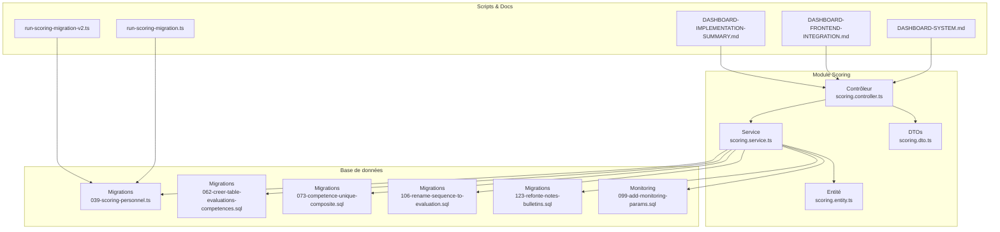
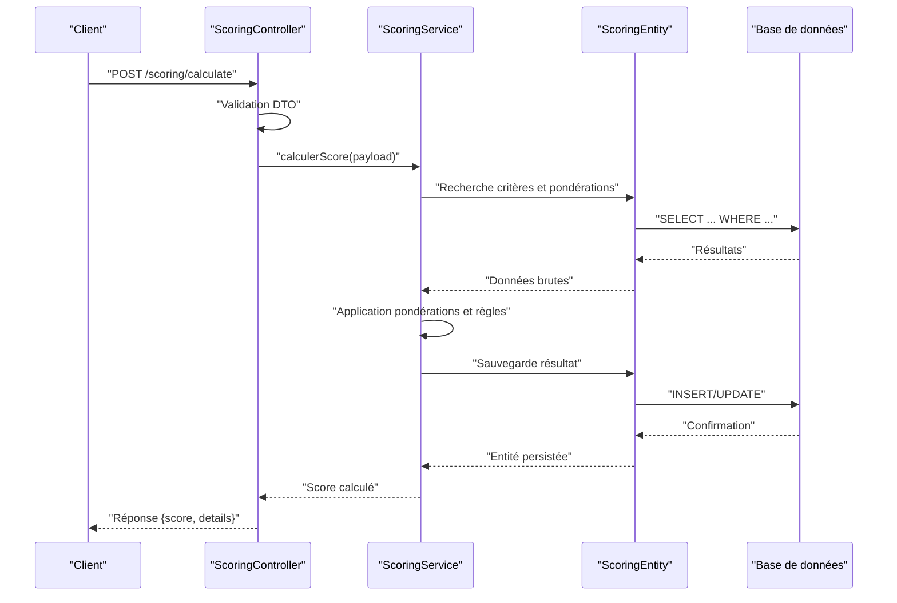
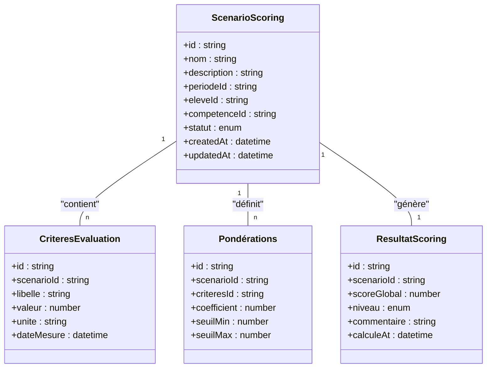
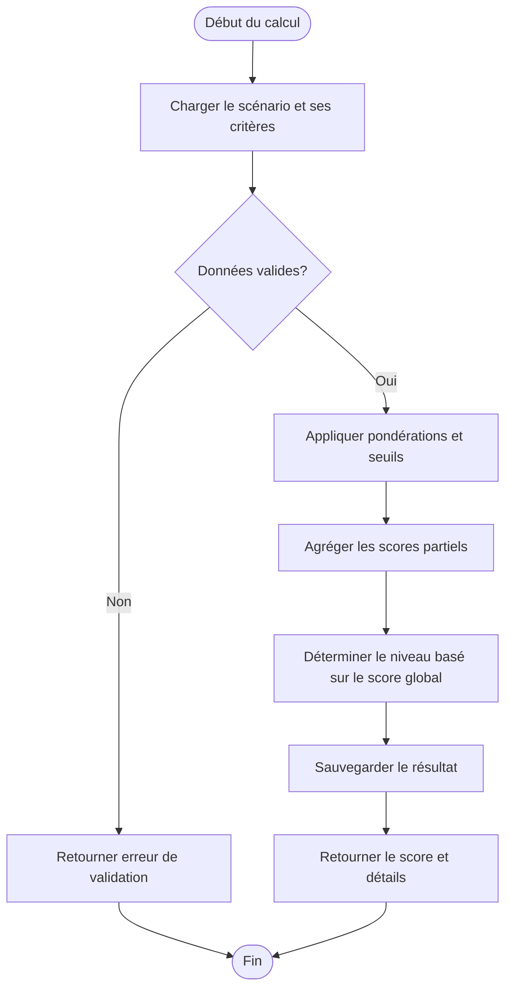
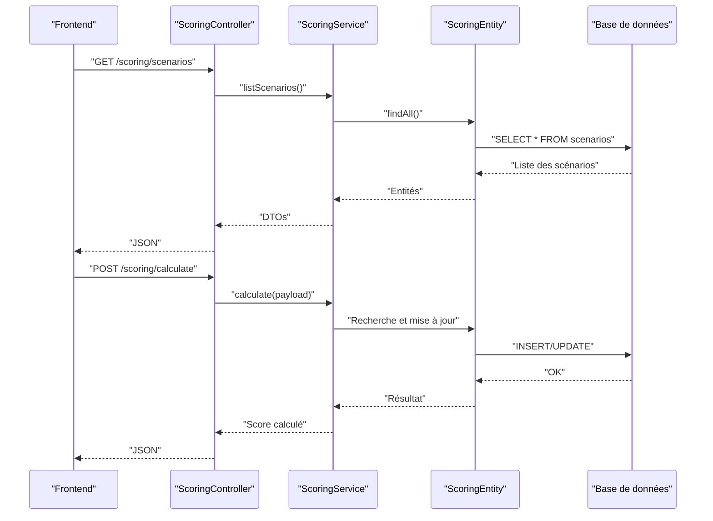
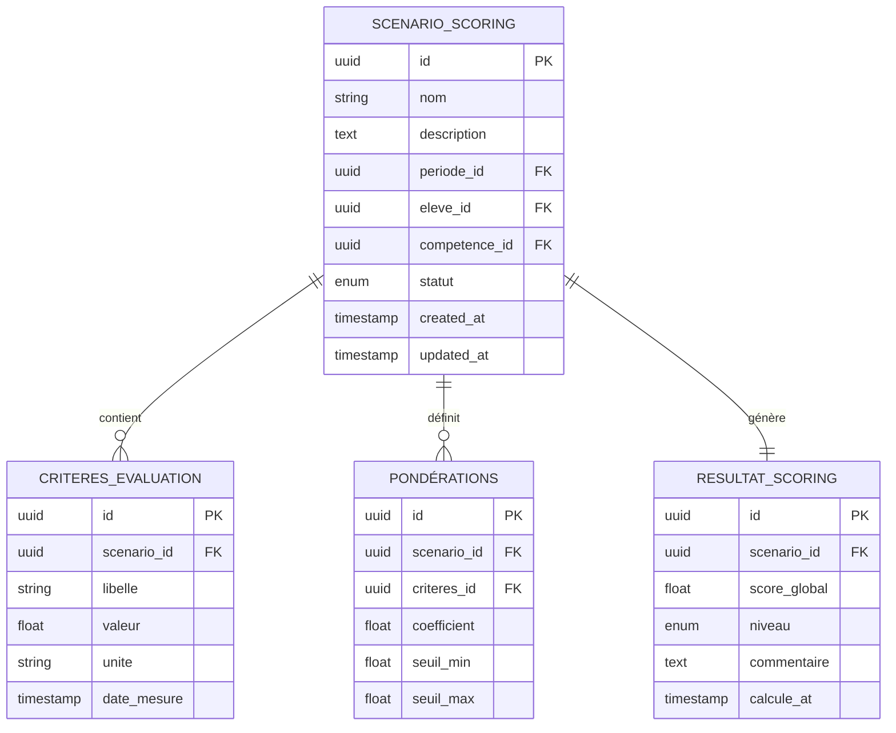
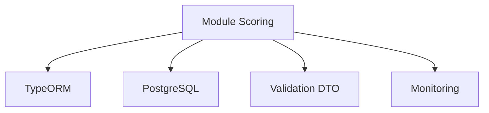

# Système de Scoring et Évaluation

<cite>
**Fichiers référencés dans ce document**
- [backend/src/modules/scoring/index.ts](file://backend/src/modules/scoring/index.ts)
- [backend/src/modules/scoring/controllers/scoring.controller.ts](file://backend/src/modules/scoring/controllers/scoring.controller.ts)
- [backend/src/modules/scoring/services/scoring.service.ts](file://backend/src/modules/scoring/services/scoring.service.ts)
- [backend/src/modules/scoring/entities/scoring.entity.ts](file://backend/src/modules/scoring/entities/scoring.entity.ts)
- [backend/src/modules/scoring/dto/scoring.dto.ts](file://backend/src/modules/scoring/dto/scoring.dto.ts)
- [backend/database/migrations/039-scoring-personnel.ts](file://backend/database/migrations/039-scoring-personnel.ts)
- [backend/scripts/run-scoring-migration.ts](file://backend/scripts/run-scoring-migration.ts)
- [backend/scripts/run-scoring-migration-v2.ts](file://backend/scripts/run-scoring-migration-v2.ts)
- [backend/database/migrations/062-creer-table-evaluations-competences.sql](file://backend/database/migrations/062-creer-table-evaluations-competences.sql)
- [backend/database/migrations/073-competence-unique-composite.sql](file://backend/database/migrations/073-competence-unique-composite.sql)
- [backend/database/migrations/099-add-monitoring-params.sql](file://backend/database/migrations/099-add-monitoring-params.sql)
- [backend/database/migrations/106-rename-sequence-to-evaluation.sql](file://backend/database/migrations/106-rename-sequence-to-evaluation.sql)
- [backend/database/migrations/123-refonte-notes-bulletins.sql](file://backend/database/migrations/123-refonte-notes-bulletins.sql)
- [backend/docs/DASHBOARD-SYSTEM.md](file://backend/docs/DASHBOARD-SYSTEM.md)
- [backend/docs/DASHBOARD-FRONTEND-INTEGRATION.md](file://backend/docs/DASHBOARD-FRONTEND-INTEGRATION.md)
- [backend/docs/DASHBOARD-IMPLEMENTATION-SUMMARY.md](file://backend/docs/DASHBOARD-IMPLEMENTATION-SUMMARY.md)
- [docs/analyses/ANALYSE-SCORING-PERSONNEL-COMPLET.md](file://docs/analyses/ANALYSE-SCORING-PERSONNEL-COMPLET.md)
</cite>

## Table des matières
1. [Introduction](#introduction)
2. [Structure du projet](#structure-du-projet)
3. [Composants principaux](#composants-principaux)
4. [Vue d'ensemble de l'architecture](#vue-densemble-de-larchitecture)
5. [Analyse détaillée des composants](#analyse-detaillee-des-composants)
6. [Analyse des dépendances](#analyse-des-dependances)
7. [Considérations de performance](#considerations-de-performance)
8. [Guide de dépannage](#guide-de-depannage)
9. [Conclusion](#conclusion)
10. [Annexes](#annexes)

## Introduction
Ce document présente le système de scoring et d'évaluation d'eLISAschool. Il explique les algorithmes de calcul des scores, les pondérations configurables, les critères personnalisables, ainsi que les entités liées aux évaluations et compétences. Il décrit également les mécanismes de calcul en temps réel, les règles de composition des scores, les rapports de performance, les optimisations de calcul, les index de performance et la cohérence des données de scoring.

## Structure du projet
Le module de scoring est organisé selon une architecture modulaire classique :
- Contrôleur REST pour exposer les endpoints
- Service contenant la logique métier et les algorithmes de calcul
- Entités TypeORM définissant les modèles de données
- DTOs pour la validation des requêtes/réponses
- Migrations SQL/TS pour le schéma et les évolutions
- Scripts de migration dédiés au scoring
- Documentation intégrée au dashboard et à l'intégration frontend

**Sources de diagramme**
- [backend/src/modules/scoring/controllers/scoring.controller.ts](file://backend/src/modules/scoring/controllers/scoring.controller.ts)
- [backend/src/modules/scoring/services/scoring.service.ts](file://backend/src/modules/scoring/services/scoring.service.ts)
- [backend/src/modules/scoring/entities/scoring.entity.ts](file://backend/src/modules/scoring/entities/scoring.entity.ts)
- [backend/src/modules/scoring/dto/scoring.dto.ts](file://backend/src/modules/scoring/dto/scoring.dto.ts)
- [backend/database/migrations/039-scoring-personnel.ts](file://backend/database/migrations/039-scoring-personnel.ts)
- [backend/database/migrations/062-creer-table-evaluations-competences.sql](file://backend/database/migrations/062-creer-table-evaluations-competences.sql)
- [backend/database/migrations/073-competence-unique-composite.sql](file://backend/database/migrations/073-competence-unique-composite.sql)
- [backend/database/migrations/106-rename-sequence-to-evaluation.sql](file://backend/database/migrations/106-rename-sequence-to-evaluation.sql)
- [backend/database/migrations/123-refonte-notes-bulletins.sql](file://backend/database/migrations/123-refonte-notes-bulletins.sql)
- [backend/database/migrations/099-add-monitoring-params.sql](file://backend/database/migrations/099-add-monitoring-params.sql)
- [backend/scripts/run-scoring-migration.ts](file://backend/scripts/run-scoring-migration.ts)
- [backend/scripts/run-scoring-migration-v2.ts](file://backend/scripts/run-scoring-migration-v2.ts)
- [backend/docs/DASHBOARD-SYSTEM.md](file://backend/docs/DASHBOARD-SYSTEM.md)
- [backend/docs/DASHBOARD-FRONTEND-INTEGRATION.md](file://backend/docs/DASHBOARD-FRONTEND-INTEGRATION.md)
- [backend/docs/DASHBOARD-IMPLEMENTATION-SUMMARY.md](file://backend/docs/DASHBOARD-IMPLEMENTATION-SUMMARY.md)

**Sources de section**
- [backend/src/modules/scoring/index.ts](file://backend/src/modules/scoring/index.ts)
- [backend/database/migrations/039-scoring-personnel.ts](file://backend/database/migrations/039-scoring-personnel.ts)
- [backend/database/migrations/062-creer-table-evaluations-competences.sql](file://backend/database/migrations/062-creer-table-evaluations-competences.sql)
- [backend/database/migrations/073-competence-unique-composite.sql](file://backend/database/migrations/073-competence-unique-composite.sql)
- [backend/database/migrations/106-rename-sequence-to-evaluation.sql](file://backend/database/migrations/106-rename-sequence-to-evaluation.sql)
- [backend/database/migrations/123-refonte-notes-bulletins.sql](file://backend/database/migrations/123-refonte-notes-bulletins.sql)
- [backend/database/migrations/099-add-monitoring-params.sql](file://backend/database/migrations/099-add-monitoring-params.sql)
- [backend/scripts/run-scoring-migration.ts](file://backend/scripts/run-scoring-migration.ts)
- [backend/scripts/run-scoring-migration-v2.ts](file://backend/scripts/run-scoring-migration-v2.ts)
- [backend/docs/DASHBOARD-SYSTEM.md](file://backend/docs/DASHBOARD-SYSTEM.md)
- [backend/docs/DASHBOARD-FRONTEND-INTEGRATION.md](file://backend/docs/DASHBOARD-FRONTEND-INTEGRATION.md)
- [backend/docs/DASHBOARD-IMPLEMENTATION-SUMMARY.md](file://backend/docs/DASHBOARD-IMPLEMENTATION-SUMMARY.md)

## Composants principaux
- Contrôleur: expose les endpoints REST pour créer, lire, mettre à jour et supprimer des scénarios de scoring, ainsi que pour déclencher les calculs et obtenir les résultats.
- Service: implémente les algorithmes de calcul (pondérations, agrégations, seuils), orchestre les lectures/écritures via les entités et gère les validations et erreurs.
- Entité: définit les modèles de données pour les scénarios, les critères, les pondérations et les résultats de scoring.
- DTOs: valident les payloads entrants et formatent les réponses.
- Migrations: créent et évoluent les tables nécessaires au scoring et aux évaluations-compétences.
- Scripts: automatisent l'exécution des migrations spécifiques au scoring.

**Sources de section**
- [backend/src/modules/scoring/controllers/scoring.controller.ts](file://backend/src/modules/scoring/controllers/scoring.controller.ts)
- [backend/src/modules/scoring/services/scoring.service.ts](file://backend/src/modules/scoring/services/scoring.service.ts)
- [backend/src/modules/scoring/entities/scoring.entity.ts](file://backend/src/modules/scoring/entities/scoring.entity.ts)
- [backend/src/modules/scoring/dto/scoring.dto.ts](file://backend/src/modules/scoring/dto/scoring.dto.ts)

## Vue d'ensemble de l'architecture
Le système suit un flux typique:
- Le contrôleur reçoit une demande (par exemple, création d'un scénario ou calcul d'un score).
- Le service valide les données, applique les règles de pondération et calcule les scores.
- Les entités TypeORM interagissent avec la base de données pour persister les configurations et les résultats.
- Les migrations assurent la cohérence du schéma et les contraintes d'intégrité.
- Les scripts lancent les migrations de scoring et les mises à jour de version.

**Sources de diagramme**
- [backend/src/modules/scoring/controllers/scoring.controller.ts](file://backend/src/modules/scoring/controllers/scoring.controller.ts)
- [backend/src/modules/scoring/services/scoring.service.ts](file://backend/src/modules/scoring/services/scoring.service.ts)
- [backend/src/modules/scoring/entities/scoring.entity.ts](file://backend/src/modules/scoring/entities/scoring.entity.ts)

## Analyse détaillée des composants

### Modèle de données et entités
Les entités définissent les structures suivantes:
- Scénario de scoring: identifie le contexte (élève, compétence, période, etc.)
- Critères d'évaluation: paramètres mesurables (notes, comportements, indicateurs)
- Pondérations: coefficients attribués à chaque critère
- Résultats de scoring: agrégation des scores par scénario

**Sources de diagramme**
- [backend/src/modules/scoring/entities/scoring.entity.ts](file://backend/src/modules/scoring/entities/scoring.entity.ts)

**Sources de section**
- [backend/src/modules/scoring/entities/scoring.entity.ts](file://backend/src/modules/scoring/entities/scoring.entity.ts)

### Algorithmes de calcul des scores
Le service implémente les étapes suivantes:
- Agrégation des valeurs de critères par scénario
- Application des pondérations (coefficients, seuils)
- Calcul du score global et détermination du niveau
- Persistance du résultat et mise à jour de l'historique

**Sources de diagramme**
- [backend/src/modules/scoring/services/scoring.service.ts](file://backend/src/modules/scoring/services/scoring.service.ts)

**Sources de section**
- [backend/src/modules/scoring/services/scoring.service.ts](file://backend/src/modules/scoring/services/scoring.service.ts)

### API REST et contrôleurs
Le contrôleur expose des endpoints pour:
- Créer/modifier des scénarios de scoring
- Ajouter/Modifier des critères et pondérations
- Déclencher le calcul des scores
- Récupérer les résultats et historiques

**Sources de diagramme**
- [backend/src/modules/scoring/controllers/scoring.controller.ts](file://backend/src/modules/scoring/controllers/scoring.controller.ts)
- [backend/src/modules/scoring/services/scoring.service.ts](file://backend/src/modules/scoring/services/scoring.service.ts)
- [backend/src/modules/scoring/entities/scoring.entity.ts](file://backend/src/modules/scoring/entities/scoring.entity.ts)

**Sources de section**
- [backend/src/modules/scoring/controllers/scoring.controller.ts](file://backend/src/modules/scoring/controllers/scoring.controller.ts)
- [backend/src/modules/scoring/dto/scoring.dto.ts](file://backend/src/modules/scoring/dto/scoring.dto.ts)

### Migrations et schéma de base de données
Les migrations définissent et évoluent le schéma:
- Création des tables de scoring et d'évaluations-compétences
- Ajout de contraintes uniques composites pour garantir l'intégrité
- Renommage de séquences vers evaluations pour alignement sémantique
- Refonte des notes/bulletins pour supporter les scores agrégés
- Paramètres de monitoring pour suivre les performances

**Sources de diagramme**
- [backend/database/migrations/039-scoring-personnel.ts](file://backend/database/migrations/039-scoring-personnel.ts)
- [backend/database/migrations/062-creer-table-evaluations-competences.sql](file://backend/database/migrations/062-creer-table-evaluations-competences.sql)
- [backend/database/migrations/073-competence-unique-composite.sql](file://backend/database/migrations/073-competence-unique-composite.sql)
- [backend/database/migrations/106-rename-sequence-to-evaluation.sql](file://backend/database/migrations/106-rename-sequence-to-evaluation.sql)
- [backend/database/migrations/123-refonte-notes-bulletins.sql](file://backend/database/migrations/123-refonte-notes-bulletins.sql)

**Sources de section**
- [backend/database/migrations/039-scoring-personnel.ts](file://backend/database/migrations/039-scoring-personnel.ts)
- [backend/database/migrations/062-creer-table-evaluations-competences.sql](file://backend/database/migrations/062-creer-table-evaluations-competences.sql)
- [backend/database/migrations/073-competence-unique-composite.sql](file://backend/database/migrations/073-competence-unique-composite.sql)
- [backend/database/migrations/106-rename-sequence-to-evaluation.sql](file://backend/database/migrations/106-rename-sequence-to-evaluation.sql)
- [backend/database/migrations/123-refonte-notes-bulletins.sql](file://backend/database/migrations/123-refonte-notes-bulletins.sql)

### Scripts de migration et déploiement
Les scripts permettent:
- Lancer les migrations de scoring v1 et v2
- Vérifier l'intégrité du schéma après migration
- Automatiser le déploiement des évolutions du module

**Sources de section**
- [backend/scripts/run-scoring-migration.ts](file://backend/scripts/run-scoring-migration.ts)
- [backend/scripts/run-scoring-migration-v2.ts](file://backend/scripts/run-scoring-migration-v2.ts)

### Intégration Dashboard et rapports
Le module s'intègre au dashboard pour:
- Afficher les scores en temps réel
- Générer des rapports de performance par élève, compétence et période
- Fournir des visualisations et alertes basées sur les seuils

**Sources de section**
- [backend/docs/DASHBOARD-SYSTEM.md](file://backend/docs/DASHBOARD-SYSTEM.md)
- [backend/docs/DASHBOARD-FRONTEND-INTEGRATION.md](file://backend/docs/DASHBOARD-FRONTEND-INTEGRATION.md)
- [backend/docs/DASHBOARD-IMPLEMENTATION-SUMMARY.md](file://backend/docs/DASHBOARD-IMPLEMENTATION-SUMMARY.md)

## Analyse des dépendances
Le module dépend de:
- TypeORM pour la gestion des entités et transactions
- Base de données PostgreSQL pour la persistance
- Validation DTO pour sécuriser les entrées
- Monitoring pour tracer les performances et erreurs

**Sources de diagramme**
- [backend/src/modules/scoring/services/scoring.service.ts](file://backend/src/modules/scoring/services/scoring.service.ts)
- [backend/src/modules/scoring/entities/scoring.entity.ts](file://backend/src/modules/scoring/entities/scoring.entity.ts)

**Sources de section**
- [backend/src/modules/scoring/services/scoring.service.ts](file://backend/src/modules/scoring/services/scoring.service.ts)
- [backend/src/modules/scoring/entities/scoring.entity.ts](file://backend/src/modules/scoring/entities/scoring.entity.ts)

## Considérations de performance
Optimisations recommandées:
- Indexer les colonnes fréquemment utilisées (eleve_id, competence_id, periode_id)
- Utiliser des vues matérialisées pour les agrégations complexes
- Mettre en cache les résultats de scoring pour les périodes stables
- Limiter les requêtes N+1 via des jointures optimisées
- Surveiller les temps de réponse et les verrous de base de données

[No sources needed since this section provides general guidance]

## Guide de dépannage
Problèmes courants et solutions:
- Erreurs de validation: vérifier les DTOs et les formats de données
- Incohérences de scoring: examiner les pondérations et les seuils
- Performances dégradées: analyser les index et les requêtes lentes
- Échecs de migration: vérifier les logs et l'état du schéma

**Sources de section**
- [backend/src/modules/scoring/dto/scoring.dto.ts](file://backend/src/modules/scoring/dto/scoring.dto.ts)
- [backend/database/migrations/099-add-monitoring-params.sql](file://backend/database/migrations/099-add-monitoring-params.sql)

## Conclusion
Le système de scoring d'eLISAschool offre une architecture modulaire et extensible permettant de configurer des scénarios d'évaluation personnalisables, de calculer des scores pondérés en temps réel et de générer des rapports de performance. Les bonnes pratiques d'optimisation et de monitoring garantissent la fiabilité et la scalabilité du système.

[No sources needed since this section summarizes without analyzing specific files]

## Annexes
- Exemples de configuration de scénarios d'évaluation
- Règles de composition des scores
- Rapports de performance et dashboards
- Guides de migration et déploiement

[No sources needed since this section provides general guidance]