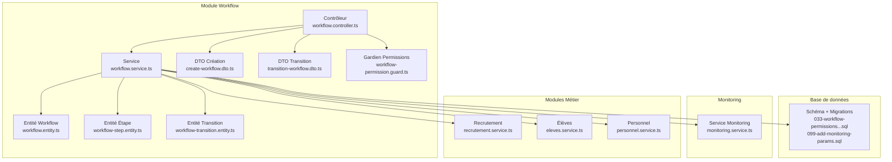
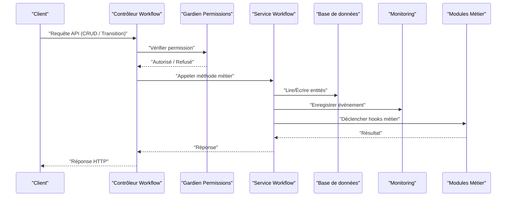
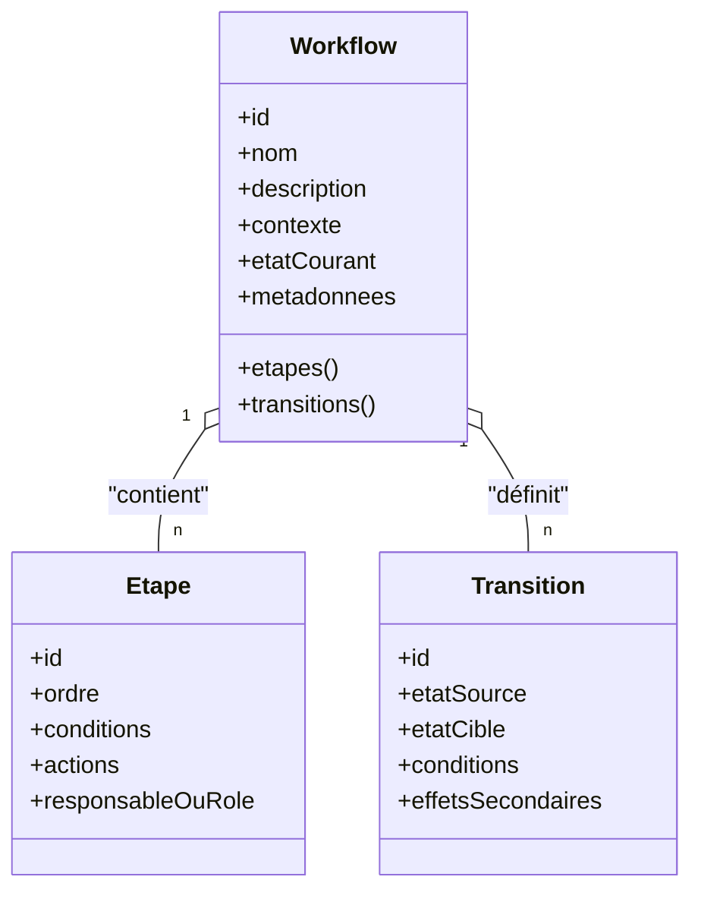
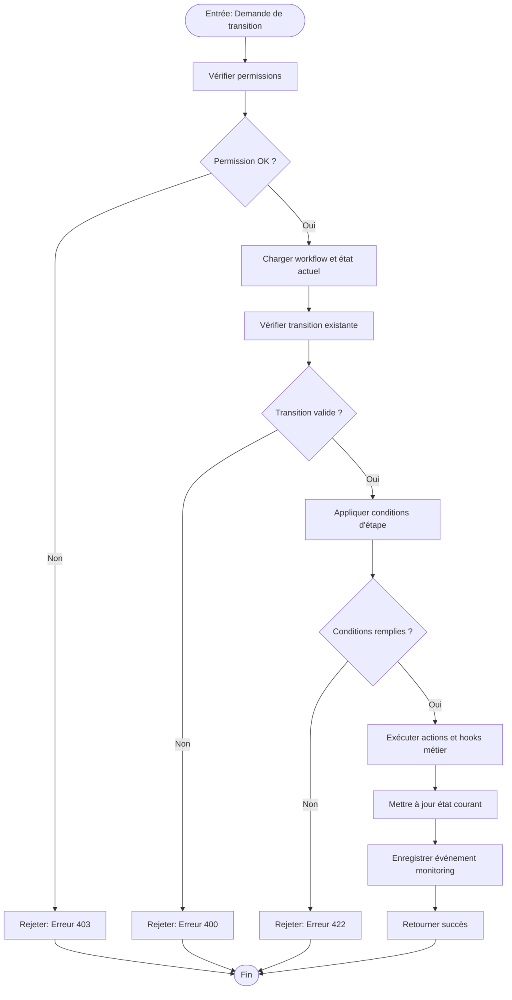
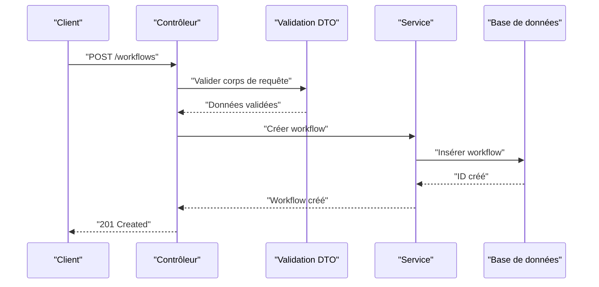
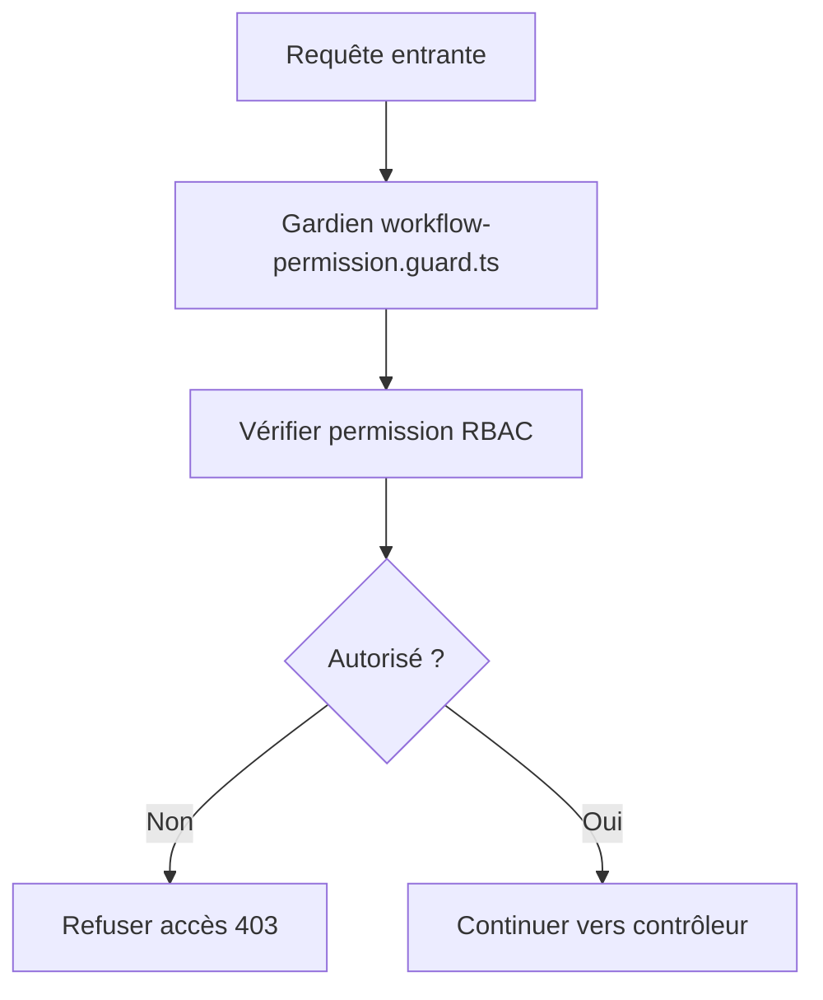
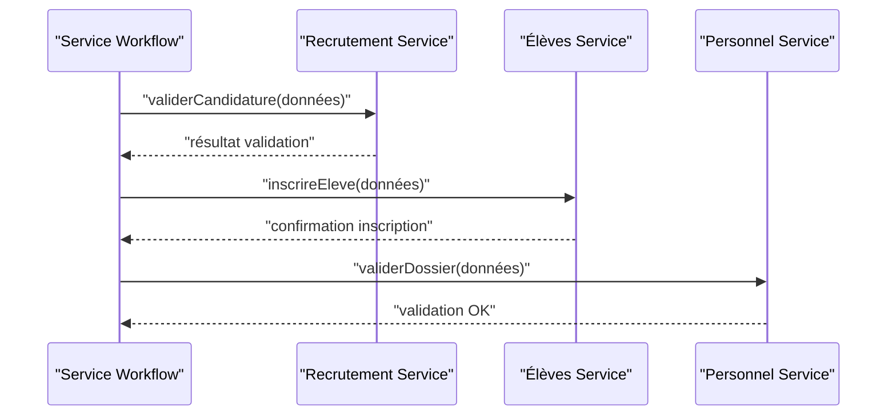
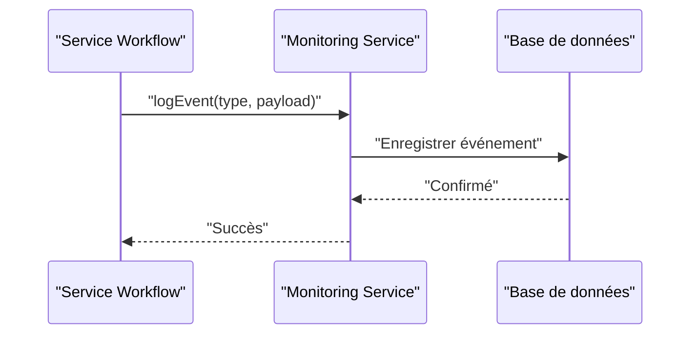
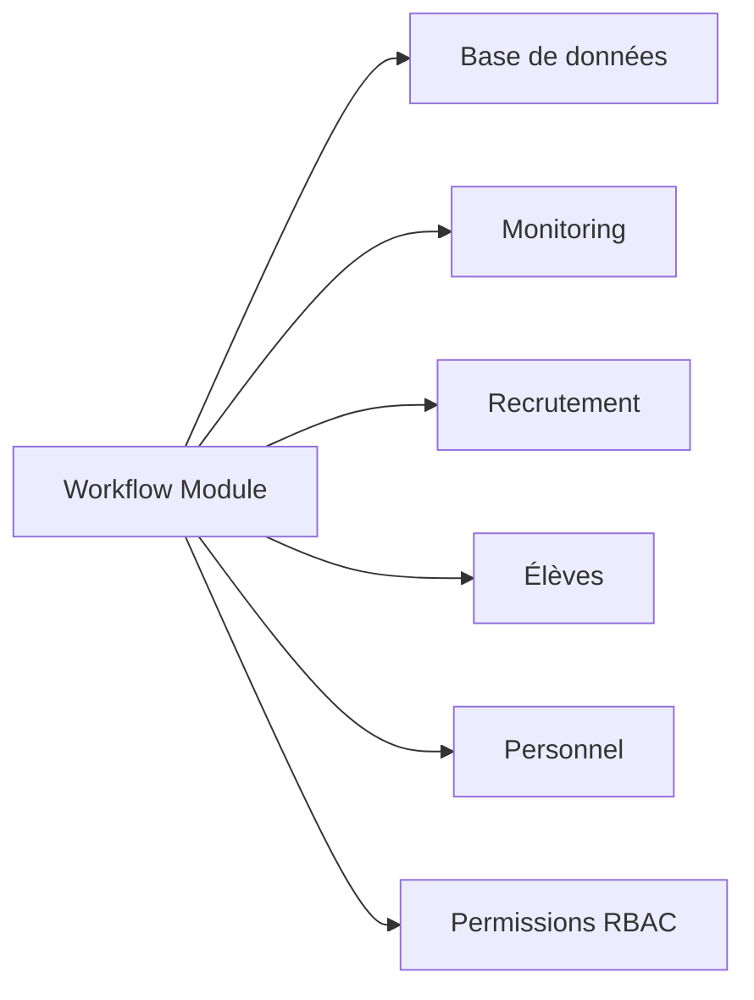

# Workflows de Validation Personnalisés

<cite>
**Fichiers référencés dans ce document**
- [backend/src/modules/validation-workflow/index.ts](file://backend/src/modules/validation-workflow/index.ts)
- [backend/src/modules/validation-workflow/entities/workflow.entity.ts](file://backend/src/modules/validation-workflow/entities/workflow.entity.ts)
- [backend/src/modules/validation-workflow/entities/workflow-step.entity.ts](file://backend/src/modules/validation-workflow/entities/workflow-step.entity.ts)
- [backend/src/modules/validation-workflow/entities/workflow-transition.entity.ts](file://backend/src/modules/validation-workflow/entities/workflow-transition.entity.ts)
- [backend/src/modules/validation-workflow/services/workflow.service.ts](file://backend/src/modules/validation-workflow/services/workflow.service.ts)
- [backend/src/modules/validation-workflow/controllers/workflow.controller.ts](file://backend/src/modules/validation-workflow/controllers/workflow.controller.ts)
- [backend/src/modules/validation-workflow/dto/create-workflow.dto.ts](file://backend/src/modules/validation-workflow/dto/create-workflow.dto.ts)
- [backend/src/modules/validation-workflow/dto/transition-workflow.dto.ts](file://backend/src/modules/validation-workflow/dto/transition-workflow.dto.ts)
- [backend/src/modules/validation-workflow/guards/workflow-permission.guard.ts](file://backend/src/modules/validation-workflow/guards/workflow-permission.guard.ts)
- [backend/database/migrations/033-workflow-permissions-nouveaux-modules.sql](file://backend/database/migrations/033-workflow-permissions-nouveaux-modules.sql)
- [backend/database/migrations/099-add-monitoring-params.sql](file://backend/database/migrations/099-add-monitoring-params.sql)
- [backend/src/modules/monitoring/services/monitoring.service.ts](file://backend/src/modules/monitoring/services/monitoring.service.ts)
- [backend/src/modules/recrutement/services/recrutement.service.ts](file://backend/src/modules/recrutement/services/recrutement.service.ts)
- [backend/src/modules/eleves/services/eleves.service.ts](file://backend/src/modules/eleves/services/eleves.service.ts)
- [backend/src/modules/personnel/services/personnel.service.ts](file://backend/src/modules/personnel/services/personnel.service.ts)
</cite>

## Table des matières
1. [Introduction](#introduction)
2. [Structure du projet](#structure-du-projet)
3. [Composants principaux](#composants-principaux)
4. [Vue d'ensemble de l'architecture](#vue-densemble-de-larchitecture)
5. [Analyse détaillée des composants](#analyse-detaillee-des-composants)
6. [Analyse des dépendances](#analyse-des-dependances)
7. [Considérations de performance](#considerations-de-performance)
8. [Guide de dépannage](#guide-de-depannage)
9. [Conclusion](#conclusion)
10. [Annexes](#annexes)

## Introduction
Ce document présente en détail le système de workflows de validation personnalisés d'eLISAschool. Il explique l’architecture, les entités, les étapes configurables, les transitions entre états, les permissions associées et les intégrations avec les modules métier (inscriptions, validations académiques, processus administratifs). Il couvre également le monitoring, la gestion des erreurs et les bonnes pratiques pour concevoir des workflows robustes et évolutifs.

## Structure du projet
Le module de workflow est organisé selon une architecture modulaire classique :
- Entités définissant les modèles de données (workflow, étape, transition).
- DTOs pour valider les entrées API.
- Service centralisant la logique métier et orchestrant les transitions.
- Contrôleur exposant les endpoints REST.
- Gardien assurant les permissions au niveau des requêtes.
- Migrations gérant le schéma et les permissions.
- Intégration avec le service de monitoring pour tracer les événements.

**Sources de diagramme**
- [backend/src/modules/validation-workflow/controllers/workflow.controller.ts](file://backend/src/modules/validation-workflow/controllers/workflow.controller.ts)
- [backend/src/modules/validation-workflow/services/workflow.service.ts](file://backend/src/modules/validation-workflow/services/workflow.service.ts)
- [backend/src/modules/validation-workflow/entities/workflow.entity.ts](file://backend/src/modules/validation-workflow/entities/workflow.entity.ts)
- [backend/src/modules/validation-workflow/entities/workflow-step.entity.ts](file://backend/src/modules/validation-workflow/entities/workflow-step.entity.ts)
- [backend/src/modules/validation-workflow/entities/workflow-transition.entity.ts](file://backend/src/modules/validation-workflow/entities/workflow-transition.entity.ts)
- [backend/src/modules/validation-workflow/dto/create-workflow.dto.ts](file://backend/src/modules/validation-workflow/dto/create-workflow.dto.ts)
- [backend/src/modules/validation-workflow/dto/transition-workflow.dto.ts](file://backend/src/modules/validation-workflow/dto/transition-workflow.dto.ts)
- [backend/src/modules/validation-workflow/guards/workflow-permission.guard.ts](file://backend/src/modules/validation-workflow/guards/workflow-permission.guard.ts)
- [backend/database/migrations/033-workflow-permissions-nouveaux-modules.sql](file://backend/database/migrations/033-workflow-permissions-nouveaux-modules.sql)
- [backend/database/migrations/099-add-monitoring-params.sql](file://backend/database/migrations/099-add-monitoring-params.sql)
- [backend/src/modules/monitoring/services/monitoring.service.ts](file://backend/src/modules/monitoring/services/monitoring.service.ts)
- [backend/src/modules/recrutement/services/recrutement.service.ts](file://backend/src/modules/recrutement/services/recrutement.service.ts)
- [backend/src/modules/eleves/services/eleves.service.ts](file://backend/src/modules/eleves/services/eleves.service.ts)
- [backend/src/modules/personnel/services/personnel.service.ts](file://backend/src/modules/personnel/services/personnel.service.ts)

**Sources de section**
- [backend/src/modules/validation-workflow/index.ts](file://backend/src/modules/validation-workflow/index.ts)

## Composants principaux
- Entités
  - Workflow : définit un processus de validation avec son contexte, ses étapes et ses règles.
  - Étape : représente une phase de validation avec des conditions et des actions.
  - Transition : définit les changements d’état autorisés et leurs préconditions.
- DTOs
  - create-workflow.dto : valide la création d’un workflow.
  - transition-workflow.dto : valide une demande de transition d’état.
- Service
  - workflow.service : orchestre la création, la lecture, la mise à jour, la suppression et les transitions. Applique les règles de validation et déclenche les hooks métier.
- Contrôleur
  - workflow.controller : expose les routes REST pour gérer les workflows et leurs transitions.
- Gardien
  - workflow-permission.guard : vérifie les permissions RBAC avant d’autoriser les opérations.
- Monitoring
  - monitoring.service : enregistre les événements de workflow pour le suivi et l’audit.

**Sources de section**
- [backend/src/modules/validation-workflow/entities/workflow.entity.ts](file://backend/src/modules/validation-workflow/entities/workflow.entity.ts)
- [backend/src/modules/validation-workflow/entities/workflow-step.entity.ts](file://backend/src/modules/validation-workflow/entities/workflow-step.entity.ts)
- [backend/src/modules/validation-workflow/entities/workflow-transition.entity.ts](file://backend/src/modules/validation-workflow/entities/workflow-transition.entity.ts)
- [backend/src/modules/validation-workflow/dto/create-workflow.dto.ts](file://backend/src/modules/validation-workflow/dto/create-workflow.dto.ts)
- [backend/src/src/modules/validation-workflow/dto/transition-workflow.dto.ts](file://backend/src/modules/validation-workflow/dto/transition-workflow.dto.ts)
- [backend/src/modules/validation-workflow/services/workflow.service.ts](file://backend/src/modules/validation-workflow/services/workflow.service.ts)
- [backend/src/modules/validation-workflow/controllers/workflow.controller.ts](file://backend/src/modules/validation-workflow/controllers/workflow.controller.ts)
- [backend/src/modules/validation-workflow/guards/workflow-permission.guard.ts](file://backend/src/modules/validation-workflow/guards/workflow-permission.guard.ts)

## Vue d'ensemble de l'architecture
Le système suit un flux contrôlé par le service qui applique les règles de transition et interagit avec les modules métier via des appels directs. Les permissions sont imposées par un gardien au niveau des contrôleurs. Le monitoring capture les événements clés pour l’observabilité.

**Sources de diagramme**
- [backend/src/modules/validation-workflow/controllers/workflow.controller.ts](file://backend/src/modules/validation-workflow/controllers/workflow.controller.ts)
- [backend/src/modules/validation-workflow/guards/workflow-permission.guard.ts](file://backend/src/modules/validation-workflow/guards/workflow-permission.guard.ts)
- [backend/src/modules/validation-workflow/services/workflow.service.ts](file://backend/src/modules/validation-workflow/services/workflow.service.ts)
- [backend/src/modules/monitoring/services/monitoring.service.ts](file://backend/src/modules/monitoring/services/monitoring.service.ts)
- [backend/src/modules/recrutement/services/recrutement.service.ts](file://backend/src/modules/recrutement/services/recrutement.service.ts)
- [backend/src/modules/eleves/services/eleves.service.ts](file://backend/src/modules/eleves/services/eleves.service.ts)
- [backend/src/modules/personnel/services/personnel.service.ts](file://backend/src/modules/personnel/services/personnel.service.ts)

## Analyse détaillée des composants

### Entités et modèle de données
Les entités structurent le cycle de vie d’un workflow :
- Workflow : identifiant unique, nom, description, état courant, contexte applicatif (module cible), métadonnées.
- Étape : ordre d’exécution, conditions de validation, actions associées, responsables ou rôles requis.
- Transition : état source, état cible, conditions de déclenchement, effets secondaires.

**Sources de diagramme**
- [backend/src/modules/validation-workflow/entities/workflow.entity.ts](file://backend/src/modules/validation-workflow/entities/workflow.entity.ts)
- [backend/src/modules/validation-workflow/entities/workflow-step.entity.ts](file://backend/src/modules/validation-workflow/entities/workflow-step.entity.ts)
- [backend/src/modules/validation-workflow/entities/workflow-transition.entity.ts](file://backend/src/modules/validation-workflow/entities/workflow-transition.entity.ts)

**Sources de section**
- [backend/src/modules/validation-workflow/entities/workflow.entity.ts](file://backend/src/modules/validation-workflow/entities/workflow.entity.ts)
- [backend/src/modules/validation-workflow/entities/workflow-step.entity.ts](file://backend/src/modules/validation-workflow/entities/workflow-step.entity.ts)
- [backend/src/modules/validation-workflow/entities/workflow-transition.entity.ts](file://backend/src/modules/validation-workflow/entities/workflow-transition.entity.ts)

### Flux de transition d'état
Le service applique les règles de transition en validant les conditions, en exécutant les actions d’étape et en mettant à jour l’état courant.

**Sources de diagramme**
- [backend/src/modules/validation-workflow/services/workflow.service.ts](file://backend/src/modules/validation-workflow/services/workflow.service.ts)
- [backend/src/modules/validation-workflow/guards/workflow-permission.guard.ts](file://backend/src/modules/validation-workflow/guards/workflow-permission.guard.ts)
- [backend/src/modules/monitoring/services/monitoring.service.ts](file://backend/src/modules/monitoring/services/monitoring.service.ts)

**Sources de section**
- [backend/src/modules/validation-workflow/services/workflow.service.ts](file://backend/src/modules/validation-workflow/services/workflow.service.ts)
- [backend/src/modules/validation-workflow/guards/workflow-permission.guard.ts](file://backend/src/modules/validation-workflow/guards/workflow-permission.guard.ts)

### Contrôleurs et DTOs
Le contrôleur expose des endpoints pour créer, lire, mettre à jour, supprimer et faire transiter les workflows. Les DTOs garantissent la cohérence des données entrantes.

**Sources de diagramme**
- [backend/src/modules/validation-workflow/controllers/workflow.controller.ts](file://backend/src/modules/validation-workflow/controllers/workflow.controller.ts)
- [backend/src/modules/validation-workflow/dto/create-workflow.dto.ts](file://backend/src/modules/validation-workflow/dto/create-workflow.dto.ts)
- [backend/src/modules/validation-workflow/services/workflow.service.ts](file://backend/src/modules/validation-workflow/services/workflow.service.ts)

**Sources de section**
- [backend/src/modules/validation-workflow/controllers/workflow.controller.ts](file://backend/src/modules/validation-workflow/controllers/workflow.controller.ts)
- [backend/src/modules/validation-workflow/dto/create-workflow.dto.ts](file://backend/src/modules/validation-workflow/dto/create-workflow.dto.ts)
- [backend/src/modules/validation-workflow/dto/transition-workflow.dto.ts](file://backend/src/modules/validation-workflow/dto/transition-workflow.dto.ts)

### Permissions et sécurité
Les permissions sont appliquées via un gardien qui s’appuie sur le système RBAC. Les migrations ajoutent les permissions spécifiques aux workflows et aux nouveaux modules.

**Sources de diagramme**
- [backend/src/modules/validation-workflow/guards/workflow-permission.guard.ts](file://backend/src/modules/validation-workflow/guards/workflow-permission.guard.ts)
- [backend/database/migrations/033-workflow-permissions-nouveaux-modules.sql](file://backend/database/migrations/033-workflow-permissions-nouveaux-modules.sql)

**Sources de section**
- [backend/src/modules/validation-workflow/guards/workflow-permission.guard.ts](file://backend/src/modules/validation-workflow/guards/workflow-permission.guard.ts)
- [backend/database/migrations/033-workflow-permissions-nouveaux-modules.sql](file://backend/database/migrations/033-workflow-permissions-nouveaux-modules.sql)

### Intégrations avec les modules métier
Le service de workflow peut appeler des services métier pour exécuter des actions liées au contexte :
- Recrutement : validation des candidatures, pré-inscriptions.
- Élèves : inscription, affectation, validation académique.
- Personnel : recrutement, validation de dossiers, affectation.

**Sources de diagramme**
- [backend/src/modules/validation-workflow/services/workflow.service.ts](file://backend/src/modules/validation-workflow/services/workflow.service.ts)
- [backend/src/modules/recrutement/services/recrutement.service.ts](file://backend/src/modules/recrutement/services/recrutement.service.ts)
- [backend/src/modules/eleves/services/eleves.service.ts](file://backend/src/modules/eleves/services/eleves.service.ts)
- [backend/src/modules/personnel/services/personnel.service.ts](file://backend/src/modules/personnel/services/personnel.service.ts)

**Sources de section**
- [backend/src/modules/validation-workflow/services/workflow.service.ts](file://backend/src/modules/validation-workflow/services/workflow.service.ts)
- [backend/src/modules/recrutement/services/recrutement.service.ts](file://backend/src/modules/recrutement/services/recrutement.service.ts)
- [backend/src/modules/eleves/services/eleves.service.ts](file://backend/src/modules/eleves/services/eleves.service.ts)
- [backend/src/modules/personnel/services/personnel.service.ts](file://backend/src/modules/personnel/services/personnel.service.ts)

### Monitoring et observabilité
Le service de monitoring enregistre les événements de workflow (création, transition, erreur) pour permettre l’audit et l’analyse de performance.

**Sources de diagramme**
- [backend/src/modules/validation-workflow/services/workflow.service.ts](file://backend/src/modules/validation-workflow/services/workflow.service.ts)
- [backend/src/modules/monitoring/services/monitoring.service.ts](file://backend/src/modules/monitoring/services/monitoring.service.ts)
- [backend/database/migrations/099-add-monitoring-params.sql](file://backend/database/migrations/099-add-monitoring-params.sql)

**Sources de section**
- [backend/src/modules/monitoring/services/monitoring.service.ts](file://backend/src/modules/monitoring/services/monitoring.service.ts)
- [backend/database/migrations/099-add-monitoring-params.sql](file://backend/database/migrations/099-add-monitoring-params.sql)

## Analyse des dépendances
Le module workflow dépend de :
- Base de données via les entités et migrations.
- Monitoring pour tracer les événements.
- Modules métier pour exécuter des actions contextuelles.
- Système RBAC pour les permissions.

**Sources de diagramme**
- [backend/src/modules/validation-workflow/services/workflow.service.ts](file://backend/src/modules/validation-workflow/services/workflow.service.ts)
- [backend/src/modules/monitoring/services/monitoring.service.ts](file://backend/src/modules/monitoring/services/monitoring.service.ts)
- [backend/src/modules/recrutement/services/recrutement.service.ts](file://backend/src/modules/recrutement/services/recrutement.service.ts)
- [backend/src/modules/eleves/services/eleves.service.ts](file://backend/src/modules/eleves/services/eleves.service.ts)
- [backend/src/modules/personnel/services/personnel.service.ts](file://backend/src/modules/personnel/services/personnel.service.ts)

**Sources de section**
- [backend/src/modules/validation-workflow/services/workflow.service.ts](file://backend/src/modules/validation-workflow/services/workflow.service.ts)

## Considérations de performance
- Éviter les boucles de validation redondantes ; regrouper les vérifications par étape.
- Utiliser des transactions pour garantir la cohérence lors des transitions complexes.
- Limiter les appels externes dans les hooks métier ; privilégier des appels asynchrones non bloquants.
- Indexer les champs fréquemment consultés (états, IDs de workflow, timestamps).
- Mettre en cache les configurations de workflow statiques si elles sont stables.

[Pas de sources nécessaires car cette section fournit des conseils généraux]

## Guide de dépannage
- Erreurs de permission (403) : vérifier les rôles et permissions attribués via le gardien et les migrations RBAC.
- Erreurs de validation (400/422) : examiner les DTOs et les conditions d’étape ; vérifier les messages d’erreur retournés.
- Blocages de transition : inspecter les conditions de transition et les actions d’étape ; consulter les logs de monitoring.
- Problèmes de persistance : vérifier les transactions et les index ; analyser les erreurs de base de données.

**Sources de section**
- [backend/src/modules/validation-workflow/guards/workflow-permission.guard.ts](file://backend/src/modules/validation-workflow/guards/workflow-permission.guard.ts)
- [backend/src/modules/validation-workflow/dto/create-workflow.dto.ts](file://backend/src/modules/validation-workflow/dto/create-workflow.dto.ts)
- [backend/src/modules/validation-workflow/dto/transition-workflow.dto.ts](file://backend/src/modules/validation-workflow/dto/transition-workflow.dto.ts)
- [backend/src/modules/monitoring/services/monitoring.service.ts](file://backend/src/modules/monitoring/services/monitoring.service.ts)

## Conclusion
Le système de workflows de validation d’eLISAschool offre une architecture modulaire et extensible, permettant de définir des processus de validation flexibles, sécurisés et monitorés. En suivant les bonnes pratiques décrites, il est possible de concevoir des workflows fiables pour les inscriptions, les validations académiques et les processus administratifs, tout en maintenant une traçabilité complète et une haute performance.

[Pas de sources nécessaires car cette section résume sans analyser de fichiers spécifiques]

## Annexes
- Exemples de création de workflows
  - Inscription élève : workflow avec étapes de collecte de documents, validation administrative, affectation à une classe.
  - Validation académique : workflow avec étapes de saisie des notes, vérification des seuils, génération du bulletin.
  - Processus administratif : workflow de recrutement avec étapes de tri, entretien, décision, notification.

[Pas de sources nécessaires car cette section propose des exemples conceptuels]